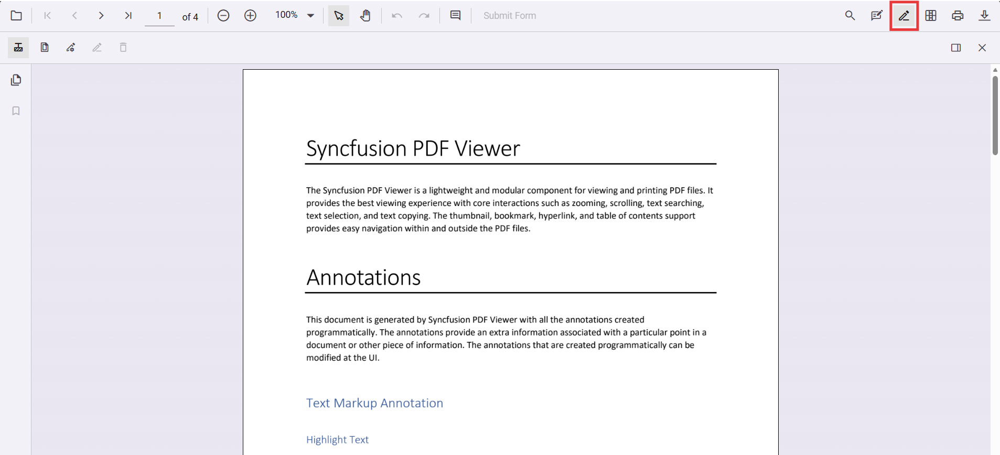
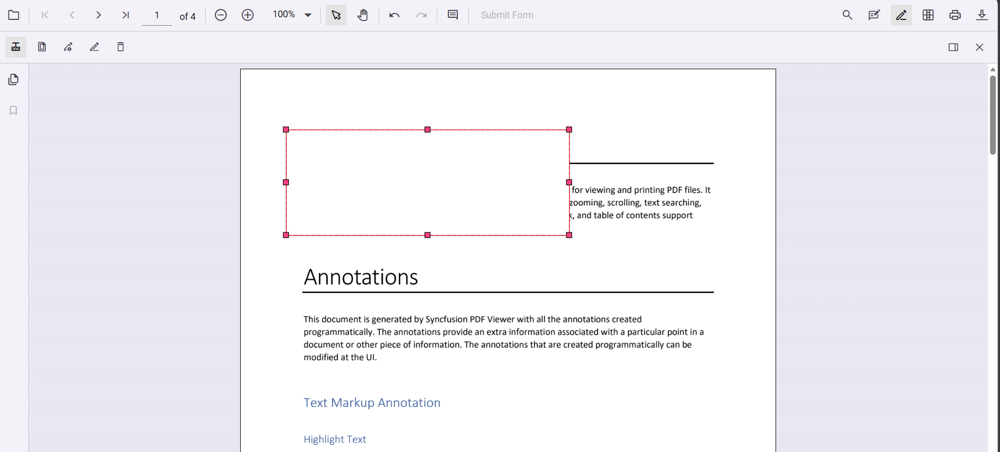
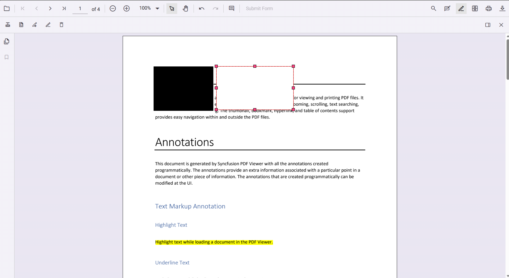
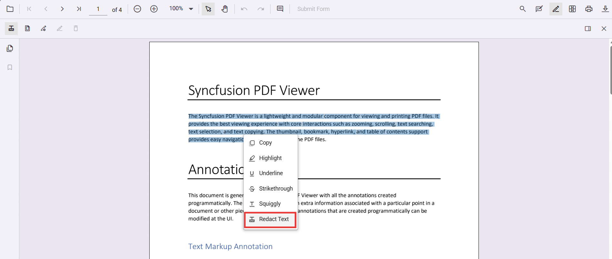
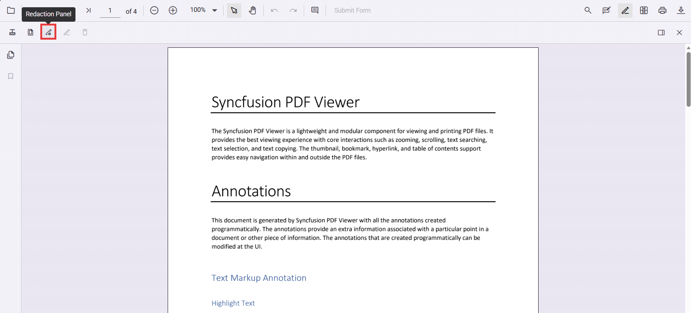
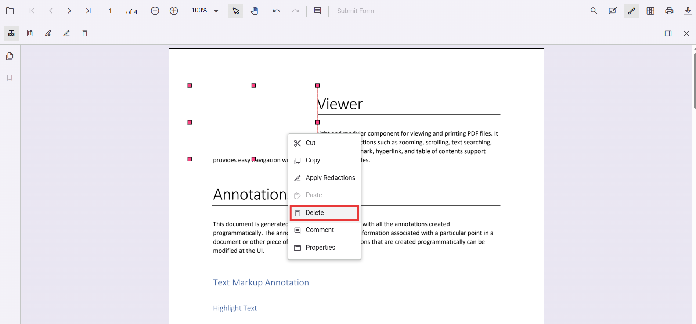
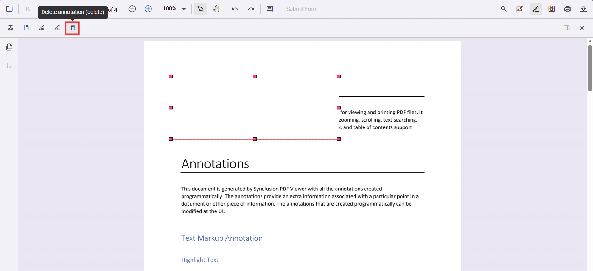
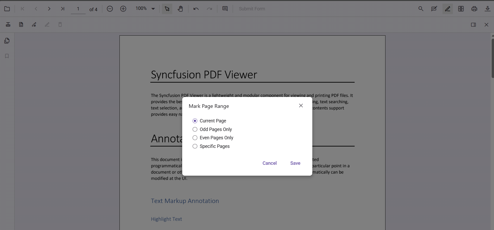
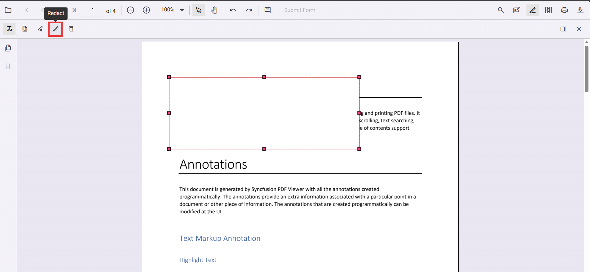
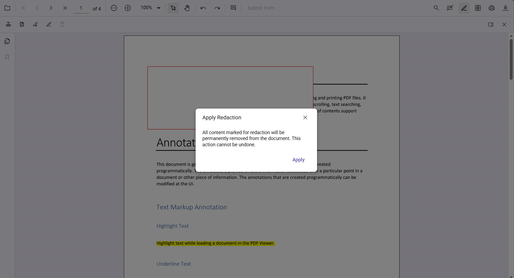

# Redaction annotation in TypeScript PDF Viewer

Redaction annotations permanently remove sensitive content from a PDF. You can draw redaction marks over text or graphics, redact entire pages, customize overlay text and styling, and apply redaction to finalize.



## Add Redaction Annotation

### Add redaction annotation in UI

- Use the Redaction tool from the toolbar to draw over content to hide.
- Redaction marks can show overlay text (for example, "Confidential") and can be styled.



Redaction annotations are interactive:
- Movable

- Resizable


You can also add redaction from the context menu by selecting content and choosing Redact Annotation.



N> Ensure the Redaction tool is included in the toolbar. See [RedactionToolbar](../../Redaction/toolbar.md)for configuration.

### Add a redaction annotation programmatically

Use the addAnnotation method with the Redaction type.

```html
<button id="addRedactAnnot">Add Redaction Annotation</button>
```
```ts
document.getElementById('addRedactAnnot')?.addEventListener('click', () => {
  viewer.annotation.addAnnotation('Redaction', {
    bound: { x: 200, y: 480, width: 150, height: 75 },
    pageNumber: 1,
    markerFillColor: '#0000FF',
    markerBorderColor: 'white',
    fillColor: 'red',
    overlayText: 'Confidential',
    fontColor: 'yellow',
    fontFamily: 'Times New Roman',
    fontSize: 8,
    beforeRedactionsApplied: false
  });
});
```

Track additions using the annotationAdd event.

```ts
viewer.annotationAdd = (args) => {
  console.log('Annotation added:', args);
};
```

## Edit Redaction Annotation

### Edit redaction annotation in UI

You can select, move, and resize Redaction annotations directly in the viewer. Use the context menu for additional actions.

#### Edit the properties of redaction annotations in UI

Use the property panel or context menu Properties to change overlay text, font, fill color, and more.




### Edit a redaction annotation programmatically

Use editAnnotation to modify overlay text, colors, fonts, etc.

```html
<button id="editRedactAnnotation">Edit Redact Annotation</button>
```
```ts
document.getElementById('editRedactAnnotation')?.addEventListener('click', () => {
  for (let i = 0; i < viewer.annotationCollection.length; i++) {
    if (viewer.annotationCollection[i].subject === 'Redaction') {
      viewer.annotationCollection[i].overlayText = 'EditedAnnotation';
      viewer.annotationCollection[i].markerFillColor = '#22FF00';
      viewer.annotationCollection[i].markerBorderColor = '#000000';
      viewer.annotationCollection[i].isRepeat = true;
      viewer.annotationCollection[i].fillColor = '#F8F8F8';
      viewer.annotationCollection[i].fontColor = '#333333';
      viewer.annotationCollection[i].fontSize = 14;
      viewer.annotationCollection[i].fontFamily = 'Symbol';
      viewer.annotationCollection[i].textAlign = 'Right';
      viewer.annotationCollection[i].beforeRedactionsApplied = false;
      viewer.annotation.editAnnotation(viewer.annotationCollection[i]);
    }
  }
});
```

## Delete redaction annotations

### Delete in UI

- Right-click and select Delete

- Use the Delete button in the toolbar

- Press Delete key

### Delete programmatically

Delete by id using deleteAnnotationById:

```html
<button id="deleteAnnotationbyId">Delete Annotation By Id</button>
```
```ts
document.getElementById('deleteAnnotationbyId')?.addEventListener('click', () => {
  viewer.annotationModule.deleteAnnotationById(viewer.annotationCollection[0].annotationId);
});
```

## Redact pages

### Redact pages in UI

Use the Redact Pages dialog to mark entire pages:



Options include Current Page, Odd Pages Only, Even Pages Only, and Specific Pages.

### Add page redactions programmatically

```html
<button id="addPageRedactions">Add Page Redaction</button>
```
```ts
document.getElementById('addPageRedactions')?.addEventListener('click', () => {
  viewer.annotation.addPageRedactions([1, 3, 5, 7]);
});
```

## Apply redaction

### Apply redaction in UI

Click Apply Redaction to permanently remove marked content.




N> Redaction is permanent and cannot be undone.

### Apply redaction programmatically

```html
<button id="redact">Apply Redaction</button>
```
```ts
document.getElementById('redact')?.addEventListener('click', () => {
  viewer.annotation.redact();
});
```

N> Applying redaction is irreversible.

## Default redaction settings during initialization

Configure defaults with redactionSettings:

```ts
viewer.redactionSettings = {
  overlayText: 'Confidential',
  markerFillColor: '#FF0000',
  markerBorderColor: '#000000',
  isRepeat: false,
  fillColor: '#F8F8F8',
  fontColor: '#333333',
  fontSize: 14,
  fontFamily: 'Symbol',
  textAlign: 'Right'
};
```

[View Sample on GitHub](https://github.com/SyncfusionExamples/typescript-pdf-viewer-examples/tree/master)

## See also

- [Annotation Overview](../overview)
- [Redaction Overview](../../Redaction/overview)
- [Annotation Toolbar](../../toolbar-customization/annotation-toolbar)
- [Create and Modify Annotation](../../annotations/create-modify-annotation)
- [Customize Annotation](../../annotations/customize-annotation)
- [Remove Annotation](../../annotations/delete-annotation)
- [Handwritten Signature](../../annotations/signature-annotation)
- [Export and Import Annotation](../../annotations/export-import/export-annotation)
- [Annotation in Mobile View](../../annotations/annotations-in-mobile-view)
- [Annotation Events](../../annotations/annotation-event)
- [Annotation API](../../annotations/annotations-api)
