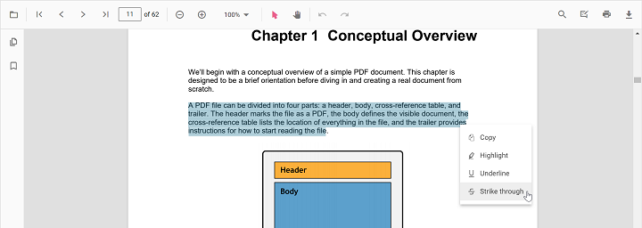

# Strikethrough annotation in TypeScript PDF Viewer

The PDF Viewer provides options to add, edit, and delete Strikethrough annotations on text. You can add strikethrough via the UI (context menu or annotation toolbar) and programmatically. You can also customize color, opacity, author/subject, and default settings, and use undo/redo, save, print, or disable them as needed.


## Add strikethrough annotation

### Add strikethrough annotation via UI

You can add strikethrough in two ways:

1. Using the context menu
* Select text in the PDF document and right-click it.
* Choose **Strikethrough** in the context menu.



<!-- markdownlint-disable MD029 -->
2. Using the annotation toolbar
* Click the **Edit Annotation** button in the PDF Viewer toolbar to open the annotation toolbar.
* Select **Strikethrough** to enable strikethrough mode.
* Select text to add the strikethrough annotation.
* Alternatively, select text first and then click **Strikethrough**.


When pan mode is active and a text markup mode is entered, the PDF Viewer switches to text selection mode to enable selection.

### Enable strikethrough mode

Use the following code to switch the viewer into strikethrough mode.



import { PdfViewer, Toolbar, Magnification, Navigation, LinkAnnotation, ThumbnailView, BookmarkView,
         TextSelection, Annotation, FormDesigner, FormFields } from '@syncfusion/ej2-pdfviewer';

PdfViewer.Inject(Toolbar, Magnification, Navigation, LinkAnnotation, ThumbnailView,
                 BookmarkView, TextSelection, Annotation, FormDesigner, FormFields);

let pdfviewer: PdfViewer = new PdfViewer({
    documentPath: 'https://cdn.syncfusion.com/content/pdf/pdf-succinctly.pdf',
    resourceUrl: 'https://cdn.syncfusion.com/ej2/31.1.23/dist/ej2-pdfviewer-lib'
});
pdfviewer.appendTo('#PdfViewer');

document.getElementById('set')?.addEventListener('click', () => {
    pdfviewer.annotation.setAnnotationMode('Strikethrough');
});


<!DOCTYPE html>
<html lang="en">
<head>
    <title>EJ2 PDF Viewer</title>
    <meta charset="utf-8" />
    <meta name="viewport" content="width=device-width, initial-scale=1.0" />
    <meta name="description" content="TypeScript PDF Viewer Control" />
    <meta name="author" content="Syncfusion" />
    <link href="index.css" rel="stylesheet" />
    <link href="https://cdn.syncfusion.com/ej2/31.1.23/material.css" rel="stylesheet" />
    <script src="https://cdnjs.cloudflare.com/ajax/libs/systemjs/0.19.38/system.js"></script>
    <script src="systemjs.config.js"></script>
</head>
<body>
    <div id="loader">Loading....</div>
    <!--Element to set text markup annotation mode-->
    <button id="set">Strikethrough</button>
    <div id="container">
        <div id="PdfViewer" style="height:500px;width:100%"></div>
    </div>
    <script src="index.ts" type="text/typescript"></script>
</body>
</html>



N> To set up the **server-backed PDF Viewer**,
Add the below `serviceUrl` in the `index.ts` file
`pdfviewer.serviceUrl = 'https://document.syncfusion.com/web-services/pdf-viewer/api/pdfviewer/';`



#### Exit strikethrough mode

Use the following code to switch back to normal mode.



import { PdfViewer, Toolbar, Magnification, Navigation, LinkAnnotation, ThumbnailView, BookmarkView,
         TextSelection, Annotation, FormDesigner, FormFields } from '@syncfusion/ej2-pdfviewer';

PdfViewer.Inject(Toolbar, Magnification, Navigation, LinkAnnotation, ThumbnailView,
                 BookmarkView, TextSelection, Annotation, FormDesigner, FormFields);

let pdfviewer: PdfViewer = new PdfViewer({
    documentPath: 'https://cdn.syncfusion.com/content/pdf/pdf-succinctly.pdf',
    resourceUrl: 'https://cdn.syncfusion.com/ej2/31.1.23/dist/ej2-pdfviewer-lib'
});
pdfviewer.appendTo('#PdfViewer');

document.getElementById('set')?.addEventListener('click', () => {
    pdfviewer.annotation.setAnnotationMode('Strikethrough');
});

document.getElementById('setNone')?.addEventListener('click', () => {
    pdfviewer.annotation.setAnnotationMode('None');
});


<!DOCTYPE html>
<html lang="en">
<head>
    <title>EJ2 PDF Viewer</title>
    <meta charset="utf-8" />
    <meta name="viewport" content="width=device-width, initial-scale=1.0" />
    <meta name="description" content="TypeScript PDF Viewer Control" />
    <meta name="author" content="Syncfusion" />
    <link href="index.css" rel="stylesheet" />
    <link href="https://cdn.syncfusion.com/ej2/31.1.23/material.css" rel="stylesheet" />
    <script src="https://cdnjs.cloudflare.com/ajax/libs/systemjs/0.19.38/system.js"></script>
    <script src="systemjs.config.js"></script>
</head>
<body>
    <div id="loader">Loading....</div>
    <!--Element to set text markup annotation mode-->
    <button id="set">Strikethrough</button>
    <!--Element to set normal mode-->
    <button id="setNone">Normal Mode</button>
    <div id="container">
        <div id="PdfViewer" style="height:500px;width:100%"></div>
    </div>
    <script src="index.ts" type="text/typescript"></script>
</body>
</html>



N> To set up the **server-backed PDF Viewer**,
Add the below `serviceUrl` in the `index.ts` file
`pdfviewer.serviceUrl = 'https://document.syncfusion.com/web-services/pdf-viewer/api/pdfviewer/';`



### Add strikethrough annotation programmatically

Programmatically add strikethrough using the [addAnnotation](https://ej2.syncfusion.com/documentation/api/pdfviewer/annotation/#addannotation) method.

Example:

```html
<button id="strikethrough">Add TextMarkup annotation programmatically</button>
```




import { PdfViewer, Toolbar, Magnification, Navigation, Annotation, LinkAnnotation, ThumbnailView, BookmarkView, TextSelection, TextSearch, FormFields, FormDesigner, PageOrganizer, StrikethroughSettings } from '@syncfusion/ej2-pdfviewer';

PdfViewer.Inject(Toolbar, Magnification, Navigation, Annotation, LinkAnnotation, ThumbnailView, BookmarkView, TextSelection, TextSearch, FormFields, FormDesigner, PageOrganizer);

let pdfviewer: PdfViewer = new PdfViewer();
pdfviewer.documentPath = 'https://cdn.syncfusion.com/content/pdf/pdf-succinctly.pdf';
pdfviewer.resourceUrl = 'https://cdn.syncfusion.com/ej2/31.1.23/dist/ej2-pdfviewer-lib';
pdfviewer.appendTo('#PdfViewer');

let strikethrough = document.getElementById('strikethrough');
if (strikethrough) {
    strikethrough.addEventListener('click', function () {
        if (pdfviewer) {
            pdfviewer.annotation.addAnnotation('Strikethrough', {
                bounds: [{ x: 97, y: 110, width: 350, height: 14 }],
                pageNumber: 1
            } as StrikethroughSettings);
        }
    });
}




import { PdfViewer, Toolbar, Magnification, Navigation, Annotation, LinkAnnotation, ThumbnailView, BookmarkView, TextSelection, TextSearch, FormFields, FormDesigner, PageOrganizer, StrikethroughSettings } from '@syncfusion/ej2-pdfviewer';

PdfViewer.Inject(Toolbar, Magnification, Navigation, Annotation, LinkAnnotation, ThumbnailView, BookmarkView, TextSelection, TextSearch, FormFields, FormDesigner, PageOrganizer);

let pdfviewer: PdfViewer = new PdfViewer();
pdfviewer.serviceUrl = 'https://document.syncfusion.com/web-services/pdf-viewer/api/pdfviewer/';
pdfviewer.documentPath = 'https://cdn.syncfusion.com/content/pdf/pdf-succinctly.pdf';
pdfviewer.appendTo('#PdfViewer');

let strikethrough = document.getElementById('strikethrough');
if (strikethrough) {
    strikethrough.addEventListener('click', function () {
        if (pdfviewer) {
            pdfviewer.annotation.addAnnotation('Strikethrough', {
                bounds: [{ x: 97, y: 110, width: 350, height: 14 }],
                pageNumber: 1
            } as StrikethroughSettings);
        }
    });
}




## Edit strikethrough annotation

### Edit strikethrough annotation in UI

#### Delete a strikethrough annotation

The selected annotation can be deleted in the following ways:

1. Using the Delete/Backspace key
    * Select the annotation.
    * Press Delete (or Backspace). The selected annotation is removed.

2. Using the annotation toolbar
    * Select the annotation.
    * Click **Delete Annotation** in the annotation toolbar. The selected annotation is removed.


#### Edit strikethrough annotation properties

The color and opacity of the strikethrough annotation can be edited using the Edit Color and Edit Opacity tools in the annotation toolbar.

### Edit color

Use the color palette in the Edit Color tool to change the annotation color.


### Edit opacity

Use the range slider in the Edit Opacity tool to change annotation opacity.


### Edit an existing strikethrough annotation programmatically

To modify an existing strikethrough annotation programmatically, use the editAnnotation() method. Example:

```html
<button id="editStrikethroughAnnotation">Edit Strikethrough annotation Programmatically</button>
```




import { PdfViewer, Toolbar, Magnification, Navigation, Annotation, LinkAnnotation, ThumbnailView, BookmarkView, TextSelection, TextSearch, FormFields, FormDesigner, PageOrganizer} from '@syncfusion/ej2-pdfviewer';

PdfViewer.Inject(Toolbar, Magnification, Navigation, Annotation, LinkAnnotation, ThumbnailView, BookmarkView, TextSelection, TextSearch, FormFields, FormDesigner, PageOrganizer);

let pdfviewer: PdfViewer = new PdfViewer();
pdfviewer.documentPath = "https://cdn.syncfusion.com/content/pdf/pdf-succinctly.pdf";
pdfviewer.resourceUrl = "https://cdn.syncfusion.com/ej2/31.1.23/dist/ej2-pdfviewer-lib";
pdfviewer.appendTo('#PdfViewer');

let editStrikethroughAnnotation = document.getElementById('editStrikethroughAnnotation');
if (editStrikethroughAnnotation) {
    editStrikethroughAnnotation.addEventListener('click', function () {
        if (pdfviewer) {
            for (let i = 0; i < pdfviewer.annotationCollection.length; i++) {
                // Update the first available Strikethrough annotation
                if (pdfviewer.annotationCollection[i].textMarkupAnnotationType === 'Strikethrough') {
                    pdfviewer.annotationCollection[i].color = '#ff0000';
                    pdfviewer.annotationCollection[i].opacity = 0.8;
                    pdfviewer.annotation.editAnnotation(pdfviewer.annotationCollection[i]);
                    break;
                }
            }
        }
    });
}




import { PdfViewer, Toolbar, Magnification, Navigation, Annotation, LinkAnnotation, ThumbnailView, BookmarkView, TextSelection, TextSearch, FormFields, FormDesigner, PageOrganizer} from '@syncfusion/ej2-pdfviewer';

PdfViewer.Inject(Toolbar, Magnification, Navigation, Annotation, LinkAnnotation, ThumbnailView, BookmarkView, TextSelection, TextSearch, FormFields, FormDesigner, PageOrganizer);

let pdfviewer: PdfViewer = new PdfViewer();
pdfviewer.serviceUrl = 'https://document.syncfusion.com/web-services/pdf-viewer/api/pdfviewer/';
pdfviewer.documentPath = "https://cdn.syncfusion.com/content/pdf/pdf-succinctly.pdf";
pdfviewer.appendTo('#PdfViewer');

let editStrikethroughAnnotation = document.getElementById('editStrikethroughAnnotation');
if (editStrikethroughAnnotation) {
    editStrikethroughAnnotation.addEventListener('click', function () {
        if (pdfviewer) {
            for (let i = 0; i < pdfviewer.annotationCollection.length; i++) {
                if (pdfviewer.annotationCollection[i].textMarkupAnnotationType === 'Strikethrough') {
                    pdfviewer.annotationCollection[i].color = '#ff0000';
                    pdfviewer.annotationCollection[i].opacity = 0.8;
                    pdfviewer.annotation.editAnnotation(pdfviewer.annotationCollection[i]);
                    break;
                }
            }
        }
    });
}




## Default strikethrough settings during initialization

Set default properties before creating the control using `strikethroughSettings`.

> After editing default color and opacity using the Edit Color and Edit Opacity tools, the values update to the selected settings.

Refer to the following code snippet to set the default strikethrough settings.




import { PdfViewer, Toolbar, Magnification, Navigation, LinkAnnotation, ThumbnailView, BookmarkView, TextSelection, Annotation } from '@syncfusion/ej2-pdfviewer';

PdfViewer.Inject(Toolbar, Magnification, Navigation, LinkAnnotation, ThumbnailView, BookmarkView, TextSelection, Annotation);

let pdfviewer: PdfViewer = new PdfViewer({
  documentPath: 'https://cdn.syncfusion.com/content/pdf/pdf-succinctly.pdf',
  strikethroughSettings: { author: 'Guest User', subject: 'Not Important', color: '#ff00ff', opacity: 0.9}
});
pdfviewer.appendTo('#PdfViewer');




import { PdfViewer, Toolbar, Magnification, Navigation, LinkAnnotation, ThumbnailView, BookmarkView, TextSelection, Annotation } from '@syncfusion/ej2-pdfviewer';

PdfViewer.Inject(Toolbar, Magnification, Navigation, LinkAnnotation, ThumbnailView, BookmarkView, TextSelection, Annotation);

let pdfviewer: PdfViewer = new PdfViewer({
  documentPath: 'https://cdn.syncfusion.com/content/pdf/pdf-succinctly.pdf',
  strikethroughSettings: { author: 'Guest User', subject: 'Not Important', color: '#ff00ff', opacity: 0.9}
});
pdfviewer.serviceUrl = 'https://document.syncfusion.com/web-services/pdf-viewer/api/pdfviewer/';
pdfviewer.appendTo('#PdfViewer');




## Perform undo and redo

The PDF Viewer supports undo and redo for strikethrough annotations:

* Adding strikethrough annotations
* Deleting strikethrough annotations
* Changing color or opacity

Undo and redo actions can be performed in the following ways:

1. Using keyboard shortcuts:
    After a strikethrough annotation action, press Ctrl+Z to undo and Ctrl+Y to redo.
2. Using the toolbar:
    Use the **Undo** and **Redo** tools in the toolbar.

Refer to the following code snippet to call undo and redo actions from the client side.



import { PdfViewer, Toolbar, Magnification, Navigation, LinkAnnotation, ThumbnailView, BookmarkView,
    TextSelection, Annotation, FormDesigner, FormFields } from '@syncfusion/ej2-pdfviewer';

PdfViewer.Inject(Toolbar, Magnification, Navigation, LinkAnnotation, ThumbnailView,
             BookmarkView, TextSelection, Annotation, FormDesigner, FormFields);

let pdfviewer: PdfViewer = new PdfViewer({
    documentPath:'https://cdn.syncfusion.com/content/pdf/pdf-succinctly.pdf',
    resourceUrl:'https://cdn.syncfusion.com/ej2/31.1.23/dist/ej2-pdfviewer-lib'
});
pdfviewer.appendTo('#PdfViewer');

document.getElementById('undo')?.addEventListener('click', ()=> {
    pdfviewer.undo();
});

document.getElementById('redo')?.addEventListener('click', ()=> {
    pdfviewer.redo();
});


<!DOCTYPE html>
<html lang="en">
<head>
    <title>EJ2 PDF Viewer</title>
    <meta charset="utf-8" />
    <meta name="viewport" content="width=device-width, initial-scale=1.0" />
    <meta name="description" content="TypeScript PDF Viewer Control" />
    <meta name="author" content="Syncfusion" />
    <link href="index.css" rel="stylesheet" />
    <link href="https://cdn.syncfusion.com/ej2/31.1.23/material.css" rel="stylesheet" />
    <script src="https://cdnjs.cloudflare.com/ajax/libs/systemjs/0.19.38/system.js"></script>
    <script src="systemjs.config.js"></script>
</head>
<body>
    <div id='loader'>Loading....</div>
    <!--Element to call undo-->
    <button id="undo">Undo</button>
    <!--Element to call redo-->
    <button id="redo">Redo</button>
    <div id='container'>
        <div id='PdfViewer' style="height:500px;width:100%"></div>
    </div>
</body>
</html>



N> To set up the **server-backed PDF Viewer**,
Add the below `serviceUrl` in the `index.ts` file
`pdfviewer.serviceUrl = 'https://document.syncfusion.com/web-services/pdf-viewer/api/pdfviewer/';`



## Disable strikethrough annotation

Disable text markup annotations (including strikethrough) using the `enableTextMarkupAnnotation` property.




import { PdfViewer, Toolbar, Magnification, Navigation, LinkAnnotation, ThumbnailView, BookmarkView, TextSelection, Annotation } from '@syncfusion/ej2-pdfviewer';

PdfViewer.Inject(Toolbar, Magnification, Navigation, LinkAnnotation, ThumbnailView, BookmarkView, TextSelection, Annotation);

let pdfviewer: PdfViewer = new PdfViewer({ documentPath:'https://cdn.syncfusion.com/content/pdf/pdf-succinctly.pdf', enableTextMarkupAnnotation: false });
pdfviewer.appendTo('#PdfViewer');




import { PdfViewer, Toolbar, Magnification, Navigation, LinkAnnotation, ThumbnailView, BookmarkView, TextSelection, Annotation } from '@syncfusion/ej2-pdfviewer';

PdfViewer.Inject(Toolbar, Magnification, Navigation, LinkAnnotation, ThumbnailView, BookmarkView, TextSelection, Annotation);

let pdfviewer: PdfViewer = new PdfViewer({ documentPath:'https://cdn.syncfusion.com/content/pdf/pdf-succinctly.pdf', enableTextMarkupAnnotation: false });
pdfviewer.serviceUrl = 'https://document.syncfusion.com/web-services/pdf-viewer/api/pdfviewer/';
pdfviewer.appendTo('#PdfViewer');




[View Sample on GitHub](https://github.com/SyncfusionExamples/typescript-pdf-viewer-examples/tree/master)

## See also

- [Annotation Overview](../overview)
- [Annotation Toolbar](../../toolbar-customization/annotation-toolbar)
- [Create and Modify Annotation](../../annotations/create-modify-annotation)
- [Customize Annotation](../../annotations/customize-annotation)
- [Remove Annotation](../../annotations/delete-annotation)
- [Handwritten Signature](../../annotations/signature-annotation)
- [Export and Import Annotation](../../annotations/export-import/export-annotation)
- [Annotation in Mobile View](../../annotations/annotations-in-mobile-view)
- [Annotation Events](../../annotations/annotation-event)
- [Annotation API](../../annotations/annotations-api)