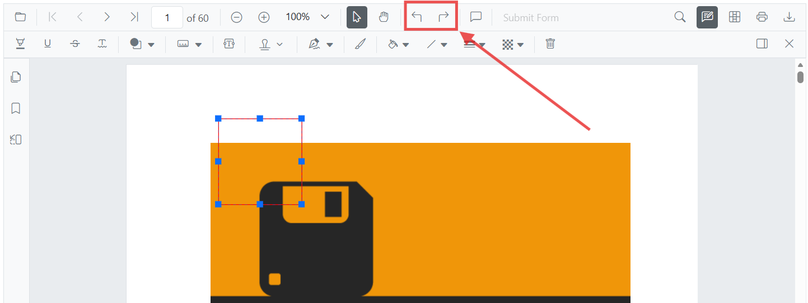

# Perform undo and redo in TypeScript 

The PDF Viewer supports undo and redo for Annotations.



Undo and redo actions can be performed in the following ways:

1. Using keyboard shortcuts:
    After performing a highlight annotation action, press Ctrl+Z to undo and Ctrl+Y to redo.
2. Using the toolbar:
    Use the **Undo** and **Redo** tools in the toolbar.

Refer to the following code snippet to call undo and redo actions from the client side.

```html
    <!--Element to call undo-->
    <button id="undo">Undo</button>
    <!--Element to call redo-->
    <button id="redo"> Redo</button>
```


import { PdfViewer, Toolbar, Magnification, Navigation, LinkAnnotation,ThumbnailView, BookmarkView,
    TextSelection, Annotation, FormDesigner, FormFields } from '@syncfusion/ej2-pdfviewer';

PdfViewer.Inject( Toolbar,Magnification, Navigation, LinkAnnotation,ThumbnailView,
             BookmarkView, TextSelection, Annotation, FormDesigner, FormFields);

let pdfviewer: PdfViewer = new PdfViewer({
    documentPath:'https://cdn.syncfusion.com/content/pdf/pdf-succinctly.pdf',
    resourceUrl:"https://cdn.syncfusion.com/ej2/31.1.23/dist/ej2-pdfviewer-lib"
});
pdfviewer.appendTo('#PdfViewer');

document.getElementById('undo').addEventListener('click', ()=> {
    pdfviewer.undo();
});

document.getElementById('redo').addEventListener('click', ()=> {
    pdfviewer.redo();
});



N> To set up the **server-backed PDF Viewer**,
Add the below `serviceUrl` in the `index.ts` file
`pdfviewer.serviceUrl = 'https://document.syncfusion.com/web-services/pdf-viewer/api/pdfviewer/';`



## See also

- [Annotation Overview](../overview)
- [Annotation Types](../annotations/annotation-types/area-annotation)
- [Annotation Toolbar](../../toolbar-customization/annotation-toolbar)
- [Create and Modify Annotation](../../annotations/create-modify-annotation)
- [Customize Annotation](../../annotations/customize-annotation)
- [Remove Annotation](../../annotations/delete-annotation)
- [Handwritten Signature](../../annotations/signature-annotation)
- [Export and Import Annotation](../../annotations/export-import/export-annotation)
- [Annotation in Mobile View](../../annotations/annotations-in-mobile-view)
- [Annotation Events](../../annotations/annotation-event)
- [Annotations API](../annotations/annotations-api)