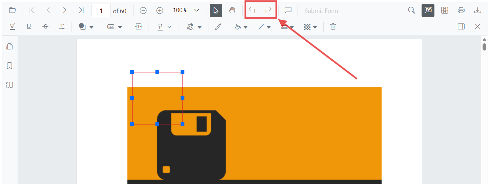

# Undo and Redo Annotations in JavaScript (ES6) PDF Viewer

The PDF Viewer supports undo and redo for annotations.



Undo and redo actions can be performed by using either of the following methods:

1. Using keyboard shortcuts (desktop):
    After performing an annotation action, press `Ctrl+Z` to undo and `Ctrl+Y` to redo on Windows and Linux. On macOS, use `Command+Z` to undo and `Command+Shift+Z` to redo.
2. Using the toolbar:
    Use the **Undo** and **Redo** tools in the toolbar.

Refer to the following code snippet to call undo and redo actions from the client side.

```html
    <!--Element to call undo-->
    <button id="undo">Undo</button>
    <!--Element to call redo-->
    <button id="redo"> Redo</button>
```


import { PdfViewer, Toolbar, Magnification, Navigation, LinkAnnotation,ThumbnailView, BookmarkView,
    TextSelection, Annotation, FormDesigner, FormFields } from '@syncfusion/ej2-pdfviewer';

PdfViewer.Inject( Toolbar,Magnification, Navigation, LinkAnnotation,ThumbnailView,
             BookmarkView, TextSelection, Annotation, FormDesigner, FormFields);

let pdfviewer: PdfViewer = new PdfViewer({
    documentPath:'https://cdn.syncfusion.com/content/pdf/pdf-succinctly.pdf',
    resourceUrl:"https://cdn.syncfusion.com/ej2/31.1.23/dist/ej2-pdfviewer-lib"
});
pdfviewer.appendTo('#PdfViewer');

document.getElementById('undo').addEventListener('click', ()=> {
    pdfviewer.undo();
});

document.getElementById('redo').addEventListener('click', ()=> {
    pdfviewer.redo();
});



N> To set up the **server-backed PDF Viewer**,
Add the below `serviceUrl` in the `index.ts` file
`pdfviewer.serviceUrl = 'https://document.syncfusion.com/web-services/pdf-viewer/api/pdfviewer/';`



## See also

- [Annotation Overview](./overview)
- [Annotation Types](./annotation-types/area-annotation)
- [Annotation Toolbar](../toolbar-customization/annotation-toolbar)
- [Create and Modify Annotation](./create-modify-annotation)
- [Customize Annotation](./customize-annotation)
- [Remove Annotation](./delete-annotation)
- [Handwritten Signature](./signature-annotation)
- [Export and Import Annotation](./export-import/export-annotation)
- [Annotation in Mobile View](./annotations-in-mobile-view)
- [Annotation Events](./annotation-event)
- [Annotations API](./annotations-api)