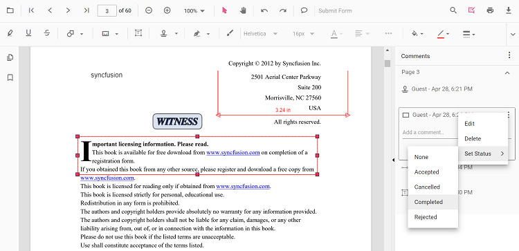

# Comments in TypeScript PDF Viewer control

The PDF Viewer control provides options to add, edit, and delete comments for the following annotations in PDF documents:

* Shape annotation
* Stamp annotation
* Sticky note annotation
* Measurement annotation
* Text markup annotation
* Free text annotation
* Ink annotation


## Adding a comment to the annotation in UI

Annotation comments, replies, and status can be managed in the PDF document using the comment panel.

### Comment panel

Annotation comments can be added to the PDF using the comment panel. The comment panel can be opened in the following ways:

1. Using the annotation menu

    * Click the Edit Annotation button in the PDF Viewer toolbar. A toolbar appears below it.
    * Click the Comment Panel button. The comment panel opens.

2. Using Context menu

    * Select the annotation in the PDF document and right-click it.
    * Select Comment from the context menu.

3. Using the Mouse click

    * Select the annotation in the PDF document and double-click it. The comment panel opens.

If the comment panel is already open, select the annotation and add comments using the panel.

### Adding comments

* Select the annotation in the PDF document.
* The corresponding comment thread is highlighted in the comment panel.
* Add comments and replies using the comment panel.


### Adding Comment Replies

* Multiple replies can be added to a comment.
* After adding a comment, add replies as needed.

### Adding Comment or Reply Status

* Select the annotation comment in the comment panel.
* Click More options in the comment or reply container.
* Select Set Status from the context menu.
* Choose a status for the comment.



### Editing the comments and comments replies of the annotations

Comments, replies, and status can be edited using the comment panel.

### Editing the Comment or Comment Replies

Edit comments and replies in the following ways:

1. Using the Context menu

    * Select the annotation comment in the comment panel.
    * Click More options in the comment or reply container.
    * Select Edit from the context menu.
    * An editable text box appears. Change the content of the comment or reply.

2. Using the Mouse Click

    * Select the annotation comment in the comment panel.
    * Double-click the comment or reply content.
    * An editable text box appears. Change the content of the comment or reply.

### Editing Comment or Reply Status

* Select the annotation comment in the comment panel.
* Click More options in the comment or reply container.
* Select Set Status from the context menu.
* Choose a status for the comment.
* None is the default state. Selecting None clears the status indicator; the comment or reply remains visible.


### Delete Comment or Comment Replies

* Select the annotation comment in the comment panel.
* Click More options in the comment or reply container.
* Select Delete from the context menu.


>Deleting the root comment from the comment panel also deletes the associated annotation.

## Add Comments to the annotation Programmatically

### How to Add Commnets and Replies programmatically

Comments can be added to the PDF document programmatically using the `editAnnotation` property.

The following example Shows how to add comments and reply in response to a button click.

```html
<button id="addComment">Add Comments</button>
<button id="addReply">Add Reply</button>
```


import {
  PdfViewer, Toolbar, Magnification, Navigation, Annotation, LinkAnnotation,
  ThumbnailView, BookmarkView, TextSelection, TextSearch, FormFields, FormDesigner, PageOrganizer
} from '@syncfusion/ej2-pdfviewer';

PdfViewer.Inject(
  Toolbar, Magnification, Navigation, Annotation, LinkAnnotation,
  ThumbnailView, BookmarkView, TextSelection, TextSearch, FormFields, FormDesigner, PageOrganizer
);

const pdfviewer: PdfViewer = new PdfViewer();
pdfviewer.documentPath = "https://cdn.syncfusion.com/content/pdf/pdf-succinctly.pdf";
pdfviewer.resourceUrl = "https://cdn.syncfusion.com/ej2/31.1.23/dist/ej2-pdfviewer-lib";
pdfviewer.appendTo('#PdfViewer');

//for adding Comments programmatically
document.getElementById("addComment")?.addEventListener("click", function() {
       let annot = pdfviewer.annotationCollection[0];
       if (annot) {
           annot.commentType = "add";
           annot.note = "New Comment";
           pdfviewer.annotation.editAnnotation(annot);
           console.log(pdfviewer.annotationCollection[0]);
       }
   });
//for adding reply programmatically
document.getElementById("addReply")?.addEventListener("click", function() {
       let annot = pdfviewer.annotationCollection[0];
       if (annot) {
           annot.commentType = "add";
           annot.replyComment = ["Reply Comment"];
           pdfviewer.annotation.editAnnotation(annot);
           console.log(pdfviewer.annotationCollection[0]);
       }
   });


import {
  PdfViewer, Toolbar, Magnification, Navigation, Annotation, LinkAnnotation,
  ThumbnailView, BookmarkView, TextSelection, TextSearch, FormFields, FormDesigner, PageOrganizer
} from '@syncfusion/ej2-pdfviewer';

PdfViewer.Inject(
  Toolbar, Magnification, Navigation, Annotation, LinkAnnotation,
  ThumbnailView, BookmarkView, TextSelection, TextSearch, FormFields, FormDesigner, PageOrganizer
);

const pdfviewer: PdfViewer = new PdfViewer();
pdfviewer.documentPath = "https://cdn.syncfusion.com/content/pdf/pdf-succinctly.pdf";
pdfviewer.serviceUrl = 'https://document.syncfusion.com/web-services/pdf-viewer/api/pdfviewer/';
pdfviewer.appendTo('#PdfViewer');

//for adding Comments programmatically
document.getElementById("addComment")?.addEventListener("click", function() {
       let annot = pdfviewer.annotationCollection[0];
       if (annot) {
           annot.commentType = "add";
           annot.note = "New Comment";
           pdfviewer.annotation.editAnnotation(annot);
           console.log(pdfviewer.annotationCollection[0]);
       }
   });
//for adding reply programmatically
document.getElementById("addReply")?.addEventListener("click", function() {
       let annot = pdfviewer.annotationCollection[0];
       if (annot) {
           annot.commentType = "add";
           annot.replyComment = ["Reply Comment"];
           pdfviewer.annotation.editAnnotation(annot);
           console.log(pdfviewer.annotationCollection[0]);
       }
   });



### How to Edit Comments programmatically

Comments can be edited in the PDF document programmatically using the `editAnnotation` property.

The following example Shows how to edit comments and reply in response to a button click.

```html
<button id="editComment">Edit Comments</button>
<button id="editReply">Edit Reply</button>
```



import {
  PdfViewer, Toolbar, Magnification, Navigation, Annotation, LinkAnnotation,
  ThumbnailView, BookmarkView, TextSelection, TextSearch, FormFields, FormDesigner, PageOrganizer
} from '@syncfusion/ej2-pdfviewer';

PdfViewer.Inject(
  Toolbar, Magnification, Navigation, Annotation, LinkAnnotation,
  ThumbnailView, BookmarkView, TextSelection, TextSearch, FormFields, FormDesigner, PageOrganizer
);

const pdfviewer: PdfViewer = new PdfViewer();
pdfviewer.documentPath = "https://cdn.syncfusion.com/content/pdf/pdf-succinctly.pdf";
pdfviewer.resourceUrl = "https://cdn.syncfusion.com/ej2/31.1.23/dist/ej2-pdfviewer-lib";
pdfviewer.appendTo('#PdfViewer');

//for Editing Comments programmatically
document.getElementById("editComment")?.addEventListener("click", function() {
       let annot = pdfviewer.annotationCollection[0];
       if (annot) {
           annot.commentType = "edit";
           annot.note = "Edited Comment";
           pdfviewer.annotation.editAnnotation(annot);
           console.log(pdfviewer.annotationCollection[0]);
       }
   });
 
//for Editing reply programmatically
document.getElementById("editReply")?.addEventListener("click", function() {
       let annot = pdfviewer.annotationCollection[0];
       if (annot) {
           annot.commentType = "edit";
           annot.replyComment = ["Edited Reply Comment"];
           pdfviewer.annotation.editAnnotation(annot);
           console.log(pdfviewer.annotationCollection[0]);
       }
   });



import {
  PdfViewer, Toolbar, Magnification, Navigation, Annotation, LinkAnnotation,
  ThumbnailView, BookmarkView, TextSelection, TextSearch, FormFields, FormDesigner, PageOrganizer
} from '@syncfusion/ej2-pdfviewer';

PdfViewer.Inject(
  Toolbar, Magnification, Navigation, Annotation, LinkAnnotation,
  ThumbnailView, BookmarkView, TextSelection, TextSearch, FormFields, FormDesigner, PageOrganizer
);

const pdfviewer: PdfViewer = new PdfViewer();
pdfviewer.documentPath = "https://cdn.syncfusion.com/content/pdf/pdf-succinctly.pdf";
pdfviewer.serviceUrl = 'https://document.syncfusion.com/web-services/pdf-viewer/api/pdfviewer/';
pdfviewer.appendTo('#PdfViewer');

//for Editing Comments programmatically
document.getElementById("editComment")?.addEventListener("click", function() {
       let annot = pdfviewer.annotationCollection[0];
       if (annot) {
           annot.commentType = "edit";
           annot.note = "Edited Comment";
           pdfviewer.annotation.editAnnotation(annot);
           console.log(pdfviewer.annotationCollection[0]);
       }
   });
 
//for Editing reply programmatically
document.getElementById("editReply")?.addEventListener("click", function() {
       let annot = pdfviewer.annotationCollection[0];
       if (annot) {
           annot.commentType = "edit";
           annot.replyComment = ["Edited Reply Comment"];
           pdfviewer.annotation.editAnnotation(annot);
           console.log(pdfviewer.annotationCollection[0]);
       }
   });





### How to check the comments added by the user

Comments added to the PDF document can be read using the annotation's `comments` property.

The following example logs comments in response to a button click.

```html
<button id="checkComments">Check the Comments</button>
```




import { PdfViewer, Toolbar, Magnification, Navigation, Annotation, LinkAnnotation, ThumbnailView, BookmarkView, TextSelection, TextSearch, FormFields, FormDesigner, PageOrganizer} from '@syncfusion/ej2-pdfviewer';

PdfViewer.Inject(Toolbar, Magnification, Navigation, Annotation, LinkAnnotation, ThumbnailView, BookmarkView, TextSelection, TextSearch, FormFields, FormDesigner, PageOrganizer);

let pdfviewer: PdfViewer = new PdfViewer();
pdfviewer.documentPath = "https://cdn.syncfusion.com/content/pdf/pdf-succinctly.pdf";
pdfviewer.resourceUrl = "https://cdn.syncfusion.com/ej2/31.1.23/dist/ej2-pdfviewer-lib";
pdfviewer.appendTo('#PdfViewer');





import { PdfViewer, Toolbar, Magnification, Navigation, Annotation, LinkAnnotation, ThumbnailView, BookmarkView, TextSelection, TextSearch, FormFields, FormDesigner, PageOrganizer} from '@syncfusion/ej2-pdfviewer';

PdfViewer.Inject(Toolbar, Magnification, Navigation, Annotation, LinkAnnotation, ThumbnailView, BookmarkView, TextSelection, TextSearch, FormFields, FormDesigner, PageOrganizer);

let pdfviewer: PdfViewer = new PdfViewer();
pdfviewer.serviceUrl = 'https://document.syncfusion.com/web-services/pdf-viewer/api/pdfviewer/';
pdfviewer.documentPath = "https://cdn.syncfusion.com/content/pdf/pdf-succinctly.pdf";
pdfviewer.appendTo('#PdfViewer');




```typescript
//Method to check the comments added in the PDF document.
document.getElementById('checkComments').addEventListener('click', function () {
    var annotationCollections = pdfviewer.annotationCollection;
    for (var x = 0; x < annotationCollections.length; x++) {
      //Prints the annotation id in the console window.
      console.log("annotation Id : " +annotationCollections[x].annotationId);
      var comments = annotationCollections[x].comments;
      for (var y = 0; y < comments.length; y++) {
        var comment = comments[y];
        //Prints the PDF document's comments in the console window.
        console.log("comment" + "[" + y + "] :" + comment.note);
      }
      var note = annotationCollections[x].note;
      console.log("note : " + note);
    }
});

```

## See also

- [Annotation Overview](../overview)
- [Annotation Types](../annotations/annotation-types/area-annotation)
- [Annotation Toolbar](../toolbar-customization/annotation-toolbar)
- [Create and Modify Annotation](../annotations/create-modify-annotation)
- [Customize Annotation](../annotations/customize-annotation)
- [Remove Annotation](../annotations/delete-annotation)
- [Handwritten Signature](../annotations/signature-annotation)
- [Export and Import Annotation](../annotations/export-import/export-annotation)
- [Annotation Permission](../annotations/annotation-permission)
- [Annotation in Mobile View](../annotations/annotations-in-mobile-view)
- [Annotation Events](../annotations/annotation-event)
- [Annotation API](../annotations/annotations-api)