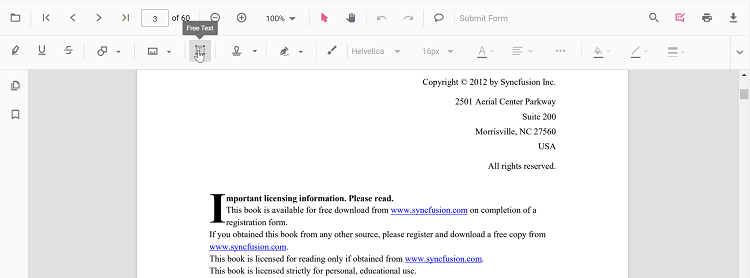

# Annotations overview

The PDF Viewer component provides a complete set of annotation tools for reviewing, measuring, and marking up PDFs in JavaScript (ES6).

## Supported annotations

- Text markup: Highlight, Underline, Squiggly, Strikethrough
- Shapes: Line, Arrow, Rectangle, Circle, Polygon
- Text boxes: Free Text
- Drawing: Ink (freehand)
- Stamps: Standard and custom stamps
- Notes: Sticky Notes (comments)
- Redaction: Mark and apply redactions
- Measurement: Distance, Perimeter, Area, Radius, Volume

### Text markup annotation in TypeScript PDF Viewer control

The PDF Viewer control provides options to add, edit, and delete text markup annotations. The supported text markup annotation types are:

* Highlight
* Underline
* Strikethrough
* Squiggly

### Shape annotation in TypeScript PDF Viewer control

The PDF Viewer control provides options to add, edit, and delete shape annotations. The supported shape annotation types are:

* Line
* Arrow
* Rectangle
* Circle
* Polygon

### Free text annotation in TypeScript PDF Viewer control

The PDF Viewer control provides options to add, edit, and delete free text annotations.

### Ink annotation in TypeScript PDF Viewer control

The PDF Viewer control provides options to add, edit, and delete ink annotations.

### Stamp annotation in TypeScript PDF Viewer control

The PDF Viewer control provides options to add, edit, delete, and rotate stamp annotations.

### Redaction in TypeScript PDF Viewer control

Redaction annotations are used to hide confidential or sensitive information in a PDF. You can mark areas for redaction and permanently apply them.

### Measurement annotation in TypeScript PDF Viewer control

The PDF Viewer provides options to add measurement annotations such as:

* Distance
* Perimeter
* Area
* Radius
* Volume

## Annotation manipulation capabilities

- Create annotations via toolbar/context menu and through APIs
- Select single or multiple annotations; marquee selection
- Move, resize, and rotate (where applicable)
- Edit contents (for notes and free text) and update properties (color, opacity, thickness, fill, font, line endings)
- Copy, paste, duplicate, delete; lock/unlock to prevent changes
- Import/export annotations (e.g., JSON/XFDF) and save with the PDF; optional flattening
- Undo/redo recent actions
- Respect document permissions; restrict tools or edits when required

### Comments in TypeScript PDF Viewer control

The PDF Viewer control provides options to add, edit, and delete comments for the following annotations in PDF documents:

* Shape annotation
* Stamp annotation
* Sticky note annotation
* Measurement annotation
* Text markup annotation
* Free text annotation
* Ink annotation
* Redaction annotation

### Import and Export Annotations

You can save and reload annotations by exporting and importing them in JSON format. This makes it easy to persist annotations or share them across sessions.

For more details, see the [Export and import annotations documentation](../how-to/import-export-annotation-ts).