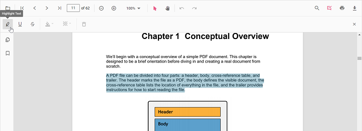

# Text markup annotation in TypeScript PDF Viewer

The PDF Viewer provides options to add, edit, and delete text markup annotations, including Highlight, Underline, Strikethrough, and Squiggly.


## Highlight text

There are two ways to highlight text:

1. Using the context menu
* Select text in the PDF document and right-click it.
* Select **Highlight** in the context menu.


<!-- markdownlint-disable MD029 -->
2. Using the annotation toolbar
* Click the **Edit Annotation** button in the PDF Viewer toolbar to open the annotation toolbar.
* Select **Highlight** to enable highlight mode.
* Select text to add the highlight annotation.
* Alternatively, select text first and then click **Highlight**.



When pan mode is active and a text markup mode is entered, the PDF Viewer switches to text selection mode to enable selection.

Refer to the following code snippet to switch to highlight mode.



import { PdfViewer, Toolbar, Magnification, Navigation, LinkAnnotation,ThumbnailView, BookmarkView,
         TextSelection, Annotation, FormDesigner, FormFields } from '@syncfusion/ej2-pdfviewer';

PdfViewer.Inject( Toolbar,Magnification, Navigation, LinkAnnotation,ThumbnailView,
                  BookmarkView, TextSelection, Annotation, FormDesigner, FormFields);

let pdfviewer: PdfViewer = new PdfViewer({
    documentPath:'https://cdn.syncfusion.com/content/pdf/pdf-succinctly.pdf',
    resourceUrl:"https://cdn.syncfusion.com/ej2/31.1.23/dist/ej2-pdfviewer-lib"
});
pdfviewer.appendTo('#PdfViewer');

document.getElementById('set').addEventListener('click', ()=> {
    pdfviewer.annotation.setAnnotationMode('Highlight');
});


<!DOCTYPE html>
<html lang="en">

<head>
    <title>EJ2 PDF Viewer</title>
    <meta charset="utf-8" />
    <meta name="viewport" content="width=device-width, initial-scale=1.0" />
    <meta name="description" content="TypeScript PDF Viewer Control" />
    <meta name="author" content="Syncfusion" />
    <link href="index.css" rel="stylesheet" />
    <link href="https://cdn.syncfusion.com/ej2/31.1.23/material.css" rel="stylesheet" />

    <script src="https://cdnjs.cloudflare.com/ajax/libs/systemjs/0.19.38/system.js"></script>
 	<script src="systemjs.config.js"></script>
</head>

<body>

    <div id='loader'>Loading....</div>
	<!--Element to set text markup annotation mode-->
    <button id="set">Highlight</button>
    <div id='container'>
        <div id='PdfViewer' style="height:500px;width:100%;"></div>
    </div>

<script src="index.ts" type="text/typescript"></script>
</body>
</html>



N> To set up the **server-backed PDF Viewer**,
Add the below `serviceUrl` in the `index.ts` file
`pdfviewer.serviceUrl = 'https://document.syncfusion.com/web-services/pdf-viewer/api/pdfviewer/';`



Refer to the following code snippet to switch back to normal mode from highlight mode.



import { PdfViewer, Toolbar, Magnification, Navigation, LinkAnnotation,ThumbnailView, BookmarkView,
    TextSelection, Annotation, FormDesigner, FormFields } from '@syncfusion/ej2-pdfviewer';

PdfViewer.Inject( Toolbar,Magnification, Navigation, LinkAnnotation,ThumbnailView,
             BookmarkView, TextSelection, Annotation, FormDesigner, FormFields);

let pdfviewer: PdfViewer = new PdfViewer({
    documentPath:'https://cdn.syncfusion.com/content/pdf/pdf-succinctly.pdf',
    resourceUrl:"https://cdn.syncfusion.com/ej2/31.1.23/dist/ej2-pdfviewer-lib"
});
pdfviewer.appendTo('#PdfViewer');

document.getElementById('set').addEventListener('click', ()=> {
    pdfviewer.annotation.setAnnotationMode('Highlight');
});

document.getElementById('setNone').addEventListener('click', ()=> {
    pdfviewer.annotation.setAnnotationMode('None');
});


<!DOCTYPE html>
<html lang="en">

<head>
    <title>EJ2 PDF Viewer</title>
    <meta charset="utf-8" />
    <meta name="viewport" content="width=device-width, initial-scale=1.0" />
    <meta name="description" content="TypeScript PDF Viewer Control" />
    <meta name="author" content="Syncfusion" />
    <link href="index.css" rel="stylesheet" />
    <link href="https://cdn.syncfusion.com/ej2/31.1.23/material.css" rel="stylesheet" />

    <script src="https://cdnjs.cloudflare.com/ajax/libs/systemjs/0.19.38/system.js"></script>
 	<script src="systemjs.config.js"></script>
</head>
<body>
    <div id='loader'>Loading....</div>
	<!--Element to set text markup annotation mode-->
    <button id="set">Highlight</button>
    <!--Element to set normal mode-->
    <button id="setNone">Normal Mode</button>
    <div id='container'>
        <div id='PdfViewer' style="height:500px;width:100%;"></div>
    </div>
    <script src="index.ts" type="text/typescript"></script>
</body>
</html>



N> To set up the **server-backed PDF Viewer**,
Add the below `serviceUrl` in the `index.ts` file
`pdfviewer.serviceUrl = 'https://document.syncfusion.com/web-services/pdf-viewer/api/pdfviewer/';`




## Highlight text programmatically

Programmatically add highlights using the [addAnnotation](https://ej2.syncfusion.com/documentation/api/pdfviewer/annotation/#addannotation) method.

Example:

```html
<button id="highlight">Add TextMarkup annotation programmatically</button>
```




import { PdfViewer, Toolbar, Magnification, Navigation, Annotation, LinkAnnotation, ThumbnailView, BookmarkView, TextSelection, TextSearch, FormFields, FormDesigner, PageOrganizer, HighlightSettings} from '@syncfusion/ej2-pdfviewer';

PdfViewer.Inject(Toolbar, Magnification, Navigation, Annotation, LinkAnnotation, ThumbnailView, BookmarkView, TextSelection, TextSearch, FormFields, FormDesigner, PageOrganizer);

let pdfviewer: PdfViewer = new PdfViewer();
pdfviewer.documentPath = "https://cdn.syncfusion.com/content/pdf/pdf-succinctly.pdf";
pdfviewer.resourceUrl = "https://cdn.syncfusion.com/ej2/31.1.23/dist/ej2-pdfviewer-lib";
pdfviewer.appendTo('#PdfViewer');

let highlight = document.getElementById('highlight');
if (highlight) {
    highlight.addEventListener('click', function () {
        if (pdfviewer) {
            pdfviewer.annotation.addAnnotation("Highlight", {
                bounds: [{ x: 97, y: 110, width: 350, height: 14 }],
                pageNumber: 1
            } as HighlightSettings);
        }
    });
}




import { PdfViewer, Toolbar, Magnification, Navigation, Annotation, LinkAnnotation, ThumbnailView, BookmarkView, TextSelection, TextSearch, FormFields, FormDesigner, PageOrganizer, HighlightSettings} from '@syncfusion/ej2-pdfviewer';

PdfViewer.Inject(Toolbar, Magnification, Navigation, Annotation, LinkAnnotation, ThumbnailView, BookmarkView, TextSelection, TextSearch, FormFields, FormDesigner, PageOrganizer);

let pdfviewer: PdfViewer = new PdfViewer();
pdfviewer.serviceUrl = 'https://document.syncfusion.com/web-services/pdf-viewer/api/pdfviewer/';
pdfviewer.documentPath = "https://cdn.syncfusion.com/content/pdf/pdf-succinctly.pdf";
pdfviewer.appendTo('#PdfViewer');

let highlight = document.getElementById('highlight');
if (highlight) {
    highlight.addEventListener('click', function () {
        if (pdfviewer) {
            pdfviewer.annotation.addAnnotation("Highlight", {
                bounds: [{ x: 97, y: 110, width: 350, height: 14 }],
                pageNumber: 1
            } as HighlightSettings);
        }
    });
}




## Underline text

There are two ways to underline text:

1. Using the context menu
* Select text in the PDF document and right-click it.
* Select **Underline** in the context menu.


<!-- markdownlint-disable MD029 -->
2. Using the annotation toolbar
* Click the **Edit Annotation** button in the PDF Viewer toolbar to open the annotation toolbar.
* Select **Underline** to enable underline mode.
* Select text to add the underline annotation.
* Alternatively, select text first and then click **Underline**.


In the pan mode, if the underline mode is entered, the PDF Viewer control will switch to text select mode to enable the text selection for underlining the text.

Refer to the following code snippet to switch to underline mode.



import { PdfViewer, Toolbar, Magnification, Navigation, LinkAnnotation,ThumbnailView, BookmarkView,
    TextSelection, Annotation, FormDesigner, FormFields } from '@syncfusion/ej2-pdfviewer';

PdfViewer.Inject( Toolbar,Magnification, Navigation, LinkAnnotation,ThumbnailView,
                  BookmarkView, TextSelection, Annotation, FormDesigner, FormFields);

let pdfviewer: PdfViewer = new PdfViewer({
    documentPath:'https://cdn.syncfusion.com/content/pdf/pdf-succinctly.pdf',
    resourceUrl:"https://cdn.syncfusion.com/ej2/31.1.23/dist/ej2-pdfviewer-lib"
});
pdfviewer.appendTo('#PdfViewer');

document.getElementById('set').addEventListener('click', ()=> {
    pdfviewer.annotation.setAnnotationMode('Underline');
});


<!DOCTYPE html>
<html lang="en">

<head>
    <title>EJ2 PDF Viewer</title>
    <meta charset="utf-8" />
    <meta name="viewport" content="width=device-width, initial-scale=1.0" />
    <meta name="description" content="TypeScript PDF Viewer Control" />
    <meta name="author" content="Syncfusion" />
    <link href="index.css" rel="stylesheet" />
    <link href="https://cdn.syncfusion.com/ej2/31.1.23/material.css" rel="stylesheet" />


    <script src="https://cdnjs.cloudflare.com/ajax/libs/systemjs/0.19.38/system.js"></script>
 	<script src="systemjs.config.js"></script>
</head>
<body>
    <div id='loader'>Loading....</div>
	<!--Element to set text markup annotation mode-->
    <button id="set">Underline</button>
    <div id='container'>
        <div id='PdfViewer' style="height:500px;width:100%;"></div>
    </div>
    <script src="index.ts" type="text/typescript"></script>
</body>
</html>



N> To set up the **server-backed PDF Viewer**,
Add the below `serviceUrl` in the `index.ts` file
`pdfviewer.serviceUrl = 'https://document.syncfusion.com/web-services/pdf-viewer/api/pdfviewer/';`



Refer to the following code snippet to switch back to normal mode from underline mode.



import { PdfViewer, Toolbar, Magnification, Navigation, LinkAnnotation,ThumbnailView, BookmarkView,
    TextSelection, Annotation, FormDesigner, FormFields } from '@syncfusion/ej2-pdfviewer';

PdfViewer.Inject( Toolbar,Magnification, Navigation, LinkAnnotation,ThumbnailView,
             BookmarkView, TextSelection, Annotation, FormDesigner, FormFields);

let pdfviewer: PdfViewer = new PdfViewer({
    documentPath:'https://cdn.syncfusion.com/content/pdf/pdf-succinctly.pdf',
    resourceUrl:"https://cdn.syncfusion.com/ej2/31.1.23/dist/ej2-pdfviewer-lib"
});
pdfviewer.appendTo('#PdfViewer');

document.getElementById('set').addEventListener('click', ()=> {
    pdfviewer.annotation.setAnnotationMode('Underline');
});

document.getElementById('setNone').addEventListener('click', ()=> {
    pdfviewer.annotation.setAnnotationMode('None');
});


<!DOCTYPE html>
<html lang="en">

<head>
    <title>EJ2 PDF Viewer</title>
    <meta charset="utf-8" />
    <meta name="viewport" content="width=device-width, initial-scale=1.0" />
    <meta name="description" content="TypeScript PDF Viewer Control" />
    <meta name="author" content="Syncfusion" />
    <link href="index.css" rel="stylesheet" />
    <link href="https://cdn.syncfusion.com/ej2/31.1.23/material.css" rel="stylesheet" />

    <script src="https://cdnjs.cloudflare.com/ajax/libs/systemjs/0.19.38/system.js"></script>
 	<script src="systemjs.config.js"></script>
</head>
<body>
    <div id='loader'>Loading....</div>
	<!--Element to set text markup annotation mode-->
    <button id="set">Underline</button>
    <!--Element to set normal mode-->
    <button id="setNone">Normal Mode</button>
    <div id='container'>
        <div id='PdfViewer' style="height:500px;width:100%;"></div>
    </div>
    <script src="index.ts" type="text/typescript"></script>
</body>
</html>



N> To set up the **server-backed PDF Viewer**,
Add the below `serviceUrl` in the `index.ts` file
`pdfviewer.serviceUrl = 'https://document.syncfusion.com/web-services/pdf-viewer/api/pdfviewer/';`



## Underline text programmatically

Programmatically add underlines using the [addAnnotation](https://ej2.syncfusion.com/documentation/api/pdfviewer/annotation/#addannotation) method.

Example:

```html
<button id="underline">Add TextMarkup annotation programmatically</button>
```




import { PdfViewer, Toolbar, Magnification, Navigation, Annotation, LinkAnnotation, ThumbnailView, BookmarkView, TextSelection, TextSearch, FormFields, FormDesigner, PageOrganizer, UnderlineSettings} from '@syncfusion/ej2-pdfviewer';

PdfViewer.Inject(Toolbar, Magnification, Navigation, Annotation, LinkAnnotation, ThumbnailView, BookmarkView, TextSelection, TextSearch, FormFields, FormDesigner, PageOrganizer);

let pdfviewer: PdfViewer = new PdfViewer();
pdfviewer.documentPath = "https://cdn.syncfusion.com/content/pdf/pdf-succinctly.pdf";
pdfviewer.resourceUrl = "https://cdn.syncfusion.com/ej2/31.1.23/dist/ej2-pdfviewer-lib";
pdfviewer.appendTo('#PdfViewer');

let underline = document.getElementById('underline');
if (underline) {
    underline.addEventListener('click', function () {
        if (pdfviewer) {
            pdfviewer.annotation.addAnnotation("Underline", {
                bounds: [{ x: 97, y: 110, width: 350, height: 14 }],
                pageNumber: 1
            } as UnderlineSettings);
        }
    });
}




import { PdfViewer, Toolbar, Magnification, Navigation, Annotation, LinkAnnotation, ThumbnailView, BookmarkView, TextSelection, TextSearch, FormFields, FormDesigner, PageOrganizer, UnderlineSettings} from '@syncfusion/ej2-pdfviewer';

PdfViewer.Inject(Toolbar, Magnification, Navigation, Annotation, LinkAnnotation, ThumbnailView, BookmarkView, TextSelection, TextSearch, FormFields, FormDesigner, PageOrganizer);

let pdfviewer: PdfViewer = new PdfViewer();
pdfviewer.serviceUrl = 'https://document.syncfusion.com/web-services/pdf-viewer/api/pdfviewer/';
pdfviewer.documentPath = "https://cdn.syncfusion.com/content/pdf/pdf-succinctly.pdf";
pdfviewer.appendTo('#PdfViewer');

let underline = document.getElementById('underline');
if (underline) {
    underline.addEventListener('click', function () {
        if (pdfviewer) {
            pdfviewer.annotation.addAnnotation("Underline", {
                bounds: [{ x: 97, y: 110, width: 350, height: 14 }],
                pageNumber: 1
            } as UnderlineSettings);
        }
    });
}




## Strikethrough text

There are two ways to strikethrough text:

1. Using the context menu
* Select text in the PDF document and right-click it.
* Select **Strikethrough** in the context menu.


<!-- markdownlint-disable MD029 -->
2. Using the annotation toolbar
* Click the **Edit Annotation** button in the PDF Viewer toolbar to open the annotation toolbar.
* Select **Strikethrough** to enable strikethrough mode.
* Select text to add the strikethrough annotation.
* Alternatively, select text first and then click **Strikethrough**.


In the pan mode, if the strikethrough mode is entered, the PDF Viewer control will switch to text select mode to enable the text selection for striking through the text.

Refer to the following code snippet to switch to strikethrough mode.



import { PdfViewer, Toolbar, Magnification, Navigation, LinkAnnotation,ThumbnailView, BookmarkView,
         TextSelection, Annotation, FormDesigner, FormFields } from '@syncfusion/ej2-pdfviewer';

PdfViewer.Inject( Toolbar,Magnification, Navigation, LinkAnnotation,ThumbnailView,
                  BookmarkView, TextSelection, Annotation, FormDesigner, FormFields);

let pdfviewer: PdfViewer = new PdfViewer({
    documentPath:'https://cdn.syncfusion.com/content/pdf/pdf-succinctly.pdf',
    resourceUrl:"https://cdn.syncfusion.com/ej2/31.1.23/dist/ej2-pdfviewer-lib"
});
pdfviewer.appendTo('#PdfViewer');

document.getElementById('set').addEventListener('click', ()=> {
    pdfviewer.annotation.setAnnotationMode('Strikethrough');
});


<!DOCTYPE html>
<html lang="en">

<head>
    <title>EJ2 PDF Viewer</title>
    <meta charset="utf-8" />
    <meta name="viewport" content="width=device-width, initial-scale=1.0" />
    <meta name="description" content="TypeScript PDF Viewer Control" />
    <meta name="author" content="Syncfusion" />
    <link href="index.css" rel="stylesheet" />
    <link href="https://cdn.syncfusion.com/ej2/31.1.23/material.css" rel="stylesheet" />

    <script src="https://cdnjs.cloudflare.com/ajax/libs/systemjs/0.19.38/system.js"></script>
 	<script src="systemjs.config.js"></script>
</head>
<body>
    <div id='loader'>Loading....</div>
	<!--Element to set text markup annotation mode-->
    <button id="set">Strikethrough</button>
    <div id='container'>
        <div id='PdfViewer' style="height:500px;width:100%;"></div>
    </div>
    <script src="index.ts" type="text/typescript"></script>
</body>
</html>



N> To set up the **server-backed PDF Viewer**,
Add the below `serviceUrl` in the `index.ts` file
`pdfviewer.serviceUrl = 'https://document.syncfusion.com/web-services/pdf-viewer/api/pdfviewer/';`



Refer to the following code snippet to switch back to normal mode from strikethrough mode.



import { PdfViewer, Toolbar, Magnification, Navigation, LinkAnnotation,ThumbnailView,BookmarkView,
TextSelection, Annotation} from '@syncfusion/ej2-pdfviewer';

PdfViewer.Inject(Toolbar,Magnification,Navigation, LinkAnnotation,ThumbnailView,BookmarkView,
TextSelection, Annotation);

let pdfviewer: PdfViewer = new PdfViewer({
    documentPath:'https://cdn.syncfusion.com/content/pdf/pdf-succinctly.pdf',
    resourceUrl:"https://cdn.syncfusion.com/ej2/31.1.23/dist/ej2-pdfviewer-lib"
});

pdfviewer.appendTo('#PdfViewer');

document.getElementById('set').addEventListener('click', ()=> {
    pdfviewer.annotation.setAnnotationMode('Strikethrough');
});

document.getElementById('setNone').addEventListener('click', ()=> {
    pdfviewer.annotation.setAnnotationMode('None');
});


<!DOCTYPE html>
<html lang="en">

<head>
    <title>EJ2 PDF Viewer</title>
    <meta charset="utf-8" />
    <meta name="viewport" content="width=device-width, initial-scale=1.0" />
    <meta name="description" content="TypeScript PDF Viewer Control" />
    <meta name="author" content="Syncfusion" />
    <link href="index.css" rel="stylesheet" />
    <link href="https://cdn.syncfusion.com/ej2/31.1.23/material.css" rel="stylesheet" />

    <script src="https://cdnjs.cloudflare.com/ajax/libs/systemjs/0.19.38/system.js"></script>
 	<script src="systemjs.config.js"></script>
</head>

<body>
    <div id='loader'>Loading....</div>
	<!--Element to set text markup annotation mode-->
    <button id="set">Strikethrough</button>
    <!--Element to set normal mode-->
    <button id="setNone">Normal Mode</button>
    <div id='container'>
        <div id='PdfViewer' style="height:500px;width:100%;"></div>
    </div>
    <script src="index.ts" type="text/typescript"></script>
</body>
</html>



N> To set up the **server-backed PDF Viewer**,
Add the below `serviceUrl` in the `index.ts` file
`pdfviewer.serviceUrl = 'https://document.syncfusion.com/web-services/pdf-viewer/api/pdfviewer/';`



## Strikethrough text programmatically

Programmatically add strikethrough using the [addAnnotation](https://ej2.syncfusion.com/documentation/api/pdfviewer/annotation/#addannotation) method.

Example:

```html
<button id="strikethrough">Add TextMarkup annotation programmatically</button>
```




import { PdfViewer, Toolbar, Magnification, Navigation, Annotation, LinkAnnotation, ThumbnailView, BookmarkView, TextSelection, TextSearch, FormFields, FormDesigner, PageOrganizer, StrikethroughSettings} from '@syncfusion/ej2-pdfviewer';

PdfViewer.Inject(Toolbar, Magnification, Navigation, Annotation, LinkAnnotation, ThumbnailView, BookmarkView, TextSelection, TextSearch, FormFields, FormDesigner, PageOrganizer);

let pdfviewer: PdfViewer = new PdfViewer();
pdfviewer.documentPath = "https://cdn.syncfusion.com/content/pdf/pdf-succinctly.pdf";
pdfviewer.resourceUrl = "https://cdn.syncfusion.com/ej2/31.1.23/dist/ej2-pdfviewer-lib";
pdfviewer.appendTo('#PdfViewer');

let strikethrough = document.getElementById('strikethrough');
if (strikethrough) {
    strikethrough.addEventListener('click', function () {
        if (pdfviewer) {
            pdfviewer.annotation.addAnnotation("Strikethrough", {
                bounds: [{ x: 97, y: 110, width: 350, height: 14 }],
                pageNumber: 1
            } as StrikethroughSettings);
        }
    });
}




import { PdfViewer, Toolbar, Magnification, Navigation, Annotation, LinkAnnotation, ThumbnailView, BookmarkView, TextSelection, TextSearch, FormFields, FormDesigner, PageOrganizer, StrikethroughSettings} from '@syncfusion/ej2-pdfviewer';

PdfViewer.Inject(Toolbar, Magnification, Navigation, Annotation, LinkAnnotation, ThumbnailView, BookmarkView, TextSelection, TextSearch, FormFields, FormDesigner, PageOrganizer);

let pdfviewer: PdfViewer = new PdfViewer();
pdfviewer.serviceUrl = 'https://document.syncfusion.com/web-services/pdf-viewer/api/pdfviewer/';
pdfviewer.documentPath = "https://cdn.syncfusion.com/content/pdf/pdf-succinctly.pdf";
pdfviewer.appendTo('#PdfViewer');

let strikethrough = document.getElementById('strikethrough');
if (strikethrough) {
    strikethrough.addEventListener('click', function () {
        if (pdfviewer) {
            pdfviewer.annotation.addAnnotation("Strikethrough", {
                bounds: [{ x: 97, y: 110, width: 350, height: 14 }],
                pageNumber: 1
            } as StrikethroughSettings);
        }
    });
}




## Add squiggly to text

There are two ways to add squiggly to text:

1. Using the context menu
* Select text in the PDF document and right-click it.
* Select **Squiggly** in the context menu.


2. Using the annotation toolbar
* Click the **Edit Annotation** button in the PDF Viewer toolbar to open the annotation toolbar.
* Select **Squiggly** to enable squiggly mode.
* Select text to add the squiggly annotation.
* Alternatively, select text first and then click **Squiggly**.


In the pan mode, if the squiggly mode is entered, the PDF Viewer control will switch to text select mode to enable the text selection for adding squiggly to the text.

Refer to the following code snippet to switch to squiggly mode.



import { PdfViewer, Toolbar, Magnification, Navigation, LinkAnnotation,ThumbnailView, BookmarkView,
         TextSelection, Annotation, FormDesigner, FormFields } from '@syncfusion/ej2-pdfviewer';

PdfViewer.Inject( Toolbar,Magnification, Navigation, LinkAnnotation,ThumbnailView,
                  BookmarkView, TextSelection, Annotation, FormDesigner, FormFields);

let pdfviewer: PdfViewer = new PdfViewer({
    documentPath:'https://cdn.syncfusion.com/content/pdf/pdf-succinctly.pdf',
    resourceUrl:"https://cdn.syncfusion.com/ej2/31.1.23/dist/ej2-pdfviewer-lib"
});
pdfviewer.appendTo('#PdfViewer');

document.getElementById('set').addEventListener('click', ()=> {
    pdfviewer.annotation.setAnnotationMode('Squiggly');
});


<!DOCTYPE html>
<html lang="en">

<head>
    <title>EJ2 PDF Viewer</title>
    <meta charset="utf-8" />
    <meta name="viewport" content="width=device-width, initial-scale=1.0" />
    <meta name="description" content="TypeScript PDF Viewer Control" />
    <meta name="author" content="Syncfusion" />
    <link href="index.css" rel="stylesheet" />
    <link href="https://cdn.syncfusion.com/ej2/31.1.23/material.css" rel="stylesheet" />

    <script src="https://cdnjs.cloudflare.com/ajax/libs/systemjs/0.19.38/system.js"></script>
 	<script src="systemjs.config.js"></script>
</head>
<body>
    <div id='loader'>Loading....</div>
	<!--Element to set text markup annotation mode-->
    <button id="set">Squiggly</button>
    <div id='container'>
        <div id='PdfViewer' style="height:500px;width:100%;"></div>
    </div>
    <script src="index.ts" type="text/typescript"></script>
</body>
</html>



N> To set up the **server-backed PDF Viewer**,
Add the below `serviceUrl` in the `index.ts` file
`pdfviewer.serviceUrl = 'https://document.syncfusion.com/web-services/pdf-viewer/api/pdfviewer/';`



Refer to the following code snippet to switch back to normal mode from squiggly mode.



import { PdfViewer, Toolbar, Magnification, Navigation, LinkAnnotation,ThumbnailView,BookmarkView,
TextSelection, Annotation} from '@syncfusion/ej2-pdfviewer';

PdfViewer.Inject(Toolbar,Magnification,Navigation, LinkAnnotation,ThumbnailView,BookmarkView,
TextSelection, Annotation);

let pdfviewer: PdfViewer = new PdfViewer({
    documentPath:'https://cdn.syncfusion.com/content/pdf/pdf-succinctly.pdf',
    resourceUrl:"https://cdn.syncfusion.com/ej2/31.1.23/dist/ej2-pdfviewer-lib"
});

pdfviewer.appendTo('#PdfViewer');

document.getElementById('set').addEventListener('click', ()=> {
    pdfviewer.annotation.setAnnotationMode('Squiggly');
});

document.getElementById('setNone').addEventListener('click', ()=> {
    pdfviewer.annotation.setAnnotationMode('None');
});


<!DOCTYPE html>
<html lang="en">

<head>
    <title>EJ2 PDF Viewer</title>
    <meta charset="utf-8" />
    <meta name="viewport" content="width=device-width, initial-scale=1.0" />
    <meta name="description" content="TypeScript PDF Viewer Control" />
    <meta name="author" content="Syncfusion" />
    <link href="index.css" rel="stylesheet" />
    <link href="https://cdn.syncfusion.com/ej2/31.1.23/material.css" rel="stylesheet" />

    <script src="https://cdnjs.cloudflare.com/ajax/libs/systemjs/0.19.38/system.js"></script>
 	<script src="systemjs.config.js"></script>
</head>

<body>
    <div id='loader'>Loading....</div>
	<!--Element to set text markup annotation mode-->
    <button id="set">Squiggly</button>
    <!--Element to set normal mode-->
    <button id="setNone">Normal Mode</button>
    <div id='container'>
        <div id='PdfViewer' style="height:500px;width:100%;"></div>
    </div>
    <script src="index.ts" type="text/typescript"></script>
</body>
</html>



N> To set up the **server-backed PDF Viewer**,
Add the below `serviceUrl` in the `index.ts` file
`pdfviewer.serviceUrl = 'https://document.syncfusion.com/web-services/pdf-viewer/api/pdfviewer/';`



## Add squiggly to text programmatically

Programmatically add squiggly using the [addAnnotation](https://ej2.syncfusion.com/documentation/api/pdfviewer/annotation/#addannotation) method.

Example:

```html
<button id="squiggly">Add TextMarkup annotation programmatically</button>
```




import { PdfViewer, Toolbar, Magnification, Navigation, Annotation, LinkAnnotation, ThumbnailView, BookmarkView, TextSelection, TextSearch, FormFields, FormDesigner, PageOrganizer, SquigglySettings} from '@syncfusion/ej2-pdfviewer';

PdfViewer.Inject(Toolbar, Magnification, Navigation, Annotation, LinkAnnotation, ThumbnailView, BookmarkView, TextSelection, TextSearch, FormFields, FormDesigner, PageOrganizer);

let pdfviewer: PdfViewer = new PdfViewer();
pdfviewer.documentPath = "https://cdn.syncfusion.com/content/pdf/pdf-succinctly.pdf";
pdfviewer.resourceUrl = "https://cdn.syncfusion.com/ej2/31.1.23/dist/ej2-pdfviewer-lib";
pdfviewer.appendTo('#PdfViewer');

let squiggly = document.getElementById('squiggly');
if (squiggly) {
    squiggly.addEventListener('click', function () {
        if (pdfviewer) {
            pdfviewer.annotation.addAnnotation("Squiggly", {
                bounds: [{ x: 97, y: 110, width: 350, height: 14 }],
                pageNumber: 1
            } as SquigglySettings);
        }
    });
}




import { PdfViewer, Toolbar, Magnification, Navigation, Annotation, LinkAnnotation, ThumbnailView, BookmarkView, TextSelection, TextSearch, FormFields, FormDesigner, PageOrganizer, SquigglySettings} from '@syncfusion/ej2-pdfviewer';

PdfViewer.Inject(Toolbar, Magnification, Navigation, Annotation, LinkAnnotation, ThumbnailView, BookmarkView, TextSelection, TextSearch, FormFields, FormDesigner, PageOrganizer);

let pdfviewer: PdfViewer = new PdfViewer();
pdfviewer.serviceUrl = 'https://document.syncfusion.com/web-services/pdf-viewer/api/pdfviewer/';
pdfviewer.documentPath = "https://cdn.syncfusion.com/content/pdf/pdf-succinctly.pdf";
pdfviewer.appendTo('#PdfViewer');

let squiggly = document.getElementById('squiggly');
if (squiggly) {
    squiggly.addEventListener('click', function () {
        if (pdfviewer) {
            pdfviewer.annotation.addAnnotation("Squiggly", {
                bounds: [{ x: 97, y: 110, width: 350, height: 14 }],
                pageNumber: 1
            } as SquigglySettings);
        }
    });
}




## Deleting a text markup annotation

The selected annotation can be deleted in the following ways:

1. Using the Delete/Backspace key
    * Select the annotation.
    * Press Delete (or Backspace). The selected annotation is removed.

2. Using the annotation toolbar
    * Select the annotation.
    * Click **Delete Annotation** in the annotation toolbar. The selected annotation is removed.


## Edit text markup annotation properties

The color and the opacity of the text markup annotation can be edited using the Edit Color tool and the Edit Opacity tool in the annotation toolbar.

### Edit color

Use the color palette in the Edit Color tool to change the annotation color.


### Edit opacity

Use the range slider in the Edit Opacity tool to change annotation opacity.


## Set default properties during control initialization

Set default properties before creating the control using `highlightSettings`, `underlineSettings`, `strikethroughSettings`, and `squigglySettings`.

> After editing default color and opacity using the Edit Color and Edit Opacity tools, the values update to the selected settings.

Refer to the following code snippet to set the default annotation settings.




import { PdfViewer, Toolbar, Magnification, Navigation, LinkAnnotation,ThumbnailView,BookmarkView,
TextSelection, Annotation} from '@syncfusion/ej2-pdfviewer';

PdfViewer.Inject(Toolbar,Magnification,Navigation, LinkAnnotation,ThumbnailView,BookmarkView,
TextSelection, Annotation);

let pdfviewer: PdfViewer = new PdfViewer({ documentPath:'https://cdn.syncfusion.com/content/pdf/pdf-succinctly.pdf',
highlightSettings: {author: 'Guest User', subject: 'Important', color: '#ffff00', opacity: 0.9, modifiedDate: ''},
underlineSettings: {author: 'Guest User', subject: 'Points to be remembered', color: '#00ffff', opacity: 0.9, modifiedDate: ''},
strikethroughSettings: {author: 'Guest User', subject: 'Not Important', color: '#ff00ff', opacity: 0.9, modifiedDate: ''},
squigglySettings: {author: 'Guest User', subject: 'Corrections', color: '#00ff00', opacity: 0.9, modifiedDate: ''} });
pdfviewer.appendTo('#PdfViewer');




import { PdfViewer, Toolbar, Magnification, Navigation, LinkAnnotation,ThumbnailView,BookmarkView,
TextSelection, Annotation} from '@syncfusion/ej2-pdfviewer';

PdfViewer.Inject(Toolbar,Magnification,Navigation, LinkAnnotation,ThumbnailView,BookmarkView,
TextSelection, Annotation);

let pdfviewer: PdfViewer = new PdfViewer({ documentPath:'https://cdn.syncfusion.com/content/pdf/pdf-succinctly.pdf',
highlightSettings: {author: 'Guest User', subject: 'Important', color: '#ffff00', opacity: 0.9, modifiedDate: ''},
underlineSettings: {author: 'Guest User', subject: 'Points to be remembered', color: '#00ffff', opacity: 0.9, modifiedDate: ''},
strikethroughSettings: {author: 'Guest User', subject: 'Not Important', color: '#ff00ff', opacity: 0.9, modifiedDate: ''},
squigglySettings: {author: 'Guest User', subject: 'Corrections', color: '#00ff00', opacity: 0.9, modifiedDate: ''} });
pdfviewer.serviceUrl = 'https://document.syncfusion.com/web-services/pdf-viewer/api/pdfviewer/';
pdfviewer.appendTo('#PdfViewer');




> API reference:
> * For more information about highlightSettings, see [highlightSettings API Documentation](https://ej2.syncfusion.com/documentation/api/pdfviewer/#highlightsettings).
> * For more information about underlineSettings, see [underlineSettings API Documentation](https://ej2.syncfusion.com/documentation/api/pdfviewer/#underlinesettings).
> * For more information about strikethroughSettings, see [strikethroughSettings API Documentation](https://ej2.syncfusion.com/documentation/api/pdfviewer/#strikethroughsettings).

## Perform undo and redo

The PDF Viewer supports undo and redo for changes. For text markup annotations, undo and redo are provided for:

* Inclusion of the text markup annotations.
* Deletion of the text markup annotations.
* Change of either color or opacity of the text markup annotations.

Undo and redo actions can be performed in the following ways:

1. Using keyboard shortcuts:
    After performing a text markup annotation action, press Ctrl+Z to undo and Ctrl+Y to redo.
2. Using the toolbar:
    Use the **Undo** and **Redo** tools in the toolbar.

Refer to the following code snippet to call undo and redo actions from the client side.



import { PdfViewer, Toolbar, Magnification, Navigation, LinkAnnotation,ThumbnailView, BookmarkView,
    TextSelection, Annotation, FormDesigner, FormFields } from '@syncfusion/ej2-pdfviewer';

PdfViewer.Inject( Toolbar,Magnification, Navigation, LinkAnnotation,ThumbnailView,
             BookmarkView, TextSelection, Annotation, FormDesigner, FormFields);

let pdfviewer: PdfViewer = new PdfViewer({
    documentPath:'https://cdn.syncfusion.com/content/pdf/pdf-succinctly.pdf',
    resourceUrl:"https://cdn.syncfusion.com/ej2/31.1.23/dist/ej2-pdfviewer-lib"
});
pdfviewer.appendTo('#PdfViewer');

document.getElementById('undo').addEventListener('click', ()=> {
    pdfviewer.undo();
});

document.getElementById('redo').addEventListener('click', ()=> {
    pdfviewer.redo();
});


<!DOCTYPE html>
<html lang="en">

<head>
    <title>EJ2 PDF Viewer</title>
    <meta charset="utf-8" />
    <meta name="viewport" content="width=device-width, initial-scale=1.0" />
    <meta name="description" content="TypeScript PDF Viewer Control" />
    <meta name="author" content="Syncfusion" />
    <link href="index.css" rel="stylesheet" />
    <link href="https://cdn.syncfusion.com/ej2/31.1.23/material.css" rel="stylesheet" />

    <script src="https://cdnjs.cloudflare.com/ajax/libs/systemjs/0.19.38/system.js"></script>
 	<script src="systemjs.config.js"></script>
</head>
<body>
    <div id='loader'>Loading....</div>
    <!--Element to call undo-->
    <button id="undo">Undo</button>
    <!--Element to call redo-->
    <button id="redo"> Redo</button>
    <div id='container'>
        <div id='PdfViewer' style="height:500px;width:100%;"></div>
    </div>
</body>
</html>



N> To set up the **server-backed PDF Viewer**,
Add the below `serviceUrl` in the `index.ts` file
`pdfviewer.serviceUrl = 'https://document.syncfusion.com/web-services/pdf-viewer/api/pdfviewer/';`



## Save text markup annotations

Click the download tool in the toolbar to save text markup annotations to the PDF document. The original document is not modified.

## Print text markup annotations

Click the print tool in the toolbar to print the PDF document with text markup annotations. The original document is not modified.

## Disable text markup annotation

Disable text markup annotations using the `enableTextMarkupAnnotation` property.




import { PdfViewer, Toolbar, Magnification, Navigation, LinkAnnotation,ThumbnailView,BookmarkView,
TextSelection, Annotation} from '@syncfusion/ej2-pdfviewer';

PdfViewer.Inject(Toolbar,Magnification,Navigation, LinkAnnotation,ThumbnailView,BookmarkView,
TextSelection, Annotation);

let pdfviewer: PdfViewer = new PdfViewer({ documentPath:'https://cdn.syncfusion.com/content/pdf/pdf-succinctly.pdf', enableTextMarkupAnnotation: false });
pdfviewer.appendTo('#PdfViewer');




import { PdfViewer, Toolbar, Magnification, Navigation, LinkAnnotation,ThumbnailView,BookmarkView,
TextSelection, Annotation} from '@syncfusion/ej2-pdfviewer';

PdfViewer.Inject(Toolbar,Magnification,Navigation, LinkAnnotation,ThumbnailView,BookmarkView,
TextSelection, Annotation);

let pdfviewer: PdfViewer = new PdfViewer({ documentPath:'https://cdn.syncfusion.com/content/pdf/pdf-succinctly.pdf', enableTextMarkupAnnotation: false });
pdfviewer.serviceUrl = 'https://document.syncfusion.com/web-services/pdf-viewer/api/pdfviewer/';
pdfviewer.appendTo('#PdfViewer');




>API reference: For more information about enableTextMarkupAnnotation, see [enableTextMarkupAnnotation API Documentation](https://ej2.syncfusion.com/documentation/api/pdfviewer/#enabletextmarkupannotation).

## Enable or disable text markup resizer

Enable or disable the text markup resizer using the `enableTextMarkupResizer` API. Defaults to `false`.




import { PdfViewer, Toolbar, Magnification, Navigation, Annotation, LinkAnnotation, ThumbnailView, BookmarkView, TextSelection, TextSearch, FormFields, FormDesigner, PageOrganizer} from '@syncfusion/ej2-pdfviewer';

PdfViewer.Inject(Toolbar, Magnification, Navigation, Annotation, LinkAnnotation, ThumbnailView, BookmarkView, TextSelection, TextSearch, FormFields, FormDesigner, PageOrganizer);

let pdfviewer: PdfViewer = new PdfViewer();
pdfviewer.documentPath = "https://cdn.syncfusion.com/content/pdf/pdf-succinctly.pdf";
pdfviewer.resourceUrl = "https://cdn.syncfusion.com/ej2/31.1.17/dist/ej2-pdfviewer-lib";
viewer.enableTextMarkupResizer = true;
pdfviewer.appendTo('#PdfViewer');




import { PdfViewer, Toolbar, Magnification, Navigation, Annotation, LinkAnnotation, ThumbnailView, BookmarkView, TextSelection, TextSearch, FormFields, FormDesigner, PageOrganizer} from '@syncfusion/ej2-pdfviewer';

PdfViewer.Inject(Toolbar, Magnification, Navigation, Annotation, LinkAnnotation, ThumbnailView, BookmarkView, TextSelection, TextSearch, FormFields, FormDesigner, PageOrganizer);

let pdfviewer: PdfViewer = new PdfViewer();
pdfviewer.serviceUrl = 'https://document.syncfusion.com/web-services/pdf-viewer/api/pdfviewer/';
pdfviewer.documentPath = "https://cdn.syncfusion.com/content/pdf/pdf-succinctly.pdf";
pdfviewer.enableTextMarkupResizer = true;
pdfviewer.appendTo('#PdfViewer');




>For more information about enableTextMarkupResizer, see [enableTextMarkupResizer API Documentation](https://ej2.syncfusion.com/documentation/api/pdfviewer/#enabletextmarkupresizer)

## See also

* [Toolbar items](../toolbar)
* [Feature modules](../feature-module)
