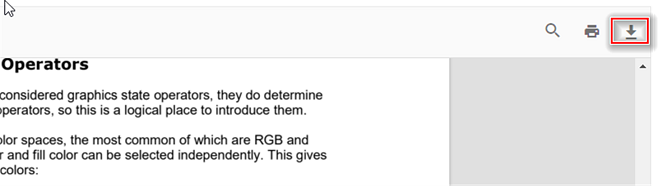

# Download in TypeScript PDF Viewer

The PDF Viewer supports downloading the loaded PDF file.

## Enable or disable download option
Use the [enableDownload](https://ej2.syncfusion.com/documentation/api/pdfviewer/pdfViewerModel/#enableDownload) property to enable or disable the download option when the PDF Viewer is loaded. It accepts a boolean value and defaults to true.

You can enable/disable the download using the following code snippet.

```html
<!DOCTYPE html>
<html lang="en">

<head>
    <title>Essential JS 2</title>
    <meta charset="utf-8" />
    <meta name="viewport" content="width=device-width, initial-scale=1.0, user-scalable=no" />
    <meta name="description" content="Essential JS 2" />
    <meta name="author" content="Syncfusion" />
    <link rel="shortcut icon" href="resources/favicon.ico" />
    <link href="https://maxcdn.bootstrapcdn.com/bootstrap/3.3.7/css/bootstrap.min.css" rel="stylesheet" />

    <!--style reference from app-->
    <link href="/styles/styles.css" rel="stylesheet" />

    <!--system js reference and configuration-->
    <script src="node_modules/systemjs/dist/system.src.js" type="text/javascript"></script>
    <script src="system.config.js" type="text/javascript"></script>
</head>

<body>
    <!--Element which will render as PdfViewer -->
    <div id="PdfViewer"></div>
</body>

</html>
```




import { PdfViewer, Toolbar,Magnification,Navigation, Annotation, LinkAnnotation,ThumbnailView,BookmarkView,
TextSelection, TextSearch, Print} from '@syncfusion/ej2-pdfviewer';

PdfViewer.Inject(Toolbar,Magnification,Navigation, Annotation, LinkAnnotation,ThumbnailView,BookmarkView,
TextSelection, TextSearch, Print);

let pdfviewer: PdfViewer = new PdfViewer({enableDownload: true});
pdfviewer.appendTo('#PdfViewer');
pdfviewer.load('https://cdn.syncfusion.com/content/pdf/pdf-succinctly.pdf', null);




import { PdfViewer, Toolbar,Magnification,Navigation, Annotation, LinkAnnotation,ThumbnailView,BookmarkView,
TextSelection, TextSearch, Print} from '@syncfusion/ej2-pdfviewer';

PdfViewer.Inject(Toolbar,Magnification,Navigation, Annotation, LinkAnnotation,ThumbnailView,BookmarkView,
TextSelection, TextSearch, Print);

let pdfviewer: PdfViewer = new PdfViewer({enableDownload: true});
pdfviewer.serviceUrl = 'https://document.syncfusion.com/web-services/pdf-viewer/api/pdfviewer/';
pdfviewer.appendTo('#PdfViewer');
pdfviewer.load('https://cdn.syncfusion.com/content/pdf/pdf-succinctly.pdf', null);




> Note: When loading documents from other origins, ensure that CORS is correctly configured on the server. In server-backed mode, the document is streamed through the serviceUrl endpoint, which must allow download requests.



You can invoke the download action using the following code snippet:





import { PdfViewer, Toolbar, Magnification, Navigation, Annotation, LinkAnnotation,ThumbnailView,BookmarkView, TextSelection} from '@syncfusion/ej2-pdfviewer';

PdfViewer.Inject(Toolbar,Magnification,Navigation, Annotation, LinkAnnotation,ThumbnailView,BookmarkView, TextSelection);

let pdfviewer: PdfViewer = new PdfViewer();
pdfviewer.appendTo('#PdfViewer');
pdfviewer.load('https://cdn.syncfusion.com/content/pdf/pdf-succinctly.pdf', null);
pdfviewer.download();




import { PdfViewer, Toolbar, Magnification, Navigation, Annotation, LinkAnnotation,ThumbnailView,BookmarkView, TextSelection} from '@syncfusion/ej2-pdfviewer';

PdfViewer.Inject(Toolbar,Magnification,Navigation, Annotation, LinkAnnotation,ThumbnailView,BookmarkView, TextSelection);

let pdfviewer: PdfViewer = new PdfViewer();
pdfviewer.serviceUrl = 'https://document.syncfusion.com/web-services/pdf-viewer/api/pdfviewer/';
pdfviewer.appendTo('#PdfViewer');
pdfviewer.load('https://cdn.syncfusion.com/content/pdf/pdf-succinctly.pdf', null);
pdfviewer.download();




## Customize download file name
Use the [downloadFileName](https://ej2.syncfusion.com/documentation/api/pdfviewer/pdfViewerModel/#downloadFileName) property to set the download file name for the PDF Viewer. It accepts a string value. For example:

```ts
viewer.downloadFileName = 'Document_Downloaded';
```

## How to get the base64 string while downloading the PDF document

The [downloadEnd](https://ej2.syncfusion.com/documentation/api/pdfviewer/#downloadend) event of the PDF Viewer is raised after the file is prepared for download and provides the document as a base64 string.

The following example illustrates how to access the downloaded document as a base64 string. Note: Handling very large base64 strings may impact memory usage; consider using a stream when possible.

```

<button id="download">Download</button>
<button id="load">Load</button>

```

```ts

document.getElementById('download').addEventListener('click', function () {
    //API to perform download action.
    viewer.download();
    viewer.downloadEnd = function (args) {
        pdfstream = args.downloadDocument;
        //Print the document as a base64 string in the console window.
        console.log(pdfstream);
    };
});

document.getElementById('load').addEventListener('click', function () {
    //Load the base64 string in the viewer.
    viewer.load(pdfstream, null);
});

```

## See also

* [Toolbar items](./toolbar)
* [Feature modules](./feature-module)
