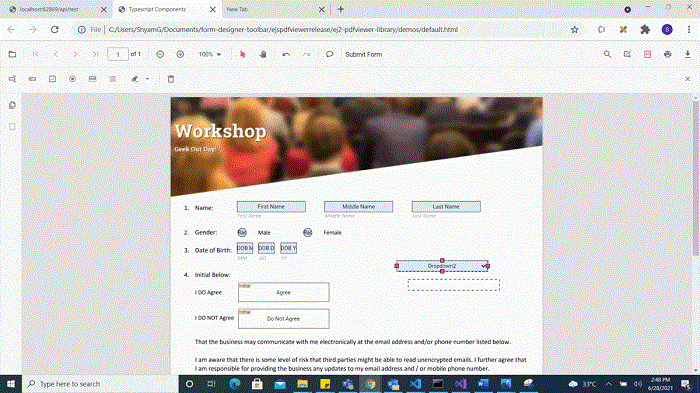
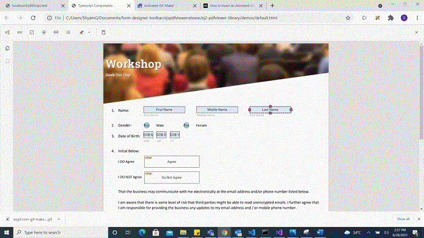

# Create with user interface interaction for TypeScript

The PDF Viewer component supports interactive form field design, including drawing, dragging, and resizing fields directly on the page. Click the Form Field icon on the toolbar to add a field and place it on the document. Supported form field types include:

- Textbox
- Password
- CheckBox
- RadioButton
- ListBox
- DropDown
- Signature field
- Initial field

## Enable or Disable form designer toolbar

Inject the FormDesigner module and set enableFormDesignerToolbar to true to display the Form Designer icon on the toolbar. The default value is true. Use the following code to enable the toolbar option.

```ts
import { PdfViewer } from '@syncfusion/ej2-pdfviewer';
PdfViewer.Inject(FormDesigner);

let pdfviewer: PdfViewer = new PdfViewer();
pdfviewer.enableFormDesignerToolbar= true;

```

## Add the form field dynamically

Click the Form Field icon on the toolbar, then click on the PDF to draw a form field. See the following GIF for reference.


## Drag the form field

Drag the selected form field to reposition it within the PDF document. See the following GIF for reference.



## Resize the form field

Resize the selected form field using the resize handles on the field boundary. See the following GIF for reference.



## Edit or Update the form field dynamically

Edit form field properties using the Form Field Properties dialog. Open it by right-clicking a form field and selecting Properties from the context menu. The following images show examples of available settings.


## Clipboard operation with form field

The PDF Viewer supports clipboard operations such as cut, copy, and paste for form fields. Right-click a form field to open the context menu and choose the desired clipboard action. The following image shows the available options.


## Undo and Redo

Undo and redo actions are supported for runtime changes made to form fields. Use the following code to perform undo and redo operations.

```ts
import { PdfViewer } from '@syncfusion/ej2-pdfviewer';
PdfViewer.Inject(FormDesigner);

let pdfviewer: PdfViewer = new PdfViewer();
pdfviewer.undo();
pdfviewer.redo();

```