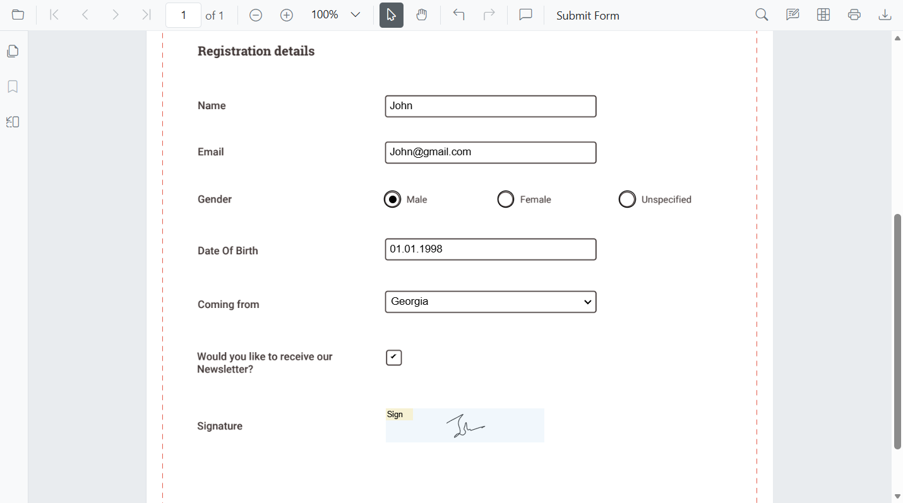

# Form Designer in TypeScript PDF Viewer

When `Form Designer mode` is enabled in the Syncfusion `TypeScript PDF Viewer`, a default `Form Designer user interface (UI)` is displayed. This UI includes a built in toolbar for adding form fields such as text boxes, password fields, check boxes, radio buttons, drop down lists, list boxes, and signature and initial fields.

Using the Form Designer UI, users can place form fields on the PDF, move and resize them, configure field and widget properties, preview the designed form, and remove fields when required. The Form Designer toolbar can also be shown or hidden and customized to control the available tools based on application requirements, enabling flexible and interactive form design directly within the viewer.

**Key Features**

**Add Form Fields**
You can add the following form fields to the PDF:

- [Text box](../form-designer/Create-edit-Style-del-formFields/create-formfields#add-textbox)
- [Password Field](../form-designer/Create-edit-Style-del-formFields/create-formfields#add-password)
- [Check box](../form-designer/Create-edit-Style-del-formFields/create-formfields#add-checkbox)
- [Radio button](../form-designer/Create-edit-Style-del-formFields/create-formfields#add-radiobutton)
- [Dropdown List](../form-designer/Create-edit-Style-del-formFields/create-formfields#add-dropdown)
- [List box](../form-designer/Create-edit-Style-del-formFields/create-formfields#add-listbox)
- [Signature field](../form-designer/Create-edit-Style-del-formFields/create-formfields#add-signature-field)
- [Initial field](../form-designer/Create-edit-Style-del-formFields/create-formfields#add-initial-field)

**Edit Form Fields**
You can move, resize, align, distribute, copy, paste, and undo or redo changes to form fields.

**Set Field Properties**
You can configure field properties such as name, value, font, color, border, alignment, visibility, tab order, and required or read only state.

**Control Field Behavior**
You can enable or disable read only mode, show or hide fields, and control whether fields appear when printing the document.

**Manage Form Fields**
You can select, group or ungroup, reorder, and delete form fields as needed.

**Save and Print Forms**
Designed form fields can be saved into the PDF document and printed with their appearances.

## Enable Form Designer

To enable form design features, inject the `FormDesigner` module into the PDF Viewer. After injecting the module, use the `enableFormDesigner` API to show or hide the Form Designer option in the main toolbar.

```ts
import { PdfViewer, Toolbar, Magnification, Navigation, Annotation, LinkAnnotation, ThumbnailView, BookmarkView, TextSelection, TextSearch, FormFields, FormDesigner, TextFieldSettings } from '@syncfusion/ej2-pdfviewer';
PdfViewer.Inject(Toolbar, Magnification, Navigation, Annotation, LinkAnnotation, ThumbnailView, BookmarkView, TextSelection, TextSearch, FormFields, FormDesigner);
let pdfviewer: PdfViewer = new PdfViewer();
pdfviewer.documentPath = "https://cdn.syncfusion.com/content/pdf/form-filling-document.pdf";
pdfviewer.resourceUrl = "https://cdn.syncfusion.com/ej2/31.1.23/dist/ej2-pdfviewer-lib";
pdfviewer.enableFormDesigner= false,
pdfviewer.appendTo('#PdfViewer');
```

## Form Designer UI

When `Form Designer mode` is enabled in the Syncfusion `TypeScript PDF Viewer`, a default `Form Designer user interface (UI)` is displayed. This UI provides a built in toolbar for adding common form fields such as text boxes, check boxes, radio buttons, drop down lists, and signature fields. Users can place fields on the PDF, select them, resize or move them, and configure their properties using the available editing options, enabling interactive form creation directly within the viewer.


**Preview of the designed PDF form**



For more information about creating and editing form fields in the PDF Viewer, refer to the [Form Creation in TypeScript PDF Viewer documentation](./Create-edit-Style-del-formFields/create-formfields).

## Form Designer Toolbar

The `Form Designer toolbar` appears at the top of the PDF Viewer and provides quick access to form field creation tools. It includes frequently used field types such as:

- [Text box](../form-designer/Create-edit-Style-del-formFields/create-formfields#add-textbox)
- [Password Field](../form-designer/Create-edit-Style-del-formFields/create-formfields#add-password)
- [Check box](../form-designer/Create-edit-Style-del-formFields/create-formfields#add-checkbox)
- [Radio button](../form-designer/Create-edit-Style-del-formFields/create-formfields#add-radiobutton)
- [Dropdown List](../form-designer/Create-edit-Style-del-formFields/create-formfields#add-dropdown)
- [List box](../form-designer/Create-edit-Style-del-formFields/create-formfields#add-listbox)
- [Signature field](../form-designer/Create-edit-Style-del-formFields/create-formfields#add-signature-field)
- [Initial field](../form-designer/Create-edit-Style-del-formFields/create-formfields#add-initial-field)

Each toolbar item allows users to place the corresponding form field by selecting the tool and clicking on the desired location in the PDF document.

**GIF – Adding a text box field using the Form Designer toolbar**


Use the following Code-snippet to enable Form Designer by injecting `FormDesigner` Module.

```ts
import { PdfViewer, Toolbar, Magnification, Navigation, Annotation, LinkAnnotation, ThumbnailView, BookmarkView, TextSelection, TextSearch, FormFields, FormDesigner } from '@syncfusion/ej2-pdfviewer';

PdfViewer.Inject(Toolbar, Magnification, Navigation, Annotation, LinkAnnotation, ThumbnailView, BookmarkView, TextSelection, TextSearch, FormFields, FormDesigner);

let pdfviewer: PdfViewer = new PdfViewer();
pdfviewer.documentPath = "https://cdn.syncfusion.com/content/pdf/form-filling-document.pdf";
pdfviewer.resourceUrl = "https://cdn.syncfusion.com/ej2/31.1.23/dist/ej2-pdfviewer-lib";
pdfviewer.appendTo('#PdfViewer');
```

For more information about creating and editing form fields in the PDF Viewer, refer to the [Form Creation in TypeScript PDF Viewer documentation](./Create-edit-Style-del-formFields/create-formfields).

## Show or Hide the Built-in Form Designer Toolbar

You can control the visibility of the Form Designer toolbar using the `isFormDesignerToolbarVisible()` method. This allows you to display or hide the Form Designer tools in the PDF Viewer based on your application requirements.

**Use this method to:**
- Show the Form Designer toolbar when form design is required
- Hide the toolbar to provide cleaner viewing experience

```html
<div id="PdfViewer" style="height:600px;width:100%;"></div>

<!-- Buttons to toggle the Form Designer toolbar -->
<button id="showDesignerBtn">Show Form Designer Toolbar</button>
<button id="hideDesignerBtn">Hide Form Designer Toolbar</button>
```
```ts
import { PdfViewer, Toolbar, Magnification, Navigation, Annotation, LinkAnnotation, ThumbnailView, BookmarkView, TextSelection, TextSearch, FormFields, FormDesigner, TextFieldSettings } from '@syncfusion/ej2-pdfviewer';
PdfViewer.Inject(Toolbar, Magnification, Navigation, Annotation, LinkAnnotation, ThumbnailView, BookmarkView, TextSelection, TextSearch, FormFields, FormDesigner);
let pdfviewer: PdfViewer = new PdfViewer();
pdfviewer.documentPath = "https://cdn.syncfusion.com/content/pdf/form-filling-document.pdf";
pdfviewer.resourceUrl = "https://cdn.syncfusion.com/ej2/31.1.23/dist/ej2-pdfviewer-lib";
pdfviewer.appendTo('#PdfViewer');

//  Wire up buttons 
document.getElementById('showDesignerBtn')!.onclick = () => {
  pdfviewer.isFormDesignerToolbarVisible=true;
};
document.getElementById('hideDesignerBtn')!.onclick = () => {
  pdfviewer.isFormDesignerToolbarVisible=false;
};
```

## Customize the Built-in Form Designer Toolbar

You can customize the Form Designer toolbar by specifying the tools to display and arranging them in the required order using the `FormDesignerToolbarItems` property.

This customization helps you limit the available tools and simplify the user interface.

**Key Points**
- Include only the toolbar items you need, in the exact order you specify.
- Any toolbar items not listed remain hidden, resulting in a cleaner and more focused UI.

```ts
import { PdfViewer, Toolbar, Magnification, Navigation, Annotation, LinkAnnotation, ThumbnailView, BookmarkView, TextSelection, TextSearch, FormFields, FormDesigner, TextFieldSettings } from '@syncfusion/ej2-pdfviewer';
PdfViewer.Inject(Toolbar, Magnification, Navigation, Annotation, LinkAnnotation, ThumbnailView, BookmarkView, TextSelection, TextSearch, FormFields, FormDesigner);
let pdfviewer: PdfViewer = new PdfViewer();
pdfviewer.documentPath = "https://cdn.syncfusion.com/content/pdf/form-filling-document.pdf";
pdfviewer.resourceUrl = "https://cdn.syncfusion.com/ej2/31.1.23/dist/ej2-pdfviewer-lib";
//Customize the Built-in Form Designer Toolbar
pdfviewer.toolbarSettings = {
    formDesignerToolbarItems: [
        "TextboxTool",
        "PasswordTool",
        "CheckBoxTool",
        "RadioButtonTool",
        "DropdownTool",
        "ListboxTool",
        "DrawSignatureTool",
        "DeleteTool"
    ]
};
pdfviewer.appendTo('#PdfViewer');
```

## Move, Resize, and Edit Form Fields

You can move, resize, and edit an existing form field directly in the PDF Viewer using the Form Designer.

- Move a field by selecting it and dragging it to the required position.

- Resize a field using the handles displayed on the field boundary.


- Edit a field by selecting it to open the Form Field Properties popover. The popover allows you to modify the form field and widget annotation properties. Changes are reflected immediately in the viewer and are saved when the properties popover is closed.
For more information, see Editing Form Fields

## Deleting Form Fields

You can remove a form field from the PDF document by selecting the field and using one of the following methods:
- Click the `Delete option` in the Form Designer UI.
- Press the `Delete key` on the keyboard after selecting the form field.

The selected form field and its associated widget annotation are permanently removed from the page.
For more information, see  [Deleting Form Fields](./Create-edit-Style-del-formFields/remove-formfields)

## See Also

- [Filling PDF Forms](./form-filling)
- [Create](./Create-edit-Style-del-formFields/create-formfields), [edit](./Create-edit-Style-del-formFields/edit-formfields), [style](./Create-edit-Style-del-formFields/style-formfields) and [remove](./Create-edit-Style-del-formFields/remove-formfields.) form fields
- [Grouping form fields](./group-formfields)
- [Form Constrains](./form-constrain)
- [Form Validation](./form-validation)
- [Custom Data](./custom-data)
- [Import](./import-export-formfields/import-formfields)/[Export Form Data](./import-export-formfields/export-formfields)
- [Form field events](./form-field-events)
