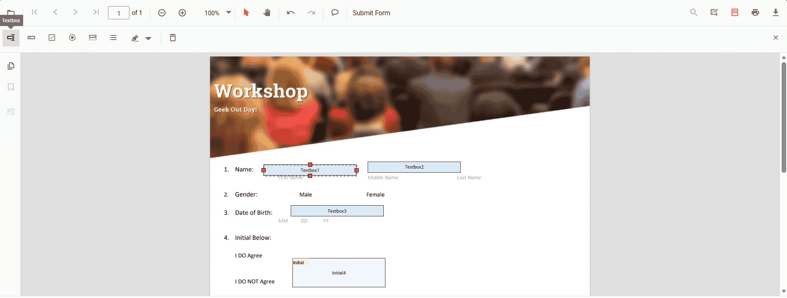

# Form Designer and Toolbar Customization in TypeScript

## Form Designer

Create and customize interactive fields directly on the PDF page.
- Add fields: textbox, checkbox, radio button, dropdown, list box, signature, and initials
- Edit quickly: move, resize, align, distribute, copy/paste, undo/redo
- Configure properties: name, value, font, color, border, alignment, required/read-only/visibility, tab order
- Control interaction: toggle read-only, show/hide, and manage printing behavior
- Manage fields: select, group/ungroup, reorder, or delete
- Save and print: persist designed fields in the PDF and print with appearances
- Tailor the UI: show/hide or customize the Form Designer toolbar; handle events for add/edit/select/move/resize
- The form designer toolbar can be customized by showing or hiding default items and by controlling the order in which the items appear.

Use the following Code-snippet to enable Form Designer by injecting `FormDesigner` Module.

```ts
import { PdfViewer, Toolbar, Magnification, Navigation, Annotation, LinkAnnotation, ThumbnailView, BookmarkView, TextSelection, TextSearch, FormFields, FormDesigner, TextFieldSettings } from '@syncfusion/ej2-pdfviewer';
PdfViewer.Inject(Toolbar, Magnification, Navigation, Annotation, LinkAnnotation, ThumbnailView, BookmarkView, TextSelection, TextSearch, FormFields, FormDesigner);
let pdfviewer: PdfViewer = new PdfViewer();
pdfviewer.documentPath = "https://cdn.syncfusion.com/content/pdf/form-filling-document.pdf";
pdfviewer.resourceUrl = "https://cdn.syncfusion.com/ej2/31.1.23/dist/ej2-pdfviewer-lib";
pdfviewer.appendTo('#PdfViewer');
```



## Show or hide the form designer toolbar

Show or hide the form designer toolbar programmatically during initialization or at runtime.

Use the [EnableFormDesigner](https://ej2.syncfusion.com/javascript/documentation/api/pdfviewer/pdfViewerModel#enableformdesigner) property or the [showFormDesignerToolbar](https://ej2.syncfusion.com/javascript/documentation/api/pdfviewer/toolbar#showformdesignertoolbar) method to toggle visibility.

The following code snippet explains how to show or hide the toolbar using the `EnableFormDesigner` property.




ej.pdfviewer.PdfViewer.Inject(ej.pdfviewer.Toolbar, ej.pdfviewer.Magnification, ej.pdfviewer.Navigation,
  ej.pdfviewer.Annotation, ej.pdfviewer.LinkAnnotation, ej.pdfviewer.ThumbnailView, ej.pdfviewer.BookmarkView,
  ej.pdfviewer.TextSelection, ej.pdfviewer.TextSearch, ej.pdfviewer.FormFields, ej.pdfviewer.FormDesigner
);

var pdfviewer = new ej.pdfviewer.PdfViewer({
    enableFormDesigner: false,
    documentPath: 'https://cdn.syncfusion.com/content/pdf/formdesigner.pdf',
    resourceUrl: 'https://cdn.syncfusion.com/ej2/31.2.2/dist/ej2-pdfviewer-lib'
});

pdfviewer.appendTo('#PdfViewer');




<!DOCTYPE html>
<html xmlns="http://www.w3.org/1999/xhtml">
    <head>
        <title>Essential JS 2</title>
        <!-- Essential JS 2 tailwind3 theme -->
        <link href="https://cdn.syncfusion.com/ej2/31.2.2/tailwind3.css" rel="stylesheet" type="text/css"/>
        <!-- Essential JS 2 PDF Viewer's global script -->
        <script src="https://cdn.syncfusion.com/ej2/31.2.2/dist/ej2.min.js" type="text/javascript"></script>
    </head>
    <body>
        <div id='container'>
            <div id='PdfViewer' style="height:500px;width:100%;">
            </div>
        </div>
    </body>
</html>




## How to customize the form designer toolbar

Choose which tools appear and control their order in the form designer toolbar.

Use [`PdfViewerToolbarSettings`](https://ej2.syncfusion.com/javascript/documentation/api/pdfviewer/toolbarSettings) with the [`FormDesignerToolbarItems`](https://ej2.syncfusion.com/javascript/documentation/api/pdfviewer/toolbarSettings#formdesignertoolbaritems) property to choose which form design tools are available. The property accepts a list of [`FormDesignerToolbarItem`](https://ej2.syncfusion.com/javascript/documentation/api/pdfviewer/formDesignerToolbarItem) values. The items you include are both displayed and rendered in the order listed; any items you omit are hidden. This provides a streamlined, user-friendly form design experience across devices.

The following example demonstrates how to customize the form designer toolbar by configuring specific tools using `FormDesignerToolbarItem`.




ej.pdfviewer.PdfViewer.Inject(ej.pdfviewer.Toolbar, ej.pdfviewer.Magnification, ej.pdfviewer.Navigation,
    ej.pdfviewer.Annotation, ej.pdfviewer.LinkAnnotation, ej.pdfviewer.ThumbnailView,
    ej.pdfviewer.BookmarkView, ej.pdfviewer.TextSelection, ej.pdfviewer.TextSearch,
    ej.pdfviewer.FormFields, ej.pdfviewer.FormDesigner);

var pdfviewer = new ej.pdfviewer.PdfViewer({
    documentPath: 'https://cdn.syncfusion.com/content/pdf/formdesigner.pdf',
    resourceUrl: 'https://cdn.syncfusion.com/ej2/31.2.2/dist/ej2-pdfviewer-lib'
});

pdfviewer.toolbarSettings = {
    formDesignerToolbarItems: [
        "TextboxTool",
        "PasswordTool",
        "CheckBoxTool",
        "RadioButtonTool",
        "DropdownTool",
        "ListboxTool",
        "DrawSignatureTool",
        "DeleteTool"
    ]
};

pdfviewer.appendTo('#PdfViewer');




<!DOCTYPE html>
<html xmlns="http://www.w3.org/1999/xhtml">
    <head>
        <title>Essential JS 2</title>
        <!-- Essential JS 2 tailwind3 theme -->
        <link href="https://cdn.syncfusion.com/ej2/31.2.2/tailwind3.css" rel="stylesheet" type="text/css"/>
        <!-- Essential JS 2 PDF Viewer's global script -->
        <script src="https://cdn.syncfusion.com/ej2/31.2.2/dist/ej2.min.js" type="text/javascript"></script>
    </head>
    <body>
        <div id='container'>
            <div id='PdfViewer' style="height:500px;width:100%;">
            </div>
        </div>
    </body>
</html>



