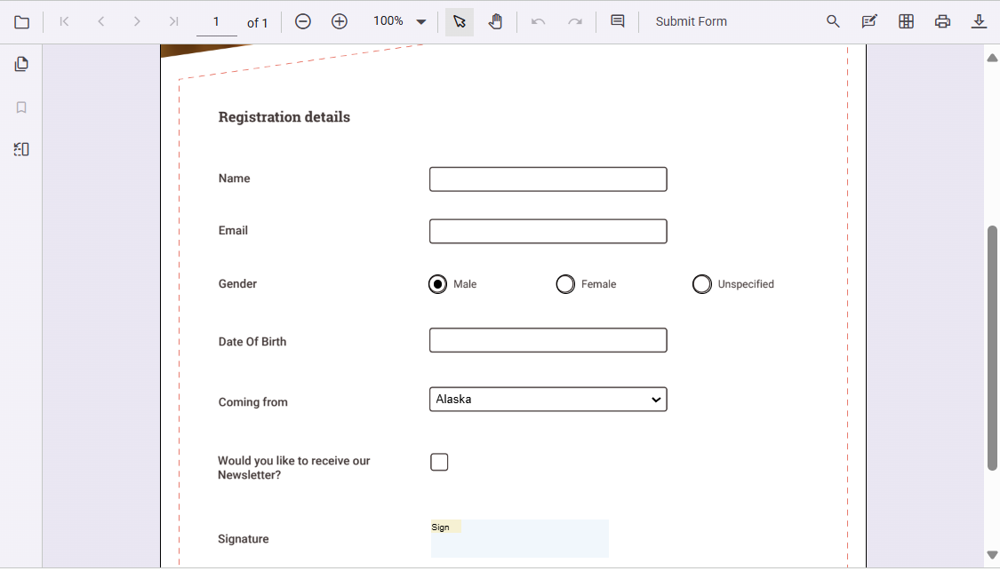
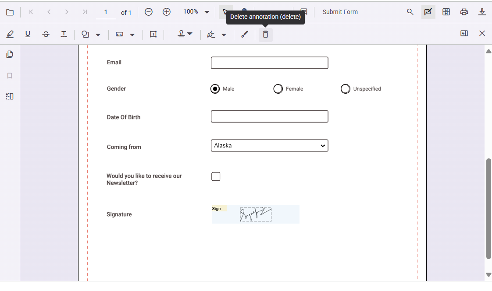

# Form filling in TypeScript PDF Viewer

The PDF Viewer displays existing form fields in a PDF and enables users to fill, validate, and download the filled data.

The PDF Viewer supports the following form field types:

* Text box
* Password
* Check box
* Radio button
* List box
* Dropdown
* Signature field
* Initial field



## Disabling form fields

The PDF Viewer provides an option to disable interaction with form fields using `enableFormDesigner` API. Use the following configuration to disable form fields in the viewer.


```ts
import { PdfViewer, Toolbar, Magnification, Navigation, Annotation, LinkAnnotation, ThumbnailView, BookmarkView, TextSelection, TextSearch, FormFields, FormDesigner} from '@syncfusion/ej2-pdfviewer';

PdfViewer.Inject(Toolbar, Magnification, Navigation, Annotation, LinkAnnotation, ThumbnailView, BookmarkView, TextSelection, TextSearch, FormFields, FormDesigner);

let pdfviewer: PdfViewer = new PdfViewer();
pdfviewer.documentPath = "https://cdn.syncfusion.com/content/pdf/form-filling-document.pdf";
pdfviewer.resourceUrl = "https://cdn.syncfusion.com/ej2/31.1.23/dist/ej2-pdfviewer-lib";
pdfviewer.enableFormDesigner = false;  //To disable Form Desinger
pdfviewer.appendTo('#PdfViewer');
```

## Access interactive form fields

You can access the collection of all interactive form fields in the loaded document using the `formFieldCollection` property. Fetch the collection after the document is loaded.

Use the following code-snippet to access interactive form fields collection:
```html
<button id="formFieldCollection">Fetch Form-Fields Collection</button>
```
```ts
import { PdfViewer, Toolbar, Magnification, Navigation, Annotation, LinkAnnotation, ThumbnailView, BookmarkView, TextSelection, TextSearch, FormFields, FormDesigner} from '@syncfusion/ej2-pdfviewer';

PdfViewer.Inject(Toolbar, Magnification, Navigation, Annotation, LinkAnnotation, ThumbnailView, BookmarkView, TextSelection, TextSearch, FormFields, FormDesigner);

let pdfviewer: PdfViewer = new PdfViewer();
pdfviewer.documentPath = "https://cdn.syncfusion.com/content/pdf/form-filling-document.pdf";
pdfviewer.resourceUrl = "https://cdn.syncfusion.com/ej2/31.1.23/dist/ej2-pdfviewer-lib";

pdfviewer.appendTo('#PdfViewer');

// Access the form fields collection via button click
document.getElementById('formFieldCollection')?.addEventListener('click',function() {
    const fields = pdfviewer.formFieldCollection; // Gets all form fields
    console.log(fields)//Log the formField Collection
});

```

## Add a handwritten signature to a signature field

Add a handwritten signature to a signature field by following these steps:

* Click the signature field in the PDF document to open the signature panel.


* Draw the signature in the signature panel.


* Select **CREATE**. The drawn signature is added to the signature field.


## Delete a signature from a signature field

Delete a signature placed in a signature field by using the Delete option in the annotation toolbar.



## Export and import form fields

The PDF Viewer supports exporting and importing form field data using the `importFormFields`, `exportFormFields`, and `exportFormFieldsAsObject` methods. The following formats are supported:

* FDF
* XFDF
* JSON

For more information, see the [Form fields documentation](./import-export-formfields/export-formfields).

## See also

- [Form Designer overview](./overview)
- [Form Designer Toolbar](../toolbar-customization/form-designer-toolbar)
- [Create form fields](./Create-edit-Style-del-formFields/create-formfields)
- [Edit form fields](./Create-edit-Style-del-formFields/edit-formfields)
- [Group form fields](./group-formfields)
- [Add custom data to form fields](./custom-data)
- [Form Constrain](./form-constrain)
- [Form validation](./form-validation)
- [Form fields API](./formfields-api)
