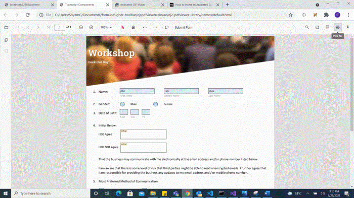
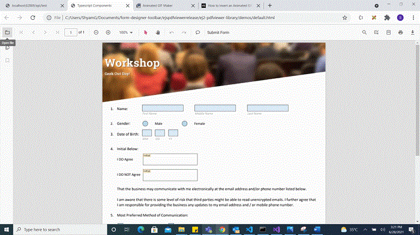

# Programmatically work with form fields in TypeScript PDF Viewer component

The PDF Viewer component provides options to add, edit, and delete form fields. The supported form field types are:

- Textbox
- Password
- CheckBox
- RadioButton
- ListBox
- DropDown
- Signature field
- Initial field

## Add a form field to a PDF document programmatically

Use the addFormField method to add form fields programmatically. Provide the field type and its property object as parameters. Use the following example to add a form field when the document loads.












## Edit or update a form field programmatically

Use the updateFormField method to modify a form field programmatically. Retrieve the target from the formFieldCollections property (by object or ID) and pass it as the first parameter. Provide the properties to update as the second parameter. The following example updates the value and background color of a Textbox field.












## Delete a form field programmatically

Use the deleteFormField method to remove a form field programmatically. Retrieve the target from the formFieldCollections property (by object or ID) and pass it to deleteFormField. The following example deletes the first form field.












## Save form fields

Selecting the Download icon on the toolbar saves the form fields in the exported PDF. This action does not modify the original source file. Refer to the following GIF for reference.


You can invoke the download action using the following code snippet.

```ts
import { PdfViewer, Toolbar, Magnification, Navigation, Annotation, LinkAnnotation,ThumbnailView,BookmarkView, TextSelection} from '@syncfusion/ej2-pdfviewer';

PdfViewer.Inject(Toolbar,Magnification,Navigation, Annotation, LinkAnnotation,ThumbnailView,BookmarkView, TextSelection);

let pdfviewer: PdfViewer = new PdfViewer();
pdfviewer.serviceUrl = 'https://document.syncfusion.com/web-services/pdf-viewer/api/pdfviewer/';
pdfviewer.appendTo('#PdfViewer');
pdfviewer.load('PDF_Succinctly.pdf', null);
pdfviewer.download();

```

## Print form fields

Selecting the Print icon on the toolbar prints the PDF along with the added form fields. This action does not modify the original document. Refer to the following GIF for reference.



You can invoke the print action using the following code snippet.

```ts
import { PdfViewer, Toolbar, Magnification, Navigation, Annotation, LinkAnnotation,ThumbnailView,BookmarkView, TextSelection} from '@syncfusion/ej2-pdfviewer';

PdfViewer.Inject(Toolbar,Magnification,Navigation, Annotation, LinkAnnotation,ThumbnailView,BookmarkView, TextSelection);

let pdfviewer: PdfViewer = new PdfViewer();
pdfviewer.serviceUrl = 'https://document.syncfusion.com/web-services/pdf-viewer/api/pdfviewer/';
pdfviewer.appendTo('#PdfViewer');
pdfviewer.load('PDF_Succinctly.pdf', null);
pdfviewer.print.print();

```

## Open an existing PDF document

Open a previously saved PDF that contains form fields by selecting the Open icon on the toolbar. Refer to the following GIF for reference.


