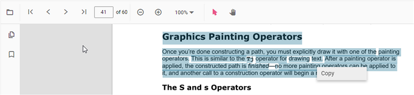
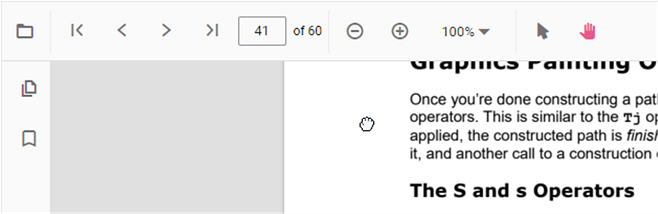

# Interaction modes in TypeScript PDF Viewer

The PDF Viewer provides interaction mode for easy interaction with the loaded PDF document.  Selection mode and panning mode are the two interactions modes. You can refer to [interactionMode API Documentation](https://ej2.syncfusion.com/documentation/api/pdfviewer/#interactionmode) for more information.

## Selection mode

In this mode, users can select text in the PDF document loaded in the PDF Viewer. Panning and touch-based scrolling are disabled in this mode. Enable or disable text selection using the following configuration:

```html
<!DOCTYPE html>
<html lang="en">

<head>
    <title>Essential JS 2</title>
    <meta charset="utf-8" />
    <meta name="viewport" content="width=device-width, initial-scale=1.0, user-scalable=no" />
    <meta name="description" content="Essential JS 2" />
    <meta name="author" content="Syncfusion" />
    <link rel="shortcut icon" href="resources/favicon.ico" />
    <link href="https://maxcdn.bootstrapcdn.com/bootstrap/3.3.7/css/bootstrap.min.css" rel="stylesheet" />

    <!--style reference from app-->
    <link href="/styles/styles.css" rel="stylesheet" />

    <!--system js reference and configuration-->
    <script src="node_modules/systemjs/dist/system.src.js" type="text/javascript"></script>
    <script src="system.config.js" type="text/javascript"></script>
</head>

<body>
    <!--Element which will render as PdfViewer -->
    <div id="PdfViewer"></div>
</body>

</html>
```




import { PdfViewer, Toolbar, Magnification, Navigation, Annotation, LinkAnnotation,ThumbnailView,BookmarkView, TextSelection} from '@syncfusion/ej2-pdfviewer';

PdfViewer.Inject(Toolbar,Magnification,Navigation, Annotation, LinkAnnotation,ThumbnailView,BookmarkView, TextSelection);

let pdfviewer: PdfViewer = new PdfViewer({enableTextSelection: true, documentPath:'https://cdn.syncfusion.com/content/pdf/pdf-succinctly.pdf'});
pdfviewer.appendTo('#PdfViewer');




import { PdfViewer, Toolbar, Magnification, Navigation, Annotation, LinkAnnotation,ThumbnailView,BookmarkView, TextSelection} from '@syncfusion/ej2-pdfviewer';

PdfViewer.Inject(Toolbar,Magnification,Navigation, Annotation, LinkAnnotation,ThumbnailView,BookmarkView, TextSelection);

let pdfviewer: PdfViewer = new PdfViewer({enableTextSelection: true, documentPath:'https://cdn.syncfusion.com/content/pdf/pdf-succinctly.pdf'});
pdfviewer.serviceUrl = 'https://document.syncfusion.com/web-services/pdf-viewer/api/pdfviewer/';
pdfviewer.appendTo('#PdfViewer');






## Panning mode

In this mode, users can pan and scroll pages (including touch). Text selection is disabled.



Switch the interaction mode of the PDF Viewer using the following configuration (set the `interactionMode` property, for example, to `InteractionMode.Pan`):




import { PdfViewer, Toolbar, Magnification, Annotation, Navigation, LinkAnnotation,ThumbnailView,BookmarkView, TextSelection} from '@syncfusion/ej2-pdfviewer';

PdfViewer.Inject(Toolbar,Magnification,Navigation, Annotation, LinkAnnotation,ThumbnailView,BookmarkView, TextSelection);

let pdfviewer: PdfViewer = new PdfViewer({documentPath:'https://cdn.syncfusion.com/content/pdf/pdf-succinctly.pdf', interactionMode: InteractionMode.Pan});
pdfviewer.appendTo('#PdfViewer');




import { PdfViewer, Toolbar, Magnification, Annotation, Navigation, LinkAnnotation,ThumbnailView,BookmarkView, TextSelection} from '@syncfusion/ej2-pdfviewer';

PdfViewer.Inject(Toolbar,Magnification,Navigation, Annotation, LinkAnnotation,ThumbnailView,BookmarkView, TextSelection);

let pdfviewer: PdfViewer = new PdfViewer({documentPath:'https://cdn.syncfusion.com/content/pdf/pdf-succinctly.pdf', interactionMode: InteractionMode.Pan});
pdfviewer.serviceUrl = 'https://document.syncfusion.com/web-services/pdf-viewer/api/pdfviewer/';
pdfviewer.appendTo('#PdfViewer');




## See also

* [Toolbar items](./toolbar)
* [Feature modules](./feature-module)
