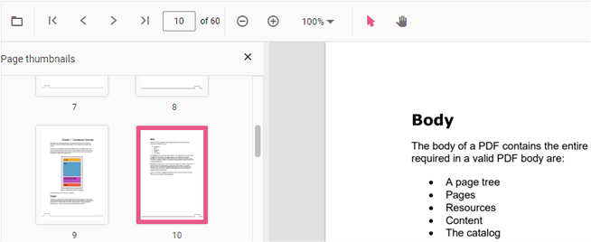

# Page Thumbnail navigation in TypeScript PDF Viewer control

Thumbnails is the miniature representation of actual pages in PDF files. This feature displays thumbnails of the pages and allows navigation.
You can enable/disable thumbnail navigation by using the following code snippet.,




import { PdfViewer, Toolbar, Magnification, Navigation, Annotation, LinkAnnotation,ThumbnailView,BookmarkView, TextSelection} from '@syncfusion/ej2-pdfviewer';

PdfViewer.Inject(Toolbar,Magnification,Navigation, Annotation, LinkAnnotation,ThumbnailView,BookmarkView, TextSelection);

let pdfviewer: PdfViewer = new PdfViewer({enableThumbnail: true, documentPath:'https://cdn.syncfusion.com/content/pdf/pdf-succinctly.pdf'});
pdfviewer.appendTo('#PdfViewer');




import { PdfViewer, Toolbar, Magnification, Navigation, Annotation, LinkAnnotation,ThumbnailView,BookmarkView, TextSelection} from '@syncfusion/ej2-pdfviewer';

PdfViewer.Inject(Toolbar,Magnification,Navigation, Annotation, LinkAnnotation,ThumbnailView,BookmarkView, TextSelection);

let pdfviewer: PdfViewer = new PdfViewer({enableThumbnail: true, documentPath:'https://cdn.syncfusion.com/content/pdf/pdf-succinctly.pdf'});
pdfviewer.serviceUrl = 'https://document.syncfusion.com/web-services/pdf-viewer/api/pdfviewer/';
pdfviewer.appendTo('#PdfViewer');




## See also

* [Toolbar items](https://help.syncfusion.com/document-processing/pdf/pdf-viewer/javascript-es6/toolbar/)
* [Feature Modules](https://help.syncfusion.com/document-processing/pdf/pdf-viewer/javascript-es6/feature-module/)