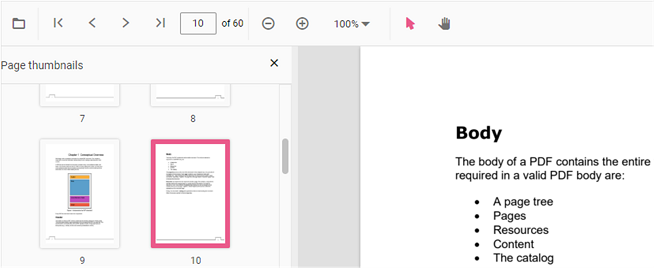

# Page Thumbnail navigation in TypeScript PDF Viewer control

Thumbnails is the miniature representation of actual pages in PDF files. This feature displays thumbnails of the pages and allows navigation.
You can enable/disable thumbnail navigation by using the following code snippet.,




import { PdfViewer, Toolbar, Magnification, Navigation, Annotation, LinkAnnotation,ThumbnailView,BookmarkView, TextSelection} from '@syncfusion/ej2-pdfviewer';

PdfViewer.Inject(Toolbar,Magnification,Navigation, Annotation, LinkAnnotation,ThumbnailView,BookmarkView, TextSelection);

let pdfviewer: PdfViewer = new PdfViewer({enableThumbnail: true, documentPath:'https://cdn.syncfusion.com/content/pdf/pdf-succinctly.pdf'});
pdfviewer.appendTo('#PdfViewer');





import { PdfViewer, Toolbar, Magnification, Navigation, Annotation, LinkAnnotation,ThumbnailView,BookmarkView, TextSelection} from '@syncfusion/ej2-pdfviewer';

PdfViewer.Inject(Toolbar,Magnification,Navigation, Annotation, LinkAnnotation,ThumbnailView,BookmarkView, TextSelection);

let pdfviewer: PdfViewer = new PdfViewer({enableThumbnail: true, documentPath:'https://cdn.syncfusion.com/content/pdf/pdf-succinctly.pdf'});
pdfviewer.serviceUrl = 'https://document.syncfusion.com/web-services/pdf-viewer/api/pdfviewer/';
pdfviewer.appendTo('#PdfViewer');







## Enable or disable thumbnail view on load

The `enableThumbnail` property gets or sets a boolean value to enable or disable the thumbnail view in PDF Viewer while loading a document. Defaults to true. You can refer to [enableThumbnail API documentation](https://ej2.syncfusion.com/documentation/api/pdfviewer/#enablenavigationtoolbar) for more information.

```ts
  viewer.enableThumbnail = false;
```
## Show or hide thumbnail view panel on load

The `isThumbnailViewOpen` property gets or sets a boolean value to show or hide the thumbnail view while loading a document. Defaults to false. You can refer to [isThumbnailViewOpen API documentation](https://ej2.syncfusion.com/documentation/api/pdfviewer/#isthumbnailviewopen) for more information.

```ts
  viewer.isThumbnailViewOpen = true;
```
## See also

* [Toolbar items](https://help.syncfusion.com/document-processing/pdf/pdf-viewer/javascript-es6/toolbar)
* [Feature Modules](https://help.syncfusion.com/document-processing/pdf/pdf-viewer/javascript-es6/feature-module)