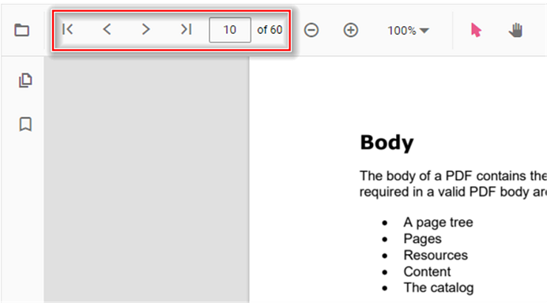

# Navigation in TypeScript PDF Viewer control

The TypeScript PDF Viewer supports different internal and external navigations.

## Toolbar page navigation option

The default toolbar of PDF Viewer contains the following navigation options

* [**Go to page**](https://ej2.syncfusion.com/documentation/api/pdfviewer/navigation/#gotopage):- Navigates to the specific page of a PDF document.
* [**Show next page**](https://ej2.syncfusion.com/documentation/api/pdfviewer/navigation/#gotonextpage):- Navigates to the next page of PDF a document.
* [**Show previous page**](https://ej2.syncfusion.com/documentation/api/pdfviewer/navigation/#gotopreviouspage):- Navigates to the previous page of a PDF document.
* [**Show first page**](https://ej2.syncfusion.com/documentation/api/pdfviewer/navigation/#gotofirstpage):-  Navigates to the first page of a PDF document.
* [**Show last page**](https://ej2.syncfusion.com/documentation/api/pdfviewer/navigation/#gotolastpage):- Navigates to the last page of a PDF document.

```html
<!DOCTYPE html>
<html lang="en">

<head>
    <title>Essential JS 2</title>
    <meta charset="utf-8" />
    <meta name="viewport" content="width=device-width, initial-scale=1.0, user-scalable=no" />
    <meta name="description" content="Essential JS 2" />
    <meta name="author" content="Syncfusion" />
    <link rel="shortcut icon" href="resources/favicon.ico" />
    <link href="https://maxcdn.bootstrapcdn.com/bootstrap/3.3.7/css/bootstrap.min.css" rel="stylesheet" />

    <!--style reference from app-->
    <link href="/styles/styles.css" rel="stylesheet" />

    <!--system js reference and configuration-->
    <script src="node_modules/systemjs/dist/system.src.js" type="text/javascript"></script>
    <script src="system.config.js" type="text/javascript"></script>
</head>

<body>
    <!--Element which will render as PdfViewer -->
    <div id="PdfViewer"></div>
</body>

</html>
```

You can enable/disable page navigation option in PDF Viewer using the following code snippet.,





import { PdfViewer, Toolbar, Magnification, Navigation, LinkAnnotation,ThumbnailView,BookmarkView, TextSelection} from '@syncfusion/ej2-pdfviewer';

PdfViewer.Inject(Toolbar,Magnification,Navigation, LinkAnnotation,ThumbnailView,BookmarkView, TextSelection);

let pdfviewer: PdfViewer = new PdfViewer({enableNavigation: true, documentPath:'https://cdn.syncfusion.com/content/pdf/pdf-succinctly.pdf'});
pdfviewer.appendTo('#PdfViewer');





import { PdfViewer, Toolbar, Magnification, Navigation, LinkAnnotation,ThumbnailView,BookmarkView, TextSelection} from '@syncfusion/ej2-pdfviewer';

PdfViewer.Inject(Toolbar,Magnification,Navigation, LinkAnnotation,ThumbnailView,BookmarkView, TextSelection);

let pdfviewer: PdfViewer = new PdfViewer({enableNavigation: true, documentPath:'https://cdn.syncfusion.com/content/pdf/pdf-succinctly.pdf'});
pdfviewer.serviceUrl = 'https://document.syncfusion.com/web-services/pdf-viewer/api/pdfviewer/';
pdfviewer.appendTo('#PdfViewer');






Also, you can programmatically perform page navigation options as follows.

```html
<!DOCTYPE html>
<html lang="en">

<head>
    <title>Essential JS 2</title>
    <meta charset="utf-8" />
    <meta name="viewport" content="width=device-width, initial-scale=1.0, user-scalable=no" />
    <meta name="description" content="Essential JS 2" />
    <meta name="author" content="Syncfusion" />
    <link rel="shortcut icon" href="resources/favicon.ico" />
    <link href="https://maxcdn.bootstrapcdn.com/bootstrap/3.3.7/css/bootstrap.min.css" rel="stylesheet" />

    <!--style reference from app-->
    <link href="/styles/styles.css" rel="stylesheet" />

    <!--system js reference and configuration-->
    <script src="node_modules/systemjs/dist/system.src.js" type="text/javascript"></script>
    <script src="system.config.js" type="text/javascript"></script>
</head>

<body>
    <!--Element which will render as PdfViewer -->
    <button id="goToFirstPage">Go To First Page</button>
    <button id="goToLastPage">Go To last Page</button>
    <button id="goToNextPage">Go To Next Page</button>
    <button id="goToPage">Go To Page</button>
    <button id="goToPreviousPage">Go To Previous Page</button>
    <div id="PdfViewer"></div>
</body>

</html>
```




import {PdfViewer, Toolbar, Magnification, Navigation, LinkAnnotation, BookmarkView, ThumbnailView, Print TextSelection, TextSearch, Annotation, FormFields } from '@syncfusion/ej2-pdfviewer';

PdfViewer.Inject(Toolbar,Magnification,Navigation, LinkAnnotation,ThumbnailView,BookmarkView, TextSelection, TextSearch, Annotation, FormFields );

let viewer: PdfViewer = new PdfViewer();
viewer.appendTo('#pdfViewer');
viewer.load('https://cdn.syncfusion.com/content/pdf/pdf-succinctly.pdf', null);

// Go To First Page
document.getElementById('goToFirstPage').addEventListener('click', () => {
  viewer.navigation.goToFirstPage();
});
// Go To Last Page
document.getElementById('goToLastPage').addEventListener('click', () => {
  viewer.navigation.goToLastPage();
});
// Go To Next Page
document.getElementById('goToNextPage').addEventListener('click', () => {
  viewer.navigation.goToNextPage();
});
// Go To Page
document.getElementById('goToPage').addEventListener('click', () => {
  viewer.navigation.goToPage(4);
});
// Go To Previous Page
document.getElementById('goToPreviousPage').addEventListener('click', () => {
  viewer.navigation.goToPreviousPage();
});




import {PdfViewer, Toolbar, Magnification, Navigation, LinkAnnotation, BookmarkView, ThumbnailView, Print TextSelection, TextSearch, Annotation, FormFields } from '@syncfusion/ej2-pdfviewer';

PdfViewer.Inject(Toolbar,Magnification,Navigation, LinkAnnotation,ThumbnailView,BookmarkView, TextSelection, TextSearch, Annotation, FormFields );

let viewer: PdfViewer = new PdfViewer();
viewer.serviceUrl =
  'https://document.syncfusion.com/web-services/pdf-viewer/api/pdfviewer/';
viewer.appendTo('#pdfViewer');
viewer.load('https://cdn.syncfusion.com/content/pdf/pdf-succinctly.pdf', null);

// Go To First Page
document.getElementById('goToFirstPage').addEventListener('click', () => {
  viewer.navigation.goToFirstPage();
});
// Go To Last Page
document.getElementById('goToLastPage').addEventListener('click', () => {
  viewer.navigation.goToLastPage();
});
// Go To Next Page
document.getElementById('goToNextPage').addEventListener('click', () => {
  viewer.navigation.goToNextPage();
});
// Go To Page
document.getElementById('goToPage').addEventListener('click', () => {
  viewer.navigation.goToPage(4);
});
// Go To Previous Page
document.getElementById('goToPreviousPage').addEventListener('click', () => {
  viewer.navigation.goToPreviousPage();
});




Find the [here](https://stackblitz.com/edit/5dqbkd?file=index.ts) to perform the page navigation options programmatically.

## Enable or disable navigation module and toolbar on load

The `enableNavigation` property gets or sets a boolean value to enable or disable the page navigation of PDF Viewer while loading a document. Defaults to true. You can refer to [enableNavigation API documentation](https://ej2.syncfusion.com/documentation/api/pdfviewer/#enablenavigationtoolbar) for more information.

```ts
  // Enable or disable page navigation
  viewer.enableNavigation = true;
```

The `enableNavigationToolbar` property gets or sets a boolean value to enable or disable the navigation toolbar of PDF Viewer while loading a document. Defaults to true. You can refer to [enableNavigationToolbar API documentation](https://ej2.syncfusion.com/documentation/api/pdfviewer/#enablenavigation) for more information.

```ts
  // Enable or disable navigation toolbar
  viewer.enableNavigationToolbar = true;
```

## See also

* [Toolbar items](https://help.syncfusion.com/document-processing/pdf/pdf-viewer/javascript-es6/toolbar)
* [Feature Modules](https://help.syncfusion.com/document-processing/pdf/pdf-viewer/javascript-es6/feature-module)