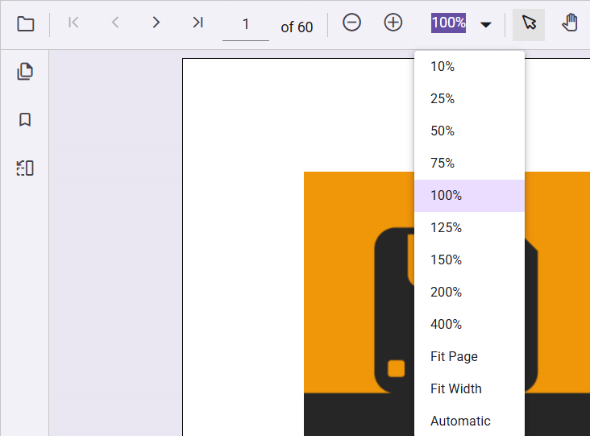

# Magnification in TypeScript PDF Viewer

The magnification tools of the PDF Viewer contains ZoomIn, ZoomOut, Zoom, FitPage, and FitWidth tools in the default toolbar. The PDF Viewer also has an option to show or hide the magnification tools in the default toolbar. You can refer to [enableMagnification API Documentation](https://ej2.syncfusion.com/documentation/api/pdfviewer#enablemagnification) for more information.

Use the following configuration to enable magnification in the PDF Viewer:

```html
<!DOCTYPE html>
<html lang="en">

<head>
    <title>Essential JS 2</title>
    <meta charset="utf-8" />
    <meta name="viewport" content="width=device-width, initial-scale=1.0, user-scalable=no" />
    <meta name="description" content="Essential JS 2" />
    <meta name="author" content="Syncfusion" />
    <link rel="shortcut icon" href="resources/favicon.ico" />
    <link href="https://maxcdn.bootstrapcdn.com/bootstrap/3.3.7/css/bootstrap.min.css" rel="stylesheet" />

    <!--style reference from app-->
    <link href="/styles/styles.css" rel="stylesheet" />

    <!--system js reference and configuration-->
    <script src="node_modules/systemjs/dist/system.src.js" type="text/javascript"></script>
    <script src="system.config.js" type="text/javascript"></script>
</head>

<body>
    <!--Element which will render as PdfViewer -->
    <div id="PdfViewer"></div>
</body>

</html>
```




import { PdfViewer, Toolbar, Magnification, Navigation, Annotation, LinkAnnotation,ThumbnailView,BookmarkView, TextSelection} from '@syncfusion/ej2-pdfviewer';

PdfViewer.Inject(Toolbar,Magnification,Navigation, Annotation, LinkAnnotation,ThumbnailView,BookmarkView, TextSelection);

let pdfviewer: PdfViewer = new PdfViewer({enableMagnification: true, documentPath:'https://cdn.syncfusion.com/content/pdf/pdf-succinctly.pdf'});
pdfviewer.appendTo('#PdfViewer');





import { PdfViewer, Toolbar, Magnification, Navigation, Annotation, LinkAnnotation,ThumbnailView,BookmarkView, TextSelection} from '@syncfusion/ej2-pdfviewer';

PdfViewer.Inject(Toolbar,Magnification,Navigation, Annotation, LinkAnnotation,ThumbnailView,BookmarkView, TextSelection);

let pdfviewer: PdfViewer = new PdfViewer({enableMagnification: true, documentPath:'https://cdn.syncfusion.com/content/pdf/pdf-succinctly.pdf'});
pdfviewer.serviceUrl = 'https://document.syncfusion.com/web-services/pdf-viewer/api/pdfviewer/';
pdfviewer.appendTo('#PdfViewer');




The following magnification options are available in the default toolbar of PDF Viewer,

* [**ZoomIn**](https://ej2.syncfusion.com/documentation/api/pdfviewer/magnification#zoomin):- Zoom in from the current zoom value of PDF pages.
* [**ZoomOut**](https://ej2.syncfusion.com/documentation/api/pdfviewer/magnification#zoomout):- Zoom out from the current zoom value of PDF pages.
* [**Zoom**](https://ej2.syncfusion.com/documentation/api/pdfviewer/magnification#zoomto):- Zoom to specific zoom value of PDF pages.
* [**FitPage**](https://ej2.syncfusion.com/documentation/api/pdfviewer/magnification#fittopage):- Fits the page width with in the available view port size.
* [**FitWidth**](https://ej2.syncfusion.com/documentation/api/pdfviewer/magnification#fittowidth):- Fits the view port width based on the page content size.



> The PDF Viewer supports zoom values from 10% to 400%.

## See also

* [Toolbar items](./toolbar)
* [Feature modules](./feature-module)
