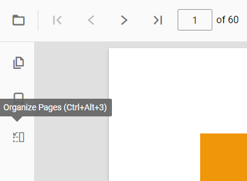
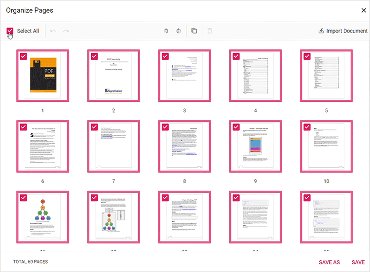

# Organize Pages in TypeScript PDF Viewer control

The PDF Viewer provides tools to organize PDF documents by inserting, deleting, rotating, rearranging, copying, and importing pages. These features enable efficient page-level editing within the viewer.

## Getting started

To access the organize pages feature, open a PDF document in the PDF Viewer and choose the Organize Pages option from the left toolbar. See the [Organize Pages API](https://ej2.syncfusion.com/documentation/api/pdfviewer/pageOrganizerSettingsModel/) for configuration options.



The page organizer enables rotating, rearranging, inserting, copying, importing, and deleting pages using an interactive dialog with page thumbnails.

### Rotating PDF pages

You can adjust the orientation of PDF pages to ensure proper alignment. The rotate icon offers the following options:

* `Rotate clockwise`: Rotate the selected pages 90 degrees clockwise.
* `Rotate counter-clockwise`: Rotate the selected pages 90 degrees counter-clockwise.

### Rearranging PDF pages

Change the sequence of pages using drag-and-drop on the page thumbnails.


### Inserting new pages

Insert blank pages to the left or right of a selected page using the respective toolbar icons.

### Deleting PDF pages

Duplicate pages by selecting thumbnails and using the copy action; duplicates are inserted to the right of the selected page.


### Copying PDF pages

Duplicate pages by selecting thumbnails and using the copy action; duplicates are inserted to the right of the selected page.


### Importing a PDF document

Import a PDF into the current document using the **Import Document** button. If a single page is selected, the imported document is inserted to the right of that page; if multiple or no pages are selected, the imported document is placed at the start. Use **Save** or **Save As** to merge and download the updated document.


### Selecting all pages

Select all thumbnails to apply actions across the entire document simultaneously.



### Zooming page thumbnails

Adjust thumbnail size using the zoom slider for better visibility or to view more pages at once. This is useful for detailed layouts or when working with many pages.


### Usage

- Changes in the organizer are applied immediately in the viewer; use the **Save** button to persist edits.
- Use **Save As** to download a modified copy of the document.

## APIs supported

**enablePageOrganizer:** This API enables or disables the page organizer feature in the PDF Viewer. By default, it is set to `true`.




import { PdfViewer, Toolbar, Magnification, Navigation, Annotation, LinkAnnotation, ThumbnailView, BookmarkView, TextSelection, TextSearch, FormFields, FormDesigner, PageOrganizer} from '@syncfusion/ej2-pdfviewer';

PdfViewer.Inject(Toolbar, Magnification, Navigation, Annotation, LinkAnnotation, ThumbnailView, BookmarkView, TextSelection, TextSearch, FormFields, FormDesigner, PageOrganizer);

let pdfviewer: PdfViewer = new PdfViewer();
pdfviewer.documentPath = "https://cdn.syncfusion.com/content/pdf/pdf-succinctly.pdf";
pdfviewer.resourceUrl = "https://cdn.syncfusion.com/ej2/25.1.35/dist/ej2-pdfviewer-lib";
pdfviewer.enablePageOrganizer = true;
pdfviewer.appendTo('#PdfViewer');




import { PdfViewer, Toolbar, Magnification, Navigation, Annotation, LinkAnnotation, ThumbnailView, BookmarkView, TextSelection, TextSearch, FormFields, FormDesigner, PageOrganizer} from '@syncfusion/ej2-pdfviewer';

PdfViewer.Inject(Toolbar, Magnification, Navigation, Annotation, LinkAnnotation, ThumbnailView, BookmarkView, TextSelection, TextSearch, FormFields, FormDesigner, PageOrganizer);

let pdfviewer: PdfViewer = new PdfViewer();
pdfviewer.serviceUrl = 'https://document.syncfusion.com/web-services/pdf-viewer/api/pdfviewer/';
pdfviewer.documentPath = "https://cdn.syncfusion.com/content/pdf/pdf-succinctly.pdf";
pdfviewer.enablePageOrganizer = true;
pdfviewer.appendTo('#PdfViewer');




**isPageOrganizerOpen:** This API determines whether the page organizer dialog will be displayed automatically when a document is loaded into the PDF Viewer. By default, it is set to `false`, meaning the dialog is not displayed initially.




import { PdfViewer, Toolbar, Magnification, Navigation, Annotation, LinkAnnotation, ThumbnailView, BookmarkView, TextSelection, TextSearch, FormFields, FormDesigner, PageOrganizer} from '@syncfusion/ej2-pdfviewer';

PdfViewer.Inject(Toolbar, Magnification, Navigation, Annotation, LinkAnnotation, ThumbnailView, BookmarkView, TextSelection, TextSearch, FormFields, FormDesigner, PageOrganizer);

let pdfviewer: PdfViewer = new PdfViewer();
pdfviewer.documentPath = "https://cdn.syncfusion.com/content/pdf/pdf-succinctly.pdf";
pdfviewer.resourceUrl = "https://cdn.syncfusion.com/ej2/25.1.35/dist/ej2-pdfviewer-lib";
pdfviewer.isPageOrganizerOpen = true;
pdfviewer.appendTo('#PdfViewer');




import { PdfViewer, Toolbar, Magnification, Navigation, Annotation, LinkAnnotation, ThumbnailView, BookmarkView, TextSelection, TextSearch, FormFields, FormDesigner, PageOrganizer} from '@syncfusion/ej2-pdfviewer';

PdfViewer.Inject(Toolbar, Magnification, Navigation, Annotation, LinkAnnotation, ThumbnailView, BookmarkView, TextSelection, TextSearch, FormFields, FormDesigner, PageOrganizer);

let pdfviewer: PdfViewer = new PdfViewer();
pdfviewer.serviceUrl = 'https://document.syncfusion.com/web-services/pdf-viewer/api/pdfviewer/';
pdfviewer.documentPath = "https://cdn.syncfusion.com/content/pdf/pdf-succinctly.pdf";
pdfviewer.isPageOrganizerOpen = true;
pdfviewer.appendTo('#PdfViewer');




**pageOrganizerSettings:** This API allows control over various page management functionalities within the PDF Viewer. It includes options to enable or disable actions such as deleting, inserting, rotating, copying, importing and rearranging pages, as well as configuring thumbnail zoom settings. By default, all these actions are enabled and standard zoom settings are applied.




import { PdfViewer, Toolbar, Magnification, Navigation, Annotation, LinkAnnotation, ThumbnailView, BookmarkView, TextSelection, TextSearch, FormFields, FormDesigner, PageOrganizer} from '@syncfusion/ej2-pdfviewer';

PdfViewer.Inject(Toolbar, Magnification, Navigation, Annotation, LinkAnnotation, ThumbnailView, BookmarkView, TextSelection, TextSearch, FormFields, FormDesigner, PageOrganizer);

let pdfviewer: PdfViewer = new PdfViewer();
pdfviewer.documentPath = "https://cdn.syncfusion.com/content/pdf/pdf-succinctly.pdf";
pdfviewer.resourceUrl = "https://cdn.syncfusion.com/ej2/25.1.35/dist/ej2-pdfviewer-lib";
pdfviewer.pageOrganizerSettings = {canDelete: true, canInsert: true, canRotate: true, canCopy: true, canRearrange: true, canImport: true,  imageZoom: 1, showImageZoomingSlider: true, imageZoomMin: 1, imageZoomMax: 5}
pdfviewer.appendTo('#PdfViewer');




import { PdfViewer, Toolbar, Magnification, Navigation, Annotation, LinkAnnotation, ThumbnailView, BookmarkView, TextSelection, TextSearch, FormFields, FormDesigner, PageOrganizer} from '@syncfusion/ej2-pdfviewer';

PdfViewer.Inject(Toolbar, Magnification, Navigation, Annotation, LinkAnnotation, ThumbnailView, BookmarkView, TextSelection, TextSearch, FormFields, FormDesigner, PageOrganizer);

let pdfviewer: PdfViewer = new PdfViewer();
pdfviewer.serviceUrl = 'https://document.syncfusion.com/web-services/pdf-viewer/api/pdfviewer/';
pdfviewer.documentPath = "https://cdn.syncfusion.com/content/pdf/pdf-succinctly.pdf";
pdfviewer.pageOrganizerSettings = {canDelete: true, canInsert: true, canRotate: true, canCopy: true, canRearrange: true, canImport: true,  imageZoom: 1, showImageZoomingSlider: true, imageZoomMin: 1, imageZoomMax: 5};
pdfviewer.appendTo('#PdfViewer');




**openPageOrganizer:** This API opens the page organizer dialog within the PDF Viewer, providing access to manage PDF pages.

```html
<button id="openPageOrganizer">Open PageOrganizer Pane</button>
```

```ts
document.getElementById('openPageOrganizer').addEventListener('click', function () {
  viewer.pageOrganizer.openPageOrganizer();
}
```
**closePageOrganizer:** This API closes the currently open page organizer dialog within the PDF Viewer.

```html
<button id="closePageOrganizer">Close PageOrganizer Pane</button>
```
```ts
document.getElementById('closePageOrganizer').addEventListener('click', function () {
  viewer.pageOrganizer.openPageOrganizer();
}
```
## Keyboard shortcuts
The following keyboard shortcuts are available at the organize pages dialog.
* **Ctrl+Z** : Undo the last action performed.
* **Ctrl+Y** : Redo the action that was undone
* **Ctrl+Scroll** : Zoom in and zoom out page thumbnails for better visibility.


#### Conclusion
The Organize Pages feature provides a set of tools for editing the page structure of PDF documents inside the viewer. Use the toolbar and organizer panel to insert, delete, rotate, rearrange, copy, import, and save changes to documents.
[View sample in GitHub](https://github.com/SyncfusionExamples/typescript-pdf-viewer-examples/tree/master/How%20to/Organize%20pdf)