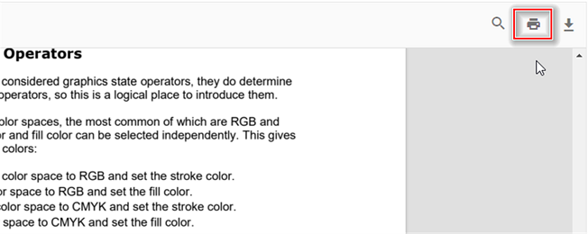

# Print in Typescript Pdfviewer control

The PDF Viewer supports printing the loaded PDF file. You can enable/disable the print using the following code snippet.

```html
<!DOCTYPE html>
<html lang="en">

<head>
    <title>Essential JS 2</title>
    <meta charset="utf-8" />
    <meta name="viewport" content="width=device-width, initial-scale=1.0, user-scalable=no" />
    <meta name="description" content="Essential JS 2" />
    <meta name="author" content="Syncfusion" />
    <link rel="shortcut icon" href="resources/favicon.ico" />
    <link href="https://maxcdn.bootstrapcdn.com/bootstrap/3.3.7/css/bootstrap.min.css" rel="stylesheet" />

    <!--style reference from app-->
    <link href="/styles/styles.css" rel="stylesheet" />

    <!--system js reference and configuration-->
    <script src="node_modules/systemjs/dist/system.src.js" type="text/javascript"></script>
    <script src="system.config.js" type="text/javascript"></script>
</head>

<body>
    <!--Element which will render as PdfViewer -->
    <div id="PdfViewer"></div>
</body>

</html>
```




import { PdfViewer, Toolbar, Magnification, Navigation, Annotation, LinkAnnotation,ThumbnailView,BookmarkView, TextSelection} from '@syncfusion/ej2-pdfviewer';

PdfViewer.Inject(Toolbar,Magnification,Navigation, Annotation, LinkAnnotation,ThumbnailView,BookmarkView, TextSelection);

let pdfviewer: PdfViewer = new PdfViewer({enablePrint: true, documentPath:'https://cdn.syncfusion.com/content/pdf/pdf-succinctly.pdf'});
pdfviewer.appendTo('#PdfViewer');




import { PdfViewer, Toolbar, Magnification, Navigation, Annotation, LinkAnnotation,ThumbnailView,BookmarkView, TextSelection} from '@syncfusion/ej2-pdfviewer';

PdfViewer.Inject(Toolbar,Magnification,Navigation, Annotation, LinkAnnotation,ThumbnailView,BookmarkView, TextSelection);

let pdfviewer: PdfViewer = new PdfViewer({enablePrint: true, documentPath:'https://cdn.syncfusion.com/content/pdf/pdf-succinctly.pdf'});
pdfviewer.serviceUrl = 'https://document.syncfusion.com/web-services/pdf-viewer/api/pdfviewer/';
pdfviewer.appendTo('#PdfViewer');






You can invoke print action using the following code snippet.,




import { PdfViewer, Toolbar, Magnification, Navigation, Annotation, LinkAnnotation,ThumbnailView,BookmarkView, TextSelection} from '@syncfusion/ej2-pdfviewer';

PdfViewer.Inject(Toolbar,Magnification,Navigation, Annotation, LinkAnnotation,ThumbnailView,BookmarkView, TextSelection);

let pdfviewer: PdfViewer = new PdfViewer();
pdfviewer.appendTo('#PdfViewer');
pdfviewer.load('https://cdn.syncfusion.com/content/pdf/pdf-succinctly.pdf', null);
pdfviewer.print.print();





import { PdfViewer, Toolbar, Magnification, Navigation, Annotation, LinkAnnotation,ThumbnailView,BookmarkView, TextSelection} from '@syncfusion/ej2-pdfviewer';

PdfViewer.Inject(Toolbar,Magnification,Navigation, Annotation, LinkAnnotation,ThumbnailView,BookmarkView, TextSelection);

let pdfviewer: PdfViewer = new PdfViewer();
pdfviewer.serviceUrl = 'https://document.syncfusion.com/web-services/pdf-viewer/api/pdfviewer/';
pdfviewer.appendTo('#PdfViewer');
pdfviewer.load('https://cdn.syncfusion.com/content/pdf/pdf-succinctly.pdf', null);
pdfviewer.print.print();




## Customizing Print Quality using printScaleFactor API

The PDF Viewer allows you to adjust the print quality using the [printScaleFactor](https://ej2.syncfusion.com/documentation/api/pdfviewer#printScaleFactor) API. The quality of the print improves as the print quality value increases from 0.5 to 5.

When the value is less than 0.5, the PDF is printed at a standard quality. When the value exceeds 5, the PDF is still printed at the standard quality. In standard quality, printScaleFactor value is set to 1 as default value.
The effective range for print quality is between 0.5 and 5. Higher values within this range will result in better print quality, but also increase the print time.

By default, the printScaleFactor is set to 1.

* **The following code snippet demonstrates how to customize print quality using the printScaleFactor API in the PDF Viewer.**



import { PdfViewer, Toolbar, Magnification, Navigation, Annotation, LinkAnnotation,ThumbnailView,BookmarkView, TextSelection} from '@syncfusion/ej2-pdfviewer';

PdfViewer.Inject(Toolbar,Magnification,Navigation, Annotation, LinkAnnotation,ThumbnailView,BookmarkView, TextSelection);

let pdfviewer: PdfViewer = new PdfViewer({enablePrint: true, documentPath:'https://cdn.syncfusion.com/content/pdf/pdf-succinctly.pdf'});
//pdf with low quality. By changing values you can change the quality of the pdf.
pdfviewer.printScaleFactor = 0.5;
pdfviewer.appendTo('#PdfViewer');




import { PdfViewer, Toolbar, Magnification, Navigation, Annotation, LinkAnnotation,ThumbnailView,BookmarkView, TextSelection} from '@syncfusion/ej2-pdfviewer';

PdfViewer.Inject(Toolbar,Magnification,Navigation, Annotation, LinkAnnotation,ThumbnailView,BookmarkView, TextSelection);

let pdfviewer: PdfViewer = new PdfViewer({enablePrint: true, documentPath:'https://cdn.syncfusion.com/content/pdf/pdf-succinctly.pdf'});
pdfviewer.serviceUrl = 'https://document.syncfusion.com/web-services/pdf-viewer/api/pdfviewer/';
//pdf with low quality. By changing values you can change the quality of the pdf.
pdfviewer.printScaleFactor = 0.5;
pdfviewer.appendTo('#PdfViewer');




## EnablePrintRotation in the PDF Viewer

The `EnablePrintRotation` property controls whether landscape pages are auto-rotated to best fit when printing. The default value is `true`. Set to `false` to preserve the original page orientation and suppress automatic rotation during print.




import { PdfViewer, Toolbar, Magnification, Navigation, Annotation, LinkAnnotation,ThumbnailView,BookmarkView, TextSelection} from '@syncfusion/ej2-pdfviewer';

PdfViewer.Inject(Toolbar,Magnification,Navigation, Annotation, LinkAnnotation,ThumbnailView,BookmarkView, TextSelection);

let pdfviewer: PdfViewer = new PdfViewer({
    documentPath:'https://cdn.syncfusion.com/content/pdf/pdf-succinctly.pdf',
    enablePrintRotation: true
});
pdfviewer.appendTo('#PdfViewer');




import { PdfViewer, Toolbar, Magnification, Navigation, Annotation, LinkAnnotation,ThumbnailView,BookmarkView, TextSelection} from '@syncfusion/ej2-pdfviewer';

PdfViewer.Inject(Toolbar,Magnification,Navigation, Annotation, LinkAnnotation,ThumbnailView,BookmarkView, TextSelection);

let pdfviewer: PdfViewer = new PdfViewer({
    documentPath:'https://cdn.syncfusion.com/content/pdf/pdf-succinctly.pdf',
    serviceUrl: 'https://document.syncfusion.com/web-services/pdf-viewer/api/pdfviewer/',
    enablePrintRotation: true
});
pdfviewer.appendTo('#PdfViewer');




## Print modes in the PDF Viewer

The `printMode` property allows you to specify how the document is printed.

The supported values are:
*   `Default`: Prints the document from the same window.
*   `NewWindow`: Prints the document from a new window/tab, which can be useful depending on browser popup policies.




import { PdfViewer, Toolbar, Magnification, Navigation, Annotation, LinkAnnotation,ThumbnailView,BookmarkView, TextSelection, PrintMode} from '@syncfusion/ej2-pdfviewer';

PdfViewer.Inject(Toolbar,Magnification,Navigation, Annotation, LinkAnnotation,ThumbnailView,BookmarkView, TextSelection);

let pdfviewer: PdfViewer = new PdfViewer({
    documentPath:'https://cdn.syncfusion.com/content/pdf/pdf-succinctly.pdf',
    printMode: PrintMode.NewWindow
});
pdfviewer.appendTo('#PdfViewer');




import { PdfViewer, Toolbar, Magnification, Navigation, Annotation, LinkAnnotation,ThumbnailView,BookmarkView, TextSelection, PrintMode} from '@syncfusion/ej2-pdfviewer';

PdfViewer.Inject(Toolbar,Magnification,Navigation, Annotation, LinkAnnotation,ThumbnailView,BookmarkView, TextSelection);

let pdfviewer: PdfViewer = new PdfViewer({
    documentPath:'https://cdn.syncfusion.com/content/pdf/pdf-succinctly.pdf',
    serviceUrl: 'https://document.syncfusion.com/web-services/pdf-viewer/api/pdfviewer/',
    printMode: PrintMode.NewWindow
});
pdfviewer.appendTo('#PdfViewer');




[View sample in GitHub](https://github.com/SyncfusionExamples/typescript-pdf-viewer-examples/tree/master/How%20to/Customization%20%20of%20Print%20Quality)

## Print Events

The following events are available in the PDF Viewer component.

| Name         | Description                            |
|--------------|----------------------------------------|
| `printStart` | Triggers when a print action starts.   |
| `printEnd`   | Triggers when a print action is completed. |

### printStart Event
The [`printStart`](https://ej2.syncfusion.com/documentation/api/pdfviewer/#printstart) event triggers when the print action is started.

#### Event Arguments
See [`PrintStartEventArgs`](https://ej2.syncfusion.com/documentation/api/pdfviewer/printStartEventArgs/) for details such as `fileName` and the `cancel` option.

The following example illustrates how to handle the `printStart` event.




import { PdfViewer, PrintStartEventArgs, Toolbar, Magnification, Navigation, Annotation, LinkAnnotation,ThumbnailView,BookmarkView, TextSelection } from '@syncfusion/ej2-pdfviewer';

PdfViewer.Inject(Toolbar,Magnification,Navigation, Annotation, LinkAnnotation,ThumbnailView,BookmarkView, TextSelection);

let pdfviewer: PdfViewer = new PdfViewer({
    documentPath: 'https://cdn.syncfusion.com/content/pdf/pdf-succinctly.pdf',
    printStart: (args: PrintStartEventArgs) => {
        console.log('Print action has started for file: ' + args.fileName);
        // To cancel the print action
        // args.cancel = true;
    }
});
pdfviewer.appendTo('#PdfViewer');




import { PdfViewer, PrintStartEventArgs, Toolbar, Magnification, Navigation, Annotation, LinkAnnotation,ThumbnailView,BookmarkView, TextSelection } from '@syncfusion/ej2-pdfviewer';

PdfViewer.Inject(Toolbar,Magnification,Navigation, Annotation, LinkAnnotation,ThumbnailView,BookmarkView, TextSelection);

let pdfviewer: PdfViewer = new PdfViewer({
    documentPath: 'https://cdn.syncfusion.com/content/pdf/pdf-succinctly.pdf',
    serviceUrl: 'https://document.syncfusion.com/web-services/pdf-viewer/api/pdfviewer/',
    printStart: (args: PrintStartEventArgs) => {
        console.log('Print action has started for file: ' + args.fileName);
        // To cancel the print action
        // args.cancel = true;
    }
});
pdfviewer.appendTo('#PdfViewer');




### printEnd Event
The [`printEnd`](https://ej2.syncfusion.com/documentation/api/pdfviewer/#printend) event triggers when a print action is completed.

#### Event Arguments
See [`PrintEndEventArgs`](https://ej2.syncfusion.com/documentation/api/pdfviewer/printEndEventArgs/) for details such as `fileName`.

The following example illustrates how to handle the `printEnd` event.




import { PdfViewer, PrintEndEventArgs, Toolbar, Magnification, Navigation, Annotation, LinkAnnotation,ThumbnailView,BookmarkView, TextSelection } from '@syncfusion/ej2-pdfviewer';

PdfViewer.Inject(Toolbar,Magnification,Navigation, Annotation, LinkAnnotation,ThumbnailView,BookmarkView, TextSelection);

let pdfviewer: PdfViewer = new PdfViewer({
    documentPath: 'https://cdn.syncfusion.com/content/pdf/pdf-succinctly.pdf',
    printEnd: (args: PrintEndEventArgs) => {
        console.log('Printed File Name: ' + args.fileName);
    }
});
pdfviewer.appendTo('#PdfViewer');




import { PdfViewer, PrintEndEventArgs, Toolbar, Magnification, Navigation, Annotation, LinkAnnotation,ThumbnailView,BookmarkView, TextSelection } from '@syncfusion/ej2-pdfviewer';

PdfViewer.Inject(Toolbar,Magnification,Navigation, Annotation, LinkAnnotation,ThumbnailView,BookmarkView, TextSelection);

let pdfviewer: PdfViewer = new PdfViewer({
    documentPath: 'https://cdn.syncfusion.com/content/pdf/pdf-succinctly.pdf',
    serviceUrl: 'https://document.syncfusion.com/web-services/pdf-viewer/api/pdfviewer/',
    printEnd: (args: PrintEndEventArgs) => {
        console.log('Printed File Name: ' + args.fileName);
    }
});
pdfviewer.appendTo('#PdfViewer');




## See also

* [Toolbar items](./toolbar)
* [Feature Modules](./feature-module)
