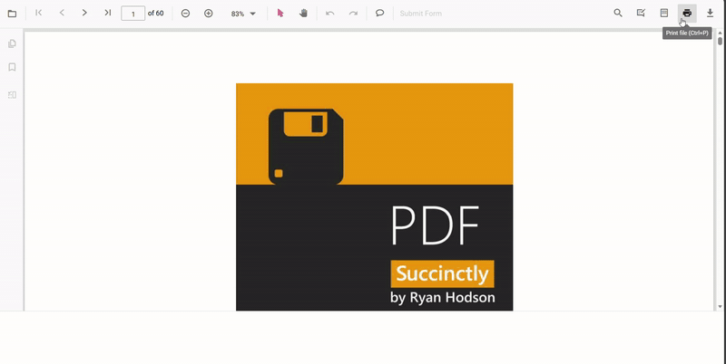

# Enable print rotation in the PDF Viewer

Set the `enablePrintRotation` property to control whether landscape pages are rotated automatically to fit the paper orientation. Keep it enabled to minimize clipping, or disable it to preserve the original orientation.




import { PdfViewer, TextSelection, TextSearch, Print, Navigation, Toolbar, Magnification, Annotation, FormDesigner, FormFields, PageOrganizer } from '@syncfusion/ej2-pdfviewer';

// Inject required modules
PdfViewer.Inject(TextSelection, TextSearch, Print, Navigation, Toolbar, Magnification, Annotation, FormDesigner, FormFields, PageOrganizer);

const pdfviewer: PdfViewer = new PdfViewer({
    documentPath: 'https://cdn.syncfusion.com/content/pdf/pdf-succinctly.pdf',
    resourceUrl: "https://cdn.syncfusion.com/ej2/31.1.23/dist/ej2-pdfviewer-lib",
    enablePrintRotation: true,
});
pdfviewer.appendTo('#PdfViewer');




import { PdfViewer, TextSelection, TextSearch, Print, Navigation, Toolbar, Magnification, Annotation, FormDesigner, FormFields, PageOrganizer } from '@syncfusion/ej2-pdfviewer';

// Inject required modules
PdfViewer.Inject(TextSelection, TextSearch, Print, Navigation, Toolbar, Magnification, Annotation, FormDesigner, FormFields, PageOrganizer);

const pdfviewer: PdfViewer = new PdfViewer({
    documentPath: 'https://cdn.syncfusion.com/content/pdf/pdf-succinctly.pdf',
    serviceUrl: 'https://document.syncfusion.com/web-services/pdf-viewer/api/pdfviewer/',
    enablePrintRotation: true,
});
pdfviewer.appendTo('#PdfViewer');




[View Sample in GitHub](https://github.com/SyncfusionExamples/typescript-pdf-viewer-examples)

## See Also

- [Overview](./overview)
- [Print quality](./print-quality)
- [Print modes](./print-modes)
- [Print events](./events)