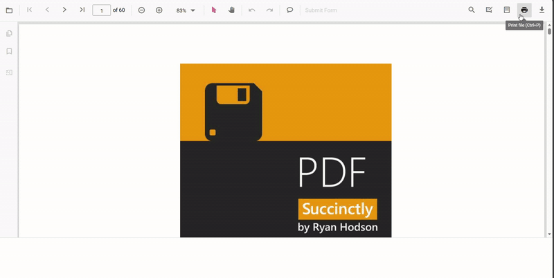

# Enable Print Rotation in JavaScript (ES6) PDF Viewer

Use the `enablePrintRotation` property to enable automatic rotation of landscape pages during printing so they match the paper orientation. Enable this setting to reduce clipping of landscape pages; disable it to preserve the document's original orientation. Ensure the `Print` module is injected before using this property — see the PdfViewer API reference: [PdfViewer API Reference](https://ej2.syncfusion.com/documentation/api/pdfviewer/index-default).




import { PdfViewer, TextSelection, TextSearch, Print, Navigation, Toolbar, Magnification, Annotation, FormDesigner, FormFields, PageOrganizer } from '@syncfusion/ej2-pdfviewer';

// Inject required modules
PdfViewer.Inject(TextSelection, TextSearch, Print, Navigation, Toolbar, Magnification, Annotation, FormDesigner, FormFields, PageOrganizer);

const pdfviewer: PdfViewer = new PdfViewer({
    documentPath: 'https://cdn.syncfusion.com/content/pdf/pdf-succinctly.pdf',
    resourceUrl: "https://cdn.syncfusion.com/ej2/31.1.23/dist/ej2-pdfviewer-lib",
    enablePrintRotation: true,
});
pdfviewer.appendTo('#PdfViewer');




import { PdfViewer, TextSelection, TextSearch, Print, Navigation, Toolbar, Magnification, Annotation, FormDesigner, FormFields, PageOrganizer } from '@syncfusion/ej2-pdfviewer';

// Inject required modules
PdfViewer.Inject(TextSelection, TextSearch, Print, Navigation, Toolbar, Magnification, Annotation, FormDesigner, FormFields, PageOrganizer);

const pdfviewer: PdfViewer = new PdfViewer({
    documentPath: 'https://cdn.syncfusion.com/content/pdf/pdf-succinctly.pdf',
    serviceUrl: 'https://document.syncfusion.com/web-services/pdf-viewer/api/pdfviewer/',
    enablePrintRotation: true,
});
pdfviewer.appendTo('#PdfViewer');




[View Sample in GitHub](https://github.com/SyncfusionExamples/typescript-pdf-viewer-examples)

## See Also

- [Overview](./overview)
- [Print quality](./print-quality)
- [Print modes](./print-modes)
- [Print events](./events)