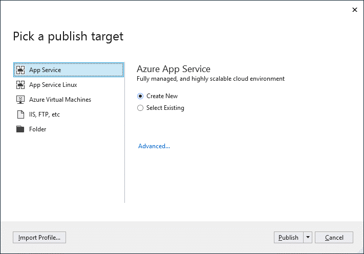
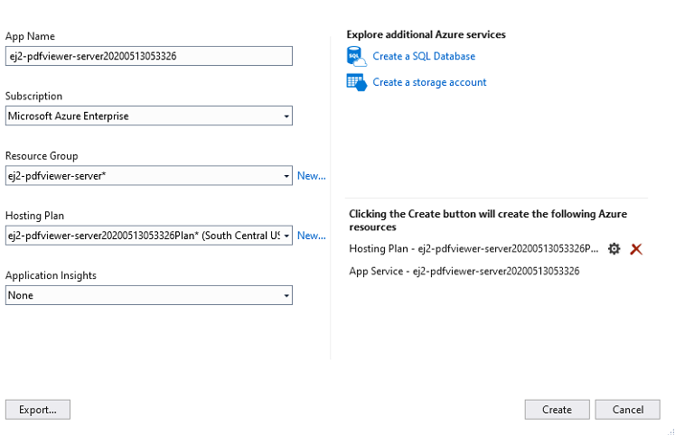

# Deploy PDF Viewer server app to Azure App Service from Visual Studio

Publish the Syncfusion PDF Viewer Web API from Visual Studio to Azure App Service to host the backend required by the TypeScript PDF Viewer client. This workflow packages the project, deploys it to Azure, and provides a public endpoint for the component’s `serviceUrl`.

## Prerequisites

- Visual Studio 2017 or 2019 with the Azure development workload installed
- Active Azure subscription. Sign up from the [Azure pricing page](https://azure.microsoft.com/pricing/)
- Existing PDF Viewer Web API project. Follow the article [Create a PDF Viewer Web API application in ASP.NET Core](https://www.syncfusion.com/kb/10346/how-to-create-pdf-viewer-web-service-application-in-asp-net-core)
- Build the project (Build > Build Solution) before publishing to catch compilation errors locally

## Publish to Azure App Service

Follow these steps to publish the Web API and generate the App Service endpoint that the TypeScript PDF Viewer client uses.

**Step 1:** In Solution Explorer, right-click the project and choose Publish (or use Build > Publish) to open the publishing wizard.

**Step 2:** If no profile exists, select **Create new profile** to configure deployment settings.

**Step 3:** In **Pick a publish target**, choose **App Service** so Visual Studio provisions or reuses an Azure App Service instance.

**Step 4:** Select **Publish**. In **Create App Service**, sign in if prompted and review the default resource group, plan, and hosting settings.

> **Security note:** Store the `SYNCFUSION_LICENSE_KEY` in Azure App Service application settings or Azure Key Vault references instead of embedding it in source code or publish profiles.

**Step 5:** Select **Create**. After deployment, browse to `https://<app_name>.azurewebsites.net` (for example, `https://ej2-pdfviewer-server20200513053326.azurewebsites.net`). Configure a custom domain and TLS certificate for production environments.

**Step 6:** Verify the API at `https://ej2-pdfviewer-server20200513053326.azurewebsites.net/api/pdfviewer`. A default GET response confirms the server is running and reachable.

Update the TypeScript PDF Viewer client to use the secure service endpoint (for example, `https://ej2-pdfviewer-server20200513053326.azurewebsites.net/api/pdfviewer`) as the `serviceUrl`. Refer to the [Getting started with the TypeScript PDF Viewer](https://help.syncfusion.com/document-processing/pdf/pdf-viewer/javascript-es6/getting-started/) guide for client configuration steps.

For production deployment guidance, review the [Azure App Service deployment documentation](https://learn.microsoft.com/visualstudio/deployment/azure/app-service). An architecture diagram illustrating the Visual Studio deployment process and client-to-server communication can help onboarding teams understand the workflow.
