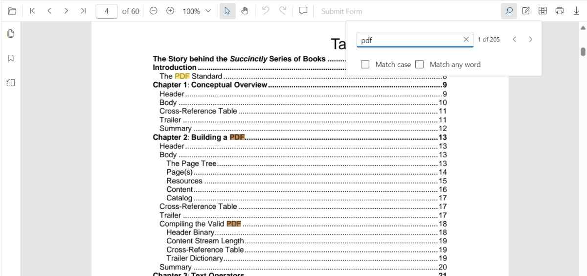

# Text search Features in TypeScript PDF Viewer control

The text search feature in the PDF Viewer locates and highlights matching content within a document. Enable or disable this capability with the following configuration.


N> The text search functionality requires importing TextSearch and adding it to PdfViewer.Inject(..., TextSearch). Otherwise, the search UI and APIs are not accessible.

## Text search features in UI

### Real-time search suggestions while typing
Typing in the search box immediately surfaces suggestions that match the entered text. The list refreshes on every keystroke so users can quickly jump to likely results without completing the entire term.


### Select search suggestions from the popup
After typing in the search box, the popup lists relevant matches. Selecting an item jumps directly to the corresponding occurrence in the PDF.


### Dynamic Text Search for Large PDF Documents
Dynamic text search is enabled during the initial loading of the document when the document text collection has not yet been fully loaded in the background.


### Search text with the Match Case option
Enable the Match Case checkbox to limit results to case-sensitive matches. Navigation commands then step through each exact match in sequence.


### Search text without Match Case
Leave the Match Case option cleared to highlight every occurrence of the query, regardless of capitalization, and navigate through each result.



### Search a list of words with Match Any Word
Enable Match Any Word to split the query into separate words. The popup proposes matches for each word and highlights them throughout the document.


## Text Search Programmatically

### Enable or Disable Text Search 

Use the following snippet to enable or disable text search features

```html
<!DOCTYPE html>
<html lang="en">

<head>
    <title>Essential JS 2</title>
    <meta charset="utf-8" />
    <meta name="viewport" content="width=device-width, initial-scale=1.0, user-scalable=no" />
    <meta name="description" content="Essential JS 2" />
    <meta name="author" content="Syncfusion" />
    <link rel="shortcut icon" href="resources/favicon.ico" />
    <link href="https://cdn.syncfusion.com/ej2/31.1.23/material.css" rel="stylesheet" />

    <!--style reference from app-->
    <link href="/styles/styles.css" rel="stylesheet" />

    <!--system js reference and configuration-->
    <script src="node_modules/systemjs/dist/system.src.js" type="text/javascript"></script>
    <script src="system.config.js" type="text/javascript"></script>
</head>

<body>
    <!--Element which will render as PdfViewer -->
    <div id="PdfViewer"></div>
</body>

</html>

```




import { PdfViewer, Toolbar, Magnification, Navigation, Annotation, LinkAnnotation,ThumbnailView,BookmarkView, TextSelection, TextSearch} from '@syncfusion/ej2-pdfviewer';

PdfViewer.Inject(Toolbar,Magnification,Navigation, Annotation, LinkAnnotation,ThumbnailView,BookmarkView, TextSelection, TextSearch);

let pdfviewer: PdfViewer = new PdfViewer();
pdfviewer.documentPath='https://cdn.syncfusion.com/content/pdf/pdf-succinctly.pdf';
pdfviewer.resourceUrl= 'https://cdn.syncfusion.com/ej2/31.1.23/dist/ej2-pdfviewer-lib';
// Enable text search
pdfviewer.enableTextSearch = true;
pdfviewer.appendTo('#PdfViewer');




import { PdfViewer, Toolbar, Magnification, Navigation, Annotation, LinkAnnotation,ThumbnailView,BookmarkView, TextSelection, TextSearch} from '@syncfusion/ej2-pdfviewer';

PdfViewer.Inject(Toolbar,Magnification,Navigation, Annotation, LinkAnnotation,ThumbnailView,BookmarkView, TextSelection, TextSearch);

let pdfviewer: PdfViewer = new PdfViewer();
pdfviewer.documentPath='https://cdn.syncfusion.com/content/pdf/pdf-succinctly.pdf';
pdfviewer.serviceUrl = 'https://document.syncfusion.com/web-services/pdf-viewer/api/pdfviewer/';
// Enable text search
pdfviewer.enableTextSearch = true;
pdfviewer.appendTo('#PdfViewer');




### Programmatic search with settings

While the PDF Viewer toolbar offers an interactive search experience, you can also trigger and customize searches programmatically by calling the `searchText` method with tailored options.

#### Using `searchText`

Use the `searchText` method to start a search with optional filters that control case sensitivity and whole-word behavior.

```typescript
// searchText(text: string, isMatchCase?: boolean)
pdfviewer.textSearch.searchText('search text', false);
```

- `isMatchCase` (optional boolean): Determines whether the search should be case-sensitive.

#### Match Case

Set the `isMatchCase` parameter to `true` to perform a case-sensitive search that mirrors the Match Case option in the search panel.

```typescript
import { PdfViewer, Toolbar, Magnification, Navigation, LinkAnnotation,ThumbnailView,BookmarkView, TextSelection, TextSearch, Print, Annotation,FormFields,FormDesigner, PageOrganizer} from "@syncfusion/ej2-pdfviewer";

PdfViewer.Inject(Toolbar,Magnification,Navigation, LinkAnnotation,ThumbnailView,BookmarkView, TextSelection, TextSearch, Print, Annotation,FormFields,FormDesigner, PageOrganizer);

let pdfviewer: PdfViewer = new PdfViewer({
    documentPath:'https://cdn.syncfusion.com/content/pdf/pdf-succinctly.pdf',
    resourceUrl: "https://cdn.syncfusion.com/ej2/31.1.23/dist/ej2-pdfviewer-lib",
});
pdfviewer.appendTo('#PdfViewer');

// Later, to search programmatically:
// This will only find instances of "PDF" in uppercase.
pdfviewer.textSearch.searchText('PDF', true);
```

#### Match Whole Word

Set the `isMatchWholeWord` parameter to `true` to restrict results to whole-word matches. For example, a search for "view" will not match "viewer".

```typescript
import { PdfViewer, Toolbar, Magnification, Navigation, LinkAnnotation,ThumbnailView,BookmarkView, TextSelection, TextSearch, Print, Annotation,FormFields,FormDesigner, PageOrganizer} from "@syncfusion/ej2-pdfviewer";

PdfViewer.Inject(Toolbar,Magnification,Navigation, LinkAnnotation,ThumbnailView,BookmarkView, TextSelection, TextSearch, Print, Annotation,FormFields,FormDesigner, PageOrganizer);

let pdfviewer: PdfViewer = new PdfViewer({
    documentPath:'https://cdn.syncfusion.com/content/pdf/pdf-succinctly.pdf',
    resourceUrl: "https://cdn.syncfusion.com/ej2/31.1.23/dist/ej2-pdfviewer-lib",
});
pdfviewer.appendTo('#PdfViewer');

// Later, to search programmatically:
// This will find "pdf" but not "pdf-succinctly"
pdfviewer.textSearch.searchText('pdf', false, true);
```

### Search Text Programmatically with the SearchText API

* [**Search text**](https://ej2.syncfusion.com/documentation/api/pdfviewer/textSearch#searchtext): Searches the target text in the PDF document and highlights each occurrence in the pages.
* [**Search next**](https://ej2.syncfusion.com/documentation/api/pdfviewer/textSearch#searchnext): Searches the next occurrence of the current query from the active match.
* [**Search previous**](https://ej2.syncfusion.com/documentation/api/pdfviewer/textSearch#searchprevious): Searches the previous occurrence of the current query from the active match.
* [**Cancel text search**](https://ej2.syncfusion.com/documentation/api/pdfviewer/textSearch#canceltextsearch): Cancels the current text search and removes the highlighted occurrences from the PDF Viewer.


Use the following code snippet to implement text search using SearchText API

```html
  <!-- Search UI -->
<div style="margin-top: 8px;">
  <input id="searchBox" type="text" placeholder="Find text" />
  <label><input id="chkMatchCase" type="checkbox" /> Match case</label>
  <label><input id="chkWholeWord" type="checkbox" /> Whole word</label>

  <button id="btnSearch">Search</button>
  <button id="btnNext">Next</button>
  <button id="btnPrev">Previous</button>
  <button id="btnCancel">Cancel</button>
</div>
<!-- Viewer host -->
<div id="pdfViewer" style="height: 700px;"></div>
```



import { PdfViewer, Toolbar, Magnification, Navigation, Annotation, LinkAnnotation,ThumbnailView,BookmarkView, TextSelection, TextSearch} from '@syncfusion/ej2-pdfviewer';

PdfViewer.Inject(Toolbar,Magnification,Navigation, Annotation, LinkAnnotation,ThumbnailView,BookmarkView, TextSelection, TextSearch);


let viewer: PdfViewer = new PdfViewer({
    documentPath:'https://cdn.syncfusion.com/content/pdf/pdf-succinctly.pdf',
    resourceUrl: "https://cdn.syncfusion.com/ej2/31.1.23/dist/ej2-pdfviewer-lib",
});

viewer.appendTo('#pdfViewer'); // Ensure your HTML has <div id="pdfViewer"></div>

// --- Programmatic Text Search API ---

// Searches the target text in the PDF and highlights all matches.
function searchText(query: string, matchCase = false): void {
  if (!query || !query.trim()) return;
  viewer.textSearch.searchText(query, matchCase);
}

// Navigates to the next occurrence relative to the current active match.
function searchNext(): void {
  viewer.textSearch.searchNext();
}

// Navigates to the previous occurrence relative to the current active match.

function searchPrevious(): void {
  viewer.textSearch.searchPrevious();
}


//Cancels the current search and clears all highlights.
function cancelTextSearch(): void {
  viewer.textSearch.cancelTextSearch();
}

// Example: wire up to buttons/inputs
const input = document.getElementById('searchBox') as HTMLInputElement | null;
document.getElementById('btnSearch')?.addEventListener('click', () => {
  searchText(input?.value ?? '', false);
});
document.getElementById('btnNext')?.addEventListener('click', () => searchNext());
document.getElementById('btnPrev')?.addEventListener('click', () => searchPrevious());
document.getElementById('btnCancel')?.addEventListener('click', () => cancelTextSearch());


import { PdfViewer, Toolbar, Magnification, Navigation, Annotation, LinkAnnotation,ThumbnailView,BookmarkView, TextSelection, TextSearch} from '@syncfusion/ej2-pdfviewer';

PdfViewer.Inject(Toolbar,Magnification,Navigation, Annotation, LinkAnnotation,ThumbnailView,BookmarkView, TextSelection, TextSearch);


let viewer: PdfViewer = new PdfViewer({
    documentPath:'https://cdn.syncfusion.com/content/pdf/pdf-succinctly.pdf',
    serviceUrl: 'https://document.syncfusion.com/web-services/pdf-viewer/api/pdfviewer/'
});

viewer.appendTo('#pdfViewer'); // Ensure your HTML has <div id="pdfViewer"></div>

// --- Programmatic Text Search API ---

// Searches the target text in the PDF and highlights all matches.
function searchText(query: string, matchCase = false): void {
  if (!query || !query.trim()) return;
  viewer.textSearch.searchText(query, matchCase);
}

// Navigates to the next occurrence relative to the current active match.
function searchNext(): void {
  viewer.textSearch.searchNext();
}

// Navigates to the previous occurrence relative to the current active match.

function searchPrevious(): void {
  viewer.textSearch.searchPrevious();
}


//Cancels the current search and clears all highlights.
function cancelTextSearch(): void {
  viewer.textSearch.cancelTextSearch();
}

// Example: wire up to buttons/inputs
const input = document.getElementById('searchBox') as HTMLInputElement | null;
document.getElementById('btnSearch')?.addEventListener('click', () => {
  searchText(input?.value ?? '', false);
});
document.getElementById('btnNext')?.addEventListener('click', () => searchNext());
document.getElementById('btnPrev')?.addEventListener('click', () => searchPrevious());
document.getElementById('btnCancel')?.addEventListener('click', () => cancelTextSearch());




[View Sample in GitHub](https://github.com/SyncfusionExamples/typescript-pdf-viewer-examples)

## See Also

[Find Text](./find-text)
[Text Search Events](./text-search-events)
[Extract Text](../how-to/extract-text-ts)
[Extract Text Options](../how-to/extract-text-option-ts)
[Extract Text Completed](../how-to/extract-text-completed-ts)