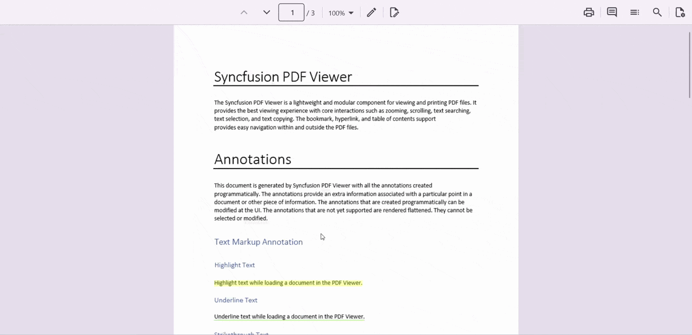
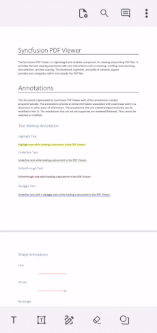

# Comments in .NET MAUI PDF Viewer (SfPdfViewer)
The PDF Viewer control provides options to add, edit, and delete comments for the following annotations in PDF documents:
1. Ink annotation
2. Shape annotation
3. Stamp annotation
4. Sticky note annotation
5. Text markup annotation
6. Free text annotation
7. Signature annotation

## Showing or hiding the comment panel
The built-in Comment Panel in the PDF Viewer displays annotation comments. You can show or hide this panel using the [IsCommentsPanelVisible](https://help.syncfusion.com/cr/document-processing/Syncfusion.Maui.PdfViewer.SfPdfViewer.html#Syncfusion_Maui_PdfViewer_SfPdfViewer_IsCommentsPanelVisible) property. The default value of this property is false.



// Show the comment panel in the PDF Viewer 
PdfViewer.IsCommentsPanelVisible = true;







<syncfusion:SfPdfViewer x:Name="PdfViewer" IsCommentsPanelVisible = "True" > 
</syncfusion:SfPdfViewer>
 



## Comment panel
Annotation comments can be added to the PDF using the comment panel. The comment panel can be opened using the built-in toolbar. In the toolbar, you can find the Comments button in the primary toolbar for desktop and in the top toolbar for mobile. The comment panel displays all annotations in the document along with their comments and replies, allowing you to add comments to any annotation and reply to existing comments or annotations.
The following image represents how to add the comments using the toolbar on the desktop.

The following image represents how to add comments using the toolbar on mobile.

## Adding comments or replies
Follow these steps to add comments or replies:
1. Select the annotation in the PDF document and open the comment panel.
2. The corresponding comment thread is highlighted in the comment panel.
3. Add a comment using the comment input area.
4. To reply to an existing comment or annotation, use the Reply button in the comment panel. This keeps the discussion linked to that annotation.
5. Multiple replies can be added to a comment.

## Add comments or replies programmatically
You can add comments or replies to existing annotations programmatically by accessing the specific annotation from the Annotations collection. This allows you to enhance collaboration and provide feedback directly within the PDF.
The following example explains how to add comments or replies to a specific annotation in the PDF document.




ReadOnlyObservableCollection<Annotation> annotations = pdfViewer.Annotations;
Annotation annotation = annotations[0];
Comment comment = new Comment()
{
    Text = "First Annotations",
    Author="User Name",
    ModifiedDate= DateTime.Now, 
};
annotation.Comments.Add(comment);




## Editing comments and replies
Comments and replies can be edited through the context menu available under More Options in the Comment Panel. Follow the steps below:
1. Select the annotation comment in the comment panel.
2. Click More Options in the comment or reply container.
3. Select Edit from the context menu.
4. An editable text box appears. Change the content of the comment or reply.

## Deleting comments and replies
Comments and replies can be deleted through the context menu available under More Options in the Comment Panel. Follow the steps below:
1. Select the annotation comment in the comment panel.
2. Click More Options in the comment or reply container.
3. Select Delete from the context menu.
   
**Note:** Deleting the root comment from the comment panel also deletes the associated annotation.

## See Also
- [Add, Remove, and Edit Annotations](https://help.syncfusion.com/document-processing/pdf/pdf-viewer/maui/add-remove-modify-annotations)
- [Annotations Overview](https://help.syncfusion.com/document-processing/pdf/pdf-viewer/maui/annotations-overview)
- [Annotation Collection](https://help.syncfusion.com/document-processing/pdf/pdf-viewer/maui/annotation-collection)
- [Ink](https://help.syncfusion.com/document-processing/pdf/pdf-viewer/maui/ink)
- [Shapes](https://help.syncfusion.com/document-processing/pdf/pdf-viewer/maui/shapes)
- [Stamps](https://help.syncfusion.com/document-processing/pdf/pdf-viewer/maui/stamps)
- [Sticky Notes](https://help.syncfusion.com/document-processing/pdf/pdf-viewer/maui/sticky-notes)
- [Free Text](https://help.syncfusion.com/document-processing/pdf/pdf-viewer/maui/free-text)
- [Text Markups](https://help.syncfusion.com/document-processing/pdf/pdf-viewer/maui/text-markups)
- [Signature](https://help.syncfusion.com/document-processing/pdf/pdf-viewer/maui/signature)
- [Toolbar](https://help.syncfusion.com/document-processing/pdf/pdf-viewer/maui/toolbar)
