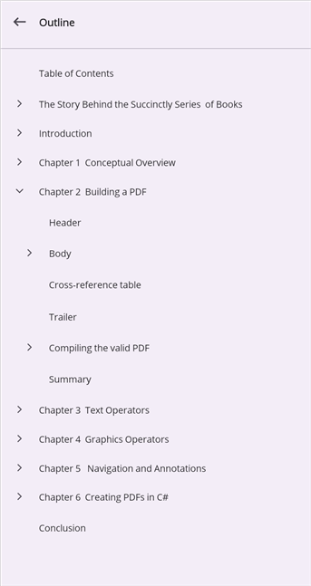

# Document outline in .NET MAUI PDF Viewer

A PDF document may optionally have a document outline (also called bookmarks) which allows the user to navigate from one part of the document to another. The PDF viewer control displays the document outline in a tree-structured hierarchy of outline elements.

## Showing / hiding the outline view

The PDF Viewer's built-in outline view, which displays the document outline in a tree-like structure, can be shown or hidden using the [IsOutlineViewVisible](https://help.syncfusion.com/cr/document-processing/Syncfusion.Maui.PdfViewer.SfPdfViewer.html#Syncfusion_Maui_PdfViewer_SfPdfViewer_IsOutlineViewVisible) property. The default value of this property is `false`.




<pdfViewer:SfPdfViewer x:Name="pdfViewer" IsOutlineViewVisible="{Binding OutlineViewVisible}" />




pdfViewer.IsOutlineViewVisible = true;




## Accessing outline elements

To access the document outline and its elements, you can use the [DocumentOutline](https://help.syncfusion.com/cr/document-processing/Syncfusion.Maui.PdfViewer.SfPdfViewer.html#Syncfusion_Maui_PdfViewer_SfPdfViewer_DocumentOutline) property. This property provides a list of outline elements. 




var documentOutline = pdfViewer.DocumentOutline;




## Accessing nested child elements

The outline elements nested within each outline element can be accessed from the [OutlineElement.Children](https://help.syncfusion.com/cr/document-processing/Syncfusion.Maui.PdfViewer.OutlineElement.html#Syncfusion_Maui_PdfViewer_OutlineElement_Children) property. The following code snippet illustrates accessing the third element in the document outline and then accessing its fourth child (using zero-based indexing).




OutlineElement outlineElement = pdfViewer.DocumentOutline[2];
OutlineElement nestedElement = outlineElement.Children[3];




## Navigating to outline elements

### Navigating using the UI

After showing the outline view using the [IsOutlineViewVisible](https://help.syncfusion.com/cr/document-processing/Syncfusion.Maui.PdfViewer.SfPdfViewer.html#Syncfusion_Maui_PdfViewer_SfPdfViewer_IsOutlineViewVisible) property as described above, you can tap on any element to navigate to the destination pointed to by that element.

### Navigating programmatically

The PDF Viewer allows users to navigate to an outline element using the [GoToOutlineElement](https://help.syncfusion.com/cr/document-processing/Syncfusion.Maui.PdfViewer.SfPdfViewer.html#Syncfusion_Maui_PdfViewer_SfPdfViewer_GoToOutlineElement_Syncfusion_Maui_PdfViewer_OutlineElement_) method. The following code snippet illustrates how to navigate to an outline element.




//Get the required outline element
OutlineElement outlineElement = pdfViewer.DocumentOutline.Where(x => x.Title.Contains("Chapter 2")).FirstOrDefault();

if (outlineElement != null)
   pdfViewer.GoToOutlineElement(outlineElement);




## See Also

- [Page Navigation](https://help.syncfusion.com/document-processing/pdf/pdf-viewer/maui/page-navigation)
- [Document Link Annotations](https://help.syncfusion.com/document-processing/pdf/pdf-viewer/maui/document-link-annotations)
- [Custom Bookmarks](https://help.syncfusion.com/document-processing/pdf/pdf-viewer/maui/custom-bookmark)
- [Hyperlink Navigation](https://help.syncfusion.com/document-processing/pdf/pdf-viewer/maui/hyperlink-navigation)
- [Annotations Overview](https://help.syncfusion.com/document-processing/pdf/pdf-viewer/maui/annotations-overview)
