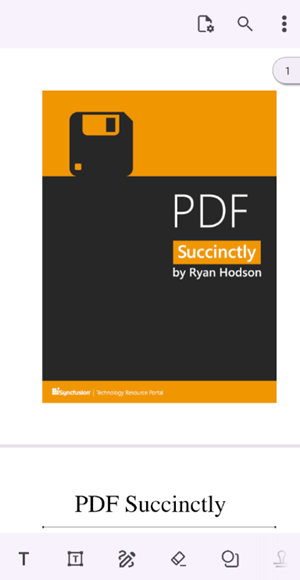

# Getting Started with .NET MAUI PDF Viewer

This section guides you through setting up and configuring the PDF Viewer in your .NET MAUI application. Follow the steps below to add the PDF Viewer to your project and load a PDF document.

To get started quickly, you can also check out our video tutorial below. 

 <iframe id='MAUISfPdfViewerVideoTutorial' src='https://www.youtube.com/embed/KdXoeL5wvkA'></iframe>




## Prerequisites

Before proceeding, ensure the following are in place:

1.	Install [.NET 9 SDK](https://dotnet.microsoft.com/en-us/download/dotnet/9.0) or later.
2.	Set up a .NET MAUI environment with Visual Studio 2022 (v17.3 or later).

## Step 1: Create a New MAUI Project

1.  Go to **File > New > Project** and choose the **.NET MAUI App** template.
2.  Name the project and choose a location, then click **Next**.
3.  Select the .NET Framework version and click **Create**.

## Step 2: Install the Syncfusion® MAUI PDF Viewer NuGet Package

1.  In **Solution Explorer**, right-click the project and choose **Manage NuGet Packages**.
2.  Search for [Syncfusion.Maui.PdfViewer](https://www.nuget.org/packages/Syncfusion.Maui.PdfViewer) and install the latest version.
3.  Ensure the dependencies are installed and the project is restored.

## Step 3: Register the Syncfusion® Core Handler

[Syncfusion.Maui.Core](https://www.nuget.org/packages/Syncfusion.Maui.Core/) is automatically installed as a dependency when [Syncfusion.Maui.PdfViewer](https://www.nuget.org/packages/Syncfusion.Maui.PdfViewer) NuGet is installed. 

1. Add the following namespace in your `MauiProgram.cs` file.


using Syncfusion.Maui.Core.Hosting;
 


2. Register the Syncfusion core handler in your `MauiProgram.cs` file to use Syncfusion controls.



public static MauiApp CreateMauiApp()
{
    var builder = MauiApp.CreateBuilder();
    builder
        .UseMauiApp<App>()
        .ConfigureFonts(fonts =>
        {
            fonts.AddFont("OpenSans-Regular.ttf", "OpenSansRegular");
        });

    builder.ConfigureSyncfusionCore();
    return builder.Build();
}

 


## Step 4: Add PDF Viewer

Open the `MainPage.xaml` file and follow the steps below. 

1.  Add the following namespace in your MainPage.xaml file.



xmlns:syncfusion="clr-namespace:Syncfusion.Maui.PdfViewer;assembly=Syncfusion.Maui.PdfViewer"
 


2.  Add the [SfPdfViewer](https://help.syncfusion.com/cr/document-processing/Syncfusion.Maui.PdfViewer.SfPdfViewer.html) control.



<syncfusion:SfPdfViewer x:Name="pdfViewer"></syncfusion:SfPdfViewer>
 


## Step 5: Load a PDF Document

1.  From the solution explorer of the project, add a new folder to the project named `Assets` and add the PDF document you need to load into the PDF viewer. Here, a PDF document named `PDF_Succinctly.pdf` is used.
2.  In Visual Studio, right-click the added PDF document and set its `Build Action` as `Embedded Resource`. 
3.  In this example, the PDF document is loaded using MVVM binding. Create a new C# file named `PdfViewerViewModel.cs` and add the following code snippet.

    
    

using System.ComponentModel;
using System.Reflection;
    
public class PdfViewerViewModel : INotifyPropertyChanged
{
    private Stream pdfDocumentStream;

    /// 

    /// Occurs when a property value changes.
    /// 

    public event PropertyChangedEventHandler? PropertyChanged;

    /// 

    /// Gets or sets the stream of the currently loaded PDF document.
    /// 

    public Stream PdfDocumentStream
    {
        get
        {
            return pdfDocumentStream;
        }
        set
        {
            pdfDocumentStream = value;
            OnPropertyChanged(nameof(PdfDocumentStream));
        }
    }
            
    /// 

    /// Initializes a new instance of the <see cref="PdfViewerViewModel"/> class.
    /// 

    public PdfViewerViewModel()
    {
        // Load the embedded PDF document stream.
        // Replace 'PdfViewerExample' with your project's default namespace in the resource path. Verify that the namespace matches your project name.
        pdfDocumentStream = typeof(App).GetTypeInfo().Assembly.GetManifestResourceStream("PdfViewerExample.Assets.PDF_Succinctly.pdf");
    }

    /// 

    /// Raises the <see cref="PropertyChanged"/> event for the specified property name.
    /// 

    /// <param name="name">The name of the property that changed.</param>
    public void OnPropertyChanged(string name)
    {
        PropertyChanged?.Invoke(this, new PropertyChangedEventArgs(name));
    } 
}

     
    

4.  Open the `MainPage.xaml` file again and add the namespace `PdfViewerExample` and name it as `local`.


xmlns:local="clr-namespace:PdfViewerExample"
 


5.  Set an instance of the `PdfViewerViewModel` class as the `BindingContext`. Bind the PDF viewer's [DocumentSource](https://help.syncfusion.com/cr/document-processing/Syncfusion.Maui.PdfViewer.SfPdfViewer.html#Syncfusion_Maui_PdfViewer_SfPdfViewer_DocumentSource) to the `PdfDocumentStream` property of the `PdfViewerViewModel` class.


<ContentPage.BindingContext>
    <local:PdfViewerViewModel x:Name="viewModel" />
</ContentPage.BindingContext>

<syncfusion:SfPdfViewer x:Name="pdfViewer" DocumentSource="{Binding PdfDocumentStream}"/>

 


N> 1. While changing or opening different documents on the same page, the previously loaded document will be unloaded automatically by the [SfPdfViewer](https://help.syncfusion.com/cr/document-processing/Syncfusion.Maui.PdfViewer.SfPdfViewer.html). 
N> 2. If you are using multiple pages in your application, then make sure to unload the document from the [SfPdfViewer](https://help.syncfusion.com/cr/document-processing/Syncfusion.Maui.PdfViewer.SfPdfViewer.html) while leaving the page that has it to release the memory and resources consumed by the PDF document that is loaded.  The unloading of documents can be done by calling the [UnloadDocument](https://help.syncfusion.com/cr/document-processing/Syncfusion.Maui.PdfViewer.SfPdfViewer.html#Syncfusion_Maui_PdfViewer_SfPdfViewer_UnloadDocument) method. 

## Step 6: Running the Application

1.  Select the target framework, device or emulator.
2.  Press `F5` to run the application.
3.  The PDF document will be loaded in the PDF viewer control as shown in the following screenshot.




## Prerequisites

Before proceeding, ensure the following are in place:

1.	Install [.NET 9 SDK](https://dotnet.microsoft.com/en-us/download/dotnet/9.0) or later.
2.	Set up a .NET MAUI environment with Visual Studio Code. 
3.  Ensure that the .NET MAUI workload is installed and configured as described in the [.NET MAUI installation guide](https://learn.microsoft.com/en-us/dotnet/maui/get-started/installation?view=net-maui-9.0&tabs=visual-studio-code).

## Step 1: Create a New MAUI Project

1.  Open the command palette by pressing `Ctrl+Shift+P` and type **.NET: New Project** and press Enter.
2.  Choose the **.NET MAUI App** template.
3.  Select the project location, type the project name, and press Enter.
4.  Then choose **Create project**.

## Step 2: Install the Syncfusion® MAUI PDF Viewer NuGet Package

1.  In **Solution Explorer**, right-click the project and choose **Add NuGet Package**.
2.  Search for [Syncfusion.Maui.PdfViewer](https://www.nuget.org/packages/Syncfusion.Maui.PdfViewer) and install the latest version.
3.  Ensure the dependencies are installed, and the project is restored.

## Step 3: Register the Syncfusion® Core Handler

[Syncfusion.Maui.Core](https://www.nuget.org/packages/Syncfusion.Maui.Core/) will be automatically installed as a dependency when [Syncfusion.Maui.PdfViewer](https://www.nuget.org/packages/Syncfusion.Maui.PdfViewer) NuGet is installed. 

1. Add the following namespace in your `MauiProgram.cs` file.


using Syncfusion.Maui.Core.Hosting;
 


2. Register the Syncfusion core handler in your `MauiProgram.cs` file to use Syncfusion controls.



public static MauiApp CreateMauiApp()
{
    var builder = MauiApp.CreateBuilder();
    builder
        .UseMauiApp<App>()
        .ConfigureFonts(fonts =>
        {
            fonts.AddFont("OpenSans-Regular.ttf", "OpenSansRegular");
        });

   builder.ConfigureSyncfusionCore();
   return builder.Build();
}

 


## Step 4: Add PDF Viewer

Open the `MainPage.xaml` file and follow the steps below. 

1.  Add the following namespace in your MainPage.xaml file.



xmlns:syncfusion="clr-namespace:Syncfusion.Maui.PdfViewer;assembly=Syncfusion.Maui.PdfViewer"
 


2.  Add the [SfPdfViewer](https://help.syncfusion.com/cr/document-processing/Syncfusion.Maui.PdfViewer.SfPdfViewer.html) control.




<syncfusion:SfPdfViewer x:Name="pdfViewer"></syncfusion:SfPdfViewer>

 


## Step 5: Load a PDF Document

1.  From the solution explorer of the project, add a new folder to the project named `Assets` and add the PDF document you need to load into the PDF viewer. Here, a PDF document named `PDF_Succinctly.pdf` is used.
2.  Open the `.csproj` file and add the following code snippet to embed the PDF document as a resource.




<ItemGroup>
	<EmbeddedResource Include="Assets\PDF_Succinctly.pdf" />
</ItemGroup>

 


If the project does not reload automatically after editing the `.csproj`, close and reopen the project.

3.  In this example, the PDF document is loaded using MVVM binding. Create a new C# file named `PdfViewerViewModel.cs` and add the following code snippet.

    
    

using System.ComponentModel;
using System.Reflection;
    
public class PdfViewerViewModel : INotifyPropertyChanged
{
    private Stream pdfDocumentStream;

    /// 

    /// Occurs when a property value changes.
    /// 

    public event PropertyChangedEventHandler? PropertyChanged;

    /// 

    /// Gets or sets the stream of the currently loaded PDF document.
    /// 

    public Stream PdfDocumentStream
    {
        get
        {
            return pdfDocumentStream;
        }
        set
        {
            pdfDocumentStream = value;
            OnPropertyChanged(nameof(PdfDocumentStream));
        }
    }

    /// 

    /// Initializes a new instance of the <see cref="PdfViewerViewModel"/> class.
    /// 

    public PdfViewerViewModel()
    {
        // Load the embedded PDF document stream.
        // Replace 'PdfViewerExample' with your project's default namespace in the resource path. Verify that the namespace matches your project name.
        pdfDocumentStream = typeof(App).GetTypeInfo().Assembly.GetManifestResourceStream("PdfViewerExample.Assets.PDF_Succinctly.pdf");
    }

    /// 

    /// Raises the <see cref="PropertyChanged"/> event for the specified property name.
    /// 

    /// <param name="name">The name of the property that changed.</param>
    public void OnPropertyChanged(string name)
    {
        PropertyChanged?.Invoke(this, new PropertyChangedEventArgs(name));
    } 
}

 


4.  Open the `MainPage.xaml` file again and add the namespace `PdfViewerExample` and name it as `local`.


xmlns:local="clr-namespace:PdfViewerExample"
 


5.  Set an instance of the `PdfViewerViewModel` class as the `BindingContext`. Bind the PDF viewer's [DocumentSource](https://help.syncfusion.com/cr/document-processing/Syncfusion.Maui.PdfViewer.SfPdfViewer.html#Syncfusion_Maui_PdfViewer_SfPdfViewer_DocumentSource) to the `PdfDocumentStream` property of the `PdfViewerViewModel` class.


<ContentPage.BindingContext>
    <local:PdfViewerViewModel x:Name="viewModel" />
</ContentPage.BindingContext>

<syncfusion:SfPdfViewer x:Name="pdfViewer" DocumentSource="{Binding PdfDocumentStream}"/>
    
 


N> 1. While changing or opening different documents on the same page, the previously loaded document will be unloaded automatically by the [SfPdfViewer](https://help.syncfusion.com/cr/document-processing/Syncfusion.Maui.PdfViewer.SfPdfViewer.html). 
N> 2. If you are using multiple pages in your application, then make sure to unload the document from the [SfPdfViewer](https://help.syncfusion.com/cr/document-processing/Syncfusion.Maui.PdfViewer.SfPdfViewer.html) while leaving the page that has it to release the memory and resources consumed by the PDF document that is loaded.  The unloading of documents can be done by calling the [UnloadDocument](https://help.syncfusion.com/cr/document-processing/Syncfusion.Maui.PdfViewer.SfPdfViewer.html#Syncfusion_Maui_PdfViewer_SfPdfViewer_UnloadDocument) method. 

## Step 6: Running the Application

1.  Select the target framework, device or emulator.
2.  Press `F5` to run the application.
3.  The PDF document will be loaded in the PDF viewer control as shown in the following screenshot.





## Prerequisites

Before proceeding, ensure the following are set up:

1. Ensure you have the latest version of JetBrains Rider.
2. Install [.NET 9 SDK](https://dotnet.microsoft.com/en-us/download/dotnet/9.0) or later.
3. Make sure the MAUI workloads are installed and configured as described [here.](https://www.jetbrains.com/help/rider/MAUI.html#before-you-start)

## Step 1: Create a new .NET MAUI Project

1. Go to **File > New Solution**, select .NET (C#), and choose the .NET MAUI App template.
2. Enter the Project Name, Solution Name, and Location.
3. Select the .NET Framework version and click Create.

## Step 2: Install the Syncfusion® MAUI PDF Viewer NuGet Package

1. In **Solution Explorer,** right-click the project and choose **Manage NuGet Packages.**
2. Search for [Syncfusion.Maui.PdfViewer](https://www.nuget.org/packages/Syncfusion.Maui.PdfViewer) and install the latest version.
3. Ensure the dependencies are installed, and the project is restored. If not, open the Terminal in Rider and manually run the following code.




dotnet restore




## Step 3: Register the Syncfusion® Core Handler

[Syncfusion.Maui.Core](https://www.nuget.org/packages/Syncfusion.Maui.Core/) is automatically installed as a dependency when [Syncfusion.Maui.PdfViewer](https://www.nuget.org/packages/Syncfusion.Maui.PdfViewer) NuGet is installed. 

1. Add the following namespace in your `MauiProgram.cs` file.


using Syncfusion.Maui.Core.Hosting;
 


2. Register the Syncfusion core handler in your `MauiProgram.cs` file to use Syncfusion controls.



public static MauiApp CreateMauiApp()
{
    var builder = MauiApp.CreateBuilder();
    builder
        .UseMauiApp<App>()
        .ConfigureFonts(fonts =>
        {
            fonts.AddFont("OpenSans-Regular.ttf", "OpenSansRegular");
        });

    builder.ConfigureSyncfusionCore();
    return builder.Build();
}

 


## Step 4: Add PDF Viewer

Open the `MainPage.xaml` file and follow the steps below. 

1.  Add the following namespace in your MainPage.xaml file.


xmlns:syncfusion="clr-namespace:Syncfusion.Maui.PdfViewer;assembly=Syncfusion.Maui.PdfViewer"
 


2.  Add the [SfPdfViewer](https://help.syncfusion.com/cr/document-processing/Syncfusion.Maui.PdfViewer.SfPdfViewer.html) control.




<syncfusion:SfPdfViewer x:Name="pdfViewer"></syncfusion:SfPdfViewer>

 


## Step 5: Load a PDF Document

1.  From the solution explorer of the project, add a new folder to the project named `Assets` and add the PDF document you need to load into the PDF viewer. Here, a PDF document named `PDF_Succinctly.pdf` is used.
2.  Open the `.csproj` file and add the following code snippet to embed the PDF document as a resource.




<ItemGroup>
	<EmbeddedResource Include="Assets\PDF_Succinctly.pdf" />
</ItemGroup>

 

3.  In this example, the PDF document is loaded using MVVM binding. Create a new C# file named `PdfViewerViewModel.cs` and add the following code snippet.

    
    

using System.ComponentModel;
using System.Reflection;

public class PdfViewerViewModel : INotifyPropertyChanged
{
    private Stream pdfDocumentStream;

    /// 

    /// Occurs when a property value changes.
    /// 

    public event PropertyChangedEventHandler? PropertyChanged;

    /// 

    /// Gets or sets the stream of the currently loaded PDF document.
    /// 

    public Stream PdfDocumentStream
    {
        get
        {
            return pdfDocumentStream;
        }
        set
        {
            pdfDocumentStream = value;
            OnPropertyChanged(nameof(PdfDocumentStream));
        }
    }

    /// 

    /// Initializes a new instance of the <see cref="PdfViewerViewModel"/> class.
    /// 

    public PdfViewerViewModel()
    {
        // Load the embedded PDF document stream.
        // Replace 'PdfViewerExample' with your project's default namespace in the resource path. Verify that the namespace matches your project name.
        pdfDocumentStream = typeof(App).GetTypeInfo().Assembly.GetManifestResourceStream("PdfViewerExample.Assets.PDF_Succinctly.pdf");
    }

    /// 

    /// Raises the <see cref="PropertyChanged"/> event for the specified property name.
    /// 

    /// <param name="name">The name of the property that changed.</param>
    public void OnPropertyChanged(string name)
    {
        PropertyChanged?.Invoke(this, new PropertyChangedEventArgs(name));
    } 
}

 


4.  Open the `MainPage.xaml` file again and add the namespace `PdfViewerExample` and name it as `local`.


xmlns:local="clr-namespace:PdfViewerExample"
 


5.  Set an instance of the `PdfViewerViewModel` class as the `BindingContext`. Bind the PDF viewer's [DocumentSource](https://help.syncfusion.com/cr/document-processing/Syncfusion.Maui.PdfViewer.SfPdfViewer.html#Syncfusion_Maui_PdfViewer_SfPdfViewer_DocumentSource) to the `PdfDocumentStream` property of the `PdfViewerViewModel` class.


<ContentPage.BindingContext>
    <local:PdfViewerViewModel x:Name="viewModel" />
</ContentPage.BindingContext>

<syncfusion:SfPdfViewer x:Name="pdfViewer" DocumentSource="{Binding PdfDocumentStream}"/>

 


N> 1. While changing or opening different documents on the same page, the previously loaded document will be unloaded automatically by the [SfPdfViewer](https://help.syncfusion.com/cr/document-processing/Syncfusion.Maui.PdfViewer.SfPdfViewer.html). 
N> 2. If you are using multiple pages in your application, then make sure to unload the document from the [SfPdfViewer](https://help.syncfusion.com/cr/document-processing/Syncfusion.Maui.PdfViewer.SfPdfViewer.html) while leaving the page that has it to release the memory and resources consumed by the PDF document that is loaded.  The unloading of documents can be done by calling the [UnloadDocument](https://help.syncfusion.com/cr/document-processing/Syncfusion.Maui.PdfViewer.SfPdfViewer.html#Syncfusion_Maui_PdfViewer_SfPdfViewer_UnloadDocument) method. 

## Step 6: Running the Application

1.  Select the target framework, device or emulator.
2.  Press **Run** or use the toolbar run button to build and launch the application.
3.  The PDF document will be loaded in the PDF viewer control as shown in the following screenshot.




The **Getting Started** example project for the .NET MAUI PDF Viewer can be downloaded [here](https://github.com/SyncfusionExamples/maui-pdf-viewer-examples/tree/master/Getting%20Started). 

N> You can refer to our [.NET MAUI PDF Viewer](https://www.syncfusion.com/pdf-viewer-sdk/net-maui-pdf-viewer) feature tour page for its groundbreaking feature representations. You can also explore our [.NET MAUI PDF Viewer Example](https://github.com/syncfusion/pdf-viewer-sdk-net-maui-demos/tree/master/MAUI/PdfViewer) that shows you how to render the PDF Viewer in .NET MAUI.

## What to Do Next

Now that the PDF Viewer is running, you can explore the following features:

| Topics | Resources |
|---|---|
| **Open documents from different sources** | Load a PDF from a URL, the device's file system, a Base64 string, or a password-protected file. → [Open a Document](https://help.syncfusion.com/document-processing/pdf/pdf-viewer/maui/open-a-document) |
| **Navigate and read** | Jump to specific pages, control zoom levels, and search for text. → [Page Navigation](https://help.syncfusion.com/document-processing/pdf/pdf-viewer/maui/page-navigation) · [Magnification](https://help.syncfusion.com/document-processing/pdf/pdf-viewer/maui/magnification) · [Text Search](https://help.syncfusion.com/document-processing/pdf/pdf-viewer/maui/text-search) |
| **Add annotations** | Highlight text, draw shapes, add sticky notes, or use freehand ink. → [Annotations Overview](https://help.syncfusion.com/document-processing/pdf/pdf-viewer/maui/annotations-overview) |
| **Fill form fields** | Read, edit, validate, import, and export PDF form data. → [Form Filling Overview](https://help.syncfusion.com/document-processing/pdf/pdf-viewer/maui/form-filling-overview) |
| **Save and print** | Persist changes back to a file stream, optionally flattening annotations. → [Save a Document](https://help.syncfusion.com/document-processing/pdf/pdf-viewer/maui/save-a-document) · [Print a Document](https://help.syncfusion.com/document-processing/pdf/pdf-viewer/maui/print-a-document) |
| **Customize the toolbar** | Show, hide, add, or remove toolbar items to match your app's workflow. → [Toolbar Customization](https://help.syncfusion.com/document-processing/pdf/pdf-viewer/maui/toolbar-customization) |
| **Redact sensitive content** | Permanently remove confidential text or images before sharing. → [Redaction](https://help.syncfusion.com/document-processing/pdf/pdf-viewer/maui/redaction) |

* For migration from Xamarin to .NET MAUI, please follow the [Migration Guide](https://help.syncfusion.com/document-processing/pdf/pdf-viewer/maui/migration).

N> Looking for the full .NET MAUI PDF Viewer component overview, features, pricing, and documentation? Visit the [.NET MAUI PDF Viewer](https://www.syncfusion.com/pdf-viewer-sdk/net-maui-pdf-viewer) page
