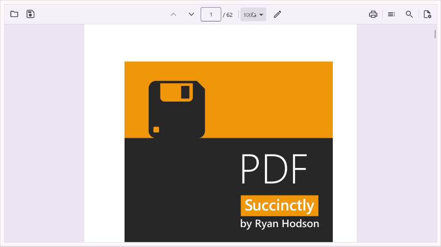
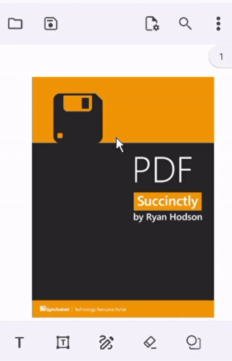

# Magnification in .NET MAUI PDF Viewer (SfPdfViewer)

Give users precise control over how PDF content is displayed — from pinch-to-zoom on touch screens to setting an exact zoom percentage in code. You can also lock the view to predefined zoom modes like *Fit to Page* or *Fit to Width* to optimize readability for different document types.

## Adjusting the Zoom Factor

You can control the zoom level using the [ZoomFactor](https://help.syncfusion.com/cr/maui/Syncfusion.Maui.PdfViewer.SfPdfViewer.html#Syncfusion_Maui_PdfViewer_SfPdfViewer_ZoomFactor) property. Refer to the following code example.



<syncfusion:SfPdfViewer x:Name="PdfViewer" DocumentSource="{Binding PdfDocumentStream}" ZoomFactor ="3" />



PdfViewer.ZoomFactor = 3;



You can also retrieve the current zoom level using the same property.

### Setting Minimum and Maximum Zoom Limits

By default, the zoom range varies by platform:
* **Mobile (Android/iOS):** 1.0 to 4.0
* **Desktop (Windows/macOS):** 0.25 to 4.0

To restrict zoom levels, use the [MinZoomFactor](https://help.syncfusion.com/cr/maui/Syncfusion.Maui.PdfViewer.SfPdfViewer.html#Syncfusion_Maui_PdfViewer_SfPdfViewer_MinZoomFactor) and [MaxZoomFactor](https://help.syncfusion.com/cr/maui/Syncfusion.Maui.PdfViewer.SfPdfViewer.html#Syncfusion_Maui_PdfViewer_SfPdfViewer_MaxZoomFactor) properties.

The following code example explains restricting the zoom factor between 0.5 and 2.



<syncfusion:SfPdfViewer x:Name="PdfViewer" DocumentSource="{Binding PdfDocumentStream}"  MinZoomFactor = “0.5” MaxZoomFactor ="2" />



PdfViewer.MinZoomFactor = 0.5;
PdfViewer.MaxZoomFactor = 2;



N> If the [ZoomFactor](https://help.syncfusion.com/cr/maui/Syncfusion.Maui.PdfViewer.SfPdfViewer.html#Syncfusion_Maui_PdfViewer_SfPdfViewer_ZoomFactor)  is set outside the defined [MinZoomFactor](https://help.syncfusion.com/cr/maui/Syncfusion.Maui.PdfViewer.SfPdfViewer.html#Syncfusion_Maui_PdfViewer_SfPdfViewer_MinZoomFactor) and [MaxZoomFactor](https://help.syncfusion.com/cr/maui/Syncfusion.Maui.PdfViewer.SfPdfViewer.html#Syncfusion_Maui_PdfViewer_SfPdfViewer_MaxZoomFactor) range, it will be ignored.

You can download a sample project demonstrating magnification features [here](https://github.com/SyncfusionExamples/maui-pdf-viewer-examples).

## Zoom Modes 

The PDF Viewer supports the following zoom modes via the [ZoomMode](https://help.syncfusion.com/cr/maui/Syncfusion.Maui.PdfViewer.ZoomMode.html#fields) property:

1. **Default** – Restores the viewer to the last user-set zoom level. This is the initial mode when a document is loaded.
2. **Fit to Page** – Displays the entire page within the viewport.
3. **Fit to Width** – Expands the page to fill the width of the viewer.

The default value is [ZoomMode.Default](https://help.syncfusion.com/cr/maui/Syncfusion.Maui.PdfViewer.ZoomMode.html#Syncfusion_Maui_PdfViewer_ZoomMode_Default).

### Zoom Mode via Built-In Toolbar

#### Desktop Toolbar

The built-in toolbar includes a magnification dropdown showing the current zoom percentage. Users can select predefined zoom levels or choose **Fit to Page** / **Fit to Width**.

#### Mobile Toolbar

On mobile, the magnification tool appears only after the zoom factor changes. Users can then select **Fit to Page** or **Fit to Width**. Once selected, the icon disappears until the zoom factor changes again.

### Programmatically Setting Zoom Mode 

#### Fit to Page

You can change the [SfPdfViewer.ZoomMode](https://help.syncfusion.com/cr/maui/Syncfusion.Maui.PdfViewer.ZoomMode.html#fields) using the [ZoomMode.FitToPage](https://help.syncfusion.com/cr/maui/Syncfusion.Maui.PdfViewer.ZoomMode.html#Syncfusion_Maui_PdfViewer_ZoomMode_FitToPage) enumeration. It will magnify the PDF document so that the entire PDF page is visible in the view port. 
Refer to the following code example: 



<Syncfusion:PdfViewer x:Name="pdfViewer" ZoomMode="FitToPage"/> 



// To apply fit-to-page zoom mode. 
pdfViewer.ZoomMode = ZoomMode.FitToPage; 



#### Fit to Width

You can change the [SfPdfViewer.ZoomMode](https://help.syncfusion.com/cr/maui/Syncfusion.Maui.PdfViewer.ZoomMode.html#fields) using the [ZoomMode.FitToWidth](https://help.syncfusion.com/cr/maui/Syncfusion.Maui.PdfViewer.ZoomMode.html#Syncfusion_Maui_PdfViewer_ZoomMode_FitToWidth) enumeration. It will magnify the PDF document so that the widest page of the PDF document fits the width of the view port. 
Refer to the following code example:



<Syncfusion:PdfViewer x:Name="pdfViewer" ZoomMode="FitToWidth"/> 



// To apply fit-to-page zoom mode. 
pdfViewer.ZoomMode = ZoomMode.FitToWidth; 



N> When the `ZoomFactor` is manually changed, the `ZoomMode` resets to `Default`. You can reapply the desired zoom mode afterward. 

## Maintain Zoom Level in Single Page View Mode

In single-page view mode, the zoom level resets to default each time you navigate to a new page. To maintain a consistent zoom factor throughout the document, enable the PersistZoomOnPageChange property. This applies whether navigation is triggered by the built-in toolbar controls or programmatic APIs.
The default value of `PersistZoomOnPageChange` is `False`.

### Enable PersistZoomOnPageChange

You can enable persistent zoom by setting the `PersistZoomOnPageChange` property to `True`. When enabled, the viewer preserves the numeric `ZoomFactor` when switching pages in `SinglePage` layout and applies that same zoom to the destination page. Refer to the following code example:



<syncfusion:SfPdfViewer x:Name="PdfViewer"
                        PageLayoutMode="SinglePage"
                        PersistZoomOnPageChange="True" />



// Enable persistence and set an initial zoom
PdfViewer.PageLayoutMode = PageLayoutMode.SinglePage;
PdfViewer.PersistZoomOnPageChange = true;



### Disable PersistZoomOnPageChange

Set `PersistZoomOnPageChange` to `False` to keep the viewer's default behavior. When disabled, navigating to a different page resets the viewer to the default zoom level unless you explicitly set a zoom after navigation. Refer to the following example:



<syncfusion:SfPdfViewer x:Name="PdfViewer"
                        PageLayoutMode="SinglePage"
                        PersistZoomOnPageChange="False" />



// Disable persistence
PdfViewer.PersistZoomOnPageChange = false;



## See Also

* [Scrolling](https://help.syncfusion.com/maui/pdf-viewer/scrolling)
* [Page Navigation](https://help.syncfusion.com/maui/pdf-viewer/page-navigation)
* [Gesture Events](https://help.syncfusion.com/maui/pdf-viewer/gesture-events)
