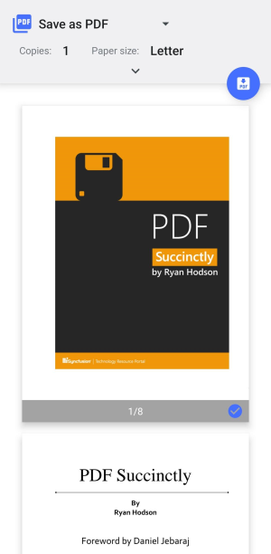

# Print a Document in .NET MAUI PDF Viewer (SfPdfViewer)

The print feature of [SfPdfViewer](https://help.syncfusion.com/cr/maui/Syncfusion.Maui.PdfViewer.SfPdfViewer.html) allows you to effortlessly print PDF documents directly from your application code.

Moreover, when performing a print operation, the default device print dialog opens, providing users with familiar options and settings to customize their printing experience.

To print a PDF programmatically, you can use the [PrintDocument](https://help.syncfusion.com/cr/maui/Syncfusion.Maui.PdfViewer.SfPdfViewer.html#Syncfusion_Maui_PdfViewer_SfPdfViewer_PrintDocument) method provided by [SfPdfViewer](https://help.syncfusion.com/cr/maui/Syncfusion.Maui.PdfViewer.SfPdfViewer.html).Refer to the following code example.



// Prints the PDF document.
PdfViewer.PrintDocument();



Also, [SfPdfViewer](https://help.syncfusion.com/cr/maui/Syncfusion.Maui.PdfViewer.SfPdfViewer.html) provides another way to print through command binding using the [PrintDocumentCommand](https://help.syncfusion.com/cr/maui/Syncfusion.Maui.PdfViewer.SfPdfViewer.html#Syncfusion_Maui_PdfViewer_SfPdfViewer_PrintDocumentCommand). This makes printing easier, especially when used with buttons.



<!-- Prints the PDF document. -->
<Button Text="Print" Command="{Binding Source={x:Reference PdfViewer},Path=PrintDocumentCommand}"/>
 


Below is an example of the print preview dialog on the Android platform. The appearance of this dialog may differ across other platforms.

## How to adjust the print quality on the Windows platform?

[SfPdfViewer](https://help.syncfusion.com/cr/maui/Syncfusion.Maui.PdfViewer.SfPdfViewer.html) allows users to adjust the printing quality on the Windows platform using the  [PrintSettings.PrintQuality](https://help.syncfusion.com/cr/maui/Syncfusion.Maui.PdfViewer.PrintSettings.html#Syncfusion_Maui_PdfViewer_PrintSettings_PrintQuality) API. The [PrintQuality](https://help.syncfusion.com/cr/maui/Syncfusion.Maui.PdfViewer.PrintQuality.html) enumeration supports the below quality levels:
* [Low](https://help.syncfusion.com/cr/maui/Syncfusion.Maui.PdfViewer.PrintQuality.html#Syncfusion_Maui_PdfViewer_PrintQuality_Low) - Optimizes print speed and uses minimal memory during printing.
* [Default](https://help.syncfusion.com/cr/maui/Syncfusion.Maui.PdfViewer.PrintQuality.html#Syncfusion_Maui_PdfViewer_PrintQuality_Default) - Suitable for standard text and basic graphics, while maintaining the quality of previous versions. This is the default value.
* [Medium](https://help.syncfusion.com/cr/maui/Syncfusion.Maui.PdfViewer.PrintQuality.html#Syncfusion_Maui_PdfViewer_PrintQuality_Medium) - Balances clarity and performance during printing.
* [High](https://help.syncfusion.com/cr/maui/Syncfusion.Maui.PdfViewer.PrintQuality.html#Syncfusion_Maui_PdfViewer_PrintQuality_High) - Ensures sharper lines and crisp small annotations in the output.
* [Ultra](https://help.syncfusion.com/cr/maui/Syncfusion.Maui.PdfViewer.PrintQuality.html#Syncfusion_Maui_PdfViewer_PrintQuality_Ultra) - Optimizes the detail on large-format print documents like CAD drawings and architectural plans.



// Sets high print quality
PdfViewer.PrintSettings.PrintQuality = PrintQuality.High;



N> The [PrintQuality](https://help.syncfusion.com/cr/maui/Syncfusion.Maui.PdfViewer.PrintSettings.html#Syncfusion_Maui_PdfViewer_PrintSettings_PrintQuality) API is only applicable to the Windows platform and does not affect printing on Android, iOS, or macOS.

## Limitations

Currently, when printing a document that contains sticky note annotations, the sticky note icon always appears as the default [comment](https://help.syncfusion.com/cr/maui/Syncfusion.Maui.PdfViewer.StickyNoteIcon.html#Syncfusion_Maui_PdfViewer_StickyNoteIcon_Comment) icon appearance in the printed document.
