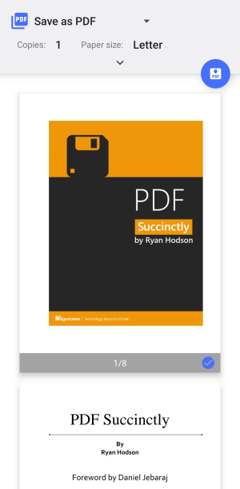

# Print a Document in .NET MAUI PDF Viewer (SfPdfViewer)

Print PDFs directly from your app using the viewer's built-in print integration. This page shows how to trigger printing, provide optional print settings, and handle platform print dialogs so your users see familiar system UI.

N> Note: On some platforms the system print dialog controls options such as paper size and print quality — collect any user-specific print options in your UI and pass them to the print API where supported.

To print a PDF programmatically, use the [PrintDocument](https://help.syncfusion.com/cr/maui/Syncfusion.Maui.PdfViewer.SfPdfViewer.html#Syncfusion_Maui_PdfViewer_SfPdfViewer_PrintDocument) method. For example, call it from a toolbar or a Print button's click handler.



// Call from a Print button's Clicked handler.
private void PrintButton_Clicked(object sender, EventArgs e)
{
    PdfViewer.PrintDocument();
}



Also, [SfPdfViewer](https://help.syncfusion.com/cr/maui/Syncfusion.Maui.PdfViewer.SfPdfViewer.html) provides another way to print through command binding using the [PrintDocumentCommand](https://help.syncfusion.com/cr/maui/Syncfusion.Maui.PdfViewer.SfPdfViewer.html#Syncfusion_Maui_PdfViewer_SfPdfViewer_PrintDocumentCommand). This makes printing easier, especially when used with buttons.



<!-- Prints the PDF document. -->
<Button Text="Print" Command="{Binding Source={x:Reference PdfViewer},Path=PrintDocumentCommand}"/>
 


Below is an example of the print preview dialog on the Android platform. The appearance of this dialog may differ across other platforms.

## How to adjust the print quality on the Windows platform?

[SfPdfViewer](https://help.syncfusion.com/cr/maui/Syncfusion.Maui.PdfViewer.SfPdfViewer.html) allows users to adjust the printing quality on the Windows platform using the  [PrintSettings.PrintQuality](https://help.syncfusion.com/cr/maui/Syncfusion.Maui.PdfViewer.PrintSettings.html#Syncfusion_Maui_PdfViewer_PrintSettings_PrintQuality) API. The [PrintQuality](https://help.syncfusion.com/cr/maui/Syncfusion.Maui.PdfViewer.PrintQuality.html) enumeration supports the below quality levels:
* [Low](https://help.syncfusion.com/cr/maui/Syncfusion.Maui.PdfViewer.PrintQuality.html#Syncfusion_Maui_PdfViewer_PrintQuality_Low) - Optimizes print speed and uses minimal memory during printing.
* [Default](https://help.syncfusion.com/cr/maui/Syncfusion.Maui.PdfViewer.PrintQuality.html#Syncfusion_Maui_PdfViewer_PrintQuality_Default) - Suitable for standard text and basic graphics, while maintaining the quality of previous versions. This is the default value.
* [Medium](https://help.syncfusion.com/cr/maui/Syncfusion.Maui.PdfViewer.PrintQuality.html#Syncfusion_Maui_PdfViewer_PrintQuality_Medium) - Balances clarity and performance during printing.
* [High](https://help.syncfusion.com/cr/maui/Syncfusion.Maui.PdfViewer.PrintQuality.html#Syncfusion_Maui_PdfViewer_PrintQuality_High) - Ensures sharper lines and crisp small annotations in the output.
* [Ultra](https://help.syncfusion.com/cr/maui/Syncfusion.Maui.PdfViewer.PrintQuality.html#Syncfusion_Maui_PdfViewer_PrintQuality_Ultra) - Optimizes the detail on large-format print documents like CAD drawings and architectural plans.



// Sets high print quality
PdfViewer.PrintSettings.PrintQuality = PrintQuality.High;



N> The [PrintQuality](https://help.syncfusion.com/cr/maui/Syncfusion.Maui.PdfViewer.PrintSettings.html#Syncfusion_Maui_PdfViewer_PrintSettings_PrintQuality) API is only applicable to the Windows platform and does not affect printing on Android, iOS, or macOS.

## Limitations

Currently, when printing a document that contains sticky note annotations, the sticky note icon always appears as the default [comment](https://help.syncfusion.com/cr/maui/Syncfusion.Maui.PdfViewer.StickyNoteIcon.html#Syncfusion_Maui_PdfViewer_StickyNoteIcon_Comment) icon appearance in the printed document.

## See Also
- [Save a Document](../save-a-document)
- [Annotations Overview](../annotations-overview)
- [Form Filling Overview](../form-filling-overview)
