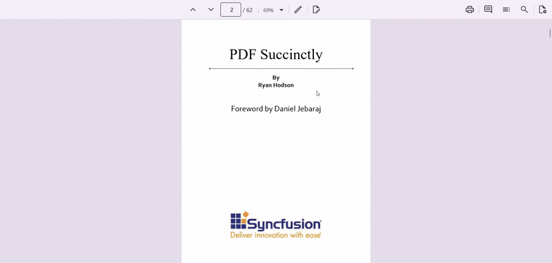
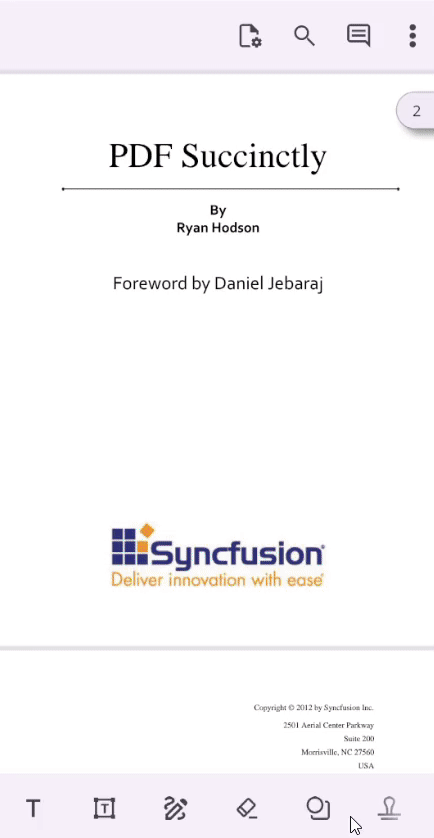

# Redaction in .NET MAUI PDF Viewer (SfPdfViewer)

Redaction support of [SfPdfViewer](https://help.syncfusion.com/cr/maui/Syncfusion.Maui.PdfViewer.SfPdfViewer.html) allows you to conceal sensitive or confidential information in text and images within a PDF document. This ensures that private data, such as personal details or financial information, is securely hidden before sharing or publishing. Once redaction is applied and the document is resaved, the concealed content cannot be recovered.

## Types of Redactions

The PDF Viewer provides multiple methods to apply redaction, allowing you to securely conceal sensitive content based on different requirements. The available redaction types include:

-	**Text-based Redaction** : Allows you to manually select the texts on a page and apply redaction to hide the texts.
-	**Selected Area Redaction** : Allows you to manually select a rectangular area on a page and apply redaction to hide any content within that region.
-	**Page-based Redaction** : Enables you to redact entire pages of a PDF document, ensuring that all content on those pages is permanently removed.

## Mark region to redact 

You need to mark the region for redaction by using one of the available methods such as text-based, selected-area or page-based redaction.

## Mark regions for redaction using toolbar

The built-in toolbar includes a redaction tool that allows you to redact text, specific areas, or entire pages by marking the desired region on the PDF document and clicking the Apply button. The toolbar also provides options to modify redaction properties, such as the color and the text to display in the redacted area.

The following image represents how to perform redactions using the toolbar on the desktop.

The following image represents how to perform redactions using the toolbar on mobile.

## Mark regions for redaction without using the toolbar

You can mark the region for redaction in a PDF document with UI interaction using touch or mouse using the `RedactionMode` property in the [SfPdfViewer](https://help.syncfusion.com/cr/maui/Syncfusion.Maui.PdfViewer.SfPdfViewer.html). The following steps explain how to mark the region on a PDF. 

1.	Set the `RedactionMode` property of the [SfPdfViewer](https://help.syncfusion.com/cr/maui/Syncfusion.Maui.PdfViewer.SfPdfViewer.html) to Text or Rect. It activates the text-based or selected-area Redaction mode on the control.
2.	Place your finger (or mouse) on the text in the PDF document, where you want to start redaction.
3.	Drag the finger (or cursor) across the text to select.
4.	Complete adding the region to the selected text or area by releasing the finger (or cursor).
5.	Once you have done that, set the `RedactionMode` to None. It will disable the redaction mode and save the marked region for redaction.
6.	You can later redact the marked regions using `RedactAsync` method. 

The following code explains how to enable the text-based redaction mode.



// Enable or activate the text-based redaction mode.
void EnableTextBasedRedactionMode()
{
    // Set the redaction mode to text using the [SfPdfViewer](https://help.syncfusion.com/cr/maui/Syncfusion.Maui.PdfViewer.SfPdfViewer.html) instance.
    PdfViewer.RedactionMode = RedactionMode.Text;
}

// Enable or activate the area redaction mode.
void EnableSelectedAreaRedactionMode()
{
    // Set the redaction mode to rect using the [SfPdfViewer](https://help.syncfusion.com/cr/maui/Syncfusion.Maui.PdfViewer.SfPdfViewer.html) instance.
    PdfViewer.RedactionMode = RedactionMode.Rect;
}



Similarly, refer to the following code to disable the redaction mode.



//Disable redaction mode after marking the region.
void DisableRedactionMode()
{
    // Set the redaction mode to none using the [SfPdfViewer](https://help.syncfusion.com/cr/maui/Syncfusion.Maui.PdfViewer.SfPdfViewer.html) instance.
    PdfViewer.RedactionMode = RedactionMode.None;
}



## How to perform redaction programmatically

### Add redaction mark on the PDF

You can mark regions for text or specific areas programmatically using the `AddRedactionMark` method of [SfPdfViewer](https://help.syncfusion.com/cr/maui/Syncfusion.Maui.PdfViewer.SfPdfViewer.html), and redact entire pages using the `AddPageRedactionMarks` method. The following example demonstrates how to mark regions for redaction, such as a specific area and page in the PDF document.



void AddRedactionMarkOnSpecificRegionAndPages()
 {
    // Define the bounds of the area or text to redact (x, y, width, height) on page number 2.
    RedactionMark redactionMark = new RedactionMark(new RectF(30, 40, 100, 100), 2);

    // Set the appearance for the redaction mark.
    redactionMark.MarkerBorderColor = Colors.Black; // Sets the marker border color
    redactionMark.MarkerFillColor = Colors.Yellow; // Sets the marker fill color
    
    // Add the redaction mark to the specified region.
    PdfViewer.AddRedactionMark(redactionMark);

    // Add redaction marks to specific pages (pages 3, 5, and 1).
    PdfViewer.AddPageRedactionMarks(new List<int>([3, 5, 1]));
 }



### Remove the selected redaction mark on the PDF

You can remove a redaction mark for text, a specific area, or a page programmatically using the `SelectedRedactionMark` property and the `RemoveRedactionMark` method of SfPdfViewer. To remove a redaction mark, select the specific mark you want to delete and pass it to the `RemoveRedactionMark` method. The following example demonstrates how to remove a selected redaction mark from the PDF document.



void RemoveSelectedRedactionMark()
{
    // Check if any redaction mark is currently selected.
    if (PdfViewer.SelectedRedactionMark != null)
    {
        // Remove the selected redaction mark from the PDF.
        PdfViewer.RemoveRedactionMark(PdfViewer.SelectedRedactionMark);
    }
} 



### Remove all the redaction marks in the PDF

You can remove all redaction marks from a document programmatically by calling the `RemoveAllRedactionMarks` method. The following example demonstrates how to remove all redaction marks from a PDF document.



void RemoveAllRedactionMarksDrawn()
{
    // Removes all the redaction marks from a PDF document using `RemoveAllRedactionMarks` method of [SfPdfViewer](https://help.syncfusion.com/cr/maui/Syncfusion.Maui.PdfViewer.SfPdfViewer.html).
    PdfViewer.RemoveAllRedactionMarks();
}



### Redact the marked region

You can redact the marked regions by using the `RedactAsync` method of [SfPdfViewer](https://help.syncfusion.com/cr/maui/Syncfusion.Maui.PdfViewer.SfPdfViewer.html). This method redacts all marked regions and saves the document, making the changes irreversible. The following example demonstrates how to redact a marked region or page in a PDF document.



private async void RedactMarkedRegion()
{
    // Apply redaction to all marked regions in the PDF document.
    await PdfViewer.RedactAsync();
}



## Customize the default redaction appearance

In redaction mode, the redaction is applied with a default appearance and behavior. You can modify these settings before marking regions on the pages. To define the appearance and behavior, customize the default settings using the `RedactionSettings` property of [SfPdfViewer](https://help.syncfusion.com/cr/maui/Syncfusion.Maui.PdfViewer.SfPdfViewer.html).
The following example demonstrates how to obtain the default redaction settings and modify their appearance properties. Similarly, you can modify other available properties.



void CustomizeDefaultRedactionSettings()
{
    // Access the default redaction settings from the SfPdfViewer instance and modify the default appearance properties.
    PdfViewer.RedactionSettings.MarkerBorderColor = Colors.Blue; // Border color for the marked region.
    PdfViewer.RedactionSettings.FillColor = Colors.Red; // Fill color after redaction is applied.
    PdfViewer.RedactionSettings.FontColor = Colors.Black; // Font color for overlay text.
    PdfViewer.RedactionSettings.OverlayText = "text"; // Text to display on the redacted area.
    PdfViewer.RedactionSettings.IsRepeat = true; // Repeat overlay text across the redacted area.
}

