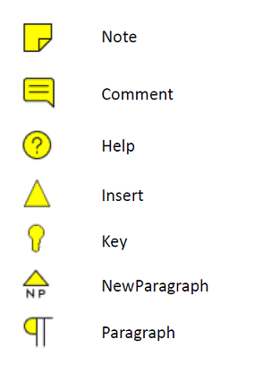
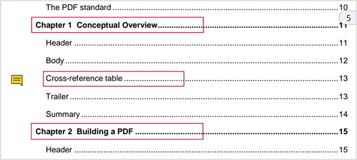
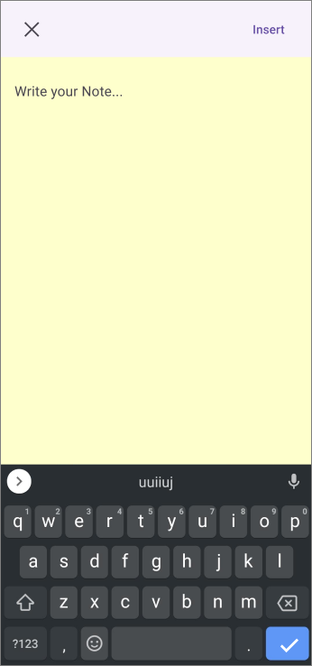

# Sticky Note Annotation in .NET MAUI PDF Viewer (SfPdfViewer)

The sticky note annotation feature of [SfPdfViewer](https://help.syncfusion.com/cr/maui/Syncfusion.Maui.PdfViewer.SfPdfViewer.html) allows you to add, remove, and modify sticky notes in a PDF document. This feature will help add comments or notes to specific parts of a document to clarify complex concepts, terms, or ideas. This section will cover the various functions available in [SfPdfViewer](https://help.syncfusion.com/cr/maui/Syncfusion.Maui.PdfViewer.SfPdfViewer.html) for working with sticky note annotations.

## Types of sticky notes

The following sticky note icon types are currently available in [SfPdfViewer](https://help.syncfusion.com/cr/maui/Syncfusion.Maui.PdfViewer.SfPdfViewer.html). The icon types can be selected from the [StickyNoteIcon](https://help.syncfusion.com/cr/maui/Syncfusion.Maui.PdfViewer.StickyNoteIcon.html) enumeration.

## Add sticky notes

This section will go through how to add sticky note annotations to a PDF page using toolbar as well as programmatically. 

### Add the sticky note annotations using the toolbar 

On the built-in toolbar, a sticky note annotation tool is available. Using that, you can add the sticky note annotation to the tapped position. Additionally, the toolbar shows the option to modify the properties of existing or new sticky note annotations. 

The following image represents how to add the sticky note annotations using the toolbar on the desktop. 

The following image represents how to add the sticky note annotation using the toolbar on mobile.

### Add the sticky note annotation without using the toolbar

You can add sticky note annotations to a PDF document by tapping with a touch (or mouse down) on a PDF page. The following steps explain how to add sticky note annotations to a PDF: 
1. Set the [AnnotationMode](https://help.syncfusion.com/cr/maui/Syncfusion.Maui.PdfViewer.SfPdfViewer.html#Syncfusion_Maui_PdfViewer_SfPdfViewer_AnnotationMode) property of the SfPdfViewer to [StickyNote](https://help.syncfusion.com/cr/maui/Syncfusion.Maui.PdfViewer.AnnotationMode.html#Syncfusion_Maui_PdfViewer_AnnotationMode_StickyNote). This activates the sticky note mode on the control.
2. Tap (or mouse down) on a PDF page, where you want to add the sticky note annotation. This will add a sticky note with a default style and a popup will be displayed to write and submit the text.
3. Once the sticky note is added, [AnnotationMode](https://help.syncfusion.com/cr/maui/Syncfusion.Maui.PdfViewer.SfPdfViewer.html#Syncfusion_Maui_PdfViewer_SfPdfViewer_AnnotationMode) is automatically changed to [None](https://help.syncfusion.com/cr/maui/Syncfusion.Maui.PdfViewer.AnnotationMode.html#Syncfusion_Maui_PdfViewer_AnnotationMode_None).
4. You can later select and edit the annotations if required.
5. If you need to disable the [AnnotationMode](https://help.syncfusion.com/cr/maui/Syncfusion.Maui.PdfViewer.SfPdfViewer.html#Syncfusion_Maui_PdfViewer_SfPdfViewer_AnnotationMode) of [StickyNote](https://help.syncfusion.com/cr/maui/Syncfusion.Maui.PdfViewer.AnnotationMode.html#Syncfusion_Maui_PdfViewer_AnnotationMode_StickyNote), you need to change the [AnnotationMode](https://help.syncfusion.com/cr/maui/Syncfusion.Maui.PdfViewer.SfPdfViewer.html#Syncfusion_Maui_PdfViewer_SfPdfViewer_AnnotationMode) to [None](https://help.syncfusion.com/cr/maui/Syncfusion.Maui.PdfViewer.AnnotationMode.html#Syncfusion_Maui_PdfViewer_AnnotationMode_None). 

The following code explains how to enable the sticky note mode



// Enable or activate the sticky note mode. 
void EnableStickyNoteMode() 
{ 
    // Set the [AnnotationMode](https://help.syncfusion.com/cr/maui/Syncfusion.Maui.PdfViewer.SfPdfViewer.html#Syncfusion_Maui_PdfViewer_SfPdfViewer_AnnotationMode) property of [SfPdfViewer](https://help.syncfusion.com/cr/maui/Syncfusion.Maui.PdfViewer.SfPdfViewer.html) instance to [StickyNote](https://help.syncfusion.com/cr/maui/Syncfusion.Maui.PdfViewer.AnnotationMode.html#Syncfusion_Maui_PdfViewer_AnnotationMode_StickyNote). 
    PdfViewer.AnnotationMode = AnnotationMode.StickyNote; 
} 



Similarly, refer to the following code explains how to disable the sticky note mode:  



// Disable or deactivate the sticky note mode. 
void DisableStickyNoteMode() 
{ 
    // Set the [AnnotationMode](https://help.syncfusion.com/cr/maui/Syncfusion.Maui.PdfViewer.SfPdfViewer.html#Syncfusion_Maui_PdfViewer_SfPdfViewer_AnnotationMode) property of [SfPdfViewer](https://help.syncfusion.com/cr/maui/Syncfusion.Maui.PdfViewer.SfPdfViewer.html) instance to [None](https://help.syncfusion.com/cr/maui/Syncfusion.Maui.PdfViewer.AnnotationMode.html#Syncfusion_Maui_PdfViewer_AnnotationMode_None). 
    PdfViewer.AnnotationMode = AnnotationMode.None; 
} 



### Add sticky note annotation programmatically 

You can create and add a sticky note annotation to a PDF document programmatically using the [AddAnnotation](https://help.syncfusion.com/cr/maui/Syncfusion.Maui.PdfViewer.SfPdfViewer.html#Syncfusion_Maui_PdfViewer_SfPdfViewer_AddAnnotation_Syncfusion_Maui_PdfViewer_Annotation_) method of the [SfPdfViewer](https://help.syncfusion.com/cr/maui/Syncfusion.Maui.PdfViewer.SfPdfViewer.html). The following example explains how to create a sticky note with a comment icon and add it to the first page of a PDF document.



StickyNoteAnnotation CreateCommentStickyNote()
{
    int pageNumber = 1;
        
    // Set the position of the sticky note on the PDF page. 
    PointF position = new PointF(100, 100);

    // Set the icon as Comment.
    StickyNoteIcon icon = StickyNoteIcon.Comment;

    // Set the text for the sticky note.
    string text = "Links are not working and need to be updated";
        
    return new StickyNoteAnnotation(icon, text, pageNumber, position);
}

void AddStickyNote()
{
    StickyNoteAnnotation stickyNote = CreateCommentStickyNote();
    PdfViewer.AddAnnotation(stickyNote);
}




## Sticky note annotation settings 

In the sticky note annotation mode, the annotation will be added with a default appearance. You can modify the annotation after it has been added to the pages. However, if you need to define the appearance before adding sticky note annotations to the document, you can change its default settings using the [SfPdfViewer.AnnotationSettings.StickyNote](https://help.syncfusion.com/cr/maui/Syncfusion.Maui.PdfViewer.SfPdfViewer.html#Syncfusion_Maui_PdfViewer_SfPdfViewer_AnnotationSettings) For that, you need to obtain the default sticky note annotation settings.

The following example explains how to obtain the default sticky note annotation settings and modify some of their properties. Similarly, you can modify all the other properties.



void CustomizeDefaultStickyNoteSettings() 
{ 
    // Obtain the default sticky note annotation settings from the [SfPdfViewer](https://help.syncfusion.com/cr/maui/Syncfusion.Maui.PdfViewer.SfPdfViewer.html) instance. 
    StickyNoteAnnotationSettings stickyNoteSettings = PdfViewer.AnnotationSettings.StickyNote; 

    // Modify the default properties. 
    stickyNoteSettings.Icon = StickyNoteIcon.Comment; // Set the default icon to Comment. 
    stickyNoteSettings.Color = Colors.Yellow; //Stroke color 
    stickyNoteSettings.Opacity = 0.75f; // 75% Opacity 
} 



## Edit the selected sticky note annotation

### Edit the text using UI interaction

When you double-tap the selected sticky note, the text editor opens. Edit the text and click &#34;Save&#34; to modify the text.

### Edit sticky note properties programmatically

Edit the properties of the selected sticky note annotation programmatically by accessing the selected annotation instance. The selected annotation instance may be obtained from the [AnnotationSelected](https://help.syncfusion.com/cr/maui/Syncfusion.Maui.PdfViewer.SfPdfViewer.html#Syncfusion_Maui_PdfViewer_SfPdfViewer_AnnotationSelected) event. The following example shows how to edit the text and icon of the selected sticky note annotation. Similarly, you can modify the other properties.



/// 
 
/// Edit the selected sticky note annotation. 
/// 
 
/// <param name="selectedAnnotation">The selected annotation instance that may be obtained from the annotation selected event</param>    

void EditSelectedStickyNoteAnnotation(Annotation selectedAnnotation)
{
    if (selectedAnnotation is StickyNoteAnnotation selectedStickyNote)
    {
        selectedStickyNote.Icon = StickyNoteIcon.Note;
        selectedStickyNote.Text = "Changed the comment to note.";
    }
}



## Sticky note modal view

The sticky note modal view appears when text needs to be input by the user for creating and editing sticky note annotations on Android and iOS platforms. The [SfPdfViewer](https://help.syncfusion.com/cr/maui/Syncfusion.Maui.PdfViewer.SfPdfViewer.html) notifies when the modal view is appearing and disappearing through events. The events help you hide and show elements that are part of the app UI that are not necessary as long as the modal view is visible. 

The `SfPdfViewer.StickyNoteModalViewAppearing` event is triggered whenever the modal view opens for either creating or editing a sticky note annotation.




pdfviewer.StickyNoteModalViewAppearing += PdfViewer_StickyNoteModalViewAppearing;

private void PdfViewer_StickyNoteModalViewAppearing(object? Sender, AnnotationModalViewAppearingEventArgs e)
{
    // Implement the logic to hide unwanted UI elements such as toolbar items added to the app UI. 
}




The `SfPdfViewer.StickyNoteModalViewDisappearing` event is triggered when the modal view is closing.




pdfviewer.StickyNoteModalViewDisappearing += PdfViewer_StickyNoteModalViewDisappearing;

Private void PdfViewer_StickyNoteModalViewDisappearing(object? Sender, EventArgs e)
{
    // Implement the logic to show the UI elements that were hidden from the StickyNoteModalViewAppearing event handler.
}

 


### Suppressing the sticky note modal view and implementing your own UI

The [SfPdfViewer](https://help.syncfusion.com/cr/maui/Syncfusion.Maui.PdfViewer.SfPdfViewer.html) allows you to suppress the sticky note modal view and use your own UI in its place. This can be achieved by setting the `AnnotationModalViewAppearingEventArgs.Cancel` property to `true` in the `StickyNoteModalViewAppearing` event handler. 

The below code snippet illustrates suppressing the sticky note modal view and using a UI implemented in the app in its place. The sticky note annotation instance that is created or edited can be obtained from the event args. Once the user enters the text in the custom dialog and confirms, the text can be assigned to this sticky note annotation instance. 




Annotation editedAnnotation;
pdfviewer.StickyNoteModalViewAppearing += PdfViewer_StickyNoteModalViewAppearing;

private void PdfViewer_StickyNoteModalViewAppearing(object? Sender, AnnotationModalViewAppearingEventArgs e)
{
    e.Cancel = true;
    editedAnnotation = e.Annotation;
    // Implement your own UI for the sticky note editor and show it.
    ShowCustomDialog();
}

Private void customDialogOkButton_Clicked(object sender, EventArgs e)
{
   //Get the typed text from the custom dialog 
   string newText = customDialog.Text; 
   if(editedAnnotation is StickyNoteAnnotation stickyNote)
   {
      stickyNote.Text = newText;
   }
}

 


N> For WinUI and MacCatalyst platforms, there is no separate modal view to receive text input from the users. As a result, the `StickyNoteModalViewAppearing` and `StickyNoteModalViewDisappearing` events are not applicable to these platforms. 