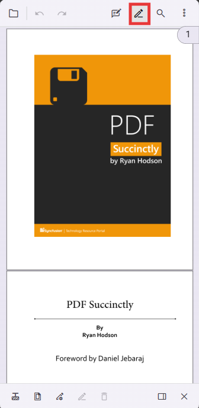
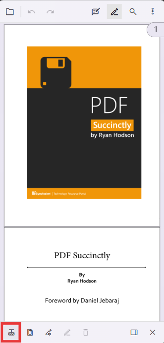
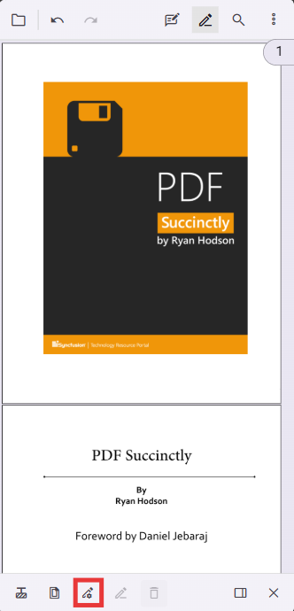
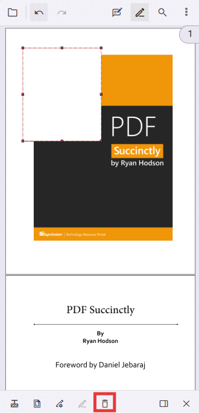

# Redaction in mobile view in React PdfViewer component

The Redaction tool lets users permanently mark and remove sensitive content from PDF documents in mobile view. It is optimized for touch interactions and provides a streamlined redaction workflow for phones and tablets.

N> In mobile view, the redaction toolbar appears at the bottom of the viewer for easy thumb access. Mobile layout activates automatically on small screens.

## Adding Redaction in Mobile View

To enable redaction functionality in your React application, configure the PDF Viewer with the following setup:




import * as ReactDOM from 'react-dom/client';
import * as React from 'react';
import './index.css';
import { PdfViewerComponent, Toolbar, Magnification, Navigation, LinkAnnotation, BookmarkView, ThumbnailView, Print, TextSelection, Annotation, TextSearch, FormFields, FormDesigner, Inject } from '@syncfusion/ej2-react-pdfviewer';
export function App() {
  // includes RedactionEditTool
  const toolbarSettings = {
    toolbarItems: [
      'OpenOption',
      'UndoRedoTool',
      'PageNavigationTool',
      'MagnificationTool',
      'PanTool',
      'SelectionTool',
      'CommentTool',
      'SubmitForm',
      'AnnotationEditTool',
      'RedactionEditTool', // Redaction entry in the primary toolbar
      'FormDesignerEditTool',
      'SearchOption',
      'PrintOption',
      'DownloadOption'
    ]
  };
  return (

    

      <PdfViewerComponent 
        id="container" 
        documentPath="https://cdn.syncfusion.com/content/pdf/pdf-succinctly.pdf"
        resourceUrl= "https://cdn.syncfusion.com/ej2/31.2.2/dist/ej2-pdfviewer-lib"
        toolbarSettings={toolbarSettings}
        
        style={{ 'height': '680px' }} 
      >
        <Inject services={[Toolbar, Magnification, Navigation, Annotation, LinkAnnotation, BookmarkView, ThumbnailView,
          Print, TextSelection, TextSearch, FormFields, FormDesigner]} />
      </PdfViewerComponent>
    

  
);
  
}
const root = ReactDOM.createRoot(document.getElementById('sample'));
root.render(<App />);




## Understanding mobile redaction toolbar tools

When entering redaction mode in mobile view, a specialized redaction toolbar appears with tools optimized for touch. Each tool supports a specific step in the redaction workflow.

### Redaction annotation tool

The Redaction Annotation tool creates rectangular overlays that mark content for removal.

Function: create visual redaction annotations that mark content for permanent removal.

Usage: touch and drag to draw rectangular redaction overlays.

Process:

- Selected content shows a customizable overlay (default black).
- Annotations remain editable until explicitly applied and can be repositioned or deleted.

### Page redaction tool

The Page Redaction tool supports batch redaction of entire pages based on patterns.

Function: redact complete pages or page ranges with one action.

Options:

- **Odd pages**: redact pages 1, 3, 5, etc.
- **Even pages**: redact pages 2, 4, 6, etc.
- **Specific pages**: specify single pages, ranges (for example, 1-5), or comma-separated lists (for example, 1,3,5-7).
- **Current page**: redact the currently displayed page.

Usage: choose a pattern, review affected pages in the viewer, and confirm the redaction scope.

### Redaction properties tool

The Redaction Properties tool customizes redaction appearance before applying changes.

Customizable properties include:

- **Fill color**: redaction overlay color (default black).
- **Outline color**: optional outline for redaction boxes.
- **Overlay text**: custom text shown on redacted areas (for example, "REDACTED").
- **Text color and font**: control visibility and style of overlay text.
- **Text alignment and size**: position and scale overlay text within the redaction area.

## Enabling redaction mode in mobile view

1. Tap the Redaction button in the mobile toolbar to activate redaction mode; the redaction toolbar appears at the bottom of the viewer.

2. From the redaction toolbar, select a redaction tool:

- **Redaction Annotation**: selective content redaction.
- **Page Redaction**: page-wide or pattern-based redaction.
- **Redaction Properties**: configure appearance options.

3. Configure redaction parameters using the selected tool interface.

## Applying different redaction types in mobile view

### Selective content redaction

1. Select the Redaction Annotation tool.
2. Tap and drag to select content or draw rectangular areas.
3. Preview overlays for accuracy.
4. Tap **Apply Redactions** to apply selected annotations.

### Page-wide redaction

1. Select the Page Redaction tool.
2. Choose a pattern (odd, even, specific range).
3. Review affected pages in the viewer.
4. Confirm and apply redaction for chosen pages.

### Custom appearance redaction

1. Select the Redaction Properties tool.
2. Adjust colors, overlay text, and formatting.
3. Preview changes on existing annotations.
4. Apply to use the customized appearance for final redaction.

## Applying redactions in mobile view

Note: Applying redactions is permanent. After applying, underlying content and extracted text are removed and cannot be recovered. Back up the original document before applying redactions.

After configuring redactions using any combination of tools:

1. Review all redaction marks and configurations.

2. Tap the **Apply Redactions** button in the redaction toolbar.

3. Confirm the action when prompted — this operation is irreversible.

The selected content is permanently removed and replaced according to redaction properties (solid overlays or custom overlay text).

## Removing redaction annotations

To remove existing redaction annotations before they are applied:

1. Tap the Redaction Edit button in the mobile toolbar to enter annotation editing mode.
2. Tap an existing redaction annotation to select it.
3. Choose **Delete** from the context menu or use the delete option in the annotation properties panel.

N> Once redactions are applied they become part of the PDF content and cannot be removed or modified.

## See Also

* [Redaction Overview](./overview)
* [UI Interaction](./ui-interaction)
* [Programmatic Support in Redaction](./programmatic-support)
* [Toolbar](./toolbar)
* [Search Text and Redact](./search-redact)
