# Redaction in mobile view in React PDF Viewer

## Overview

This tutorial teaches you how to enable and use the Redaction tools in the Syncfusion React PDF Viewer optimized for mobile (phone/tablet) screens. You will add a redaction button to the viewer toolbar, open the viewer on a small-screen layout, create selective and page-wide redactions, customize appearance, and apply redactions permanently.

**Outcome**: a working React sample where users can mark content for redaction using touch, configure appearance, and apply redactions.

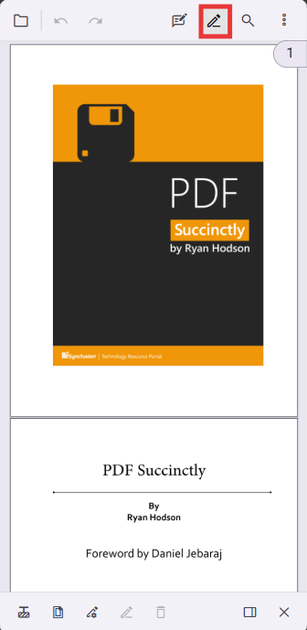

N> In mobile view the redaction toolbar appears at the bottom of the viewer for easy thumb access. Mobile layout activates automatically on small screens.

## Prerequisites

- A React project with PDF Viewer added to project. See [getting started guide](../getting-started)

## Steps

1. Add the PdfViewer to your React app and include the redaction toolbar item.

    - Create or update `src/App.tsx` or (`src/App.jsx`) with the example in this [guide](./toolbar#enable-redaction-toolbar). The example includes a toolbar entry for [`RedactionEditTool`](https://ej2.syncfusion.com/react/documentation/api/pdfviewer/toolbaritem) which enables redaction controls in the viewer.

2. Start the app and open it on a narrow viewport (phone width) to trigger mobile layout.

3. Use the mobile redaction toolbar (bottom of the screen) to:
   - Draw redaction boxes with the Redaction Annotation tool (touch & drag)
   - Use Page Redaction to redact odd/even/specified pages
   - Open Redaction Properties to change overlay color, overlay text, and font

4. Review annotations, then tap Apply Redactions to permanently remove content.

## Understanding mobile redaction toolbar tools

When entering redaction mode in mobile view, a specialized redaction toolbar appears with tools optimized for touch. Each tool supports a specific step in the redaction workflow.

### Redaction annotation tool

The Redaction Annotation tool creates rectangular overlays that mark content for removal. Touch and drag to draw boxes; overlays remain editable until applied.

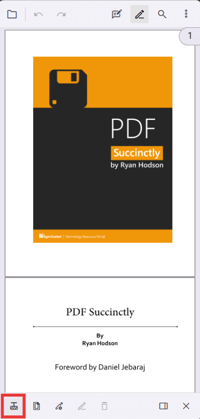

### Page redaction tool

Use Page Redaction to redact whole pages or page ranges (odd, even, specific ranges). This helps remove patterns of sensitive pages quickly.

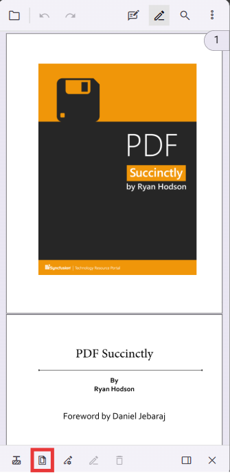

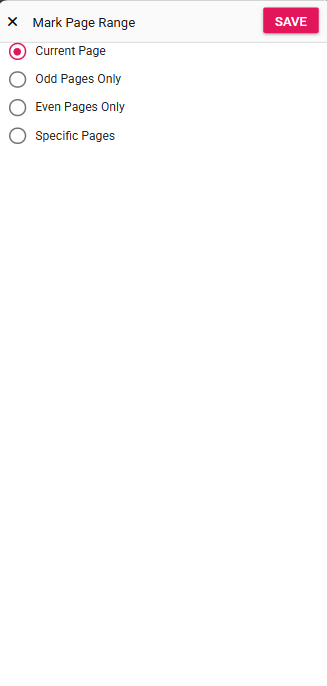

### Redaction properties tool

Open Redaction Properties to change overlay fill color, outline color, overlay text, text color, font and alignment before applying.

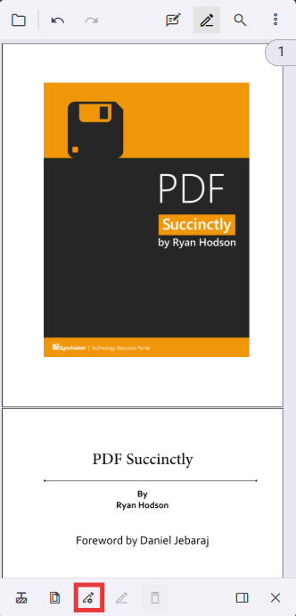

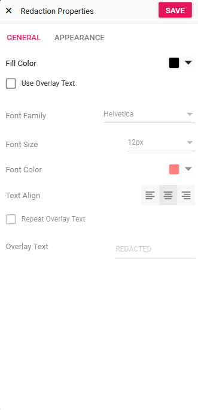

## Applying redactions in mobile view

Applying redactions is permanent. Back up the original document before applying.

1. Review all redaction marks and configurations.

    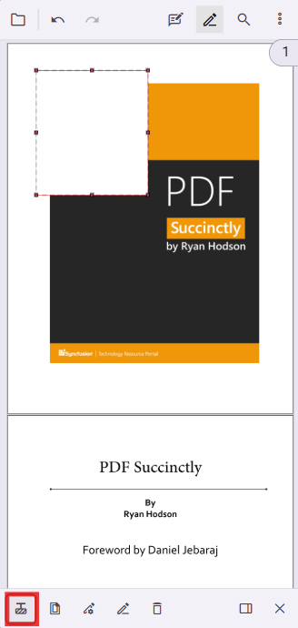

2. Tap the **Apply Redactions** button in the redaction toolbar.

    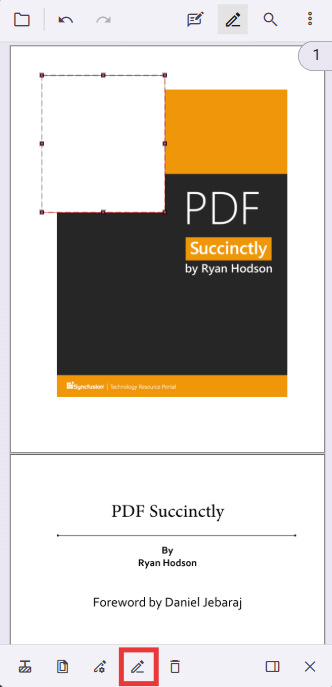

3. Confirm the action when prompted — this operation is irreversible.

    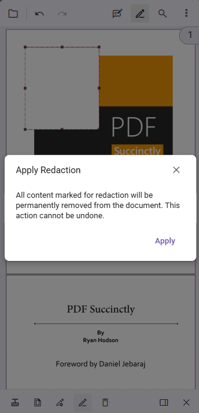

4. After applying, the selected content is permanently removed and replaced according to redaction properties.

    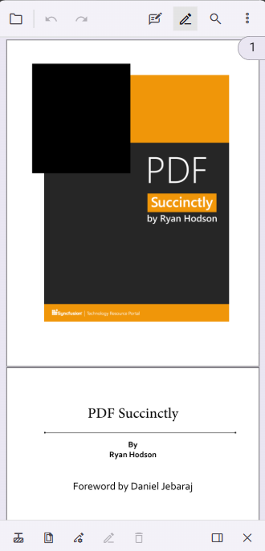

### Removing redaction annotations

To remove a redaction annotation prior to applying it: enter Redaction Edit mode, tap the annotation to select it and choose Delete.

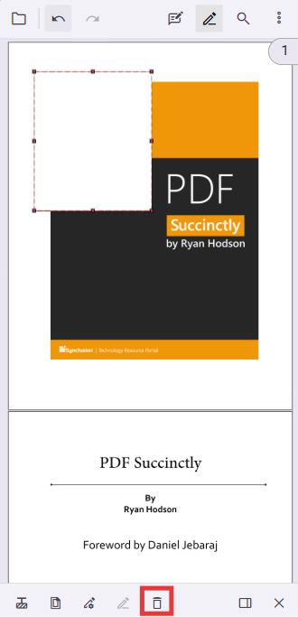

## Mobile redaction workflow

1. Tap the Redaction button in the main toolbar to open the mobile redaction toolbar at the bottom.
2. Choose Redaction Annotation to draw boxes by touch-and-drag.
3. Use Redaction Properties to set fill color and overlay text.
4. Tap Apply Redactions to make changes permanent (this is irreversible).

## Troubleshooting

- If toolbar or redaction controls don't appear: ensure your [`toolbarSettings`](https://ej2.syncfusion.com/react/documentation/api/pdfviewer#toolbarsettings) includes [`RedactionEditTool`](https://ej2.syncfusion.com/react/documentation/api/pdfviewer/toolbaritem) and that the `Inject` list contains [`Annotation`](https://ej2.syncfusion.com/react/documentation/api/pdfviewer/annotation).
- If the viewer is blank: confirm [`resourceUrl`](https://ej2.syncfusion.com/react/documentation/api/pdfviewer#resourceurl) points to the correct Syncfusion PDF Viewer resource package version.
- For production builds, ensure your app serves the WASM and resource files from [`resourceUrl`](https://ej2.syncfusion.com/react/documentation/api/pdfviewer#resourceurl) or a hosted CDN.

## Related topics

- [Redaction Overview](./overview)
- [UI Interaction](./ui-interaction)
- [Programmatic Support in Redaction](./programmatic-support)
- [Toolbar](./toolbar)
- [Search Text and Redact](./search-redact)
