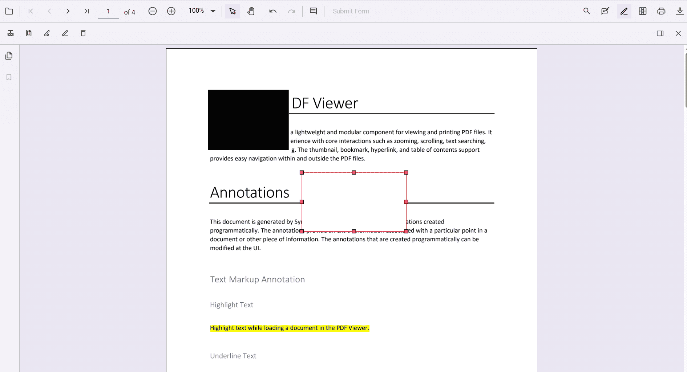
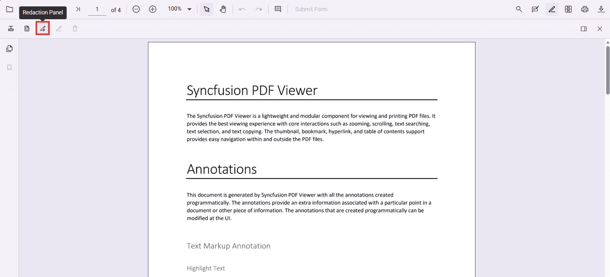
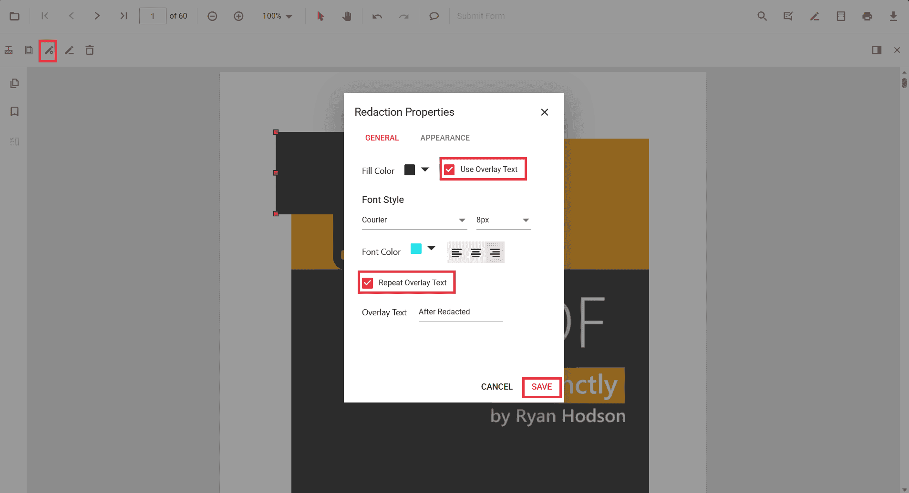
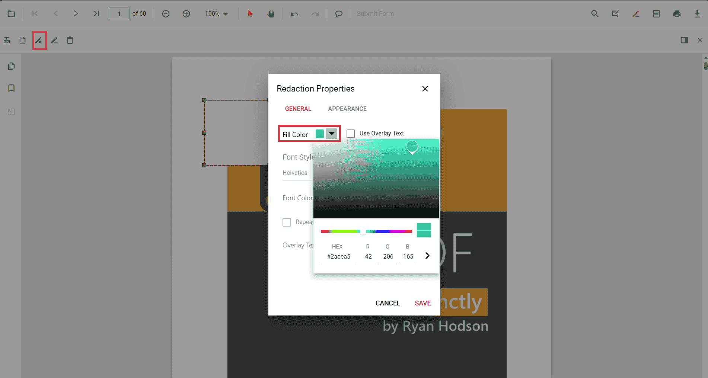
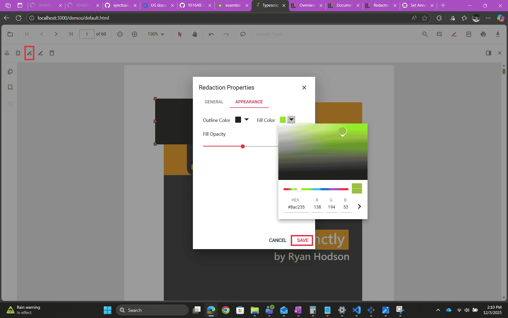
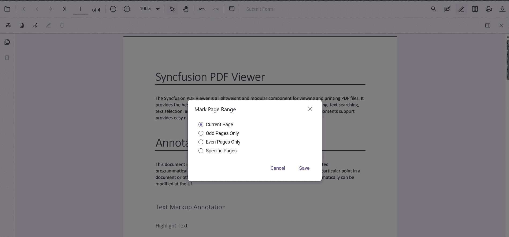
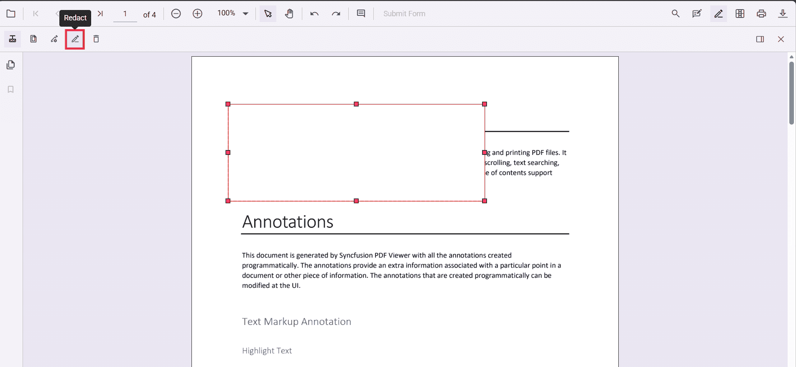
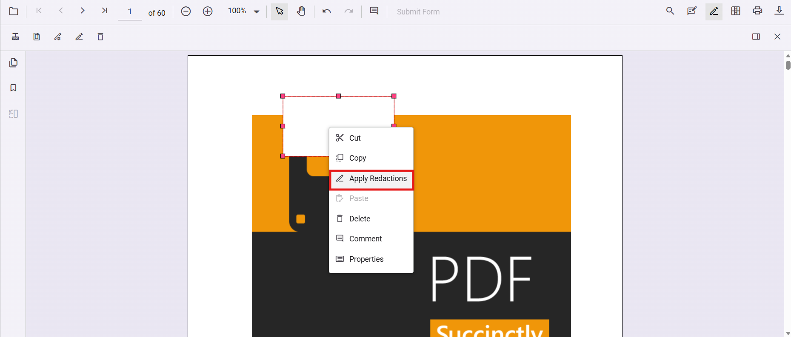

# Redaction UI interactions in React PDF Viewer

## Overview

This guide explains how to use the Redaction UI in the Syncfusion React PDF Viewer: drawing redaction marks, customizing their appearance, deleting marks, redacting whole pages, and applying redaction. The page provides step-by-step UI instructions to redact a PDF.

## Prerequisites

- A React project with PDF Viewer added to it. See [getting started guide](../getting-started)
- The EJ2 React PDF Viewer version you use must include the Redaction feature.

## Steps

1. Enable the Redaction tool

	- Open the viewer with the [`toolbarSettings.toolbarItems`](https://ej2.syncfusion.com/react/documentation/api/pdfviewer/toolbarsettings#toolbaritems) configured to include the Redaction tool.
	- The Redaction tool is hidden by default; adding it to [`toolbarItems`](https://ej2.syncfusion.com/react/documentation/api/pdfviewer/toolbarsettings#toolbaritems) makes it visible.

2. Add a redaction annotation from the toolbar

	- Select the Redaction tool in the toolbar, then draw a rectangle over the text or graphics to hide.

	    

3. Add a redaction annotation from the context menu

	- Select text or region, right‑click (or long‑press on mobile), and choose **Redact Annotation**.

	    

4. Move or resize a redaction annotation

	- Drag to move the box

	    

    - Drag the handles to resize.

	    

5. Update redaction properties using the property panel

	- Select an annotation and open the Property Panel from the toolbar icon or choose **Properties** from the context menu.

	    

	    

	- General tab: set Overlay Text, Repeat Overlay Text, font, and final Fill Color (these values are used when you apply redaction).

	    

	    

	- Appearance tab: style the temporary annotation (fill, outline, opacity).

	    

6. Delete a redaction annotation

	- Right‑click the annotation and select **Delete**, press the **Delete** key, or click the toolbar Delete button.

	    

	    

7. Redact pages using the UI

	- Use **Redact Pages** from the toolbar to mark whole pages (Current, Odd, Even, or Specific page ranges). Click **Save** to apply page marks.

	    

8. Apply redaction

	- Click **Apply Redaction** in the toolbar or select **Apply redactions** in context menu to permanently remove marked content.

	    

        

    - A confirmation dialog appears before changes are flattened.

	    

	- After applying: the selected content is permanently removed, overlay text (if enabled) is burned in, and properties become read‑only.

## Troubleshooting

- Redaction tool not visible: ensure you added `RedactionEditTool` to [`toolbarSettings.toolbarItems`](https://ej2.syncfusion.com/react/documentation/api/pdfviewer/toolbarsettings#toolbaritems) and injected required services.
- Apply Redaction disabled: there are no redaction annotations present; add at least one mark.
- Final redacted content not editable: this is expected — applied redaction flattens content and becomes read‑only. Keep a backup of the original file before applying.

## Related topics

- [Redaction overview](./overview)
- [Programmatic Support in Redaction](./programmatic-support)
- [Redaction in Mobile View](./mobile-view)
- [Redaction Toolbar](./toolbar)
- [Search Text and Redact](./search-redact)
