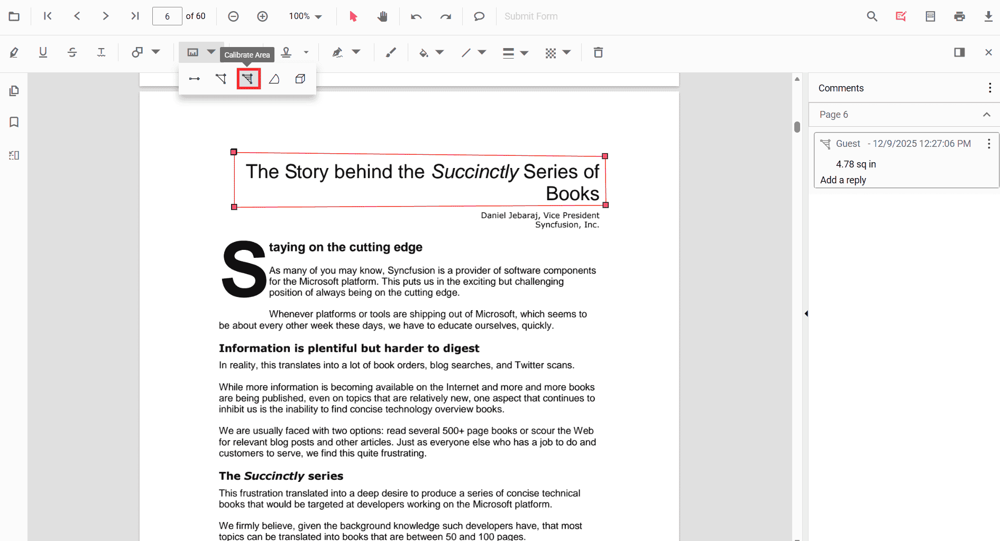

# Add Area Measurement Annotations in React PDF Viewer
Area is a measurement annotation used to calculate the surface of a closed region on a PDF page—ideal for engineering, construction, or design reviews.

## Enable Area Measurement

To enable Area annotations, inject the following modules into the React PDF Viewer:

- [**Annotation**](https://ej2.syncfusion.com/react/documentation/api/pdfviewer/index-default#annotation)
- [**Toolbar**](https://ej2.syncfusion.com/react/documentation/api/pdfviewer/index-default#toolbar)




import * as React from 'react';
import * as ReactDOM from 'react-dom/client';
import { PdfViewerComponent, Inject, Toolbar, Annotation } from '@syncfusion/ej2-react-pdfviewer';

function App() {
  return (
    <PdfViewerComponent
      id="container"
      documentPath="https://cdn.syncfusion.com/content/pdf/pdf-succinctly.pdf"
      resourceUrl="https://cdn.syncfusion.com/ej2/31.2.2/dist/ej2-pdfviewer-lib"
      style={{ height: '650px' }}
    >
      <Inject services={[Toolbar, Annotation]} />
    </PdfViewerComponent>
  );
}

ReactDOM.createRoot(document.getElementById('sample')).render(<App />);




## Add Area Annotation

### Add Area Using the Toolbar

1. Open the **Annotation Toolbar**.
2. Select **Measurement** → **Area**.
3. Click points to define the polygon; double‑click to close and finalize the area.

> **Tip:** If Pan mode is active, choosing a measurement tool switches the viewer into the appropriate interaction mode for a smoother workflow.

### Enable Area Mode
Programmatically switch the viewer into Area mode.




function enableAreaMode() {
  const viewer = document.getElementById('container').ej2_instances[0];
  viewer.annotation.setAnnotationMode('Area');
}




#### Exit Area Mode



function exitAreaMode() {
  const viewer = document.getElementById('container').ej2_instances[0];
  viewer.annotation.setAnnotationMode('None');
}




### Add Area Programmatically
Use the [`addAnnotation`](https://ej2.syncfusion.com/react/documentation/api/pdfviewer/index-default#addannotation) API to draw an area by providing **vertexPoints** for a closed region.




function addArea() {
  const viewer = document.getElementById('container').ej2_instances[0];
  viewer.annotation.addAnnotation('Area', {
    offset: { x: 200, y: 500 },
    pageNumber: 1,
    vertexPoints: [
      { x: 200, y: 500 },
      { x: 288, y: 499 },
      { x: 289, y: 553 },
      { x: 200, y: 500 }
    ]
  });
}




## Customize Area Appearance
Configure default properties using the [`Area Settings`](https://ej2.syncfusion.com/react/documentation/api/pdfviewer/index-default#areasettings) property (for example, default **fill color**, **stroke color**, **opacity**).




<PdfViewerComponent
  id="container"
  documentPath="https://cdn.syncfusion.com/content/pdf/pdf-succinctly.pdf"
  resourceUrl="https://cdn.syncfusion.com/ej2/31.2.2/dist/ej2-pdfviewer-lib"
  areaSettings={{ fillColor: 'yellow', strokeColor: 'orange', opacity: 0.6 }}
  style={{ height: '650px' }}
>
  <Inject services={[Toolbar, Annotation]} />
</PdfViewerComponent>




## Manage Area (Move, Reshape, Edit, Delete)
- **Move**: Drag inside the polygon to reposition it.
- **Reshape**: Drag any vertex handle to adjust points and shape.

### Edit Perimeter

#### Edit Perimeter (UI)

- Edit the **fill color** using the Edit Color tool.  
  
- Edit the **stroke color** using the Edit Stroke Color tool.  
  
- Edit the **border thickness** using the Edit Thickness tool.  
  
- Edit the **opacity** using the Edit Opacity tool.  
  
- Open **Right Click → Properties** for additional line‑based options.
  

#### Edit Area Programmatically

Update properties and call `editAnnotation()`.




function editAreaProgrammatically() {
  const viewer = document.getElementById('container').ej2_instances[0];
  for (const ann of viewer.annotationCollection) {
    if (ann.subject === 'Area calculation') {
      ann.strokeColor = '#0000FF';
      ann.thickness = 2;
      ann.fillColor = '#FFFF00';
      viewer.annotation.editAnnotation(ann);
      break;
    }
  }
}




### Delete Distance Annotation

Delete Distance Annotation via UI (toolbar/context menu) or programmatically. For supported workflows and APIs, see [**Delete Annotation**](../remove-annotations).

## Set Default Properties During Initialization
Apply defaults for Area using the [`areaSettings`](https://ej2.syncfusion.com/react/documentation/api/pdfviewer/index-default#areasettings) property.




<PdfViewerComponent
  id="container"
  documentPath="https://cdn.syncfusion.com/content/pdf/pdf-succinctly.pdf"
  resourceUrl="https://cdn.syncfusion.com/ej2/31.2.2/dist/ej2-pdfviewer-lib"
  areaSettings={{ fillColor: 'yellow', strokeColor: 'orange', opacity: 0.6 }}
  style={{ height: '650px' }}
>
  <Inject services={[Toolbar, Annotation]} />
</PdfViewerComponent>




## Set Properties While Adding Individual Annotation
Pass per‑annotation values directly when calling [`addAnnotation`](https://ej2.syncfusion.com/react/documentation/api/pdfviewer/index-default#addannotation).




function addStyledArea() {
  const viewer = document.getElementById('container').ej2_instances[0];
  viewer.annotation.addAnnotation('Area', {
    offset: { x: 210, y: 510 },
    pageNumber: 1,
    vertexPoints: [
      { x: 210, y: 510 },
      { x: 300, y: 510 },
      { x: 305, y: 560 },
      { x: 210, y: 510 }
    ],
    strokeColor: '#EA580C',
    fillColor: '#FEF3C7',
    thickness: 2,
    opacity: 0.85
  });
}




## Scale Ratio and Units
- Use **Scale Ratio** from the context menu to set the actual‑to‑page scale.  
  
- Supported units include **Inch, Millimeter, Centimeter, Point, Pica, Feet**.  
  

### Set Default Scale Ratio During Initialization
Configure scale defaults using [`measurementSettings`](https://ej2.syncfusion.com/react/documentation/api/pdfviewer/index-default#mesaurementsettings).




<PdfViewerComponent
  id="container"
  documentPath="https://cdn.syncfusion.com/content/pdf/pdf-succinctly.pdf"
  resourceUrl="https://cdn.syncfusion.com/ej2/31.2.2/dist/ej2-pdfviewer-lib"
  measurementSettings={{ scaleRatio: 2, conversionUnit: 'cm', displayUnit: 'cm' }}
  style={{ height: '650px' }}
>
  <Inject services={[Toolbar, Annotation]} />
</PdfViewerComponent>




## Handle Area Events

Listen to annotation life-cycle events (add/modify/select/remove). For the full list and parameters, see [**Annotation Events**](../annotation-event).

## Export and Import
Area measurements can be exported or imported with other annotations. For workflows and supported formats, see [**Export and Import annotations**](../export-import-annotations).

## See Also
- [Annotation Toolbar](../../toolbar-customization/annotation-toolbar)
- [Customize Context Menu](../../context-menu/custom-context-menu)
- [Comments Panel](../comments)
- [Annotation Events](../annotation-event)
- [Export and Import annotations](../export-import-annotations)
- [Delete Annotations](../remove-annotations)
