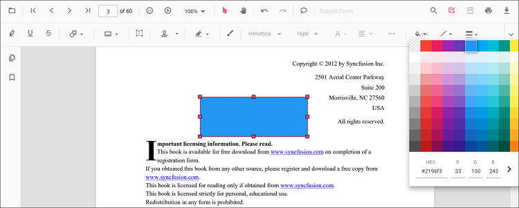

# Arrow annotation in React PDF Viewer

Arrow is a shape annotation used to point, direct attention, or indicate flow. Common use cases include callouts, direction markers, and connectors in technical reviews.

## Add Arrow Annotation

### Add arrow annotation via UI

Use the annotation toolbar:
- Click the **Edit Annotation** button in the PDF Viewer toolbar.
- Open the **Shape Annotation**** dropdown.
- Choose **Arrow**, then draw on the page.

N> When in pan mode, selecting a shape annotation switches the viewer to text select mode.

### Enable arrow mode

The PDF Viewer library allows drawing shape annotations programmatically after enabling arrow mode in button clicks.




import * as ReactDOM from 'react-dom/client';
import * as React from 'react';
import './index.css';
import {
  PdfViewerComponent,
  Toolbar, Magnification, Navigation, LinkAnnotation, BookmarkView, ThumbnailView,
  Print, TextSelection, TextSearch, Annotation, FormFields, FormDesigner, PageOrganizer, Inject
} from '@syncfusion/ej2-react-pdfviewer';

export function App() {
  function arrowMode() {
    const viewer = document.getElementById('container').ej2_instances[0];
    viewer.annotation.setAnnotationMode('Arrow');
  }

  return (
    

      <button onClick={arrowMode}>Arrow</button>
      

        <PdfViewerComponent
          id="container"
          documentPath="https://cdn.syncfusion.com/content/pdf/pdf-succinctly.pdf"
          resourceUrl="https://cdn.syncfusion.com/ej2/31.2.2/dist/ej2-pdfviewer-lib"
          style={{ height: '640px' }}
        >
          <Inject services={[
            Toolbar, Annotation, Magnification, Navigation, LinkAnnotation, BookmarkView, ThumbnailView,
            Print, TextSelection, TextSearch, FormFields, FormDesigner, PageOrganizer
          ]} />
        </PdfViewerComponent>
      

    

  );
}
const root = ReactDOM.createRoot(document.getElementById('sample'));
root.render(<App />);




import * as ReactDOM from 'react-dom/client';
import * as React from 'react';
import './index.css';
import {
  PdfViewerComponent,
  Toolbar, Magnification, Navigation, LinkAnnotation, BookmarkView, ThumbnailView,
  Print, TextSelection, TextSearch, Annotation, FormFields, FormDesigner, PageOrganizer, Inject
} from '@syncfusion/ej2-react-pdfviewer';

export function App() {
  function arrowMode() {
    const viewer = document.getElementById('container').ej2_instances[0];
    viewer.annotation.setAnnotationMode('Arrow');
  }

  return (
    

      <button onClick={arrowMode}>Arrow</button>
      

        <PdfViewerComponent
          id="container"
          documentPath="https://cdn.syncfusion.com/content/pdf/pdf-succinctly.pdf"
          serviceUrl="https://document.syncfusion.com/web-services/pdf-viewer/api/pdfviewer"
          style={{ height: '640px' }}
        >
          <Inject services={[
            Toolbar, Annotation, Magnification, Navigation, LinkAnnotation, BookmarkView, ThumbnailView,
            Print, TextSelection, TextSearch, FormFields, FormDesigner, PageOrganizer
          ]} />
        </PdfViewerComponent>
      

    

  );
}
const root = ReactDOM.createRoot(document.getElementById('sample'));
root.render(<App />);




### Add an arrow annotation programmatically

The PDF Viewer library allows adding shape annotations programmatically using the [addAnnotation()](https://ej2.syncfusion.com/documentation/api/pdfviewer/annotation#annotation) method.




import * as ReactDOM from 'react-dom/client';
import * as React from 'react';
import './index.css';
import {
  PdfViewerComponent,
  Toolbar, Magnification, Navigation, LinkAnnotation, BookmarkView, ThumbnailView,
  Print, TextSelection, TextSearch, Annotation, FormFields, FormDesigner, PageOrganizer, Inject
} from '@syncfusion/ej2-react-pdfviewer';

export function App() {
  function addArrowAnnotation() {
    const viewer = document.getElementById('container').ej2_instances[0];
    viewer.annotation.addAnnotation('Arrow', {
      offset: { x: 200, y: 370 },
      pageNumber: 1,
      vertexPoints: [{ x: 200, y: 370 }, { x: 350, y: 370 }]
    });
  }

  return (
    

      <button onClick={addArrowAnnotation}>Add Arrow annotation programmatically</button>
      

        <PdfViewerComponent
          id="container"
          documentPath="https://cdn.syncfusion.com/content/pdf/pdf-succinctly.pdf"
          resourceUrl="https://cdn.syncfusion.com/ej2/31.2.2/dist/ej2-pdfviewer-lib"
          style={{ height: '640px' }}
        >
          <Inject services={[
            Toolbar, Annotation, Magnification, Navigation, LinkAnnotation, BookmarkView, ThumbnailView,
            Print, TextSelection, TextSearch, FormFields, FormDesigner, PageOrganizer
          ]} />
        </PdfViewerComponent>
      

    

  );
}
const root = ReactDOM.createRoot(document.getElementById('sample'));
root.render(<App />);



import * as ReactDOM from 'react-dom/client';
import * as React from 'react';
import './index.css';
import {
  PdfViewerComponent,
  Toolbar, Magnification, Navigation, LinkAnnotation, BookmarkView, ThumbnailView,
  Print, TextSelection, TextSearch, Annotation, FormFields, FormDesigner, PageOrganizer, Inject
} from '@syncfusion/ej2-react-pdfviewer';

export function App() {
  function addArrowAnnotation() {
    const viewer = document.getElementById('container').ej2_instances[0];
    viewer.annotation.addAnnotation('Arrow', {
      offset: { x: 200, y: 370 },
      pageNumber: 1,
      vertexPoints: [{ x: 200, y: 370 }, { x: 350, y: 370 }]
    });
  }

  return (
    

      <button onClick={addArrowAnnotation}>Add Arrow annotation programmatically</button>
      

        <PdfViewerComponent
          id="container"
          documentPath="https://cdn.syncfusion.com/content/pdf/pdf-succinctly.pdf"
          serviceUrl="https://document.syncfusion.com/web-services/pdf-viewer/api/pdfviewer"
          style={{ height: '640px' }}
        >
          <Inject services={[
            Toolbar, Annotation, Magnification, Navigation, LinkAnnotation, BookmarkView, ThumbnailView,
            Print, TextSelection, TextSearch, FormFields, FormDesigner, PageOrganizer
          ]} />
        </PdfViewerComponent>
      

    

  );
}
const root = ReactDOM.createRoot(document.getElementById('sample'));
root.render(<App />);



## Edit Arrow Annotation

### Edit arrow annotation in UI

You can select, move, and resize Arrow annotations directly in the viewer:
- Select an Arrow to show its handles.
- Move: drag inside the shape to reposition it on the page.
- Resize/reshape: drag start/end handles to adjust its length and direction.
- Delete or access more options from the context menu.

#### Editing the properties of the arrow annotation

The fill color, stroke color, thickness, and opacity of arrow shape annotations can be edited using the Edit Color, Edit Stroke Color, Edit Thickness, and Edit Opacity tools in the annotation toolbar.

##### Editing fill color

The fill color of the annotation can be edited using the color palette provided in the Edit Color tool.

#### Editing stroke color

The stroke color of the annotation can be edited using the color palette provided in the Edit Stroke Color tool.

#### Editing thickness

The thickness of the border of the annotation can be edited using the range slider provided in the Edit Thickness tool.

#### Editing opacity

The opacity of the annotation can be edited using the range slider provided in the Edit Opacity tool.

#### Editing the line properties

Arrow annotations have additional options in the Line Properties window. Open it by right-clicking a line or arrow annotation and selecting Properties from the context menu.

### Edit an existing arrow annotation programmatically

To modify an existing arrow annotation programmatically, use the editAnnotation() method.

Here is an example of using editAnnotation():




import * as ReactDOM from 'react-dom/client';
import * as React from 'react';
import './index.css';
import {
  PdfViewerComponent,
  Toolbar, Magnification, Navigation, LinkAnnotation, BookmarkView, ThumbnailView,
  Print, TextSelection, TextSearch, Annotation, FormFields, FormDesigner, PageOrganizer, Inject
} from '@syncfusion/ej2-react-pdfviewer';

export function App() {

  function editArrowAnnotation() {
    const viewer = document.getElementById('container').ej2_instances[0];
    for (let i = 0; i < viewer.annotationCollection.length; i++) {
      const ann = viewer.annotationCollection[i];
      if (ann.subject === 'Arrow') {
        ann.annotationSelectorSettings.resizerShape = 'Circle';
        ann.strokeColor = '#0000FF';
        ann.thickness = 2;
        ann.fillColor = '#FFFF00';
        viewer.annotation.editAnnotation(ann);
      }
    }
  }

  return (
    

      <button onClick={editArrowAnnotation}>Edit Arrow annotation programmatically</button>
      

        <PdfViewerComponent
          id="container"
          documentPath="https://cdn.syncfusion.com/content/pdf/pdf-succinctly.pdf"
          resourceUrl="https://cdn.syncfusion.com/ej2/31.2.2/dist/ej2-pdfviewer-lib"
          style={{ height: '640px' }}
        >
          <Inject services={[
            Toolbar, Annotation, Magnification, Navigation, LinkAnnotation, BookmarkView, ThumbnailView,
            Print, TextSelection, TextSearch, FormFields, FormDesigner, PageOrganizer
          ]} />
        </PdfViewerComponent>
      

    

  );
}
const root = ReactDOM.createRoot(document.getElementById('sample'));
root.render(<App />);




import * as ReactDOM from 'react-dom/client';
import * as React from 'react';
import './index.css';
import {
  PdfViewerComponent,
  Toolbar, Magnification, Navigation, LinkAnnotation, BookmarkView, ThumbnailView,
  Print, TextSelection, TextSearch, Annotation, FormFields, FormDesigner, PageOrganizer, Inject
} from '@syncfusion/ej2-react-pdfviewer';

export function App() {

  function editArrowAnnotation() {
    const viewer = document.getElementById('container').ej2_instances[0];
    for (let i = 0; i < viewer.annotationCollection.length; i++) {
      const ann = viewer.annotationCollection[i];
      if (ann.subject === 'Arrow') {
        ann.annotationSelectorSettings.resizerShape = 'Circle';
        ann.strokeColor = '#0000FF';
        ann.thickness = 2;
        ann.fillColor = '#FFFF00';
        viewer.annotation.editAnnotation(ann);
      }
    }
  }

  return (
    

      <button onClick={editArrowAnnotation}>Edit Arrow annotation programmatically</button>
      

        <PdfViewerComponent
          id="container"
          documentPath="https://cdn.syncfusion.com/content/pdf/pdf-succinctly.pdf"
          serviceUrl="https://document.syncfusion.com/web-services/pdf-viewer/api/pdfviewer"
          style={{ height: '640px' }}
        >
          <Inject services={[
            Toolbar, Annotation, Magnification, Navigation, LinkAnnotation, BookmarkView, ThumbnailView,
            Print, TextSelection, TextSearch, FormFields, FormDesigner, PageOrganizer
          ]} />
        </PdfViewerComponent>
      

    

  );
}
const root = ReactDOM.createRoot(document.getElementById('sample'));
root.render(<App />);




## Default arrow settings during initialization

Set default [arrowSettings](https://ej2.syncfusion.com/react/documentation/api/pdfviewer/index-default#arrowsettings) before creating the control.




import * as ReactDOM from 'react-dom/client';
import * as React from 'react';
import './index.css';
import {
  PdfViewerComponent,
  Toolbar, Magnification, Navigation, LinkAnnotation, BookmarkView, ThumbnailView,
  Print, TextSelection, TextSearch, Annotation, FormFields, FormDesigner, PageOrganizer, Inject
} from '@syncfusion/ej2-react-pdfviewer';

export function App() {
  return (
    

      

        <PdfViewerComponent
          id="container"
          documentPath="https://cdn.syncfusion.com/content/pdf/pdf-succinctly.pdf"
          resourceUrl="https://cdn.syncfusion.com/ej2/31.2.2/dist/ej2-pdfviewer-lib"
          arrowSettings={{ fillColor: 'green', opacity: 0.6, strokeColor: 'blue' }}
          style={{ height: '640px' }}
        >
          <Inject services={[
            Toolbar, Annotation, Magnification, Navigation, LinkAnnotation, BookmarkView, ThumbnailView,
            Print, TextSelection, TextSearch, FormFields, FormDesigner, PageOrganizer
          ]} />
        </PdfViewerComponent>
      

    

  );
}
const root = ReactDOM.createRoot(document.getElementById('sample'));
root.render(<App />);




import * as ReactDOM from 'react-dom/client';
import * as React from 'react';
import './index.css';
import {
  PdfViewerComponent,
  Toolbar, Magnification, Navigation, LinkAnnotation, BookmarkView, ThumbnailView,
  Print, TextSelection, TextSearch, Annotation, FormFields, FormDesigner, PageOrganizer, Inject
} from '@syncfusion/ej2-react-pdfviewer';

export function App() {
  return (
    

      

        <PdfViewerComponent
          id="container"
          documentPath="https://cdn.syncfusion.com/content/pdf/pdf-succinctly.pdf"
          serviceUrl="https://document.syncfusion.com/web-services/pdf-viewer/api/pdfviewer"
          arrowSettings={{ fillColor: 'green', opacity: 0.6, strokeColor: 'blue' }}
          style={{ height: '640px' }}
        >
          <Inject services={[
            Toolbar, Annotation, Magnification, Navigation, LinkAnnotation, BookmarkView, ThumbnailView,
            Print, TextSelection, TextSearch, FormFields, FormDesigner, PageOrganizer
          ]} />
        </PdfViewerComponent>
      

    

  );
}
const root = ReactDOM.createRoot(document.getElementById('sample'));
root.render(<App />);




## Set properties while adding Individual Annotation

Set properties for individual annotation before creating the control using `ArrowSettings`.

> After editing default color and opacity using the Edit Color and Edit Opacity tools, the values update to the selected settings.

Refer to the following code snippet to set the default arrow settings.




import * as ReactDOM from 'react-dom/client';
import * as React from 'react';
import './index.css';
import {
  PdfViewerComponent,
  Toolbar, Magnification, Navigation, LinkAnnotation, BookmarkView, ThumbnailView,
  Print, TextSelection, TextSearch, Annotation, FormFields, FormDesigner, Inject
} from '@syncfusion/ej2-react-pdfviewer';

export function App() {

  function addArrowWithSettings() {
    const viewer = document.getElementById('container').ej2_instances[0];
    viewer.annotation.addAnnotation('Arrow', {
      offset: { x: 200, y: 230 },
      pageNumber: 1,
      vertexPoints: [{ x: 200, y: 230 }, { x: 350, y: 230 }],
      fillColor: '#ff1010ff',
      strokeColor: '#fff000',
      opacity: 0.9,
      author: 'User 1',
      thickness: 1
    });
  }

  return (
    

      <button onClick={addArrowWithSettings}>Add Arrow</button>
      

        <PdfViewerComponent
          id="container"
          documentPath="https://cdn.syncfusion.com/content/pdf/form-designer.pdf"
          resourceUrl="https://cdn.syncfusion.com/ej2/31.2.2/dist/ej2-pdfviewer-lib"
          style={{ height: '640px' }}
        >
          <Inject services={[
            Toolbar, Annotation, Magnification, Navigation, LinkAnnotation, BookmarkView, ThumbnailView,
            Print, TextSelection, TextSearch, FormFields, FormDesigner
          ]} />
        </PdfViewerComponent>
      

    

  );
}
const root = ReactDOM.createRoot(document.getElementById('sample'));
root.render(<App />);




import * as ReactDOM from 'react-dom/client';
import * as React from 'react';
import './index.css';
import {
  PdfViewerComponent,
  Toolbar, Magnification, Navigation, LinkAnnotation, BookmarkView, ThumbnailView,
  Print, TextSelection, TextSearch, Annotation, FormFields, FormDesigner, Inject
} from '@syncfusion/ej2-react-pdfviewer';

export function App() {

  function addArrowWithSettings() {
    const viewer = document.getElementById('container').ej2_instances[0];
    viewer.annotation.addAnnotation('Arrow', {
      offset: { x: 200, y: 230 },
      pageNumber: 1,
      vertexPoints: [{ x: 200, y: 230 }, { x: 350, y: 230 }],
      fillColor: '#ff1010ff',
      strokeColor: '#fff000',
      opacity: 0.9,
      author: 'User 1',
      thickness: 1
    });
  }

  return (
    

      <button onClick={addArrowWithSettings}>Add Arrow</button>
      

        <PdfViewerComponent
          id="container"
          documentPath="https://cdn.syncfusion.com/content/pdf/form-designer.pdf"
          serviceUrl="https://document.syncfusion.com/web-services/pdf-viewer/api/pdfviewer"
          style={{ height: '640px' }}
        >
          <Inject services={[
            Toolbar, Annotation, Magnification, Navigation, LinkAnnotation, BookmarkView, ThumbnailView,
            Print, TextSelection, TextSearch, FormFields, FormDesigner
          ]} />
        </PdfViewerComponent>
      

    

  );
}
const root = ReactDOM.createRoot(document.getElementById('sample'));
root.render(<App />);




N> In both [Arrow](https://ej2.syncfusion.com/react/documentation/api/pdfviewer/index-default#arrowsettings) and [Line](https://ej2.syncfusion.com/react/documentation/api/pdfviewer/index-default#linesettings) annotations Settings, the Fill Color option is available only when an arrowhead style is applied at the Start or End. If both Start and End arrowhead styles are set to None, lines do not support fill rendering and the Fill Color option remains disabled.

[View Sample on GitHub](https://github.com/SyncfusionExamples/typescript-pdf-viewer-examples/tree/master)

## See also

- [Annotation Overview](../overview)
- [Annotation Toolbar](../../toolbar-customization/annotation-toolbar)
- [Create and Modify Annotation](../../annotations/create-modify-annotation)
- [Customize Annotation](../../annotations/customize-annotation)
- [Remove Annotation](../../annotations/delete-annotation)
- [Handwritten Signature](../../annotations/signature-annotation)
- [Export and Import Annotation](../../annotations/export-import/export-annotation)
- [Annotation in Mobile View](../../annotations/annotations-in-mobile-view)
- [Annotation Events](../../annotations/annotation-event)
- [Annotation API](../../annotations/annotations-api)