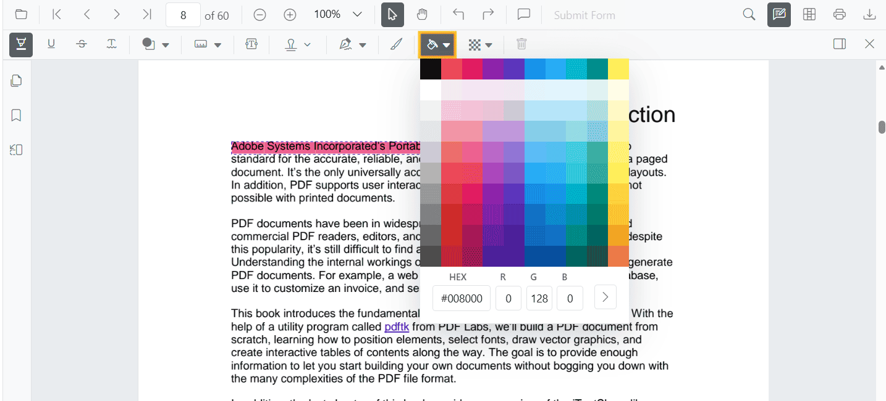
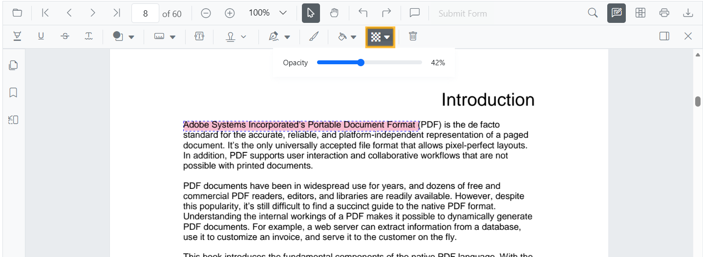

# Arrow Annotation (Shape) in React PDF Viewer
Arrow annotations let users point, direct attention, or indicate flow on PDFs—useful for callouts, direction markers, and connectors during reviews. You can add arrows from the toolbar, switch to arrow mode programmatically, customize appearance, edit/delete them in the UI, and export them with the document.

---

## Enable Arrow Annotation in the Viewer

To enable Arrow annotations, inject the following modules into the React PDF Viewer:

- [**Annotation**](https://ej2.syncfusion.com/react/documentation/api/pdfviewer/index-default#annotation)
- [**Toolbar**](https://ej2.syncfusion.com/react/documentation/api/pdfviewer/index-default#toolbar)




import * as React from 'react';
import * as ReactDOM from 'react-dom/client';
import { PdfViewerComponent, Inject, Toolbar, Annotation } from '@syncfusion/ej2-react-pdfviewer';

function App() {
  return (
    <PdfViewerComponent
      id="container"
      documentPath="https://cdn.syncfusion.com/content/pdf/pdf-succinctly.pdf"
      resourceUrl="https://cdn.syncfusion.com/ej2/31.2.2/dist/ej2-pdfviewer-lib"
      style={{ height: '650px' }}
    >
      <Inject services={[Toolbar, Annotation]} />
    </PdfViewerComponent>
  );
}

ReactDOM.createRoot(document.getElementById('sample')).render(<App />);




---

## Apply Arrow Annotation

### Apply Arrow Annotation Using the Toolbar
1. Open the **Annotation Toolbar**.
2. Select **Shapes** → **Arrow**.
3. Click and drag on the PDF page to draw the arrow.

N> When in Pan mode, selecting a shape tool automatically switches the viewer to selection mode for smooth interaction.

---

### Enable Arrow Mode
Switch the viewer into highlight mode using `setAnnotationMode('Arrow')`.




function enableArrowMode() {
  const viewer = document.getElementById('container').ej2_instances[0];
  viewer.annotation.setAnnotationMode('Arrow');
}




#### Exit Arrow Mode



function exitArrowMode() {
  const viewer = document.getElementById('container').ej2_instances[0];
  viewer.annotation.setAnnotationMode('None');
}




---

### Add Arrow Programmatically
Use the [`addAnnotation`](https://ej2.syncfusion.com/react/documentation/api/pdfviewer/index-default#addannotation) API to draw an arrow at a specific location (defined by two **vertexPoints**).




function addArrow() {
  const viewer = document.getElementById('container').ej2_instances[0];
  viewer.annotation.addAnnotation('Arrow', {
    offset: { x: 200, y: 370 },
    pageNumber: 1,
    vertexPoints: [
      { x: 200, y: 370 },
      { x: 350, y: 370 }
    ]
  });
}




---

## Customize Arrow Appearance
Configure default arrow appearance (fill color, stroke color, thickness, opacity) using the [`arrowSettings`](https://ej2.syncfusion.com/react/documentation/api/pdfviewer/index-default#arrowsettings) property.




<PdfViewerComponent
  id="container"
  documentPath="https://cdn.syncfusion.com/content/pdf/pdf-succinctly.pdf"
  resourceUrl="https://cdn.syncfusion.com/ej2/31.2.2/dist/ej2-pdfviewer-lib"
  arrowSettings={{ fillColor: '#ffff00', strokeColor: '#0066ff', thickness: 2, opacity: 0.9 }}
  style={{ height: '650px' }}
>
  <Inject services={[Toolbar, Annotation]} />
</PdfViewerComponent>




N> For **Line** and **Arrow** annotations, **Fill Color** is available only when an arrowhead style is applied at the **Start** or **End**. If both are `None`, lines do not render fill and the Fill option remains disabled.

---

## Manage Arrow (Edit, Move, Resize, Delete)
### Edit Arrow 

#### Edit Arrow (UI)
- Select a Arrow to view resize handles.
- Drag endpoints to adjust length/angle.
- Edit stroke color, opacity, and thickness using the annotation toolbar.

Use the annotation toolbar:
- **Edit Color** tool  

- **Edit Opacity** slider

- **Line Properties** 
Open the Line Properties dialog via **Right Click → Properties**.

#### Edit Arrow Programmatically

Modify an existing Arrow programmatically using `editAnnotation()`.




function editArrowProgrammatically() {
  const viewer = document.getElementById('container').ej2_instances[0];
  for (const annot of viewer.annotationCollection) {
    if (annot.subject === 'Arrow') {
      annot.strokeColor = '#0000ff';
      annot.thickness = 2;
      annot.fillColor = '#ffff00';
      viewer.annotation.editAnnotation(annot);
      break;
    }
  }
}




---

### Delete Arrow

The PDF Viewer supports deleting existing annotations through the UI and API.
See [**Delete Annotation**](../remove-annotations) for full behavior and workflows.

---

### Comments

Use the [**Comments panel**](../comments) to add, view, and reply to threaded discussions linked to arrow annotations. It provides a dedicated interface for collaboration and review within the PDF Viewer.

---

## Set properties while adding Individual Annotation

Set properties for individual arrow annotations by passing values directly during [`addAnnotation`](https://ej2.syncfusion.com/react/documentation/api/pdfviewer/index-default#addannotation).




function addMultipleArrows() {
  const viewer = document.getElementById('container').ej2_instances[0];

  // Arrow 1
  viewer.annotation.addAnnotation('Arrow', {
    offset: { x: 200, y: 230 },
    pageNumber: 1,
    vertexPoints: [
      { x: 200, y: 230 },
      { x: 350, y: 230 }
    ],
    fillColor: '#ffff00',
    strokeColor: '#0066ff',
    thickness: 2,
    opacity: 0.9,
    author: 'User 1'
  });

  // Arrow 2
  viewer.annotation.addAnnotation('Arrow', {
    offset: { x: 220, y: 300 },
    pageNumber: 1,
    vertexPoints: [
      { x: 220, y: 300 },
      { x: 400, y: 300 }
    ],
    fillColor: '#ffef00',
    strokeColor: '#ff1010',
    thickness: 3,
    opacity: 0.9,
    author: 'User 2'
  });
}




---

## Disable Arrow Annotation

Disable shape annotations (Line, Arrow, Rectangle, Circle, Polygon) using the [`enableShapeAnnotation`](https://ej2.syncfusion.com/react/documentation/api/pdfviewer/index-default#enableshapeannotation) property.




<PdfViewerComponent
  id="container"
  enableShapeAnnotation={false}
  documentPath="https://cdn.syncfusion.com/content/pdf/pdf-succinctly.pdf"
  resourceUrl="https://cdn.syncfusion.com/ej2/31.2.2/dist/ej2-pdfviewer-lib"
  style={{ height: '650px' }}
>
  <Inject services={[Toolbar, Annotation]} />
</PdfViewerComponent>




---

## Handle Arrow Events

The PDF viewer provides annotation life-cycle events that notify when Arrow annotations are added, modified, selected, or removed.
For the full list of available events and their descriptions, see [**Annotation Events**](../annotation-event)

---

## Export and Import
The PDF Viewer supports exporting and importing annotations. For details on supported formats and workflows, see [**Export and Import annotations**](../export-import-annotations).

---

## See Also
- [Annotation Toolbar](../../toolbar-customization/annotation-toolbar)
- [Customize Context Menu](../../context-menu/custom-context-menu)
- [Comments Panel](../comments)
- [Annotation Events](../annotation-event)
- [Export and Import annotations](../export-import-annotations)
- [Delete Annotations](../remove-annotations)
