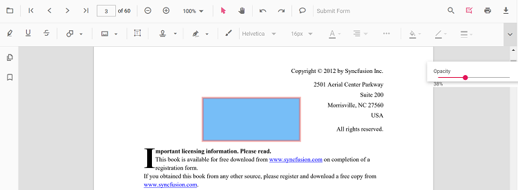
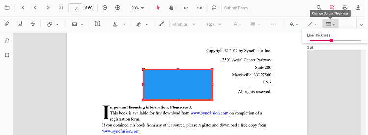

# Circle Annotation (Shape) in React PDF Viewer
Circle annotations let users highlight circular regions or draw emphasis bubbles on PDFs for reviews and markups. You can add circles from the toolbar, switch to circle mode programmatically, customize appearance, edit/delete them in the UI, and export them with the document.

---

## Enable Circle Annotation in the Viewer

To enable Line annotations, inject the following modules into the React PDF Viewer:

- [**Annotation**](https://ej2.syncfusion.com/react/documentation/api/pdfviewer/index-default#annotation)
- [**Toolbar**](https://ej2.syncfusion.com/react/documentation/api/pdfviewer/index-default#toolbar)




import * as React from 'react';
import * as ReactDOM from 'react-dom/client';
import { PdfViewerComponent, Inject, Toolbar, Annotation } from '@syncfusion/ej2-react-pdfviewer';

function App() {
  return (
    <PdfViewerComponent
      id="container"
      documentPath="https://cdn.syncfusion.com/content/pdf/pdf-succinctly.pdf"
      resourceUrl="https://cdn.syncfusion.com/ej2/31.2.2/dist/ej2-pdfviewer-lib"
      style={{ height: '650px' }}
    >
      <Inject services={[Toolbar, Annotation]} />
    </PdfViewerComponent>
  );
}

ReactDOM.createRoot(document.getElementById('sample')).render(<App />);




---

## Apply Circle Annotation

### Apply Circle Annotation Using the Toolbar
1. Open the **Annotation Toolbar**.
2. Select **Shapes** → **Circle**.
3. Click and drag on the PDF page to draw the circle (ellipse).

N> When in Pan mode, selecting a shape tool automatically switches the viewer to selection mode for smooth interaction.

---

### Enable Circle Mode

Switch the viewer into highlight mode using `setAnnotationMode('Circle')`.




function enableCircleMode() {
  const viewer = document.getElementById('container').ej2_instances[0];
  viewer.annotation.setAnnotationMode('Circle');
}




#### Exit Circle Mode

Switch back to normal mode using:




function exitCircleMode() {
  const viewer = document.getElementById('container').ej2_instances[0];
  viewer.annotation.setAnnotationMode('None');
}




---

### Add Circle Programmatically
Use the [`addAnnotation`](https://ej2.syncfusion.com/react/documentation/api/pdfviewer/index-default#addannotation) API to draw a circle (ellipse) at a specific location.




function addCircle() {
  const viewer = document.getElementById('container').ej2_instances[0];
  viewer.annotation.addAnnotation('Circle', {
    offset: { x: 200, y: 620 },
    pageNumber: 1,
    width: 90,
    height: 90
  });
}




---

## Customize Circle Appearance
Configure default circle appearance (fill color, stroke color, thickness, opacity) using the [`circleSettings`](https://ej2.syncfusion.com/react/documentation/api/pdfviewer/index-default#circlesettings) property.




<PdfViewerComponent
  id="container"
  documentPath="https://cdn.syncfusion.com/content/pdf/pdf-succinctly.pdf"
  resourceUrl="https://cdn.syncfusion.com/ej2/31.2.2/dist/ej2-pdfviewer-lib"
  circleSettings={{ fillColor: '#ffa500', strokeColor: '#ff6a00', thickness: 2, opacity: 0.9 }}
  style={{ height: '650px' }}
>
  <Inject services={[Toolbar, Annotation]} />
</PdfViewerComponent>




---

## Manage Circle (Edit, Move, Resize, Delete)

### Edit Circle

#### Edit Circle (UI)

- Select a Circle to view resize handles.
- Drag any side/corner to resize; drag inside the shape to move it.
- Edit **fill**, **stroke**, **thickness**, and **opacity** using the annotation toolbar.

Use the annotation toolbar:
- **Edit fill Color** tool  

- **Edit stroke Color** tool

- **Edit Opacity** slider

- **Edit Thickness** slider

#### Edit Circle Programmatically

Modify an existing Circle programmatically using `editAnnotation()`.




function editCircleProgrammatically() {
  const viewer = document.getElementById('container').ej2_instances[0];
  for (const annot of viewer.annotationCollection) {
    if (annot.subject === 'Circle') {
      annot.strokeColor = '#0000ff';
      annot.thickness = 2;
      annot.fillColor = '#ffff00';
      viewer.annotation.editAnnotation(annot);
      break;
    }
  }
}




---

### Delete Circle
The PDF Viewer supports deleting existing annotations through the UI and API.
See [**Delete Annotation**](../remove-annotations) for full behavior and workflows.

---

### Comments
Use the [**Comments panel**](../comments) to add, view, and reply to threaded discussions linked to circle annotations. It provides a dedicated interface for collaboration and review within the PDF Viewer.

---

## Set properties while adding Individual Annotation
Set properties for individual circle annotations by passing values directly during [`addAnnotation`](https://ej2.syncfusion.com/react/documentation/api/pdfviewer/index-default#addannotation).




function addMultipleCircles() {
  const viewer = document.getElementById('container').ej2_instances[0];

  // Circle 1
  viewer.annotation.addAnnotation('Circle', {
    offset: { x: 200, y: 620 },
    pageNumber: 1,
    width: 100,
    height: 100,
    opacity: 0.9,
    strokeColor: '#ff6a00',
    fillColor: '#ffa500',
    author: 'User 1'
  });

  // Circle 2
  viewer.annotation.addAnnotation('Circle', {
    offset: { x: 340, y: 620 },
    pageNumber: 1,
    width: 80,
    height: 80,
    opacity: 0.85,
    strokeColor: '#ff1010',
    fillColor: '#ffe600',
    author: 'User 2'
  });
}




---

## Disable Circle Annotation
Disable shape annotations (Line, Arrow, Rectangle, Circle, Polygon) using the [`enableShapeAnnotation`](https://ej2.syncfusion.com/react/documentation/api/pdfviewer/index-default#enableshapeannotation) property.




<PdfViewerComponent
  id="container"
  enableShapeAnnotation={false}
  documentPath="https://cdn.syncfusion.com/content/pdf/pdf-succinctly.pdf"
  resourceUrl="https://cdn.syncfusion.com/ej2/31.2.2/dist/ej2-pdfviewer-lib"
  style={{ height: '650px' }}
>
  <Inject services={[Toolbar, Annotation]} />
</PdfViewerComponent>




---

## Handle Circle Events

The PDF viewer provides annotation life-cycle events that notify when Circle annotations are added, modified, selected, or removed.
For the full list of available events and their descriptions, see [**Annotation Events**](../annotation-event)

---

## Export and Import

The PDF Viewer supports exporting and importing annotations. For details on supported formats and workflows, see [**Export and Import annotations**](../export-import-annotations).

---

## See Also
- [Annotation Toolbar](../../toolbar-customization/annotation-toolbar)
- [Customize Context Menu](../../context-menu/custom-context-menu)
- [Comments Panel](../comments)
- [Annotation Events](../annotation-event)
- [Export and Import annotations](../export-import-annotations)
- [Delete Annotations](../remove-annotations)
