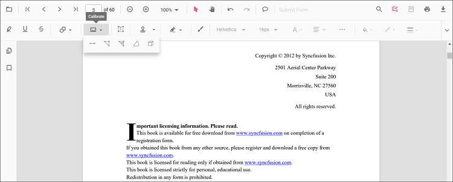

# Add Distance Annotations in React PDF Viewer
Distance is a measurement annotation used to measure the length between two points on a PDF page. Use it for precise reviews, markups, or engineering measurements.

## Enable Distance Annotation

To enable Distance annotation, inject the following modules into the React PDF Viewer:

- [**Annotation**](https://ej2.syncfusion.com/react/documentation/api/pdfviewer/index-default#annotation)
- [**Toolbar**](https://ej2.syncfusion.com/react/documentation/api/pdfviewer/index-default#toolbar)




import * as React from 'react';
import * as ReactDOM from 'react-dom/client';
import { PdfViewerComponent, Inject, Toolbar, Annotation } from '@syncfusion/ej2-react-pdfviewer';

function App() {
  return (
    <PdfViewerComponent
      id="container"
      documentPath="https://cdn.syncfusion.com/content/pdf/pdf-succinctly.pdf"
      resourceUrl="https://cdn.syncfusion.com/ej2/31.2.2/dist/ej2-pdfviewer-lib"
      style={{ height: '650px' }}
    >
      <Inject services={[Toolbar, Annotation]} />
    </PdfViewerComponent>
  );
}

ReactDOM.createRoot(document.getElementById('sample')).render(<App />);




## Add Distance Annotation

### Add Distance Using the Toolbar
1. Open the **Annotation Toolbar**.
2. Select **Measurement** → **Distance**.
3. Click to set the start point, then click again to set the end point.

N> If Pan mode is active, choosing a measurement tool switches the viewer into the appropriate interaction mode for a smoother workflow.

### Enable Distance Mode
Programmatically switch the viewer into Distance mode.




function enableDistanceMode() {
  const viewer = document.getElementById('container').ej2_instances[0];
  viewer.annotation.setAnnotationMode('Distance');
}




#### Exit Distance Mode



function exitDistanceMode() {
  const viewer = document.getElementById('container').ej2_instances[0];
  viewer.annotation.setAnnotationMode('None');
}




### Add Distance Programmatically
Use the [`addAnnotation`](https://ej2.syncfusion.com/react/documentation/api/pdfviewer/index-default#addannotation) API to draw a Distance measurement by providing two **vertexPoints**.




function addDistance() {
  const viewer = document.getElementById('container').ej2_instances[0];
  viewer.annotation.addAnnotation('Distance', {
    offset: { x: 200, y: 230 },
    pageNumber: 1,
    vertexPoints: [
      { x: 200, y: 230 },
      { x: 350, y: 230 }
    ]
  });
}




## Customize Distance Appearance
Configure default properties using the [`Distance Settings`](https://ej2.syncfusion.com/react/documentation/api/pdfviewer/index-default#distancesettings) property (for example, default **fill color**, **stroke color**, **opacity**).




<PdfViewerComponent
  id="container"
  documentPath="https://cdn.syncfusion.com/content/pdf/pdf-succinctly.pdf"
  resourceUrl="https://cdn.syncfusion.com/ej2/31.2.2/dist/ej2-pdfviewer-lib"
  distanceSettings={{ fillColor: 'blue', strokeColor: 'green', opacity: 0.6 }}
  style={{ height: '650px' }}
>
  <Inject services={[Toolbar, Annotation]} />
</PdfViewerComponent>




## Manage Distance (Move, Resize, Edit, Delete)
- **Move**: Drag the measurement to reposition it.
- **Resize**: Drag the end handles to adjust the length.

### Edit Distance

#### Edit Distance (UI)
Change **stroke color**, **thickness**, and **opacity** using the annotation toolbar tools.

- Edit the **fill color** using the Edit Color tool.  
  
- Edit the **stroke color** using the Edit Stroke Color tool.
  
- Edit the **border thickness** using the Edit Thickness tool.
  
- Edit the **opacity** using the Edit Opacity tool.
  
- Open **Right Click → Properties** for additional line-based options.

#### Edit Distance Programmatically
Update properties and call `editAnnotation()`.




function editDistanceProgrammatically() {
  const viewer = document.getElementById('container').ej2_instances[0];
  for (const ann of viewer.annotationCollection) {
    if (ann.subject === 'Distance calculation') {
      ann.strokeColor = '#0000FF';
      ann.thickness = 2;
      ann.opacity = 0.8;
      viewer.annotation.editAnnotation(ann);
      break;
    }
  }
}




### Delete Distance Annotation

Delete Distance Annotation via UI (toolbar/context menu) or programmatically. For supported workflows and APIs, see [**Delete Annotation**](../remove-annotations).

## Set Default Properties During Initialization
Apply defaults for Distance using the [`distanceSettings`](https://ej2.syncfusion.com/react/documentation/api/pdfviewer/index-default#distancesettings) property.




<PdfViewerComponent
  id="container"
  documentPath="https://cdn.syncfusion.com/content/pdf/pdf-succinctly.pdf"
  resourceUrl="https://cdn.syncfusion.com/ej2/31.2.2/dist/ej2-pdfviewer-lib"
  distanceSettings={{ fillColor: 'blue', strokeColor: 'green', opacity: 0.6 }}
  style={{ height: '650px' }}
>
  <Inject services={[Toolbar, Annotation]} />
</PdfViewerComponent>




## Set Properties While Adding Individual Annotation
Pass per-annotation values directly when calling [`addAnnotation`](https://ej2.syncfusion.com/react/documentation/api/pdfviewer/index-default#addannotation).




function addStyledDistance() {
  const viewer = document.getElementById('container').ej2_instances[0];
  viewer.annotation.addAnnotation('Distance', {
    offset: { x: 220, y: 260 },
    pageNumber: 1,
    vertexPoints: [
      { x: 220, y: 260 },
      { x: 360, y: 260 }
    ],
    strokeColor: '#059669',
    opacity: 0.9,
    fillColor: '#D1FAE5',
    thickness: 2
  });
}




## Scale Ratio and Units

- Use **Scale Ratio** from the context menu to set the actual-to-page scale.  
  
- Supported units include **Inch, Millimeter, Centimeter, Point, Pica, Feet**.  
  

### Set Default Scale Ratio During Initialization
Configure scale defaults using `measurementSettings`.




<PdfViewerComponent
  id="container"
  documentPath="https://cdn.syncfusion.com/content/pdf/pdf-succinctly.pdf"
  resourceUrl="https://cdn.syncfusion.com/ej2/31.2.2/dist/ej2-pdfviewer-lib"
  measurementSettings={{ scaleRatio: 2, conversionUnit: 'cm', displayUnit: 'cm' }}
  style={{ height: '650px' }}
>
  <Inject services={[Toolbar, Annotation]} />
</PdfViewerComponent>




## Handle Distance Events

Listen to annotation life-cycle events (add/modify/select/remove). For the full list and parameters, see [**Annotation Events**](../annotation-event).

## Export and Import
Distance measurements can be exported or imported with other annotations. For workflows and supported formats, see [**Export and Import annotations**](../export-import-annotations).

## See Also
- [Annotation Toolbar](../../toolbar-customization/annotation-toolbar)
- [Customize Context Menu](../../context-menu/custom-context-menu)
- [Comments Panel](../comments)
- [Annotation Events](../annotation-event)
- [Export and Import annotations](../export-import-annotations)
- [Delete Annotations](../remove-annotations)
