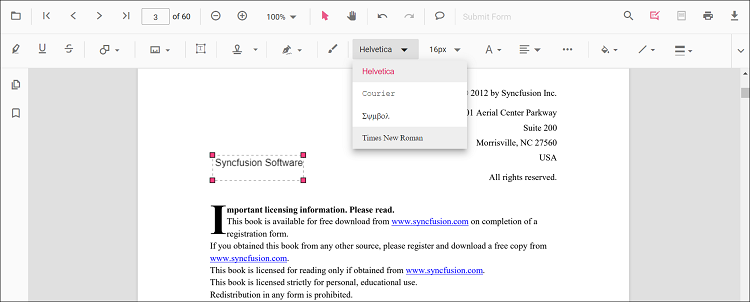
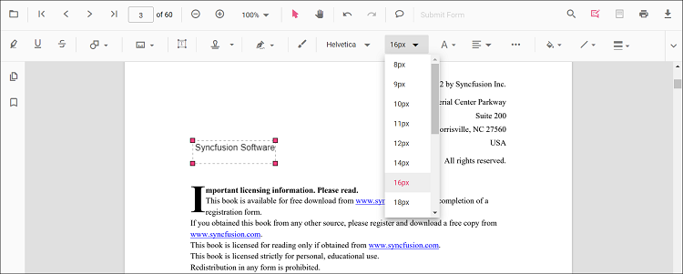
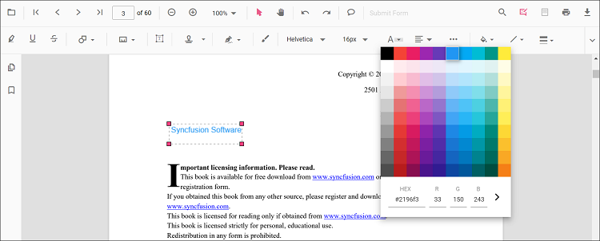
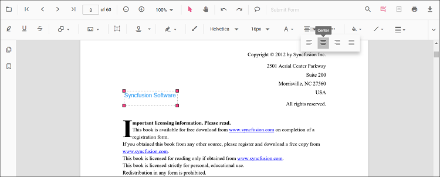
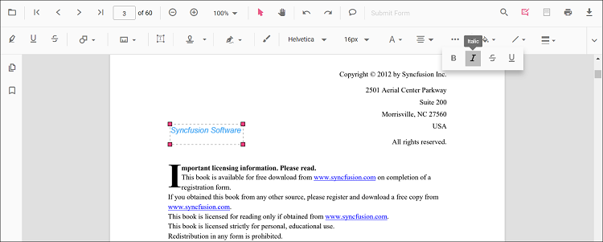
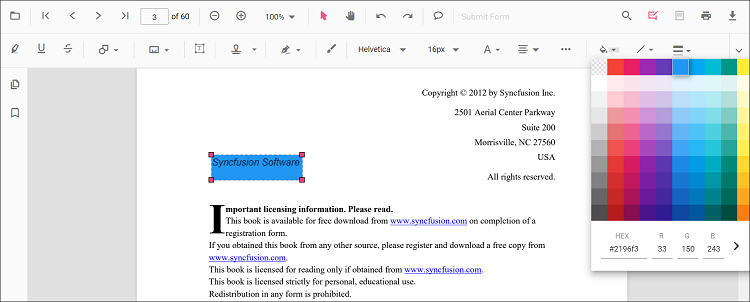
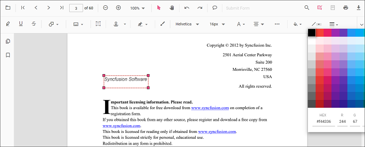
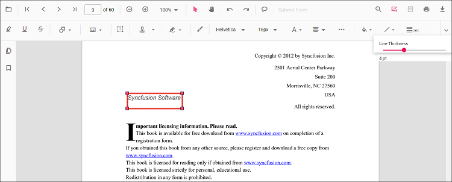
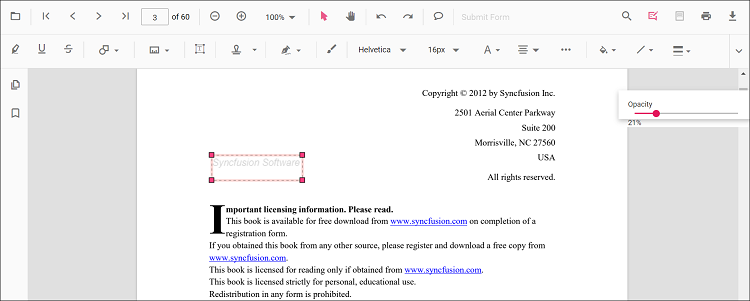

# Free text annotation in React PDF Viewer

Free Text is a text box annotation used to place formatted text anywhere on the page for notes, labels, or callouts.

## Add Free Text annotation

### Add Free Text annotation via UI

Use the annotation toolbar:
- Click the **Edit Annotation** button in the PDF Viewer toolbar.
- Click the **Free Text Annotation** button to enable Free Text mode.
- Click on the page to add text.

When in pan mode, selecting Free Text switches the viewer to text select mode.

### Switch to Free Text mode

The PDF Viewer component allows drawing Distance annotations programmatically after enabling Distance mode in button clicks.




import * as ReactDOM from 'react-dom/client';
import * as React from 'react';
import './index.css';
import {
  PdfViewerComponent,
  Toolbar, Magnification, Navigation, LinkAnnotation, BookmarkView, ThumbnailView,
  Print, TextSelection, TextSearch, Annotation, FormFields, FormDesigner, PageOrganizer, Inject
} from '@syncfusion/ej2-react-pdfviewer';

export function App() {
  function freeTextMode() {
    const viewer = document.getElementById('container').ej2_instances[0];
    viewer.annotation.setAnnotationMode('FreeText');
  }

  return (
    

      <button onClick={freeTextMode}>FreeText</button>
      

        <PdfViewerComponent
          id="container"
          documentPath="https://cdn.syncfusion.com/content/pdf/pdf-succinctly.pdf"
          resourceUrl="https://cdn.syncfusion.com/ej2/31.2.2/dist/ej2-pdfviewer-lib"
          style={{ height: '640px' }}
        >
          <Inject services={[
            Toolbar, Annotation, Magnification, Navigation, LinkAnnotation, BookmarkView, ThumbnailView,
            Print, TextSelection, TextSearch, FormFields, FormDesigner, PageOrganizer
          ]}/>
        </PdfViewerComponent>
      

    

  );
}
const root = ReactDOM.createRoot(document.getElementById('sample'));
root.render(<App />);




import * as ReactDOM from 'react-dom/client';
import * as React from 'react';
import './index.css';
import {
  PdfViewerComponent,
  Toolbar, Magnification, Navigation, LinkAnnotation, BookmarkView, ThumbnailView,
  Print, TextSelection, TextSearch, Annotation, FormFields, FormDesigner, PageOrganizer, Inject
} from '@syncfusion/ej2-react-pdfviewer';

export function App() {
  function freeTextMode() {
    const viewer = document.getElementById('container').ej2_instances[0];
    viewer.annotation.setAnnotationMode('FreeText');
  }

  return (
    

      <button onClick={freeTextMode}>FreeText</button>
      

        <PdfViewerComponent
          id="container"
          documentPath="https://cdn.syncfusion.com/content/pdf/pdf-succinctly.pdf"
          serviceUrl="https://document.syncfusion.com/web-services/pdf-viewer/api/pdfviewer"
          style={{ height: '640px' }}
        >
          <Inject services={[
            Toolbar, Annotation, Magnification, Navigation, LinkAnnotation, BookmarkView, ThumbnailView,
            Print, TextSelection, TextSearch, FormFields, FormDesigner, PageOrganizer
          ]}/>
        </PdfViewerComponent>
      

    

  );
}
const root = ReactDOM.createRoot(document.getElementById('sample'));
root.render(<App />);




### Add Free Text annotation programmatically

Use [addAnnotation()](https://ej2.syncfusion.com/documentation/api/pdfviewer/annotation#annotation) to programmatically create Free Text.




import * as ReactDOM from 'react-dom/client';
import * as React from 'react';
import './index.css';
import {
  PdfViewerComponent,
  Toolbar, Magnification, Navigation, LinkAnnotation, BookmarkView, ThumbnailView,
  Print, TextSelection, TextSearch, Annotation, FormFields, FormDesigner, PageOrganizer, Inject
} from '@syncfusion/ej2-react-pdfviewer';

export function App() {
  function addFreeTextProgram() {
    const viewer = document.getElementById('container').ej2_instances[0];
    viewer.annotation.addAnnotation('FreeText', {
      offset: { x: 120, y: 80 },
      pageNumber: 1,
      width: 200,
      height: 40,
      fontSize: 16,
      fontFamily: 'Helvetica',
      isLock: false,
      defaultText: 'Syncfusion'
    });
  }

  return (
    

      <button onClick={addFreeTextProgram}>Add FreeText Programmatically</button>
      

        <PdfViewerComponent
          id="container"
          documentPath="https://cdn.syncfusion.com/content/pdf/pdf-succinctly.pdf"
          resourceUrl="https://cdn.syncfusion.com/ej2/31.2.2/dist/ej2-pdfviewer-lib"
          style={{ height: '640px' }}
        >
          <Inject services={[
            Toolbar, Annotation, Magnification, Navigation, LinkAnnotation, BookmarkView, ThumbnailView,
            Print, TextSelection, TextSearch, FormFields, FormDesigner, PageOrganizer
          ]}/>
        </PdfViewerComponent>
      

    

  );
}
const root = ReactDOM.createRoot(document.getElementById('sample'));
root.render(<App />);




import * as ReactDOM from 'react-dom/client';
import * as React from 'react';
import './index.css';
import {
  PdfViewerComponent,
  Toolbar, Magnification, Navigation, LinkAnnotation, BookmarkView, ThumbnailView,
  Print, TextSelection, TextSearch, Annotation, FormFields, FormDesigner, PageOrganizer, Inject
} from '@syncfusion/ej2-react-pdfviewer';

export function App() {
  function addFreeTextProgram() {
    const viewer = document.getElementById('container').ej2_instances[0];
    viewer.annotation.addAnnotation('FreeText', {
      offset: { x: 120, y: 80 },
      pageNumber: 1,
      width: 200,
      height: 40,
      fontSize: 16,
      fontFamily: 'Helvetica',
      isLock: false,
      defaultText: 'Syncfusion'
    });
  }

  return (
    

      <button onClick={addFreeTextProgram}>Add FreeText Programmatically</button>
      

        <PdfViewerComponent
          id="container"
          documentPath="https://cdn.syncfusion.com/content/pdf/pdf-succinctly.pdf"
          serviceUrl="https://document.syncfusion.com/web-services/pdf-viewer/api/pdfviewer"
          style={{ height: '640px' }}
        >
          <Inject services={[
            Toolbar, Annotation, Magnification, Navigation, LinkAnnotation, BookmarkView, ThumbnailView,
            Print, TextSelection, TextSearch, FormFields, FormDesigner, PageOrganizer
          ]}/>
        </PdfViewerComponent>
      

    

  );
}
const root = ReactDOM.createRoot(document.getElementById('sample'));
root.render(<App />);




## Edit Free Text annotation

### Edit Free Text Annotation in UI

You can select, move, and resize FreeText annotations directly in the viewer:
- Select a Free Text annotation to display its bounding box and resize handles.
- Move: drag the annotation box to reposition it on the page.
- Resize: drag any corner or edge handle to adjust its size.
- Delete: press the Delete key or use the context menu to remove the annotation.

Use the toolbar to change the appearance of the selected Free Text annotation:
- Font Family, Font Size, Font Style (Bold, Italic, Underline)
- Font Color and Text Alignment
- Fill Color (background) and Stroke Color (border)
- Border Thickness and Opacity

See the sections below for screenshots and details.

#### Edit the properties of free text annotations

Font family, font size, styles, font color, text alignment, fill color, stroke color, border thickness, and opacity can be edited using the Font Family, Font Size, Font Color, Text Align, Font Style, Edit Color, Edit Stroke Color, Edit Thickness, and Edit Opacity tools in the annotation toolbar.

#### Edit font family

Edit the font family by selecting a font in the Font Family tool.

#### Edit font size

Edit the font size by selecting a size in the Font Size tool.

#### Edit font color

Edit the font color using the color palette in the Font Color tool.

#### Edit text alignment

Align text by selecting an option from the Text Align tool.

#### Edit text styles

Edit text styles by selecting options in the Font Style tool.

#### Edit fill color

Edit the fill color using the color palette in the Edit Color tool.

#### Edit stroke color

Edit the stroke color using the color palette in the Edit Stroke Color tool.

#### Edit thickness

Edit border thickness using the range slider in the Edit Thickness tool.

#### Edit opacity

Edit opacity using the range slider in the Edit Opacity tool.

### Edit Free Text annotation programmatically

Use editAnnotation to update existing Free Text content.




import * as ReactDOM from 'react-dom/client';
import * as React from 'react';
import './index.css';
import {
  PdfViewerComponent,
  Toolbar, Magnification, Navigation, LinkAnnotation, BookmarkView, ThumbnailView,
  Print, TextSelection, TextSearch, Annotation, FormFields, FormDesigner, PageOrganizer, Inject
} from '@syncfusion/ej2-react-pdfviewer';

export function App() {
  function changeContent() {
    const viewer = document.getElementById('container').ej2_instances[0];
    for (let i = 0; i < viewer.annotationCollection.length; i++) {
      const ann = viewer.annotationCollection[i];
      if (ann.subject === 'Text Box') {
        ann.dynamicText = 'syncfusion';
        viewer.annotation.editAnnotation(ann);
      }
    }
  }

  return (
    

      <button onClick={changeContent}>Change Content</button>
      

        <PdfViewerComponent
          id="container"
          documentPath="https://cdn.syncfusion.com/content/pdf/pdf-succinctly.pdf"
          resourceUrl="https://cdn.syncfusion.com/ej2/31.2.2/dist/ej2-pdfviewer-lib"
          style={{ height: '640px' }}
        >
          <Inject services={[
            Toolbar, Annotation, Magnification, Navigation, LinkAnnotation, BookmarkView, ThumbnailView,
            Print, TextSelection, TextSearch, FormFields, FormDesigner, PageOrganizer
          ]}/>
        </PdfViewerComponent>
      

    

  );
}
const root = ReactDOM.createRoot(document.getElementById('sample'));
root.render(<App />);




import * as ReactDOM from 'react-dom/client';
import * as React from 'react';
import './index.css';
import {
  PdfViewerComponent,
  Toolbar, Magnification, Navigation, LinkAnnotation, BookmarkView, ThumbnailView,
  Print, TextSelection, TextSearch, Annotation, FormFields, FormDesigner, PageOrganizer, Inject
} from '@syncfusion/ej2-react-pdfviewer';

export function App() {
  function changeContent() {
    const viewer = document.getElementById('container').ej2_instances[0];
    for (let i = 0; i < viewer.annotationCollection.length; i++) {
      const ann = viewer.annotationCollection[i];
      if (ann.subject === 'Text Box') {
        ann.dynamicText = 'syncfusion';
        viewer.annotation.editAnnotation(ann);
      }
    }
  }

  return (
    

      <button onClick={changeContent}>Change Content</button>
      

        <PdfViewerComponent
          id="container"
          documentPath="https://cdn.syncfusion.com/content/pdf/pdf-succinctly.pdf"
          serviceUrl="https://document.syncfusion.com/web-services/pdf-viewer/api/pdfviewer"
          style={{ height: '640px' }}
        >
          <Inject services={[
            Toolbar, Annotation, Magnification, Navigation, LinkAnnotation, BookmarkView, ThumbnailView,
            Print, TextSelection, TextSearch, FormFields, FormDesigner, PageOrganizer
          ]}/>
        </PdfViewerComponent>
      

    

  );
}
const root = ReactDOM.createRoot(document.getElementById('sample'));
root.render(<App />);




## Default Free Text settings during initialization

Set default Free Text properties before creating the control using freeTextSettings.




import * as ReactDOM from 'react-dom/client';
import * as React from 'react';
import './index.css';
import {
  PdfViewerComponent,
  Toolbar, Magnification, Navigation, LinkAnnotation, BookmarkView, ThumbnailView,
  Print, TextSelection, TextSearch, Annotation, FormFields, FormDesigner, PageOrganizer, Inject
} from '@syncfusion/ej2-react-pdfviewer';

export function App() {
  return (
    

      

        <PdfViewerComponent
          id="container"
          documentPath="https://cdn.syncfusion.com/content/pdf/pdf-succinctly.pdf"
          resourceUrl="https://cdn.syncfusion.com/ej2/31.2.2/dist/ej2-pdfviewer-lib"
          freeTextSettings={{ fillColor: 'green', borderColor: 'blue', fontColor: 'yellow' }}
          style={{ height: '640px' }}
        >
          <Inject services={[
            Toolbar, Annotation, Magnification, Navigation, LinkAnnotation, BookmarkView, ThumbnailView,
            Print, TextSelection, TextSearch, FormFields, FormDesigner, PageOrganizer
          ]}/>
        </PdfViewerComponent>
      

    

  );
}
const root = ReactDOM.createRoot(document.getElementById('sample'));
root.render(<App />);




import * as ReactDOM from 'react-dom/client';
import * as React from 'react';
import './index.css';
import {
  PdfViewerComponent,
  Toolbar, Magnification, Navigation, LinkAnnotation, BookmarkView, ThumbnailView,
  Print, TextSelection, TextSearch, Annotation, FormFields, FormDesigner, PageOrganizer, Inject
} from '@syncfusion/ej2-react-pdfviewer';

export function App() {
  return (
    

      

        <PdfViewerComponent
          id="container"
          documentPath="https://cdn.syncfusion.com/content/pdf/pdf-succinctly.pdf"
          serviceUrl="https://document.syncfusion.com/web-services/pdf-viewer/api/pdfviewer"
          freeTextSettings={{ fillColor: 'green', borderColor: 'blue', fontColor: 'yellow' }}
          style={{ height: '640px' }}
        >
          <Inject services={[
            Toolbar, Annotation, Magnification, Navigation, LinkAnnotation, BookmarkView, ThumbnailView,
            Print, TextSelection, TextSearch, FormFields, FormDesigner, PageOrganizer
          ]}/>
        </PdfViewerComponent>
      

    

  );
}
const root = ReactDOM.createRoot(document.getElementById('sample'));
root.render(<App />);




## Set properties while adding Individual Annotation

Set properties for individual annotation before creating the control using `FreeTextSettings`.

> After editing default color and opacity using the Edit Color and Edit Opacity tools, the values update to the selected settings.

Refer to the following code snippet to set the default FreeText settings.




import * as ReactDOM from 'react-dom/client';
import * as React from 'react';
import './index.css';
import {
  PdfViewerComponent,
  Toolbar, Magnification, Navigation, LinkAnnotation, BookmarkView, ThumbnailView,
  Print, TextSelection, TextSearch, Annotation, FormFields, FormDesigner, Inject
} from '@syncfusion/ej2-react-pdfviewer';

export function App() {
  function addFreeTextWithSettings() {
    const viewer = document.getElementById('container').ej2_instances[0];
    viewer.annotation.addAnnotation('FreeText', {
      offset: { x: 120, y: 80 },
      pageNumber: 1,
      width: 200,
      height: 40,
      fontSize: 16,
      fontFamily: 'Helvetica',
      isLock: false,
      defaultText: 'Syncfusion',
      fillColor: 'green',
      borderColor: 'blue',
      fontColor: 'yellow'
    });
  }

  return (
    

      <button onClick={addFreeTextWithSettings}>Add FreeText</button>
      

        <PdfViewerComponent
          id="container"
          documentPath="https://cdn.syncfusion.com/content/pdf/form-designer.pdf"
          resourceUrl="https://cdn.syncfusion.com/ej2/31.2.2/dist/ej2-pdfviewer-lib"
          style={{ height: '640px' }}
        >
          <Inject services={[
            Toolbar, Annotation, Magnification, Navigation, LinkAnnotation, BookmarkView, ThumbnailView,
            Print, TextSelection, TextSearch, FormFields, FormDesigner
          ]}/>
        </PdfViewerComponent>
      

    

  );
}
const root = ReactDOM.createRoot(document.getElementById('sample'));
root.render(<App />);




import * as ReactDOM from 'react-dom/client';
import * as React from 'react';
import './index.css';
import {
  PdfViewerComponent,
  Toolbar, Magnification, Navigation, LinkAnnotation, BookmarkView, ThumbnailView,
  Print, TextSelection, TextSearch, Annotation, FormFields, FormDesigner, Inject
} from '@syncfusion/ej2-react-pdfviewer';

export function App() {
  function addFreeTextWithSettings() {
    const viewer = document.getElementById('container').ej2_instances[0];
    viewer.annotation.addAnnotation('FreeText', {
      offset: { x: 120, y: 80 },
      pageNumber: 1,
      width: 200,
      height: 40,
      fontSize: 16,
      fontFamily: 'Helvetica',
      isLock: false,
      defaultText: 'Syncfusion',
      fillColor: 'green',
      borderColor: 'blue',
      fontColor: 'yellow'
    });
  }

  return (
    

      <button onClick={addFreeTextWithSettings}>Add FreeText</button>
      

        <PdfViewerComponent
          id="container"
          documentPath="https://cdn.syncfusion.com/content/pdf/form-designer.pdf"
          serviceUrl="https://document.syncfusion.com/web-services/pdf-viewer/api/pdfviewer"
          style={{ height: '640px' }}
        >
          <Inject services={[
            Toolbar, Annotation, Magnification, Navigation, LinkAnnotation, BookmarkView, ThumbnailView,
            Print, TextSelection, TextSearch, FormFields, FormDesigner
          ]}/>
        </PdfViewerComponent>
      

    

  );
}
const root = ReactDOM.createRoot(document.getElementById('sample'));
root.render(<App />);




[View Sample on GitHub](https://github.com/SyncfusionExamples/typescript-pdf-viewer-examples/tree/master)

## See also

- [Annotation Overview](../overview)
- [Annotation Toolbar](../../toolbar-customization/annotation-toolbar)
- [Create and Modify Annotation](../../annotations/create-modify-annotation)
- [Customize Annotation](../../annotations/customize-annotation)
- [Remove Annotation](../../annotations/delete-annotation)
- [Handwritten Signature](../../annotations/signature-annotation)
- [Export and Import Annotation](../../annotations/export-import/export-annotation)
- [Annotation in Mobile View](../../annotations/annotations-in-mobile-view)
- [Annotation Events](../../annotations/annotation-event)
- [Annotation API](../../annotations/annotations-api)