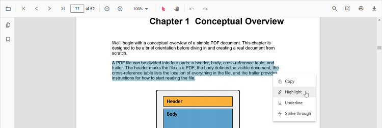
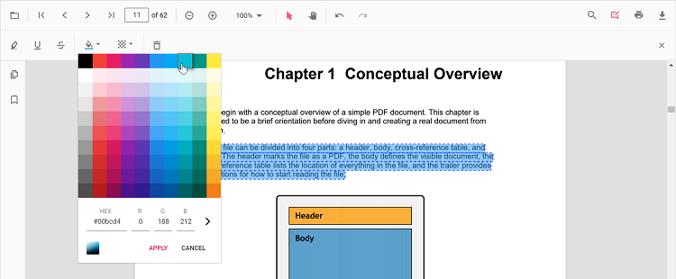
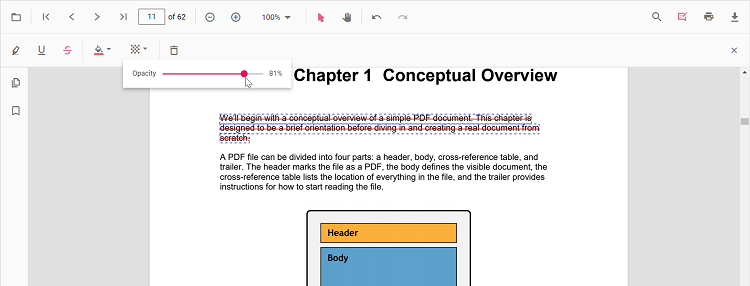
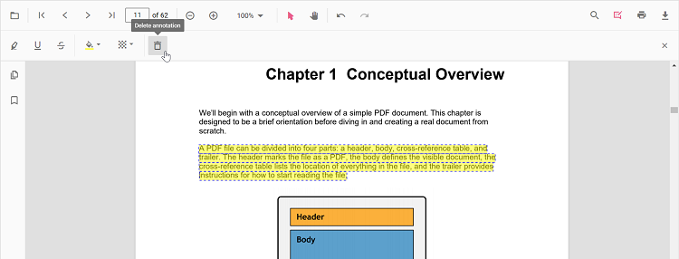

# Highlight annotation in React PDF Viewer

The PDF Viewer provides options to add, edit, and delete Highlight annotations on text. You can add highlights via the UI (context menu or annotation toolbar) and programmatically. You can also customize color, opacity, author/subject, and default settings, and use undo/redo, save, print, or disable highlights as needed.

## Add Highlight Annotation

### Add highlight annotation via UI

You can add highlights in two ways:

1. Using the context menu
- Select text in the PDF document and right-click it.
- Choose **Highlight** in the context menu.

2. Using the annotation toolbar
- Click the **Edit Annotation** button in the PDF Viewer toolbar to open the annotation toolbar.
- Select **Highlight** to enable highlight mode.
- Select text to add the highlight annotation. Alternatively, select text first and then click **Highlight**.

N> When pan mode is active and a text markup mode is entered, the PDF Viewer switches to text selection mode to enable selection.

### Enable Highlight Mode

The PDF Viewer component allows add highlight annotations programmatically after enabling Highlight mode in button clicks.




import * as ReactDOM from 'react-dom/client';
import * as React from 'react';
import './index.css';
import {
  PdfViewerComponent,
  Toolbar, Magnification, Navigation, LinkAnnotation, BookmarkView, ThumbnailView,
  Print, TextSelection, Annotation, FormDesigner, FormFields, TextSearch, Inject
} from '@syncfusion/ej2-react-pdfviewer';

export function App() {
  function enableHighlightMode() {
    const viewer = document.getElementById('container').ej2_instances[0];
    viewer.annotation.setAnnotationMode('Highlight');
  }

  return (
    

      {/* Element to set text markup annotation mode */}
      <button onClick={enableHighlightMode}>Highlight</button>

      

        <PdfViewerComponent
          id="container"
          documentPath="https://cdn.syncfusion.com/content/pdf/pdf-succinctly.pdf"
          resourceUrl="https://cdn.syncfusion.com/ej2/31.2.2/dist/ej2-pdfviewer-lib"
          style={{ height: '640px' }}
        >
          <Inject services={[
            Toolbar, Magnification, Navigation, LinkAnnotation, ThumbnailView,
            BookmarkView, TextSelection, TextSearch, Annotation, FormDesigner, FormFields
          ]}/>
        </PdfViewerComponent>
      

    

  );
}
const root = ReactDOM.createRoot(document.getElementById('sample'));
root.render(<App />);




N> To set up the **server-backed PDF Viewer**, add the below `serviceUrl` in the `index.ts` file: `pdfviewer.serviceUrl = 'https://document.syncfusion.com/web-services/pdf-viewer/api/pdfviewer/';`



#### Exit Highlight mode

To switch back to normal mode from highlight mode:



// Common (Standalone/Server-Backed)
function exitHighlightMode() {
  const viewer = document.getElementById('container').ej2_instances[0];
  viewer.annotation.setAnnotationMode('None');
}

// Add the buttons inside your component JSX:
//
// <button onClick={enableHighlightMode}>Highlight</button>
// <button onClick={exitHighlightMode}>Normal Mode</button>




N> To set up the **server-backed PDF Viewer**, add the below `serviceUrl` in the `index.ts` file:
`pdfviewer.serviceUrl = 'https://document.syncfusion.com/web-services/pdf-viewer/api/pdfviewer/';`



### Add highlight annotation programmatically

Programmatically add highlights using the [addAnnotation](https://ej2.syncfusion.com/documentation/api/pdfviewer/annotation#addannotation) method.




import * as ReactDOM from 'react-dom/client';
import * as React from 'react';
import './index.css';
import {
  PdfViewerComponent,
  Toolbar, Magnification, Navigation, LinkAnnotation, BookmarkView, ThumbnailView,
  Print, TextSelection, TextSearch, Annotation, FormFields, FormDesigner, PageOrganizer, Inject
} from '@syncfusion/ej2-react-pdfviewer';

export function App() {
  function addHighlight() {
    const viewer = document.getElementById('container').ej2_instances[0];
    viewer.annotation.addAnnotation('Highlight', {
      bounds: [{ x: 97, y: 110, width: 350, height: 14 }],
      pageNumber: 1
    });
  }

  return (
    

      <button onClick={addHighlight}>Add TextMarkup annotation programmatically</button>
      

        <PdfViewerComponent
          id="container"
          documentPath="https://cdn.syncfusion.com/content/pdf/pdf-succinctly.pdf"
          resourceUrl="https://cdn.syncfusion.com/ej2/31.2.2/dist/ej2-pdfviewer-lib"
          style={{ height: '640px' }}
        >
          <Inject services={[
            Toolbar, Magnification, Navigation, Annotation, LinkAnnotation, BookmarkView,
            ThumbnailView, Print, TextSelection, TextSearch, FormFields, FormDesigner, PageOrganizer
          ]}/>
        </PdfViewerComponent>
      

    

  );
}
const root = ReactDOM.createRoot(document.getElementById('sample'));
root.render(<App />);




import * as ReactDOM from 'react-dom/client';
import * as React from 'react';
import './index.css';
import {
  PdfViewerComponent,
  Toolbar, Magnification, Navigation, LinkAnnotation, BookmarkView, ThumbnailView,
  Print, TextSelection, TextSearch, Annotation, FormFields, FormDesigner, PageOrganizer, Inject
} from '@syncfusion/ej2-react-pdfviewer';

export function App() {
  function addHighlight() {
    const viewer = document.getElementById('container').ej2_instances[0];
    viewer.annotation.addAnnotation('Highlight', {
      bounds: [{ x: 97, y: 110, width: 350, height: 14 }],
      pageNumber: 1
    });
  }

  return (
    

      <button onClick={addHighlight}>Add TextMarkup annotation programmatically</button>
      

        <PdfViewerComponent
          id="container"
          documentPath="https://cdn.syncfusion.com/content/pdf/pdf-succinctly.pdf"
          serviceUrl="https://document.syncfusion.com/web-services/pdf-viewer/api/pdfviewer"
          style={{ height: '640px' }}
        >
          <Inject services={[
            Toolbar, Magnification, Navigation, Annotation, LinkAnnotation, BookmarkView,
            ThumbnailView, Print, TextSelection, TextSearch, FormFields, FormDesigner, PageOrganizer
          ]}/>
        </PdfViewerComponent>
      

    

  );
}
const root = ReactDOM.createRoot(document.getElementById('sample'));
root.render(<App />);




## Edit Highlight Annotation

### Edit highlight annotation in UI

You can select a highlight to change its appearance or remove it:
- Change appearance using the annotation toolbar: Edit Color and Edit Opacity.
- Delete using Delete/Backspace keys or the Delete Annotation button in the annotation toolbar.

#### Edit color
Use the color palette in the Edit Color tool to change the annotation color.

#### Edit opacity
Use the range slider in the Edit Opacity tool to change annotation opacity.

#### Delete highlight annotation
- Select the annotation and press Delete, or
- Click **Delete Annotation** in the annotation toolbar.

### Edit highlight annotation programmatically

Modify an existing highlight programmatically using `editAnnotation()`.




import * as ReactDOM from 'react-dom/client';
import * as React from 'react';
import './index.css';
import {
  PdfViewerComponent,
  Toolbar, Magnification, Navigation, LinkAnnotation, BookmarkView, ThumbnailView,
  Print, TextSelection, TextSearch, Annotation, FormFields, FormDesigner, PageOrganizer, Inject
} from '@syncfusion/ej2-react-pdfviewer';

export function App() {
  function editHighlight() {
    const viewer = document.getElementById('container').ej2_instances[0];
    for (let i = 0; i < viewer.annotationCollection.length; i++) {
      const annot = viewer.annotationCollection[i];
      if (annot.textMarkupAnnotationType === 'Highlight') {
        annot.color = '#000fff';   // ensure valid hex string, e.g., '#000fff'
        annot.opacity = 0.8;
        viewer.annotation.editAnnotation(annot);
        break;
      }
    }
  }

  return (
    

      <button onClick={editHighlight}>Edit Highlight annotation Programmatically</button>
      

        <PdfViewerComponent
          id="container"
          documentPath="https://cdn.syncfusion.com/content/pdf/pdf-succinctly.pdf"
          resourceUrl="https://cdn.syncfusion.com/ej2/31.2.2/dist/ej2-pdfviewer-lib"
          style={{ height: '640px' }}
        >
          <Inject services={[
            Toolbar, Magnification, Navigation, Annotation, LinkAnnotation, BookmarkView,
            ThumbnailView, Print, TextSelection, TextSearch, FormFields, FormDesigner, PageOrganizer
          ]}/>
        </PdfViewerComponent>
      

    

  );
}
const root = ReactDOM.createRoot(document.getElementById('sample'));
root.render(<App />);




import * as ReactDOM from 'react-dom/client';
import * as React from 'react';
import './index.css';
import {
  PdfViewerComponent,
  Toolbar, Magnification, Navigation, LinkAnnotation, BookmarkView, ThumbnailView,
  Print, TextSelection, TextSearch, Annotation, FormFields, FormDesigner, PageOrganizer, Inject
} from '@syncfusion/ej2-react-pdfviewer';

export function App() {
  function editHighlight() {
    const viewer = document.getElementById('container').ej2_instances[0];
    for (let i = 0; i < viewer.annotationCollection.length; i++) {
      const annot = viewer.annotationCollection[i];
      if (annot.textMarkupAnnotationType === 'Highlight') {
        annot.color = '#000fff';
        annot.opacity = 0.8;
        viewer.annotation.editAnnotation(annot);
        break;
      }
    }
  }

  return (
    

      <button onClick={editHighlight}>Edit Highlight annotation Programmatically</button>
      

        <PdfViewerComponent
          id="container"
          documentPath="https://cdn.syncfusion.com/content/pdf/pdf-succinctly.pdf"
          serviceUrl="https://document.syncfusion.com/web-services/pdf-viewer/api/pdfviewer"
          style={{ height: '640px' }}
        >
          <Inject services={[
            Toolbar, Magnification, Navigation, Annotation, LinkAnnotation, BookmarkView,
            ThumbnailView, Print, TextSelection, TextSearch, FormFields, FormDesigner, PageOrganizer
          ]}/>
        </PdfViewerComponent>
      

    

  );
}
const root = ReactDOM.createRoot(document.getElementById('sample'));
root.render(<App />);




## Set default properties during control initialization

Set default properties before creating the control using `highlightSettings`.

> After editing default color and opacity using the Edit Color and Edit Opacity tools, the values update to the selected settings.

Refer to the following code snippet to set the default highlight settings.




import * as ReactDOM from 'react-dom/client';
import * as React from 'react';
import './index.css';
import {
  PdfViewerComponent,
  Toolbar, Magnification, Navigation, LinkAnnotation, BookmarkView, ThumbnailView,
  Print, TextSelection, Annotation, Inject
} from '@syncfusion/ej2-react-pdfviewer';

export function App() {
  return (
    

      

        <PdfViewerComponent
          id="container"
          documentPath="https://cdn.syncfusion.com/content/pdf/pdf-succinctly.pdf"
          resourceUrl="https://cdn.syncfusion.com/ej2/31.2.2/dist/ej2-pdfviewer-lib"
          highlightSettings={{ author: 'Guest User', subject: 'Important', color: '#ffff00', opacity: 0.9 }}
          style={{ height: '640px' }}
        >
          <Inject services={[Toolbar, Magnification, Navigation, LinkAnnotation, ThumbnailView, BookmarkView, TextSelection, Annotation]}/>
        </PdfViewerComponent>
      

    

  )
}
const root = ReactDOM.createRoot(document.getElementById('sample'));
root.render(<App />);




import * as ReactDOM from 'react-dom/client';
import * as React from 'react';
import './index.css';
import {
  PdfViewerComponent,
  Toolbar, Magnification, Navigation, LinkAnnotation, BookmarkView, ThumbnailView,
  Print, TextSelection, Annotation, Inject
} from '@syncfusion/ej2-react-pdfviewer';

export function App() {
  return (
    

      

        <PdfViewerComponent
          id="container"
          documentPath="https://cdn.syncfusion.com/content/pdf/pdf-succinctly.pdf"
          serviceUrl="https://document.syncfusion.com/web-services/pdf-viewer/api/pdfviewer"
          highlightSettings={{ author: 'Guest User', subject: 'Important', color: '#ffff00', opacity: 0.9 }}
          style={{ height: '640px' }}
        >
          <Inject services={[Toolbar, Magnification, Navigation, LinkAnnotation, ThumbnailView, BookmarkView, TextSelection, Annotation]}/>
        </PdfViewerComponent>
      

    

  )
}
const root = ReactDOM.createRoot(document.getElementById('sample'));
root.render(<App />);




## Set properties while adding Individual Annotation

Set properties for individual annotation before creating the control using `highlightSettings`.

> After editing default color and opacity using the Edit Color and Edit Opacity tools, the values update to the selected settings.

Refer to the following code snippet to set the default highlight settings.



i
import * as ReactDOM from 'react-dom/client';
import * as React from 'react';
import './index.css';
import {
  PdfViewerComponent,
  Toolbar, Magnification, Navigation, LinkAnnotation, BookmarkView, ThumbnailView,
  Print, TextSelection, TextSearch, Annotation, FormFields, FormDesigner, Inject
} from '@syncfusion/ej2-react-pdfviewer';

export function App() {
  function addIndividualHighlights() {
    const viewer = document.getElementById('container').ej2_instances[0];

    // First highlight
    viewer.annotation.addAnnotation('Highlight', {
      bounds: [{ x: 97, y: 110, width: 350, height: 14 }],
      pageNumber: 1,
      author: 'User 1',
      color: '#ffff00',
      opacity: 0.9
    });

    // Second highlight
    viewer.annotation.addAnnotation('Highlight', {
      bounds: [{ x: 107, y: 220, width: 350, height: 14 }],
      pageNumber: 1,
      author: 'User 2',
      color: '#ff1010ff', // ensure this matches your version's color format (hex)
      opacity: 0.9
    });
  }

  return (
    

      <button onClick={addIndividualHighlights}>Add Highlight</button>
      

        <PdfViewerComponent
          id="container"
          documentPath="https://cdn.syncfusion.com/content/pdf/form-designer.pdf"
          resourceUrl="https://cdn.syncfusion.com/ej2/31.2.2/dist/ej2-pdfviewer-lib"
          style={{ height: '640px' }}
        >
          <Inject services={[
            Toolbar, Magnification, Navigation, Annotation, LinkAnnotation, BookmarkView,
            ThumbnailView, Print, TextSelection, TextSearch, FormFields, FormDesigner
          ]}/>
        </PdfViewerComponent>
      

    

  )
}
const root = ReactDOM.createRoot(document.getElementById('sample'));
root.render(<App />);




import * as ReactDOM from 'react-dom/client';
import * as React from 'react';
import './index.css';
import {
  PdfViewerComponent,
  Toolbar, Magnification, Navigation, LinkAnnotation, BookmarkView, ThumbnailView,
  Print, TextSelection, TextSearch, Annotation, FormFields, FormDesigner, Inject
} from '@syncfusion/ej2-react-pdfviewer';

export function App() {
  function addIndividualHighlights() {
    const viewer = document.getElementById('container').ej2_instances[0];

    viewer.annotation.addAnnotation('Highlight', {
      bounds: [{ x: 97, y: 110, width: 350, height: 14 }],
      pageNumber: 1,
      author: 'User 1',
      color: '#ffff00',
      opacity: 0.9
    });

    viewer.annotation.addAnnotation('Highlight', {
      bounds: [{ x: 107, y: 220, width: 350, height: 14 }],
      pageNumber: 1,
      author: 'User 2',
      color: '#ff1010ff',
      opacity: 0.9
    });
  }

  return (
    

      <button onClick={addIndividualHighlights}>Add Highlight</button>
      

        <PdfViewerComponent
          id="container"
          documentPath="https://cdn.syncfusion.com/content/pdf/form-designer.pdf"
          serviceUrl="https://document.syncfusion.com/web-services/pdf-viewer/api/pdfviewer"
          style={{ height: '640px' }}
        >
          <Inject services={[
            Toolbar, Magnification, Navigation, Annotation, LinkAnnotation, BookmarkView,
            ThumbnailView, Print, TextSelection, TextSearch, FormFields, FormDesigner
          ]}/>
        </PdfViewerComponent>
      

    

  )
}
const root = ReactDOM.createRoot(document.getElementById('sample'));
root.render(<App />);




## Disable highlight annotation

Disable text markup annotations (including highlight) using the `enableTextMarkupAnnotation` property.




import * as ReactDOM from 'react-dom/client';
import * as React from 'react';
import './index.css';
import {
  PdfViewerComponent,
  Toolbar, Magnification, Navigation, LinkAnnotation, BookmarkView, ThumbnailView,
  Print, TextSelection, Annotation, Inject
} from '@syncfusion/ej2-react-pdfviewer';

export function App() {
  return (
    

      

        <PdfViewerComponent
          id="container"
          documentPath="https://cdn.syncfusion.com/content/pdf/pdf-succinctly.pdf"
          enableTextMarkupAnnotation={false}
          style={{ height: '640px' }}
        >
          <Inject services={[Toolbar, Magnification, Navigation, LinkAnnotation, ThumbnailView, BookmarkView, TextSelection, Annotation]}/>
        </PdfViewerComponent>
      

    

  )
}
const root = ReactDOM.createRoot(document.getElementById('sample'));
root.render(<App />);




import * as ReactDOM from 'react-dom/client';
import * as React from 'react';
import './index.css';
import {
  PdfViewerComponent,
  Toolbar, Magnification, Navigation, LinkAnnotation, BookmarkView, ThumbnailView,
  Print, TextSelection, Annotation, Inject
} from '@syncfusion/ej2-react-pdfviewer';

export function App() {
  return (
    

      

        <PdfViewerComponent
          id="container"
          documentPath="https://cdn.syncfusion.com/content/pdf/pdf-succinctly.pdf"
          serviceUrl="https://document.syncfusion.com/web-services/pdf-viewer/api/pdfviewer"
          enableTextMarkupAnnotation={false}
          style={{ height: '640px' }}
        >
          <Inject services={[Toolbar, Magnification, Navigation, LinkAnnotation, ThumbnailView, BookmarkView, TextSelection, Annotation]}/>
        </PdfViewerComponent>
      

    

  )
}
const root = ReactDOM.createRoot(document.getElementById('sample'));
root.render(<App />);




[View Sample on GitHub](https://github.com/SyncfusionExamples/typescript-pdf-viewer-examples/tree/master)

## See also

- [Annotation Overview](../overview)
- [Annotation Toolbar](../../toolbar-customization/annotation-toolbar)
- [Create and Modify Annotation](../../annotations/create-modify-annotation)
- [Customize Annotation](../../annotations/customize-annotation)
- [Remove Annotation](../../annotations/delete-annotation)
- [Handwritten Signature](../../annotations/signature-annotation)
- [Export and Import Annotation](../../annotations/export-import/export-annotation)
- [Annotation in Mobile View](../../annotations/annotations-in-mobile-view)
- [Annotation Events](../../annotations/annotation-event)
- [Annotation API](../../annotations/annotations-api)