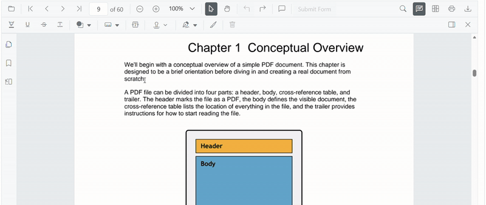
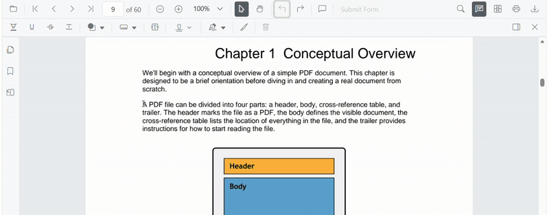

# Highlight Annotation (Text Markup) in React PDF Viewer

This guide explains how to **enable**, **apply**, **customize**, and **manage** *Highlight* text markup annotations in the Syncfusion **React PDF Viewer**.
You can highlight text using the toolbar or context menu, programmatically invoke highlight mode, customize default settings, handle events, and export the PDF with annotations.

---

## Enable Highlight in the Viewer

To enable Highlight annotations, inject the following modules into the React PDF Viewer:

- [**Annotation**](https://ej2.syncfusion.com/react/documentation/api/pdfviewer/index-default#annotation)
- [**TextSelection**](https://ej2.syncfusion.com/react/documentation/api/pdfviewer/index-default#textselection)
- [**TextSearch**](https://ej2.syncfusion.com/react/documentation/api/pdfviewer/index-default#textsearch)
- [**Toolbar**](https://ej2.syncfusion.com/react/documentation/api/pdfviewer/index-default#toolbar)

This minimal setup enables UI interactions like selection and highlighting.




import * as React from 'react';
import * as ReactDOM from 'react-dom/client';
import {
  PdfViewerComponent,
  Inject,
  Toolbar,
  Annotation,
  TextSelection,
  TextSearch
} from '@syncfusion/ej2-react-pdfviewer';

function App() {
  return (
    <PdfViewerComponent
      id="container"
      documentPath="https://cdn.syncfusion.com/content/pdf/pdf-succinctly.pdf"
      resourceUrl="https://cdn.syncfusion.com/ej2/31.2.2/dist/ej2-pdfviewer-lib"
      style={{ height: '650px' }}
    >
      <Inject services={[Toolbar, Annotation, TextSelection, TextSearch]} />
    </PdfViewerComponent>
  );
}

ReactDOM.createRoot(document.getElementById('sample')).render(<App />);




---

## Apply Highlight Using the Toolbar

1. Select the text you want to highlight.
2. Click the **Highlight** icon in the annotation toolbar.
   - If **Pan Mode** is active, the viewer automatically switches to **Text Selection** mode.

---

## Apply Highlight Programmatically

Switch the viewer into highlight mode using `setAnnotationMode('Highlight')`.




function enableHighlight() {
  const viewer = document.getElementById('container').ej2_instances[0];
  viewer.annotation.setAnnotationMode('Highlight');
}




### Exit Highlight Mode  

Switch back to normal mode using:




function disableHighlightMode() {
  const viewer = document.getElementById('container').ej2_instances[0];
  viewer.annotation.setAnnotationMode('None');
}




### Add Highlight Programmatically (with bounds)

Use [`addAnnotation()`](https://ej2.syncfusion.com/react/documentation/api/pdfviewer/index-default#addannotation) to insert highlight at a specific location.




function addHighlight() {
  const viewer = document.getElementById('container').ej2_instances[0];

  viewer.annotation.addAnnotation('Highlight', {
    bounds: [{ x: 97, y: 110, width: 350, height: 14 }],
    pageNumber: 1
  });
}




## Add Multiple Highlights with Individual Properties  
You can also supply custom per‑annotation settings:




function addMultipleHighlights() {
  const viewer = document.getElementById('container').ej2_instances[0];

  // Highlight 1
  viewer.annotation.addAnnotation('Highlight', {
    bounds: [{ x: 100, y: 150, width: 320, height: 14 }],
    pageNumber: 1,
    author: 'User 1',
    color: '#ffff00',
    opacity: 0.9
  });

  // Highlight 2
  viewer.annotation.addAnnotation('Highlight', {
    bounds: [{ x: 110, y: 220, width: 300, height: 14 }],
    pageNumber: 1,
    author: 'User 2',
    color: '#ff1010',
    opacity: 0.9
  });
}




---

## Customize Highlight Appearance

Configure default highlight settings such as **color**, **opacity**, and **author** using [`highlightSettings`](https://ej2.syncfusion.com/react/documentation/api/pdfviewer/index-default#highlightsettings).




<PdfViewerComponent
  id="container"
  documentPath="https://cdn.syncfusion.com/content/pdf/pdf-succinctly.pdf"
  resourceUrl="https://cdn.syncfusion.com/ej2/31.2.2/dist/ej2-pdfviewer-lib"
  height="650px"
  highlightSettings={{
    author: 'Guest User',
    subject: 'Important',
    color: '#ffff00',
    opacity: 0.9
  }}
>
  <Inject services={[Toolbar, Annotation, TextSelection, TextSearch]} />
</PdfViewerComponent>




---

## Manage Highlight (Edit, Delete, Comment)

### Edit Highlight Appearance (UI)
Use the annotation toolbar:
- **Edit Color** tool  

- **Edit Opacity** slider

---

### Delete Highlight
- Press **Delete** key, or
- Use **Delete Annotation** in the toolbar

---

### Edit Highlight Programmatically

Modify an existing highlight programmatically using `editAnnotation()`.




function editHighlightProgrammatically() {
  const viewer = document.getElementById('container').ej2_instances[0];

  for (let annot of viewer.annotationCollection) {
    if (annot.textMarkupAnnotationType === 'Highlight') {
      annot.color = '#0000ff';
      annot.opacity = 0.8;
      viewer.annotation.editAnnotation(annot);
      break;
    }
  }
}




---

### Comments
Use the [**Comments panel**](../comments) for threaded discussions on highlight annotations.

---

## Use the Context Menu with Highlight

Right-click a selected text region → select **Highlight**.

To customize menu items, refer to [**Customize Context Menu**](../../context-menu/custom-context-menu) documentation.

---

## Handle Highlight Events

Subscribe to annotation lifecycle events.




function onAnnotationAdd(args) {
  console.log('Highlight added:', args);
}

<PdfViewerComponent
  id="container"
  annotationAdd={onAnnotationAdd}
/>




See [**Annotation Events**](../annotation-event) page for full list and parameter details.

---

## Disable TextMarkup Annotation
Disable text markup annotations (including highlight) using the [`enableTextMarkupAnnotation`](https://ej2.syncfusion.com/react/documentation/api/pdfviewer/index-default#enabletextmarkupannotation) property.




<PdfViewerComponent
  id="container"
  enableTextMarkupAnnotation={false}
  documentPath="https://cdn.syncfusion.com/content/pdf/pdf-succinctly.pdf"
  resourceUrl="https://cdn.syncfusion.com/ej2/31.2.2/dist/ej2-pdfviewer-lib"
  style={{ height: '650px' }}
>
  <Inject services={[Toolbar, Annotation, TextSelection, TextSearch]} />
</PdfViewerComponent>




---

## Save and Export

Use the [**Download**](../../download) tool to export the PDF with highlight annotations included. The original document remains unchanged.

---

## See Also

- [Annotation Toolbar](../../toolbar-customization/annotation-toolbar)
- [Customize Context Menu](../../context-menu/custom-context-menu)
- [Comments Panel](../comments)
- [Annotation Events](../annotation-event)
