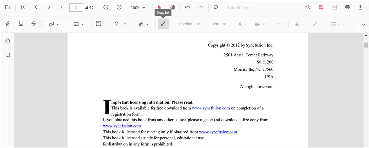

# Ink (freehand) annotation in React PDF Viewer

Ink is a freehand drawing annotation used to sketch, sign, or mark up content.

## Add Ink Annotation

### Add ink annotation via UI

Use the annotation toolbar:
- Click the Edit Annotation button in the PDF Viewer toolbar.
- Click the Draw Ink button to enable ink mode.
- Draw on any page of the PDF document.

### Enable ink mode

The PDF Viewer component allows add ink annotations programmatically after enabling ink mode in button clicks.




import * as ReactDOM from 'react-dom/client';
import * as React from 'react';
import './index.css';
import {
  PdfViewerComponent,
  Toolbar, Magnification, Navigation, LinkAnnotation, BookmarkView, ThumbnailView,
  Print, TextSelection, TextSearch, Annotation, FormFields, FormDesigner, PageOrganizer, Inject
} from '@syncfusion/ej2-react-pdfviewer';

export function App() {
  function inkMode() {
    const viewer = document.getElementById('container').ej2_instances[0];
    viewer.annotation.setAnnotationMode('Ink');
  }

  return (
    

      <button onClick={inkMode}>Ink Annotation</button>
      

        <PdfViewerComponent
          id="container"
          documentPath="https://cdn.syncfusion.com/content/pdf/pdf-succinctly.pdf"
          resourceUrl="https://cdn.syncfusion.com/ej2/31.2.2/dist/ej2-pdfviewer-lib"
          style={{ height: '640px' }}
        >
          <Inject services={[
            Toolbar, Magnification, Navigation, Annotation, LinkAnnotation, BookmarkView,
            ThumbnailView, Print, TextSelection, TextSearch, FormFields, FormDesigner, PageOrganizer
          ]}/>
        </PdfViewerComponent>
      

    

  );
}
const root = ReactDOM.createRoot(document.getElementById('sample'));
root.render(<App />);




#### Exit ink mode




// Common (works for both Standalone and Server-Backed)
function exitMode() {
  const viewer = document.getElementById('container').ej2_instances[0];
  viewer.annotation.setAnnotationMode('None');
}

// In your JSX:
// <button onClick={exitMode}>Normal Mode</button>




### Add ink annotation programmatically

Use addAnnotation to programmatically create an Ink annotation.




import * as ReactDOM from 'react-dom/client';
import * as React from 'react';
import './index.css';
import {
  PdfViewerComponent,
  Toolbar, Magnification, Navigation, LinkAnnotation, BookmarkView, ThumbnailView,
  Print, TextSelection, TextSearch, Annotation, FormFields, FormDesigner, PageOrganizer, Inject
} from '@syncfusion/ej2-react-pdfviewer';

export function App() {
  function addInkProgram() {
    const viewer = document.getElementById('container').ej2_instances[0];
    viewer.annotation.addAnnotation('Ink', {
      offset: { x: 150, y: 100 },
      pageNumber: 1,
      width: 200,
      height: 60,
      path: '[{"command":"M","x":244.83,"y":982.00},{"command":"L","x":250.83,"y":953.33}]'
    });
  }

  return (
    

      <button onClick={addInkProgram}>Add Ink Annotation Programmatically</button>
      

        <PdfViewerComponent
          id="container"
          documentPath="https://cdn.syncfusion.com/content/pdf/pdf-succinctly.pdf"
          resourceUrl="https://cdn.syncfusion.com/ej2/31.2.2/dist/ej2-pdfviewer-lib"
          style={{ height: '640px' }}
        >
          <Inject services={[
            Toolbar, Magnification, Navigation, Annotation, LinkAnnotation, BookmarkView,
            ThumbnailView, Print, TextSelection, TextSearch, FormFields, FormDesigner, PageOrganizer
          ]}/>
        </PdfViewerComponent>
      

    

  );
}
const root = ReactDOM.createRoot(document.getElementById('sample'));
root.render(<App />);




import * as ReactDOM from 'react-dom/client';
import * as React from 'react';
import './index.css';
import {
  PdfViewerComponent,
  Toolbar, Magnification, Navigation, LinkAnnotation, BookmarkView, ThumbnailView,
  Print, TextSelection, TextSearch, Annotation, FormFields, FormDesigner, PageOrganizer, Inject
} from '@syncfusion/ej2-react-pdfviewer';

export function App() {
  function addInkProgram() {
    const viewer = document.getElementById('container').ej2_instances[0];
    viewer.annotation.addAnnotation('Ink', {
      offset: { x: 150, y: 100 },
      pageNumber: 1,
      width: 200,
      height: 60,
      path: '[{"command":"M","x":244.83,"y":982.00},{"command":"L","x":250.83,"y":953.33}]'
    });
  }

  return (
    

      <button onClick={addInkProgram}>Add Ink Annotation Programmatically</button>
      

        <PdfViewerComponent
          id="container"
          documentPath="https://cdn.syncfusion.com/content/pdf/pdf-succinctly.pdf"
          serviceUrl="https://document.syncfusion.com/web-services/pdf-viewer/api/pdfviewer"
          style={{ height: '640px' }}
        >
          <Inject services={[
            Toolbar, Magnification, Navigation, Annotation, LinkAnnotation, BookmarkView,
            ThumbnailView, Print, TextSelection, TextSearch, FormFields, FormDesigner, PageOrganizer
          ]}/>
        </PdfViewerComponent>
      

    

  );
}
const root = ReactDOM.createRoot(document.getElementById('sample'));
root.render(<App />);




## Edit Ink Annotation

### Edit ink annotation in UI

You can select, move, and resize Ink annotations directly in the viewer:
- Select an Ink annotation to show its handles.
- Move: drag inside the stroke to reposition it on the page.
- Resize: drag the selector handles to adjust its bounds.
- Delete or access more options from the context menu.

#### Edit the properties of ink annotations

Stroke color, thickness, and opacity can be edited using the Edit Stroke Color, Edit Thickness, and Edit Opacity tools in the annotation toolbar.

#### Edit stroke color

Edit the stroke color using the color palette in the Edit Stroke Color tool.

#### Edit thickness

Edit thickness using the range slider in the Edit Thickness tool.

#### Edit opacity

Edit opacity using the range slider in the Edit Opacity tool.

### Edit an existing ink annotation programmatically

Use editAnnotation to modify properties and bounds of an existing ink annotation.




import * as ReactDOM from 'react-dom/client';
import * as React from 'react';
import './index.css';
import {
  PdfViewerComponent,
  Toolbar, Magnification, Navigation, LinkAnnotation, BookmarkView, ThumbnailView,
  Print, TextSelection, TextSearch, Annotation, FormFields, FormDesigner, PageOrganizer, Inject
} from '@syncfusion/ej2-react-pdfviewer';

export function App() {
  function editInkAnnotation() {
    const viewer = document.getElementById('container').ej2_instances[0];
    for (let i = 0; i < viewer.annotationCollection.length; i++) {
      const ann = viewer.annotationCollection[i];
      if (ann.shapeAnnotationType === 'Ink') {
        const { width, height } = ann.bounds;
        ann.bounds = { x: 100, y: 100, width, height };
        ann.strokeColor = '#0000FF';
        ann.thickness = 2;
        ann.annotationSelectorSettings.resizerShape = 'Circle';
        viewer.annotation.editAnnotation(ann);
      }
    }
  }

  return (
    

      <button onClick={editInkAnnotation}>Edit Ink Annotation Programmatically</button>
      

        <PdfViewerComponent
          id="container"
          documentPath="https://cdn.syncfusion.com/content/pdf/pdf-succinctly.pdf"
          resourceUrl="https://cdn.syncfusion.com/ej2/31.2.2/dist/ej2-pdfviewer-lib"
          style={{ height: '640px' }}
        >
          <Inject services={[
            Toolbar, Magnification, Navigation, Annotation, LinkAnnotation, BookmarkView,
            ThumbnailView, Print, TextSelection, TextSearch, FormFields, FormDesigner, PageOrganizer
          ]}/>
        </PdfViewerComponent>
      

    

  );
}
const root = ReactDOM.createRoot(document.getElementById('sample'));
root.render(<App />);




import * as ReactDOM from 'react-dom/client';
import * as React from 'react';
import './index.css';
import {
  PdfViewerComponent,
  Toolbar, Magnification, Navigation, LinkAnnotation, BookmarkView, ThumbnailView,
  Print, TextSelection, TextSearch, Annotation, FormFields, FormDesigner, PageOrganizer, Inject
} from '@syncfusion/ej2-react-pdfviewer';

export function App() {
  function editInkAnnotation() {
    const viewer = document.getElementById('container').ej2_instances[0];
    for (let i = 0; i < viewer.annotationCollection.length; i++) {
      const ann = viewer.annotationCollection[i];
      if (ann.shapeAnnotationType === 'Ink') {
        const { width, height } = ann.bounds;
        ann.bounds = { x: 100, y: 100, width, height };
        ann.strokeColor = '#0000FF';
        ann.thickness = 2;
        ann.annotationSelectorSettings.resizerShape = 'Circle';
        viewer.annotation.editAnnotation(ann);
      }
    }
  }

  return (
    

      <button onClick={editInkAnnotation}>Edit Ink Annotation Programmatically</button>
      

        <PdfViewerComponent
          id="container"
          documentPath="https://cdn.syncfusion.com/content/pdf/pdf-succinctly.pdf"
          serviceUrl="https://document.syncfusion.com/web-services/pdf-viewer/api/pdfviewer"
          style={{ height: '640px' }}
        >
          <Inject services={[
            Toolbar, Magnification, Navigation, Annotation, LinkAnnotation, BookmarkView,
            ThumbnailView, Print, TextSelection, TextSearch, FormFields, FormDesigner, PageOrganizer
          ]}/>
        </PdfViewerComponent>
      

    

  );
}
const root = ReactDOM.createRoot(document.getElementById('sample'));
root.render(<App />);




## Default ink settings during initialization

Set defaults using inkAnnotationSettings.




import * as ReactDOM from 'react-dom/client';
import * as React from 'react';
import './index.css';
import {
  PdfViewerComponent,
  Toolbar, Magnification, Navigation, LinkAnnotation, BookmarkView, ThumbnailView,
  Print, TextSelection, TextSearch, Annotation, FormFields, FormDesigner, PageOrganizer, Inject
} from '@syncfusion/ej2-react-pdfviewer';

export function App() {
  return (
    

      

        <PdfViewerComponent
          id="container"
          documentPath="https://cdn.syncfusion.com/content/pdf/pdf-succinctly.pdf"
          resourceUrl="https://cdn.syncfusion.com/ej2/31.2.2/dist/ej2-pdfviewer-lib"
          inkAnnotationSettings={{ author: 'Syncfusion', strokeColor: 'green', thickness: 3, opacity: 0.6 }}
          style={{ height: '640px' }}
        >
          <Inject services={[
            Toolbar, Magnification, Navigation, Annotation, LinkAnnotation, BookmarkView,
            ThumbnailView, Print, TextSelection, TextSearch, FormFields, FormDesigner, PageOrganizer
          ]}/>
        </PdfViewerComponent>
      

    

  );
}
const root = ReactDOM.createRoot(document.getElementById('sample'));
root.render(<App />);




import * as ReactDOM from 'react-dom/client';
import * as React from 'react';
import './index.css';
import {
  PdfViewerComponent,
  Toolbar, Magnification, Navigation, LinkAnnotation, BookmarkView, ThumbnailView,
  Print, TextSelection, TextSearch, Annotation, FormFields, FormDesigner, PageOrganizer, Inject
} from '@syncfusion/ej2-react-pdfviewer';

export function App() {
  return (
    

      

        <PdfViewerComponent
          id="container"
          documentPath="https://cdn.syncfusion.com/content/pdf/pdf-succinctly.pdf"
          serviceUrl="https://document.syncfusion.com/web-services/pdf-viewer/api/pdfviewer"
          inkAnnotationSettings={{ author: 'Syncfusion', strokeColor: 'green', thickness: 3, opacity: 0.6 }}
          style={{ height: '640px' }}
        >
          <Inject services={[
            Toolbar, Magnification, Navigation, Annotation, LinkAnnotation, BookmarkView,
            ThumbnailView, Print, TextSelection, TextSearch, FormFields, FormDesigner, PageOrganizer
          ]}/>
        </PdfViewerComponent>
      

    

  );
}
const root = ReactDOM.createRoot(document.getElementById('sample'));
root.render(<App />);




## Set properties while adding Individual Annotation

Set properties for individual annotation before creating the control using `InkSettings`.

> After editing default color and opacity using the Edit Color and Edit Opacity tools, the values update to the selected settings.

Refer to the following code snippet to set the default Ink settings.




import * as ReactDOM from 'react-dom/client';
import * as React from 'react';
import './index.css';
import {
  PdfViewerComponent,
  Toolbar, Magnification, Navigation, LinkAnnotation, BookmarkView, ThumbnailView,
  Print, TextSelection, TextSearch, Annotation, FormFields, FormDesigner, Inject
} from '@syncfusion/ej2-react-pdfviewer';

export function App() {
  function addInkWithSettings() {
    const viewer = document.getElementById('container').ej2_instances[0];
    viewer.annotation.addAnnotation('Ink', {
      offset: { x: 150, y: 100 },
      pageNumber: 1,
      width: 200,
      height: 60,
      path: '[{"command":"M","x":244.83,"y":982.00},{"command":"L","x":250.83,"y":953.33}]',
      author: 'Syncfusion',
      strokeColor: 'green',
      thickness: 3,
      opacity: 0.6
    });
  }

  return (
    

      <button onClick={addInkWithSettings}>Add Ink</button>
      

        <PdfViewerComponent
          id="container"
          documentPath="https://cdn.syncfusion.com/content/pdf/form-designer.pdf"
          resourceUrl="https://cdn.syncfusion.com/ej2/31.2.2/dist/ej2-pdfviewer-lib"
          style={{ height: '640px' }}
        >
          <Inject services={[
            Toolbar, Magnification, Navigation, Annotation, LinkAnnotation, BookmarkView,
            ThumbnailView, Print, TextSelection, TextSearch, FormFields, FormDesigner
          ]}/>
        </PdfViewerComponent>
      

    

  );
}
const root = ReactDOM.createRoot(document.getElementById('sample'));
root.render(<App />);




import * as ReactDOM from 'react-dom/client';
import * as React from 'react';
import './index.css';
import {
  PdfViewerComponent,
  Toolbar, Magnification, Navigation, LinkAnnotation, BookmarkView, ThumbnailView,
  Print, TextSelection, TextSearch, Annotation, FormFields, FormDesigner, Inject
} from '@syncfusion/ej2-react-pdfviewer';

export function App() {
  function addInkWithSettings() {
    const viewer = document.getElementById('container').ej2_instances[0];
    viewer.annotation.addAnnotation('Ink', {
      offset: { x: 150, y: 100 },
      pageNumber: 1,
      width: 200,
      height: 60,
      path: '[{"command":"M","x":244.83,"y":982.00},{"command":"L","x":250.83,"y":953.33}]',
      author: 'Syncfusion',
      strokeColor: 'green',
      thickness: 3,
      opacity: 0.6
    });
  }

  return (
    

      <button onClick={addInkWithSettings}>Add Ink</button>
      

        <PdfViewerComponent
          id="container"
          documentPath="https://cdn.syncfusion.com/content/pdf/form-designer.pdf"
          serviceUrl="https://document.syncfusion.com/web-services/pdf-viewer/api/pdfviewer"
          style={{ height: '640px' }}
        >
          <Inject services={[
            Toolbar, Magnification, Navigation, Annotation, LinkAnnotation, BookmarkView,
            ThumbnailView, Print, TextSelection, TextSearch, FormFields, FormDesigner
          ]}/>
        </PdfViewerComponent>
      

    

  );
}
const root = ReactDOM.createRoot(document.getElementById('sample'));
root.render(<App />);




[View Sample on GitHub](https://github.com/SyncfusionExamples/typescript-pdf-viewer-examples/tree/master)

## See also

- [Annotation Overview](../overview)
- [Annotation Toolbar](../../toolbar-customization/annotation-toolbar)
- [Create and Modify Annotation](../../annotations/create-modify-annotation)
- [Customize Annotation](../../annotations/customize-annotation)
- [Remove Annotation](../../annotations/delete-annotation)
- [Handwritten Signature](../../annotations/signature-annotation)
- [Export and Import Annotation](../../annotations/export-import/export-annotation)
- [Annotation in Mobile View](../../annotations/annotations-in-mobile-view)
- [Annotation Events](../../annotations/annotation-event)
- [Annotation API](../../annotations/annotations-api)