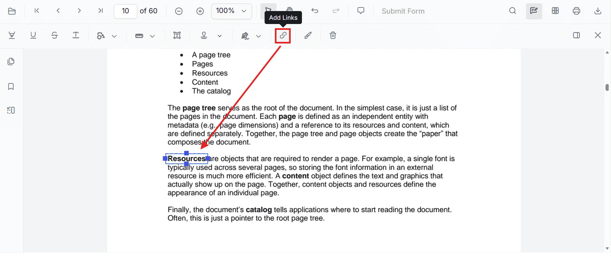
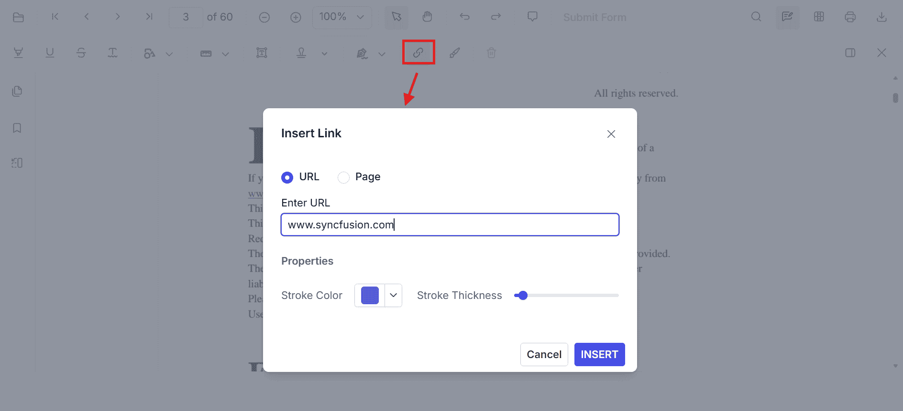
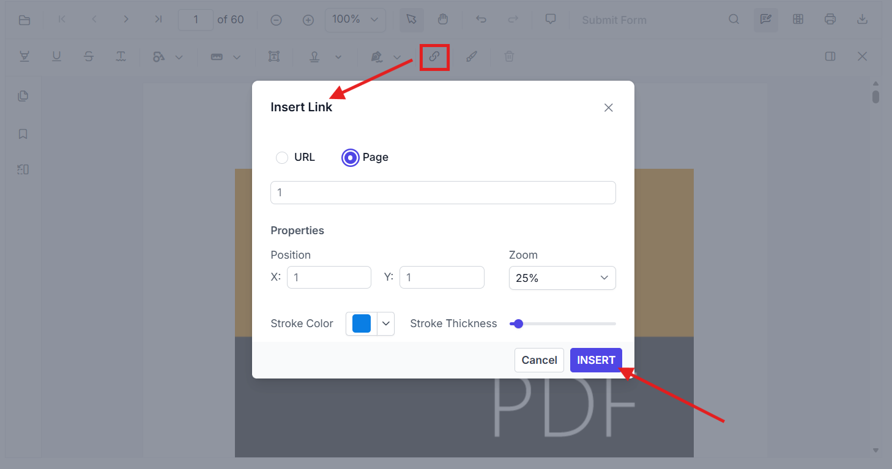
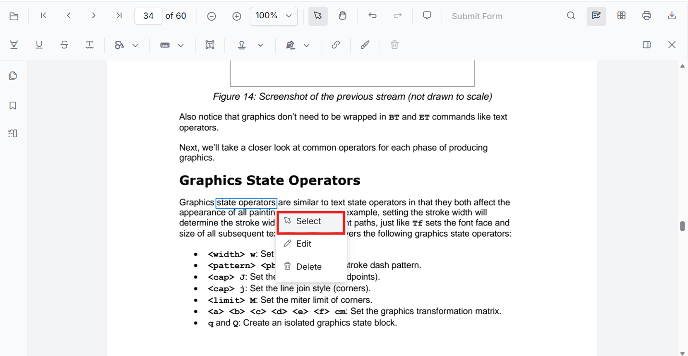
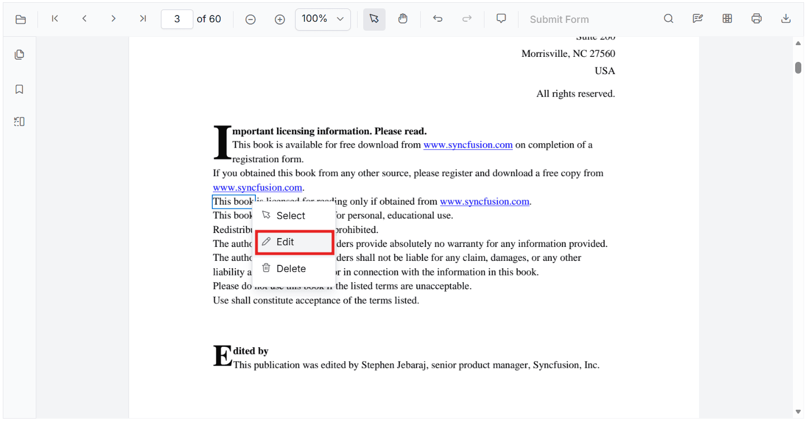
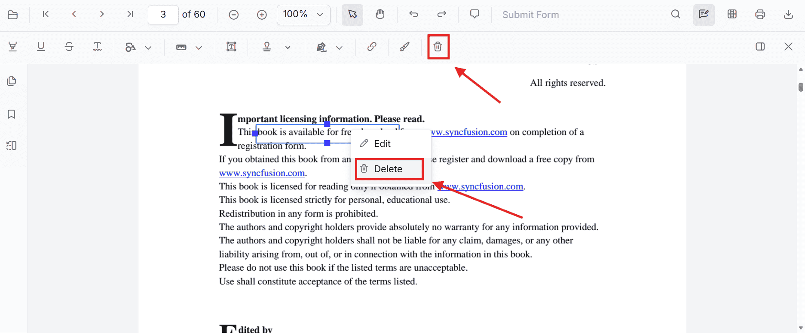

# Link Annotation in React PDF Viewer

This guide explains how to **enable**, **add**, **customize**, and **manage** link annotations in the Syncfusion **React PDF Viewer**. You can use link annotations to navigate to another page in the same PDF or open an external URL in the browser. Add links from the annotation toolbar, insert them programmatically, adjust the rectangle bounds, and edit or delete them through the UI or API.

## Enable Link Annotation in the Viewer

To enable Link annotations, inject the following modules into the React PDF Viewer:

- [**Annotation**](https://ej2.syncfusion.com/react/documentation/api/pdfviewer/index-default#annotation)
- [**LinkAnnotation**](https://ej2.syncfusion.com/react/documentation/api/pdfviewer/index-default#linkannotation)
- [**Toolbar**](https://ej2.syncfusion.com/react/documentation/api/pdfviewer/index-default#toolbar)
- [**Magnification**](https://ej2.syncfusion.com/react/documentation/api/pdfviewer/magnification)
- [**Navigation**](https://ej2.syncfusion.com/react/documentation/api/pdfviewer/navigation)

This setup enables the annotation toolbar and link annotation behavior.




import {
  PdfViewerComponent,
  Toolbar,
  Magnification,
  Navigation,
  LinkAnnotation,
  BookmarkView,
  ThumbnailView,
  Print,
  TextSelection,
  Annotation,
  TextSearch,
  FormFields,
  FormDesigner,
  PageOrganizer,
  Inject
} from '@syncfusion/ej2-react-pdfviewer';

export default function App() {
  return (
    <PdfViewerComponent
      id="container"
      documentPath="https://cdn.syncfusion.com/content/pdf/pdf-succinctly.pdf"
      resourceUrl="https://cdn.syncfusion.com/ej2/34.1.29/dist/ej2-pdfviewer-lib"
    >
      <Inject services={[
        Toolbar,
        Magnification,
        Navigation,
        Annotation,
        LinkAnnotation,
        BookmarkView,
        ThumbnailView,
        Print,
        TextSelection,
        TextSearch,
        FormFields,
        FormDesigner,
        PageOrganizer
      ]} />
    </PdfViewerComponent>
  );
}




> The `hyperlinkOpenState` property controls how external URLs open when the user clicks a link. Supported values include `NewTab` and `NewWindow`. Use `NewTab` to open the URL in a new browser tab, or `NewWindow` to open it in a separate browser window.

## Add Link Annotation

### Add Link Using the Toolbar

1. Click the **Add Link** button from the annotation toolbar.
2. Choose whether the link points to a **URL** or a **Page**.
3. Enter the target URL or page number.
4. Set the properties such as **stroke color** and **stroke thickness**.
5. Click **Insert** to create the link annotation.

The inserted link is displayed as a rectangular annotation region. Users can drag and resize it to position it over the desired target text or area in the PDF.

When clicked, the viewer navigates to the configured page or opens the specified external URL. You can also reposition or resize the annotation after insertion.

### Add Link Annotation Programmatically

Use [`addAnnotation()`](https://ej2.syncfusion.com/react/documentation/api/pdfviewer/index-default#addannotation) to create a link annotation at a specific location.

#### Add Internal Page Link




function addInternalLink() {
  const viewer = document.getElementById('container').ej2_instances[0];

  viewer.annotation.addAnnotation('Link', {
    offset: { x: 200, y: 480 },
    pageNumber: 1,
    width: 150,
    height: 75,
    destinationPageIndex: 4,
    destinationLocation: { x: 100, y: 200 },
    zoomValue: 4,
    strokeColor: '#1433e3'
  });
}




This adds a link rectangle that navigates to page index 4 and zooms to the specified location when clicked.

#### Add External URL Link




function addExternalLink() {
  const viewer = document.getElementById('container').ej2_instances[0];

  viewer.annotation.addAnnotation('Link', {
    offset: { x: 450, y: 480 },
    pageNumber: 1,
    width: 150,
    height: 75,
    url: 'https://www.syncfusion.com',
    strokeColor: '#FF0000'
  });
}




This adds a link rectangle that opens the specified external URL in the browser when clicked.

## Customize Link Appearance

Link annotations can be customized with optional visual and navigation properties, such as stroke color, thickness, size, destination page, or URL, depending on the type of link you are creating. The `hyperlinkOpenState` property controls how external URLs open: `NewTab` opens the page in a new tab, and `NewWindow` opens it in a separate browser window.

The following example configures the viewer to open external links in a separate browser window.




<PdfViewerComponent
  id="container"
  documentPath="https://cdn.syncfusion.com/content/pdf/pdf-succinctly.pdf"
  resourceUrl="https://cdn.syncfusion.com/ej2/31.2.2/dist/ej2-pdfviewer-lib"
  style={{ height: '650px' }}
  hyperlinkOpenState="NewWindow"
>
  <Inject services={[Toolbar, Annotation, LinkAnnotation]} />
</PdfViewerComponent>




## Manage Link Annotations

### Edit Link Annotation in the UI

After a link annotation is inserted, the user can:

- Right-click the selected link annotation to open the context menu
- Choose **Select** option from the context menu
- Drag the rectangle to a new position
- Resize the rectangle using resize handles

- Right-click the selected link annotation to open the context menu
- Choose **Edit** option from the context menu
- Modify the stroke color and thickness in the property panel
- Edit the target page or URL from the dialog box

This allows the link to be visually aligned with the PDF content without changing the document itself.

### Edit Link Annotation Programmatically

Use `editAnnotation()` to update an existing link annotation. The following example updates the selected link annotation by changing its color, size, and navigation target.




function editLinkAnnotation() {
  const viewer = document.getElementById('container').ej2_instances[0];

  for (const linkAnnotation of viewer.annotationCollection) {
    if (linkAnnotation.subject === 'Link') {
      linkAnnotation.strokeColor = '#1fcbd4';
      linkAnnotation.thickness = 2;
      linkAnnotation.bounds = { left: 100, top: 100, width: 100, height: 100 };
      linkAnnotation.url = 'https://www.google.com';
      linkAnnotation.destinationPageIndex = 3;
      linkAnnotation.destinationLocation = { x: 300, y: 300 };
      linkAnnotation.zoomValue = 1;
      viewer.annotation.editAnnotation(linkAnnotation);
      break;
    }
  }
}




### Delete Link Annotation

The PDF Viewer supports deleting link annotations through both the UI and API.

#### Delete a link annotation by ID

The following example deletes only the first link annotation found in the collection and keeps all other annotations unchanged.




function deleteLinkById() {
  const viewer = document.getElementById('container').ej2_instances[0];
  const linkAnnotation = viewer.annotationCollection.find((item) => item.subject === 'Link');

  if (linkAnnotation) {
    viewer.annotation.deleteAnnotationById(linkAnnotation.annotationId);
  }
}




## Set Properties While Adding an Individual Link

You can set link properties when creating the annotation directly by passing the required fields in the `addAnnotation('Link', ...)` call. The following example creates two different link annotations: one to an external URL and one to a destination page.




function addMultipleLinks() {
  const viewer = document.getElementById('container').ej2_instances[0];

  viewer.annotation.addAnnotation('Link', {
    offset: { x: 100, y: 150 },
    pageNumber: 1,
    width: 180,
    height: 60,
    url: 'https://www.syncfusion.com',
    strokeColor: '#ff0000'
  });

  viewer.annotation.addAnnotation('Link', {
    offset: { x: 320, y: 180 },
    pageNumber: 1,
    width: 150,
    height: 60,
    destinationPageIndex: 2,
    destinationLocation: { x: 100, y: 200 },
    zoomValue: 2,
    strokeColor: '#1433e3'
  });
}




## Link Annotation Events

The PDF viewer raises annotation life cycle events that can be used to monitor when link annotations are added, modified, selected, or removed. For the complete event list and event details, see [Annotation Events](../annotation-event).

N> [View Sample in GitHub](https://github.com/SyncfusionExamples/react-pdf-viewer-examples/tree/master/Annotations/Link%20Annotation).

## See Also

- [Annotation Toolbar](../../toolbar-customization/annotation-toolbar)
- [Customize Context Menu](../../context-menu/custom-context-menu)
- [Hyperlink Navigation](../../interactive-pdf-navigation/hyperlink)
- [Annotation Events](../annotation-event)
- [Export and Import Annotation](../export-import/export-annotation)
- [Delete Annotation](../delete-annotation)
