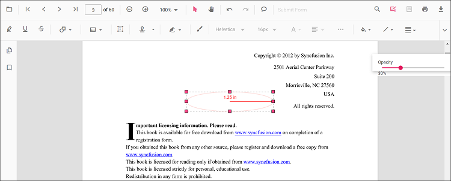

# Perimeter annotation in React PDF Viewer

Perimeter is a measurement annotation used to measure the length around a closed polyline in the PDF.

## Add Perimeter Annotation

### Add perimeter annotation via UI

Use the annotation toolbar:
- Click the Edit Annotation button in the PDF Viewer toolbar.
- Click the Measurement Annotation dropdown.
- Choose Perimeter, then draw the polyline on the page.

N> When in pan mode, selecting a measurement annotation switches the viewer to text select mode.

### Enable perimeter mode

The PDF Viewer library allows drawing measurement annotations programmatically after enabling perimeter mode in button clicks.




import * as ReactDOM from 'react-dom/client';
import * as React from 'react';
import './index.css';
import {
  PdfViewerComponent,
  Toolbar, Magnification, Navigation, LinkAnnotation, BookmarkView, ThumbnailView,
  Print, TextSelection, TextSearch, Annotation, FormFields, FormDesigner, PageOrganizer, Inject
} from '@syncfusion/ej2-react-pdfviewer';

export function App() {
  function perimeterMode() {
    const viewer = document.getElementById('container').ej2_instances[0];
    viewer.annotation.setAnnotationMode('Perimeter');
  }

  return (
    

      <button onClick={perimeterMode}>Perimeter</button>
      

        <PdfViewerComponent
          id="container"
          documentPath="https://cdn.syncfusion.com/content/pdf/pdf-succinctly.pdf"
          resourceUrl="https://cdn.syncfusion.com/ej2/31.2.2/dist/ej2-pdfviewer-lib"
          style={{ height: '640px' }}
        >
          <Inject services={[
            Toolbar, Annotation, Magnification, Navigation, LinkAnnotation, BookmarkView, ThumbnailView,
            Print, TextSelection, TextSearch, FormFields, FormDesigner, PageOrganizer
          ]}/>
        </PdfViewerComponent>
      

    

  );
}
const root = ReactDOM.createRoot(document.getElementById('sample'));
root.render(<App />);




import * as ReactDOM from 'react-dom/client';
import * as React from 'react';
import './index.css';
import {
  PdfViewerComponent,
  Toolbar, Magnification, Navigation, LinkAnnotation, BookmarkView, ThumbnailView,
  Print, TextSelection, TextSearch, Annotation, FormFields, FormDesigner, PageOrganizer, Inject
} from '@syncfusion/ej2-react-pdfviewer';

export function App() {
  function perimeterMode() {
    const viewer = document.getElementById('container').ej2_instances[0];
    viewer.annotation.setAnnotationMode('Perimeter');
  }

  return (
    

      <button onClick={perimeterMode}>Perimeter</button>
      

        <PdfViewerComponent
          id="container"
          documentPath="https://cdn.syncfusion.com/content/pdf/pdf-succinctly.pdf"
          serviceUrl="https://document.syncfusion.com/web-services/pdf-viewer/api/pdfviewer"
          style={{ height: '640px' }}
        >
          <Inject services={[
            Toolbar, Annotation, Magnification, Navigation, LinkAnnotation, BookmarkView, ThumbnailView,
            Print, TextSelection, TextSearch, FormFields, FormDesigner, PageOrganizer
          ]}/>
        </PdfViewerComponent>
      

    

  );
}
const root = ReactDOM.createRoot(document.getElementById('sample'));
root.render(<App />);




### Add a perimeter annotation programmatically

The PDF Viewer library allows adding measurement annotations programmatically using the [addAnnotation()](https://ej2.syncfusion.com/documentation/api/pdfviewer/annotation#annotation) method.




import * as ReactDOM from 'react-dom/client';
import * as React from 'react';
import './index.css';
import {
  PdfViewerComponent,
  Toolbar, Magnification, Navigation, LinkAnnotation, BookmarkView, ThumbnailView,
  Print, TextSelection, TextSearch, Annotation, FormFields, FormDesigner, PageOrganizer, Inject
} from '@syncfusion/ej2-react-pdfviewer';

export function App() {
  function addPerimeterAnnotation() {
    const viewer = document.getElementById('container').ej2_instances[0];
    viewer.annotation.addAnnotation('Perimeter', {
      offset: { x: 200, y: 350 },
      pageNumber: 1,
      vertexPoints: [{ x: 200, y: 350 }, { x: 285, y: 350 }, { x: 286, y: 412 }]
    });
  }

  return (
    

      <button onClick={addPerimeterAnnotation}>Add Perimeter annotation Programmatically</button>
      

        <PdfViewerComponent
          id="container"
          documentPath="https://cdn.syncfusion.com/content/pdf/pdf-succinctly.pdf"
          resourceUrl="https://cdn.syncfusion.com/ej2/31.2.2/dist/ej2-pdfviewer-lib"
          style={{ height: '640px' }}
        >
          <Inject services={[
            Toolbar, Annotation, Magnification, Navigation, LinkAnnotation, BookmarkView, ThumbnailView,
            Print, TextSelection, TextSearch, FormFields, FormDesigner, PageOrganizer
          ]}/>
        </PdfViewerComponent>
      

    

  );
}
const root = ReactDOM.createRoot(document.getElementById('sample'));
root.render(<App />);




import * as ReactDOM from 'react-dom/client';
import * as React from 'react';
import './index.css';
import {
  PdfViewerComponent,
  Toolbar, Magnification, Navigation, LinkAnnotation, BookmarkView, ThumbnailView,
  Print, TextSelection, TextSearch, Annotation, FormFields, FormDesigner, PageOrganizer, Inject
} from '@syncfusion/ej2-react-pdfviewer';

export function App() {
  function addPerimeterAnnotation() {
    const viewer = document.getElementById('container').ej2_instances[0];
    viewer.annotation.addAnnotation('Perimeter', {
      offset: { x: 200, y: 350 },
      pageNumber: 1,
      vertexPoints: [{ x: 200, y: 350 }, { x: 285, y: 350 }, { x: 286, y: 412 }]
    });
  }

  return (
    

      <button onClick={addPerimeterAnnotation}>Add Perimeter annotation Programmatically</button>
      

        <PdfViewerComponent
          id="container"
          documentPath="https://cdn.syncfusion.com/content/pdf/pdf-succinctly.pdf"
          serviceUrl="https://document.syncfusion.com/web-services/pdf-viewer/api/pdfviewer"
          style={{ height: '640px' }}
        >
          <Inject services={[
            Toolbar, Annotation, Magnification, Navigation, LinkAnnotation, BookmarkView, ThumbnailView,
            Print, TextSelection, TextSearch, FormFields, FormDesigner, PageOrganizer
          ]}/>
        </PdfViewerComponent>
      

    

  );
}
const root = ReactDOM.createRoot(document.getElementById('sample'));
root.render(<App />);




## Edit Perimeter Annotation

### Edit perimeter annotation in UI

You can select, move, and resize Perimeter annotations directly in the viewer:
- Select a Perimeter to show its vertex handles.
- Move: drag inside the shape to reposition it on the page.
- Resize/reshape: drag any vertex handle to adjust the polyline points and size.
- Delete or access more options from the context menu.

#### Edit the properties of Perimeter annotations

The fill color, stroke color, thickness, and opacity can be edited using the Edit Color, Edit Stroke Color, Edit Thickness, and Edit Opacity tools in the annotation toolbar.

#### Edit fill color

The fill color of the annotation can be edited using the color palette provided in the Edit Color tool.

#### Edit stroke color

The stroke color of the annotation can be edited using the color palette provided in the Edit Stroke Color tool.

#### Edit thickness

Edit border thickness using the range slider provided in the Edit Thickness tool.

#### Edit opacity

The opacity of the annotation can be edited using the range slider provided in the Edit Opacity tool.

### Edit an existing perimeter annotation programmatically

To modify an existing perimeter annotation programmatically, use the editAnnotation() method.

Here is an example of using editAnnotation():




import * as ReactDOM from 'react-dom/client';
import * as React from 'react';
import './index.css';
import {
  PdfViewerComponent,
  Toolbar, Magnification, Navigation, LinkAnnotation, BookmarkView, ThumbnailView,
  Print, TextSelection, TextSearch, Annotation, FormFields, FormDesigner, PageOrganizer, Inject
} from '@syncfusion/ej2-react-pdfviewer';

export function App() {
  function editPerimeterAnnotation() {
    const viewer = document.getElementById('container').ej2_instances[0];
    for (let i = 0; i < viewer.annotationCollection.length; i++) {
      const ann = viewer.annotationCollection[i];
      if (ann.subject === 'Perimeter calculation') {
        ann.annotationSelectorSettings.resizerShape = 'Circle';
        ann.strokeColor = '#0000FF';
        ann.thickness = 2;
        ann.fillColor = '#FFFF00';
        viewer.annotation.editAnnotation(ann);
      }
    }
  }

  return (
    

      <button onClick={editPerimeterAnnotation}>Edit Perimeter annotation Programmatically</button>
      

        <PdfViewerComponent
          id="container"
          documentPath="https://cdn.syncfusion.com/content/pdf/pdf-succinctly.pdf"
          resourceUrl="https://cdn.syncfusion.com/ej2/31.2.2/dist/ej2-pdfviewer-lib"
          style={{ height: '640px' }}
        >
          <Inject services={[
            Toolbar, Annotation, Magnification, Navigation, LinkAnnotation, BookmarkView, ThumbnailView,
            Print, TextSelection, TextSearch, FormFields, FormDesigner, PageOrganizer
          ]}/>
        </PdfViewerComponent>
      

    

  );
}

const root = ReactDOM.createRoot(document.getElementById('sample'));
root.render(<App />);




import * as ReactDOM from 'react-dom/client';
import * as React from 'react';
import './index.css';
import {
  PdfViewerComponent,
  Toolbar, Magnification, Navigation, LinkAnnotation, BookmarkView, ThumbnailView,
  Print, TextSelection, TextSearch, Annotation, FormFields, FormDesigner, PageOrganizer, Inject
} from '@syncfusion/ej2-react-pdfviewer';

export function App() {
  function editPerimeterAnnotation() {
    const viewer = document.getElementById('container').ej2_instances[0];
    for (let i = 0; i < viewer.annotationCollection.length; i++) {
      const ann = viewer.annotationCollection[i];
      if (ann.subject === 'Perimeter calculation') {
        ann.annotationSelectorSettings.resizerShape = 'Circle';
        ann.strokeColor = '#0000FF';
        ann.thickness = 2;
        ann.fillColor = '#FFFF00';
        viewer.annotation.editAnnotation(ann);
      }
    }
  }

  return (
    

      <button onClick={editPerimeterAnnotation}>Edit Perimeter annotation Programmatically</button>
      

        <PdfViewerComponent
          id="container"
          documentPath="https://cdn.syncfusion.com/content/pdf/pdf-succinctly.pdf"
          serviceUrl="https://document.syncfusion.com/web-services/pdf-viewer/api/pdfviewer"
          style={{ height: '640px' }}
        >
          <Inject services={[
            Toolbar, Annotation, Magnification, Navigation, LinkAnnotation, BookmarkView, ThumbnailView,
            Print, TextSelection, TextSearch, FormFields, FormDesigner, PageOrganizer
          ]}/>
        </PdfViewerComponent>
      

    

  );
}

const root = ReactDOM.createRoot(document.getElementById('sample'));
root.render(<App />);




## Default perimeter settings during initialization

Set default perimeterSettings before creating the control.




import * as ReactDOM from 'react-dom/client';
import * as React from 'react';
import './index.css';
import {
  PdfViewerComponent,
  Toolbar, Magnification, Navigation, LinkAnnotation, BookmarkView, ThumbnailView,
  Print, TextSelection, TextSearch, Annotation, FormFields, FormDesigner, PageOrganizer, Inject
} from '@syncfusion/ej2-react-pdfviewer';

export function App() {
  return (
    

      

        <PdfViewerComponent
          id="container"
          documentPath="https://cdn.syncfusion.com/content/pdf/pdf-succinctly.pdf"
          resourceUrl="https://cdn.syncfusion.com/ej2/31.2.2/dist/ej2-pdfviewer-lib"
          perimeterSettings={{ fillColor: 'green', opacity: 0.6, strokeColor: 'blue' }}
          style={{ height: '640px' }}
        >
          <Inject services={[
            Toolbar, Annotation, Magnification, Navigation, LinkAnnotation, BookmarkView, ThumbnailView,
            Print, TextSelection, TextSearch, FormFields, FormDesigner, PageOrganizer
          ]}/>
        </PdfViewerComponent>
      

    

  );
}

const root = ReactDOM.createRoot(document.getElementById('sample'));
root.render(<App />);




import * as ReactDOM from 'react-dom/client';
import * as React from 'react';
import './index.css';
import {
  PdfViewerComponent,
  Toolbar, Magnification, Navigation, LinkAnnotation, BookmarkView, ThumbnailView,
  Print, TextSelection, TextSearch, Annotation, FormFields, FormDesigner, PageOrganizer, Inject
} from '@syncfusion/ej2-react-pdfviewer';

export function App() {
  return (
    

      

        <PdfViewerComponent
          id="container"
          documentPath="https://cdn.syncfusion.com/content/pdf/pdf-succinctly.pdf"
          serviceUrl="https://document.syncfusion.com/web-services/pdf-viewer/api/pdfviewer"
          perimeterSettings={{ fillColor: 'green', opacity: 0.6, strokeColor: 'blue' }}
          style={{ height: '640px' }}
        >
          <Inject services={[
            Toolbar, Annotation, Magnification, Navigation, LinkAnnotation, BookmarkView, ThumbnailView,
            Print, TextSelection, TextSearch, FormFields, FormDesigner, PageOrganizer
          ]}/>
        </PdfViewerComponent>
      

    

  );
}

const root = ReactDOM.createRoot(document.getElementById('sample'));
root.render(<App />);




## Set properties while adding Individual Annotation

Set properties for individual annotation before creating the control using `PerimeterSettings`.

> After editing default color and opacity using the Edit Color and Edit Opacity tools, the values update to the selected settings.

Refer to the following code snippet to set the default Perimeter settings.




import * as ReactDOM from 'react-dom/client';
import * as React from 'react';
import './index.css';
import {
  PdfViewerComponent,
  Toolbar, Magnification, Navigation, LinkAnnotation, BookmarkView, ThumbnailView,
  Print, TextSelection, TextSearch, Annotation, FormFields, FormDesigner, Inject
} from '@syncfusion/ej2-react-pdfviewer';

export function App() {
  function addPerimeterWithSettings() {
    const viewer = document.getElementById('container').ej2_instances[0];
    viewer.annotation.addAnnotation('Perimeter', {
      offset: { x: 200, y: 350 },
      pageNumber: 1,
      vertexPoints: [{ x: 200, y: 350 }, { x: 285, y: 350 }, { x: 286, y: 412 }],
      fillColor: 'green',
      opacity: 0.6,
      strokeColor: 'blue'
    });
  }

  return (
    

      <button onClick={addPerimeterWithSettings}>Add Perimeter</button>
      

        <PdfViewerComponent
          id="container"
          documentPath="https://cdn.syncfusion.com/content/pdf/form-designer.pdf"
          resourceUrl="https://cdn.syncfusion.com/ej2/31.2.2/dist/ej2-pdfviewer-lib"
          style={{ height: '640px' }}
        >
          <Inject services={[
            Toolbar, Annotation, Magnification, Navigation, LinkAnnotation, BookmarkView, ThumbnailView,
            Print, TextSelection, TextSearch, FormFields, FormDesigner
          ]}/>
        </PdfViewerComponent>
      

    

  );
}

const root = ReactDOM.createRoot(document.getElementById('sample'));
root.render(<App />);




import * as ReactDOM from 'react-dom/client';
import * as React from 'react';
import './index.css';
import {
  PdfViewerComponent,
  Toolbar, Magnification, Navigation, LinkAnnotation, BookmarkView, ThumbnailView,
  Print, TextSelection, TextSearch, Annotation, FormFields, FormDesigner, Inject
} from '@syncfusion/ej2-react-pdfviewer';

export function App() {
  function addPerimeterWithSettings() {
    const viewer = document.getElementById('container').ej2_instances[0];
    viewer.annotation.addAnnotation('Perimeter', {
      offset: { x: 200, y: 350 },
      pageNumber: 1,
      vertexPoints: [{ x: 200, y: 350 }, { x: 285, y: 350 }, { x: 286, y: 412 }],
      fillColor: 'green',
      opacity: 0.6,
      strokeColor: 'blue'
    });
  }

  return (
    

      <button onClick={addPerimeterWithSettings}>Add Perimeter</button>
      

        <PdfViewerComponent
          id="container"
          documentPath="https://cdn.syncfusion.com/content/pdf/form-designer.pdf"
          serviceUrl="https://document.syncfusion.com/web-services/pdf-viewer/api/pdfviewer"
          style={{ height: '640px' }}
        >
          <Inject services={[
            Toolbar, Annotation, Magnification, Navigation, LinkAnnotation, BookmarkView, ThumbnailView,
            Print, TextSelection, TextSearch, FormFields, FormDesigner
          ]}/>
        </PdfViewerComponent>
      

    

  );
}

const root = ReactDOM.createRoot(document.getElementById('sample'));
root.render(<App />);




## Editing scale ratio and unit of the perimeter measurement annotation

The scale ratio and unit of measurement can be modified using the scale ratio option provided in the context menu of the PDF Viewer control.

The Units of measurements support for the measurement annotations in the PDF Viewer are

- Inch
- Millimeter
- Centimeter
- Point
- Pica
- Feet

## Setting default scale ratio settings during control initialization

The properties of scale ratio for measurement annotation can be set before creating the control using measurementSettings as shown in the following code snippet,




import * as ReactDOM from 'react-dom/client';
import * as React from 'react';
import './index.css';
import {
  PdfViewerComponent,
  Toolbar, Magnification, Navigation, LinkAnnotation, BookmarkView, ThumbnailView,
  Print, TextSelection, TextSearch, Annotation, FormFields, FormDesigner, PageOrganizer, Inject
} from '@syncfusion/ej2-react-pdfviewer';

export function App() {
  return (
    

      

        <PdfViewerComponent
          id="container"
          documentPath="https://cdn.syncfusion.com/content/pdf/pdf-succinctly.pdf"
          resourceUrl="https://cdn.syncfusion.com/ej2/31.2.2/dist/ej2-pdfviewer-lib"
          measurementSettings={{ scaleRatio: 2, conversionUnit: 'cm', displayUnit: 'cm' }}
          style={{ height: '640px' }}
        >
          <Inject services={[
            Toolbar, Annotation, Magnification, Navigation, LinkAnnotation, BookmarkView, ThumbnailView,
            Print, TextSelection, TextSearch, FormFields, FormDesigner, PageOrganizer
          ]}/>
        </PdfViewerComponent>
      

    

  );
}

const root = ReactDOM.createRoot(document.getElementById('sample'));
root.render(<App />);




import * as ReactDOM from 'react-dom/client';
import * as React from 'react';
import './index.css';
import {
  PdfViewerComponent,
  Toolbar, Magnification, Navigation, LinkAnnotation, BookmarkView, ThumbnailView,
  Print, TextSelection, TextSearch, Annotation, FormFields, FormDesigner, PageOrganizer, Inject
} from '@syncfusion/ej2-react-pdfviewer';

export function App() {
  return (
    

      

        <PdfViewerComponent
          id="container"
          documentPath="https://cdn.syncfusion.com/content/pdf/pdf-succinctly.pdf"
          serviceUrl="https://document.syncfusion.com/web-services/pdf-viewer/api/pdfviewer"
          measurementSettings={{ scaleRatio: 2, conversionUnit: 'cm', displayUnit: 'cm' }}
          style={{ height: '640px' }}
        >
          <Inject services={[
            Toolbar, Annotation, Magnification, Navigation, LinkAnnotation, BookmarkView, ThumbnailView,
            Print, TextSelection, TextSearch, FormFields, FormDesigner, PageOrganizer
          ]}/>
        </PdfViewerComponent>
      

    

  );
}

const root = ReactDOM.createRoot(document.getElementById('sample'));
root.render(<App />);




[View Sample on GitHub](https://github.com/SyncfusionExamples/typescript-pdf-viewer-examples/tree/master)

## See also

- [Annotation Overview](../overview)
- [Annotation Toolbar](../../toolbar-customization/annotation-toolbar)
- [Create and Modify Annotation](../../annotations/create-modify-annotation)
- [Customize Annotation](../../annotations/customize-annotation)
- [Remove Annotation](../../annotations/delete-annotation)
- [Handwritten Signature](../../annotations/signature-annotation)
- [Export and Import Annotation](../../annotations/export-import/export-annotation)
- [Annotation in Mobile View](../../annotations/annotations-in-mobile-view)
- [Annotation Events](../../annotations/annotation-event)
- [Annotation API](../../annotations/annotations-api)
