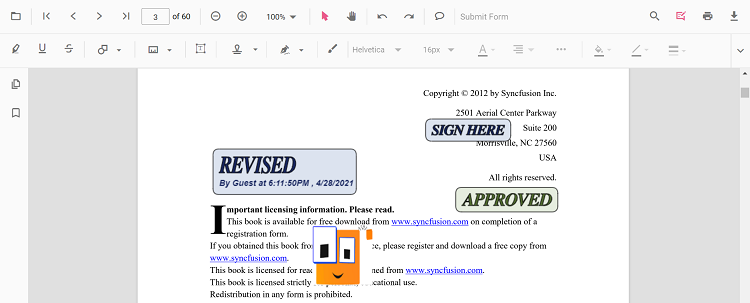
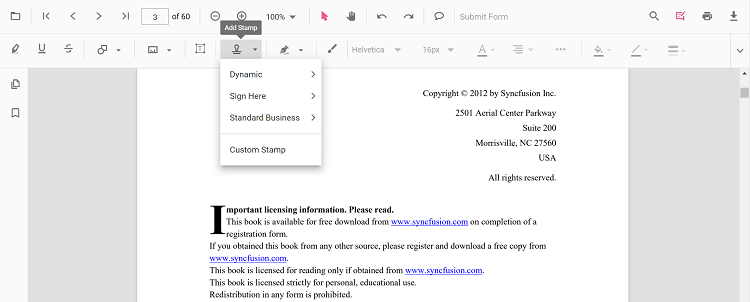
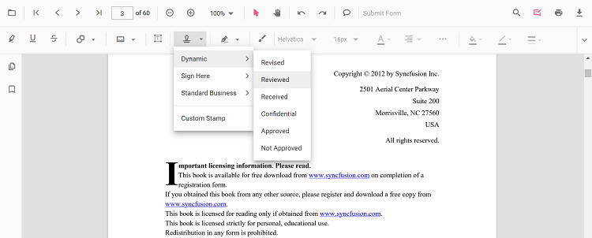

# Stamp Annotation in React PDF Viewer
Stamp annotations allow you to place predefined or custom stamps (such as **Dynamic**, **Sign Here**, **Standard Business**, or **Custom**) on a PDF to communicate review states, approvals, or instructions. You can add stamps from the toolbar, switch to specific stamp modes programmatically, customize defaults (e.g., opacity/author), edit or lock them, and export them with the document.

---

## Enable Stamp Annotation in the Viewer

To enable Stamp annotations, inject the following modules into the React PDF Viewer:

- [**Annotation**](https://ej2.syncfusion.com/react/documentation/api/pdfviewer/index-default#annotation)
- [**Toolbar**](https://ej2.syncfusion.com/react/documentation/api/pdfviewer/index-default#toolbar)




import * as React from 'react';
import * as ReactDOM from 'react-dom/client';
import { PdfViewerComponent, Inject, Toolbar, Annotation } from '@syncfusion/ej2-react-pdfviewer';

function App() {
  return (
    <PdfViewerComponent
      id="container"
      documentPath="https://cdn.syncfusion.com/content/pdf/pdf-succinctly.pdf"
      resourceUrl="https://cdn.syncfusion.com/ej2/31.2.2/dist/ej2-pdfviewer-lib"
      style={{ height: '650px' }}
    >
      <Inject services={[Toolbar, Annotation]} />
    </PdfViewerComponent>
  );
}

ReactDOM.createRoot(document.getElementById('sample')).render(<App />);




---

## Add Stamp Annotation

### Add Stamp Using the Toolbar
1. Open the **Annotation Toolbar**.
2. Choose **Stamp** to open the stamp gallery.

3. Select a stamp type (**Dynamic**, **Sign Here**, **Standard Business**, or **Custom**) and click on the page to place it.

N> When Pan mode is active and a stamp tool is chosen, the viewer automatically switches to selection mode for a smoother interaction.

---

### Enable a Specific Stamp Mode
Switch the viewer into a specific stamp annotation mode programmatically.




import { SignStampItem, StandardBusinessStampItem, DynamicStampItem } from '@syncfusion/ej2-react-pdfviewer';

function enableDynamicStamp() {
  const viewer = document.getElementById('container').ej2_instances[0];
  viewer.annotation.setAnnotationMode('Stamp', DynamicStampItem.NotApproved);
}

function enableSignHereStamp() {
  const viewer = document.getElementById('container').ej2_instances[0];
  viewer.annotation.setAnnotationMode('Stamp', null, SignStampItem.Witness);
}

function enableStandardBusinessStamp() {
  const viewer = document.getElementById('container').ej2_instances[0];
  viewer.annotation.setAnnotationMode('Stamp', null, null, StandardBusinessStampItem.Approved);
}




#### Exit Stamp Mode



function exitStampMode() {
  const viewer = document.getElementById('container').ej2_instances[0];
  viewer.annotation.setAnnotationMode('None');
}




---

### Add Stamp Programmatically
Use the [`addAnnotation`](https://ej2.syncfusion.com/react/documentation/api/pdfviewer/index-default#addannotation) API to place stamps at specific coordinates.




// Dynamic stamp
function addDynamicStamp() {
  const viewer = document.getElementById('container').ej2_instances[0];
  viewer.annotation.addAnnotation('Stamp', { offset: { x: 200, y: 140 }, pageNumber: 1 }, 'Approved');
}

// Sign Here stamp
function addSignStamp() {
  const viewer = document.getElementById('container').ej2_instances[0];
  viewer.annotation.addAnnotation('Stamp', { offset: { x: 200, y: 240 }, pageNumber: 1 }, undefined, 'Witness');
}

// Standard Business stamp
function addStandardBusinessStamp() {
  const viewer = document.getElementById('container').ej2_instances[0];
  viewer.annotation.addAnnotation('Stamp', { offset: { x: 200, y: 340 }, pageNumber: 1 }, undefined, undefined, 'Approved');
}

// Custom stamp (JPG/JPEG only)
function addCustomStamp() {
  const viewer = document.getElementById('container').ej2_instances[0];
  viewer.annotation.addAnnotation('Stamp', {
    offset: { x: 100, y: 440 },
    width: 100,
    height: 46,
    author: 'Guest',
    isLock: true,
    pageNumber: 1,
    customStamps: [
      {
        customStampName: 'Image',
        customStampImageSource: 'data:image/jpeg;base64,REPLACE_WITH_YOUR_BASE64_IMAGE_DATA'
      }
    ]
  });
}




N> For **Custom Stamp** via the UI, only **JPG/JPEG** image formats are supported.

---

## Customize Stamp Appearance
Configure default properties using the [`stampSettings`](https://ej2.syncfusion.com/react/documentation/api/pdfviewer/index-default#stampsettings) property (for example, default **opacity** and **author**).




<PdfViewerComponent
  id="container"
  documentPath="https://cdn.syncfusion.com/content/pdf/pdf-succinctly.pdf"
  resourceUrl="https://cdn.syncfusion.com/ej2/31.2.2/dist/ej2-pdfviewer-lib"
  stampSettings={{ opacity: 0.3, author: 'Guest User' }}
  style={{ height: '650px' }}
>
  <Inject services={[Toolbar, Annotation]} />
</PdfViewerComponent>




N> After changing opacity via the **Edit Opacity** tool in the toolbar, the updated value becomes the working default for subsequent placements in the current session.

---

## Manage Stamp (Move, Resize, Rotate, Lock/Unlock, Delete)

### Edit Stamp Annotation

#### Edit & Arrange (UI)
- **Move**: drag the stamp to reposition it.
- **Resize**: use corner handles to change size.
- **Rotate**: use the rotation handle (where available) to rotate the stamp.
- **Opacity**: adjust using the **Edit Opacity** tool in the annotation toolbar.
- **Lock/Unlock**: lock a selected stamp from the context menu to prevent edits.

#### Edit Stamp Programmatically
Modify bounds or lock state, then call `editAnnotation()`.




function editStampProgrammatically() {
  const viewer = document.getElementById('container').ej2_instances[0];
  for (const ann of viewer.annotationCollection) {
    // shapeAnnotationType is 'stamp' for stamp annotations
    if (ann.shapeAnnotationType === 'stamp') {
      const { width, height } = ann.bounds;
      ann.bounds = { x: 100, y: 100, width, height };
      ann.annotationSettings = ann.annotationSettings || {};
      ann.annotationSettings.isLock = true; // lock the stamp
      viewer.annotation.editAnnotation(ann);
      break;
    }
  }
}




### Delete Stamp
Delete stamps via UI (toolbar/context menu) or programmatically. For supported workflows and APIs, see [**Delete Annotation**](../remove-annotations).

---

## Set properties while adding Individual Annotation
You can pass per‑annotation values (e.g., **type**, **position**, **size**, **author**, **isLock**, or **customStamps**) when calling [`addAnnotation`](https://ej2.syncfusion.com/react/documentation/api/pdfviewer/index-default#addannotation).




function addMultipleStamps() {
  const viewer = document.getElementById('container').ej2_instances[0];

  // Dynamic stamp – Approved
  viewer.annotation.addAnnotation('Stamp', { offset: { x: 180, y: 140 }, pageNumber: 1 }, 'Approved');

  // Sign Here – Witness
  viewer.annotation.addAnnotation('Stamp', { offset: { x: 180, y: 240 }, pageNumber: 1 }, undefined, 'Witness');

  // Standard Business – Approved
  viewer.annotation.addAnnotation('Stamp', { offset: { x: 180, y: 340 }, pageNumber: 1 }, undefined, undefined, 'Approved');
}




---

## Handle Stamp Events

The PDF viewer provides annotation life‑cycle events that notify when Stamp annotations are added, modified, selected, or removed.
For the full list of available events and their descriptions, see [**Annotation Events**](../annotation-event)

---

## Export and Import
The PDF Viewer supports exporting and importing annotations, allowing you to save stamps and reload them later. For supported formats and steps, see [**Export and Import annotations**](../export-import-annotations).

---

## See Also
- [Annotation Toolbar](../../toolbar-customization/annotation-toolbar)
- [Customize Context Menu](../../context-menu/custom-context-menu)
- [Comments Panel](../comments)
- [Annotation Events](../annotation-event)
- [Export and Import annotations](../export-import-annotations)
- [Delete Annotations](../remove-annotations)
