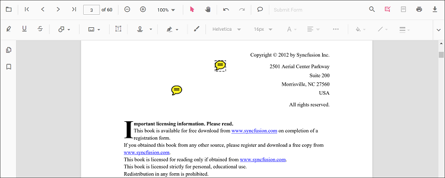

# Add Sticky Notes Annotations in React PDF Viewer
Sticky Notes allow users to place comment markers on the PDF. When clicked, the note opens a popup containing comments, replies, and discussions. Use them to capture review feedback without altering the original content. 

## Enable Sticky Notes Annotation
Inject the minimal modules required to work with Sticky Notes in the React PDF Viewer. (Toolbar is optional but recommended for UI access.) 




import * as React from 'react';
import * as ReactDOM from 'react-dom/client';
import { PdfViewerComponent, Inject, Toolbar, Annotation, TextSelection } from '@syncfusion/ej2-react-pdfviewer';

function App() {
  return (
    <PdfViewerComponent
      id="container"
      documentPath="https://cdn.syncfusion.com/content/pdf/pdf-succinctly.pdf"
      resourceUrl="https://cdn.syncfusion.com/ej2/31.2.2/dist/ej2-pdfviewer-lib"
      style={{ height: '650px' }}
    >
      <Inject services={[Toolbar, Annotation, TextSelection]} />
    </PdfViewerComponent>
  );
}

ReactDOM.createRoot(document.getElementById('sample')).render(<App />);




N> The **Sticky Note** tool appears in the Annotation toolbar when annotation features are enabled. 

## Add Sticky Notes

### Add Sticky Notes Using the Toolbar
1. Open the **Annotation Toolbar**.
2. Select the **Sticky Note** tool.
3. Click anywhere on the page to place the note; click the note to open its popup and start commenting. 

 

N> Use the **Comments panel** to add replies or update status for the selected note. 

### Add Sticky Notes Programmatically

Create a note at specific coordinates using `addAnnotation`. 




function addStickyNote() {
  const viewer = document.getElementById('container').ej2_instances[0];
  viewer.annotation.addAnnotation('StickyNotes', {
    offset: { x: 120, y: 220 },
    pageNumber: 1,
    isLock: false
  });
}




## Customize Sticky Note Appearance
Configure default properties using the [`stickyNotesSettings`](https://ej2.syncfusion.com/react/documentation/api/pdfviewer/index-default#stickyNotesSettings).
 property (for example, default **fill color**, **stroke color**, **opacity**).




<PdfViewerComponent
  id="container"
  documentPath="https://cdn.syncfusion.com/content/pdf/pdf-succinctly.pdf"
  resourceUrl="https://cdn.syncfusion.com/ej2/31.2.2/dist/ej2-pdfviewer-lib"
  stickyNotesSettings={{ author: 'Guest User' }}
  style={{ height: '650px' }}
>
  <Inject services={[Toolbar, Annotation, TextSelection]} />
</PdfViewerComponent>




## Move, Edit, or Delete Sticky Notes

- **Move**: Drag the note icon to a new location. 
- **Edit**: Click the note icon to open the popup; edit text, add replies, or change status in the **Comments panel**. 

### Edit Sticky Notes Annotation

#### Edit Sticky Notes (UI)

- **Icon style**: Open **Right Click → Properties** on a note to choose a different note icon style (e.g., classic note icon). 
- **Color**: Change the note color using the **Edit Color** tool in the annotation toolbar. 
- **Opacity**: Adjust transparency using the **Edit Opacity** tool.  
   

N> To tailor right‑click actions (Delete, Properties, etc.), see [**Customize Context Menu**](../../context-menu/custom-context-menu). 

#### Edit Sticky Notes Programmatically
Update properties and call `editAnnotation()`.




function editVolumeProgrammatically() {
  const viewer = document.getElementById('container').ej2_instances[0];
  for (const ann of viewer.annotationCollection) {
    if (ann.subject === 'Volume calculation') {
      ann.strokeColor = '#0000FF';
      ann.thickness = 2;
      ann.opacity = 0.8;
      viewer.annotation.editAnnotation(ann);
      break;
    }
  }
}




### Delete Volume Annotation

Delete Volume Annotation via UI (toolbar/context menu) or programmatically. For supported workflows and APIs, see [**Delete Annotation**](../remove-annotations).

## Set Default Properties During Initialization
Configure scale defaults using [`stickyNotesSettings`](https://ej2.syncfusion.com/react/documentation/api/pdfviewer/index-default#stickyNotesSettings).




<PdfViewerComponent
  id="container"
  documentPath="https://cdn.syncfusion.com/content/pdf/pdf-succinctly.pdf"
  resourceUrl="https://cdn.syncfusion.com/ej2/31.2.2/dist/ej2-pdfviewer-lib"
  stickyNotesSettings={{ author: 'Guest User' }}
  style={{ height: '650px' }}
>
  <Inject services={[Toolbar, Annotation, TextSelection]} />
</PdfViewerComponent>




## Sticky Note Events

Listen to annotation life-cycle events and filter for sticky notes. See [**Annotation Events**](../annotation-event) for the full list and argument details. 

## Export and Import
Sticky Notes are included when exporting or importing annotations. For supported formats and workflows, see [**Export and Import annotations**](../export-import-annotations). 

## See Also
- [Annotation Toolbar](../../toolbar-customization/annotation-toolbar)
- [Customize Context Menu](../../context-menu/custom-context-menu)
- [Comments Panel](../comments)
- [Annotation Events](../annotation-event)
- [Export and Import annotations](../export-import-annotations)
- [Delete Annotations](../remove-annotations)