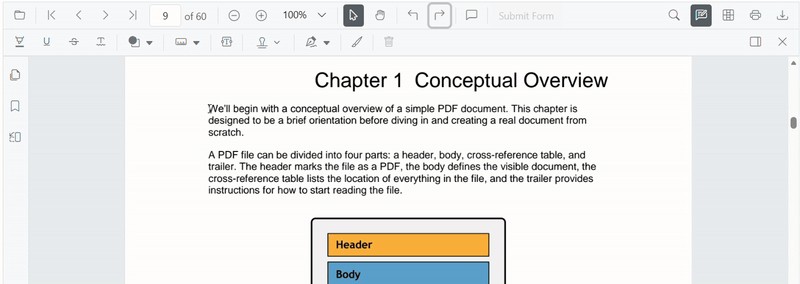

# Strikethrough Annotation (Text Markup) in React PDF Viewer
This guide explains how to **enable**, **apply**, **customize**, and **manage** *Strikethrough* text markup annotations in the Syncfusion **React PDF Viewer**. You can apply strikethrough using the toolbar or context menu, programmatically invoke strikethrough mode, customize default settings, handle events, and export the PDF with annotations.

---

## Enable Strikethrough in the Viewer
To enable Strikethrough annotations, inject the following modules into the React PDF Viewer:
- [**Annotation**](https://ej2.syncfusion.com/react/documentation/api/pdfviewer/index-default#annotation)
- [**TextSelection**](https://ej2.syncfusion.com/react/documentation/api/pdfviewer/index-default#textselection)
- [**Toolbar**](https://ej2.syncfusion.com/react/documentation/api/pdfviewer/index-default#toolbar)

This minimal setup enables UI interactions like selection and strikethrough.




import * as React from 'react';
import * as ReactDOM from 'react-dom/client';
import {
  PdfViewerComponent,
  Inject,
  Toolbar,
  Annotation,
  TextSelection
} from '@syncfusion/ej2-react-pdfviewer';

function App() {
  return (
    <PdfViewerComponent
      id="container"
      documentPath="https://cdn.syncfusion.com/content/pdf/pdf-succinctly.pdf"
      resourceUrl="https://cdn.syncfusion.com/ej2/31.2.2/dist/ej2-pdfviewer-lib"
      style={{ height: '650px' }}
    >
      <Inject services={[Toolbar, Annotation, TextSelection]} />
    </PdfViewerComponent>
  );
}

ReactDOM.createRoot(document.getElementById('sample')).render(<App />);




---

## Apply Strikethrough Annotation

### Apply Strikethrough Using the Toolbar
1. Select the text you want to strike through.
2. Click the **Strikethrough** icon in the annotation toolbar.
   - If **Pan Mode** is active, the viewer automatically switches to **Text Selection** mode.

---

### Apply strikethrough using Context Menu
Right-click a selected text region → select **Strikethrough**.

To customize menu items, refer to [**Customize Context Menu**](../../context-menu/custom-context-menu) documentation.

---

### Enable Strikethrough Mode
Switch the viewer into strikethrough mode using `setAnnotationMode('Strikethrough')`.




function enableStrikethrough() {
  const viewer = document.getElementById('container').ej2_instances[0];
  viewer.annotation.setAnnotationMode('Strikethrough');
}




#### Exit Strikethrough Mode
Switch back to normal mode using:




function disableStrikethroughMode() {
  const viewer = document.getElementById('container').ej2_instances[0];
  viewer.annotation.setAnnotationMode('None');
}




---

### Add Strikethrough Programmatically
Use [`addAnnotation()`](https://ej2.syncfusion.com/react/documentation/api/pdfviewer/index-default#addannotation) to insert a strikethrough at a specific location.




function addStrikethrough() {
  const viewer = document.getElementById('container').ej2_instances[0];
  viewer.annotation.addAnnotation('Strikethrough', {
    bounds: [{ x: 97, y: 110, width: 350, height: 14 }],
    pageNumber: 1
  });
}




---

## Customize Strikethrough Appearance
Configure default strikethrough settings such as **color**, **opacity**, and **author** using [`strikethroughSettings`](https://ej2.syncfusion.com/react/documentation/api/pdfviewer/index-default#strikethroughsettings).




<PdfViewerComponent
  id="container"
  documentPath="https://cdn.syncfusion.com/content/pdf/pdf-succinctly.pdf"
  resourceUrl="https://cdn.syncfusion.com/ej2/31.2.2/dist/ej2-pdfviewer-lib"
  height="650px"
  strikethroughSettings={{
    author: 'Guest User',
    subject: 'Not Important',
    color: '#ff00ff',
    opacity: 0.9
  }}
>
  <Inject services={[Toolbar, Annotation, TextSelection]} />
</PdfViewerComponent>




---

## Manage Strikethrough (Edit, Delete, Comment)

### Edit Strikethrough

#### Edit Strikethrough Appearance (UI)
Use the annotation toolbar:
- **Edit Color** tool  

- **Edit Opacity** slider  

---

#### Edit Strikethrough Programmatically
Modify an existing strikethrough programmatically using `editAnnotation()` and `annotationCollection`.




function editStrikethroughProgrammatically() {
  const viewer = document.getElementById('container').ej2_instances[0];
  for (let annot of viewer.annotationCollection) {
    if (annot.textMarkupAnnotationType === 'Strikethrough') {
      annot.color = '#ff0000';
      annot.opacity = 0.8;
      viewer.annotation.editAnnotation(annot);
      break;
    }
  }
}




---

### Delete Strikethrough
The PDF Viewer supports deleting existing annotations through both the UI and API. For detailed behavior, supported deletion workflows, and API reference, see [**Delete Annotation**](../remove-annotation).

---

### Comments
Use the [**Comments panel**](../comments) to add, view, and reply to threaded discussions linked to strikethrough annotations. It provides a dedicated UI for reviewing feedback, tracking conversations, and collaborating on annotation–related notes within the PDF Viewer.

---

## Set properties while adding Individual Annotation
Set properties for individual annotations when adding them programmatically by supplying fields on each `addAnnotation('Strikethrough', …)` call.




function addMultipleStrikethroughs() {
  const viewer = document.getElementById('container').ej2_instances[0];
  // Strikethrough 1
  viewer.annotation.addAnnotation('Strikethrough', {
    bounds: [{ x: 100, y: 150, width: 320, height: 14 }],
    pageNumber: 1,
    author: 'User 1',
    color: '#ffff00',
    opacity: 0.9
  });
  // Strikethrough 2
  viewer.annotation.addAnnotation('Strikethrough', {
    bounds: [{ x: 110, y: 220, width: 300, height: 14 }],
    pageNumber: 1,
    author: 'User 2',
    color: '#ff1010',
    opacity: 0.9
  });
}




---

## Disable TextMarkup Annotation
Disable text markup annotations (including strikethrough) using the [`enableTextMarkupAnnotation`](https://ej2.syncfusion.com/react/documentation/api/pdfviewer/index-default#enabletextmarkupannotation) property.




<PdfViewerComponent
  id="container"
  enableTextMarkupAnnotation={false}
  documentPath="https://cdn.syncfusion.com/content/pdf/pdf-succinctly.pdf"
  resourceUrl="https://cdn.syncfusion.com/ej2/31.2.2/dist/ej2-pdfviewer-lib"
  style={{ height: '650px' }}
>
  <Inject services={[Toolbar, Annotation, TextSelection]} />
</PdfViewerComponent>




---

## Handle Strikethrough Events
The PDF viewer provides annotation life-cycle events that notify when strikethrough annotations are added, modified, selected, or removed. For the full list of available events and their descriptions, see [**Annotation Events**](../annotation-event).

---

## Export and Import
The PDF Viewer supports exporting and importing annotations, allowing you to save annotations as a separate file or load existing annotations back into the viewer. For full details on supported formats and steps to export or import annotations, see [**Export and Import Annotation**](../export-import-annotations).

---

## See Also

- [Annotation Toolbar](../../toolbar-customization/annotation-toolbar)
- [Customize Context Menu](../../context-menu/custom-context-menu)
- [Comments Panel](../comments)
- [Annotation Events](../annotation-event)
- [Export and Import annotations](../export-import-annotations)
- [Delete Annotations](../remove-annotations)
