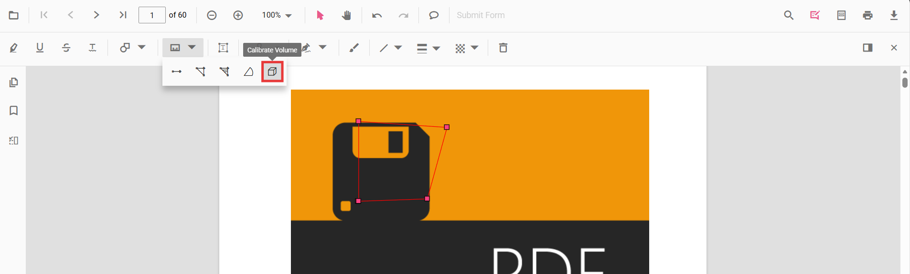

# Add Volume Measurement Annotations in React PDF Viewer
Volume measurement annotations allow users to draw circular regions and calculate the volume visually.

---

## Enable Volume Measurement
Inject the **Annotation** and **Toolbar** modules to enable volume annotation tools.




import * as React from 'react';
import * as ReactDOM from 'react-dom/client';
import { PdfViewerComponent, Toolbar, Annotation, Inject } from '@syncfusion/ej2-react-pdfviewer';

function App() {
  return (
    <PdfViewerComponent
      id="container"
      documentPath="https://cdn.syncfusion.com/content/pdf/pdf-succinctly.pdf"
      resourceUrl="https://cdn.syncfusion.com/ej2/31.2.2/dist/ej2-pdfviewer-lib"
      style={{ height: '650px' }}
    >
      <Inject services={[Toolbar, Annotation]} />
    </PdfViewerComponent>
  );
}

ReactDOM.createRoot(document.getElementById('sample')).render(<App/>);




---

## Add Volume Annotation

### Draw Volume Using the Toolbar

1. Open the **Annotation Toolbar**.
2. Select **Measurement → Volume**.
3. Click and drag on the page to draw the volume.

> If Pan mode is active, selecting the Volume tool automatically switches interaction mode.

### Enable Volume Mode
Programmatically switch the viewer into Volume mode.




function enableVolumeMode() {
  const viewer = document.getElementById('container').ej2_instances[0];
  viewer.annotation.setAnnotationMode('Volume');
}




#### Exit Volume Mode




function exitVolumeMode() {
  const viewer = document.getElementById('container').ej2_instances[0];
  viewer.annotation.setAnnotationMode('None');
}




---

### Add Volume Programmatically
Configure default properties using the [`Volume Settings`](https://ej2.syncfusion.com/react/documentation/api/pdfviewer/index-default#volumesettings) property (for example, default **fill color**, **stroke color**, **opacity**).




function addVolume() {
  const viewer = document.getElementById('container').ej2_instances[0];
  viewer.annotation.addAnnotation('Volume', {
    offset: { x: 200, y: 810 },
    pageNumber: 1,
    width: 90,
    height: 90
  });
}




---

## Customize Volume Appearance
Configure default properties using the [`Volume Settings`](https://ej2.syncfusion.com/react/documentation/api/pdfviewer/index-default#volumesettings) property (for example, default **fill color**, **stroke color**, **opacity**).




<PdfViewerComponent
  id="container"
  documentPath="https://cdn.syncfusion.com/content/pdf/pdf-succinctly.pdf"
  resourceUrl="https://cdn.syncfusion.com/ej2/31.2.2/dist/ej2-pdfviewer-lib"
  volumeSettings={{ fillColor: 'yellow', strokeColor: 'orange', opacity: 0.6 }}
  style={{ height: '650px' }}
>
  <Inject services={[Toolbar, Annotation]} />
</PdfViewerComponent>




---

---

## Manage Volume (Move, Resize, Delete)
- **Move**: Drag inside the polygon to reposition it.
- **Reshape**: Drag any vertex handle to adjust points and shape.

### Edit Volume Annotaion

#### Edit Volume (UI)

- Edit the **fill color** using the Edit Color tool.  
  
- Edit the **stroke color** using the Edit Stroke Color tool.  
  
- Edit the **border thickness** using the Edit Thickness tool.  
  
- Edit the **opacity** using the Edit Opacity tool.  
  
- Open **Right Click → Properties** for additional line‑based options.
  

#### Edit Volume Programmatically
Update properties and call `editAnnotation()`.




function editVolumeProgrammatically() {
  const viewer = document.getElementById('container').ej2_instances[0];
  for (const ann of viewer.annotationCollection) {
    if (ann.subject === 'Volume calculation') {
      ann.strokeColor = '#0000FF';
      ann.thickness = 2;
      ann.opacity = 0.8;
      viewer.annotation.editAnnotation(ann);
      break;
    }
  }
}




---

### Delete Volume Annotation

Delete Volume Annotation via UI (toolbar/context menu) or programmatically. For supported workflows and APIs, see [**Delete Annotation**](../remove-annotations).

---

## Set Default Properties During Initialization
Apply defaults for Volume using the [`volumeSettings`](https://ej2.syncfusion.com/react/documentation/api/pdfviewer/index-default#volumesettings) property.




<PdfViewerComponent
  id="container"
  documentPath="https://cdn.syncfusion.com/content/pdf/pdf-succinctly.pdf"
  resourceUrl="https://cdn.syncfusion.com/ej2/31.2.2/dist/ej2-pdfviewer-lib"
  volumeSettings={{ fillColor: 'yellow', opacity: 0.6, strokeColor: 'yellow' }}
  style={{ height: '650px' }}
>
  <Inject services={[Toolbar, Annotation]} />
</PdfViewerComponent>




---

## Set Properties While Adding Individual Annotation
Apply defaults for Area using the [`volumeSettings`](https://ej2.syncfusion.com/react/documentation/api/pdfviewer/index-default#volumesettings) property.




function addStyledVolume() {
  const viewer = document.getElementById('container').ej2_instances[0];
  viewer.annotation.addAnnotation('Volume', {
    offset: { x: 200, y: 810 },
    pageNumber: 1,
    width: 90,
    height: 90,
    fillColor: 'yellow',
    opacity: 0.6,
    strokeColor: 'yellow'
  });
}




---

## Scale Ratio & Units
- Use **Scale Ratio** from the context menu.  
  
- Supported units: Inch, Millimeter, Centimeter, Point, Pica, Feet.  
  

### Set Default Scale Ratio During Initialization
Configure scale defaults using [`measurementSettings`](https://ej2.syncfusion.com/react/documentation/api/pdfviewer/index-default#mesaurementsettings).




<PdfViewerComponent
  id="container"
  documentPath="https://cdn.syncfusion.com/content/pdf/pdf-succinctly.pdf"
  resourceUrl="https://cdn.syncfusion.com/ej2/31.2.2/dist/ej2-pdfviewer-lib"
  measurementSettings={{ scaleRatio: 2, conversionUnit: 'cm', displayUnit: 'cm' }}
  style={{ height: '650px' }}
>
  <Inject services={[Toolbar, Annotation]} />
</PdfViewerComponent>




---

## Handle Volume Events
Listen to annotation life-cycle events (add/modify/select/remove). For the full list and parameters, see [**Annotation Events**](../annotation-event).

---

## Export and Import
Volume measurements can be exported or imported with other annotations. For workflows and supported formats, see [**Export and Import annotations**](../export-import-annotations).
---

## See Also
- [Annotation Toolbar](../../toolbar-customization/annotation-toolbar)
- [Annotation Events](../annotation-event)
- [Export and Import](../export-import-annotations)
